Below is a generic, scalable semantic-search design inspired by LinkedIn’s architecture: LLM-based query understanding, GPU-backed embedding retrieval, cross-encoder/SLM ranking, offline + nearline feature pipelines, score caching, traffic shaping, and continuous LLM-judge evaluation. LinkedIn describes this pattern for jobs/people search: query understanding creates query embeddings, GPU embedding-based retrieval gathers candidates, a cross-encoder SLM reranks them, and offline Spark/Flyte plus nearline Flink pipelines precompute features, embeddings, summaries, and indexes. ([linkedin.com](https://www.linkedin.com/blog/engineering/search/reimagining-linkedins-search-stack))

## 1. Goals

Design a **generic semantic search platform** that can search billions of documents with high QPS, low latency, frequent updates, personalization, filtering, ranking, observability, and continuous relevance evaluation.

Typical target:

| Dimension        |                                                                                  Target |
| ---------------- | --------------------------------------------------------------------------------------: |
| Corpus size      |                                                                   100M to 10B documents |
| QPS              |                                                10K to millions, depending on deployment |
| P95 latency      |                                                              100–500 ms for search page |
| Freshness        |                         seconds to minutes for critical updates; hours for full rebuild |
| Retrieval recall |                                                    high recall at top 1K–10K candidates |
| Ranking quality  |                                      optimized for relevance + business/user objectives |
| Availability     |                                                       multi-AZ, optionally multi-region |
| Data types       | text, structured metadata, user/context features, optional image/audio/video embeddings |

---

# 2. High-level architecture

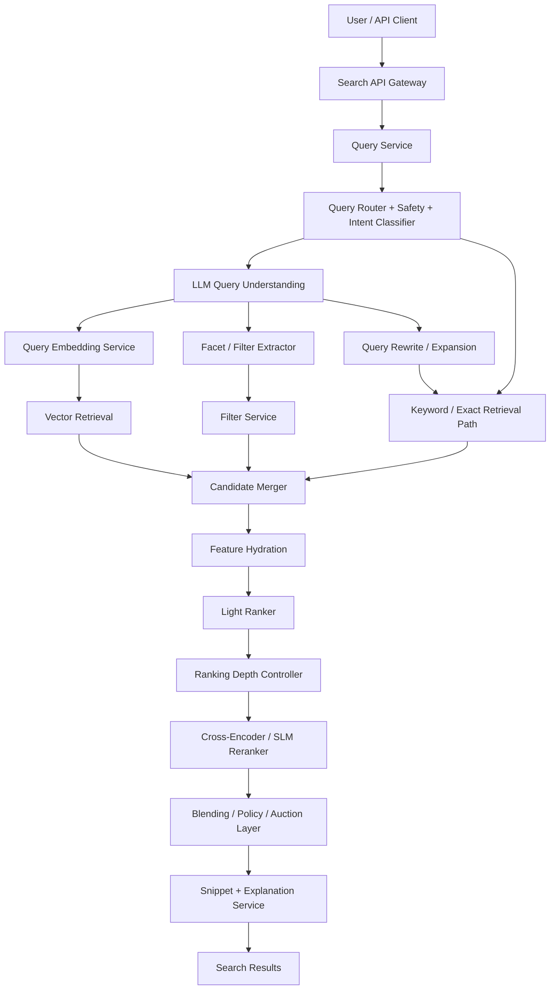

Core principle: **do not run expensive models over the entire corpus**. Use cheap retrieval to get broad candidates, then progressively spend more compute on fewer items.

LinkedIn follows this same staged pattern: embedding-based retrieval narrows the corpus, then a cross-encoder SLM combines query, document, and member features for final ranking. ([linkedin.com](https://www.linkedin.com/blog/engineering/search/reimagining-linkedins-search-stack))

---

# 3. Data model

Every searchable item should be represented in four forms.

```text id="lhabqx"
Document {
  id: string
  tenant_id: string
  type: enum                  // product, article, profile, job, place, ticket, etc.
  raw_text: string
  structured_fields: map      // title, category, location, price, author, brand, etc.
  permissions: acl
  freshness_timestamp: time
  popularity_signals: map
  business_signals: map
  quality_signals: map
  embedding: float[d]
  compressed_summary: string
  phrase_embeddings: optional
}
```

Recommended storage split:

| Store | Purpose |
|---|---|
| Object store / lake | raw documents, historical snapshots |
| OLTP DB | document metadata and write source of truth |
| Search index | lexical BM25, filters, facets |
| Vector index | dense embedding retrieval |
| Feature store | online features for ranking |
| KV cache | summaries, query results, score cache, snippets |
| Analytics warehouse | logs, labels, evaluation, training data |

---

# 4. Ingestion and indexing

## 4.1 Offline batch pipeline

Use for full corpus processing, backfills, model migrations, and index rebuilds.

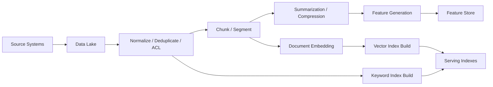

Batch jobs should:

1. Normalize documents.
2. Remove duplicates and near-duplicates.
3. Apply language detection.
4. Extract structured fields.
5. Generate document embeddings.
6. Generate compressed summaries for ranking.
7. Build lexical and vector indexes.
8. Validate index quality.
9. Publish atomically to serving clusters.

LinkedIn uses a hybrid offline/nearline pipeline where large-scale offline workflows produce features and concise representations, and nearline streaming handles low-latency updates. ([linkedin.com](https://www.linkedin.com/blog/engineering/search/reimagining-linkedins-search-stack))

## 4.2 Nearline streaming pipeline

Use for new documents, document edits, deletions, ACL changes, popularity changes, and freshness-sensitive signals.

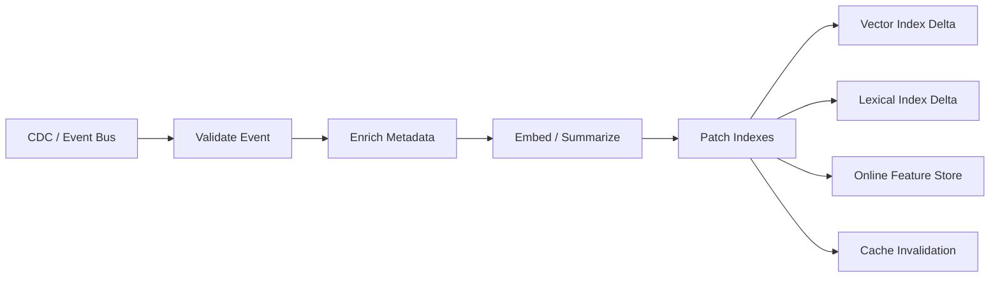

Design notes:

- Use Kafka/PubSub/Kinesis for event delivery.
- Make updates idempotent.
- Maintain document version numbers.
- Use tombstones for deletes.
- ACL updates must propagate fast.
- Keep a delta index for fresh documents and compact into the main index periodically.

---

# 5. Query understanding

Semantic search starts by turning messy user input into machine-usable signals.

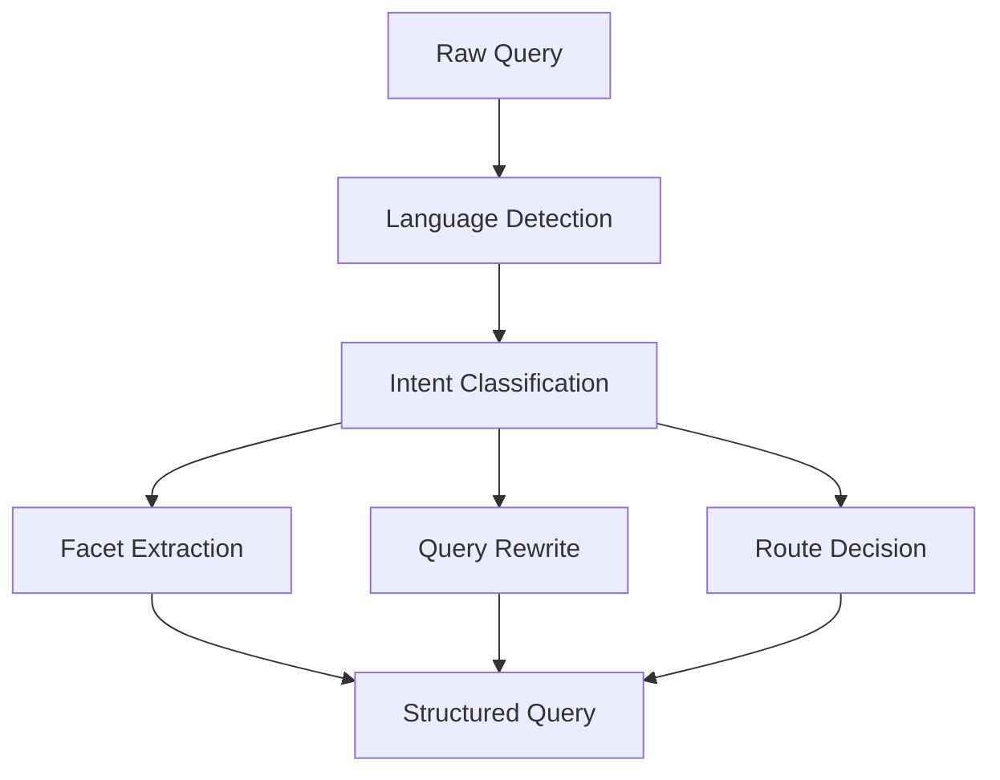

The query-understanding service should produce:

```json id="4opgd4"
{
  "original_query": "remote senior backend engineer fintech berlin",
  "intent": "job_search",
  "rewritten_query": "senior backend engineer in fintech, remote or Berlin",
  "facets": {
    "seniority": "senior",
    "role": "backend engineer",
    "industry": "fintech",
    "location": "Berlin",
    "workplace_type": ["remote", "hybrid"]
  },
  "safety_flags": [],
  "routing": {
    "semantic": true,
    "lexical": true,
    "exact_entity": false
  }
}
```

Use a small fine-tuned LLM or encoder model for:

- intent classification
- facet extraction
- entity extraction
- query rewriting
- spelling correction
- policy checks
- personalization-aware expansion

LinkedIn similarly uses a unified LLM-based query understanding layer for intent classification, facet extraction, and profile-aware rewriting, plus a lightweight router for high-QPS classification and policy checks. ([linkedin.com](https://www.linkedin.com/blog/engineering/search/reimagining-linkedins-search-stack))

Important routing logic:

| Query type                      | Preferred path              |
| ------------------------------- | --------------------------- |
| Natural language / vague intent | semantic retrieval          |
| Exact name, SKU, ID, code       | lexical/exact retrieval     |
| Entity-heavy query              | hybrid retrieval            |
| Navigational query              | direct entity lookup        |
| Unsafe or unsupported query     | safe fallback / explanation |

---

# 6. Retrieval layer

Use **hybrid retrieval**: dense vector search + lexical search + filters + optional graph/personalization candidates.

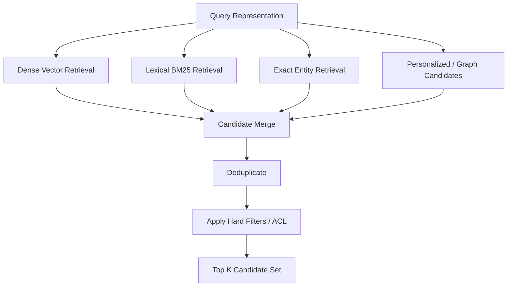

## 6.1 Dense vector retrieval

Use a bi-encoder:

```text id="37e3dh"
query_embedding = QueryEncoder(query_text + extracted_facets)
doc_embedding   = DocEncoder(document_text + structured_fields)
score           = dot(query_embedding, doc_embedding)
```

LinkedIn uses a dual-tower/bi-encoder model that maps queries and jobs into a shared semantic space, trained with contrastive InfoNCE loss plus margin-based ranking loss, including hard positives and hard negatives mined from LLM-judged data. ([linkedin.com](https://www.linkedin.com/blog/engineering/search/reimagining-linkedins-search-stack))

Options for vector search:

| Approach | Good for | Trade-off |
|---|---|---|
| Exhaustive GPU search | highest recall, fixed corpus shards, high scale | GPU cost, memory planning |
| HNSW | low latency, high recall | memory-heavy, slower updates |
| IVF-PQ / compressed ANN | very large corpora | lower recall unless tuned |
| DiskANN-like | huge corpus, lower memory | higher latency |
| Two-tier: ANN then exact rerank | balanced | more infra complexity |

LinkedIn’s post describes GPU-backed exhaustive k-nearest-neighbor retrieval using dot-product similarity over precomputed document embeddings. ([linkedin.com](https://www.linkedin.com/blog/engineering/search/reimagining-linkedins-search-stack))

## 6.2 Lexical retrieval

Keep BM25/keyword search. Dense retrieval is not enough.

Lexical retrieval is better for:

- exact names
- product IDs
- rare terms
- legal/medical codes
- error messages
- quoted phrases
- known entities
- navigational queries

## 6.3 Filtering

Support two classes of filters:

| Filter type | Example | Where applied |
|---|---|---|
| Hard filter | ACL, tenant, language, region, availability | before ranking |
| Soft filter | preference for recency, nearby, cheaper, popular | ranking feature |

For vector retrieval with filters, use one of:

1. **Pre-filtering** by shard/partition.
2. **Post-filtering** with over-fetching.
3. **Hybrid**: partition by high-cardinality stable fields, post-filter the rest.

---

# 7. Candidate merging

Each retriever returns candidates with its own score distribution. Normalize before merging.

```text id="eee44s"
final_retrieval_score =
    w_dense  * normalized_dense_score +
    w_bm25   * normalized_bm25_score +
    w_exact  * exact_match_boost +
    w_graph  * personalization_score +
    w_fresh  * freshness_score
```

Use reciprocal-rank fusion as a strong baseline:

```text id="b2zpfc"
RRF(doc) = Σ 1 / (k + rank_i(doc))
```

Candidate counts:

| Stage | Typical count |
|---|---:|
| Dense retrieval | 1K–10K |
| Lexical retrieval | 1K–10K |
| Merged candidates | 2K–20K |
| After filters/dedup | 500–5K |
| Light ranker | 200–1K |
| Cross-encoder rerank | 20–500 |
| Final page | 10–100 |

---

# 8. Ranking architecture

Use a cascade.

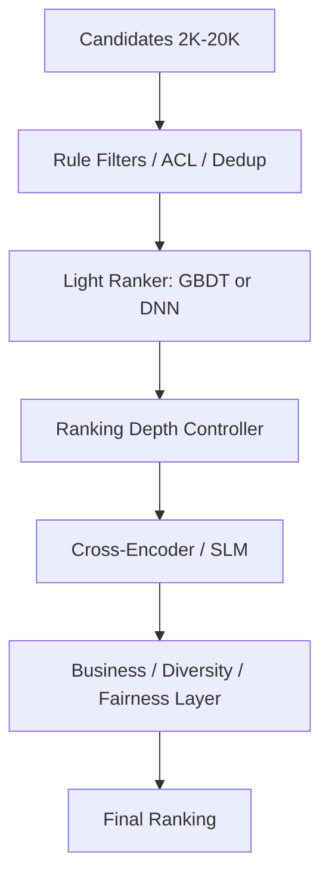

## 8.1 Light ranker

Use a cheap model over many candidates.

Features:

- retrieval scores
- BM25 score
- vector similarity
- query/document language match
- recency
- popularity
- personalization
- click-through priors
- document quality
- availability
- geographic distance
- exact field matches
- facet satisfaction

Model options:

- LambdaMART / XGBoost
- shallow DNN
- logistic regression for early MVP
- small transformer only if latency budget allows

## 8.2 Ranking depth controller

The depth controller decides how many candidates go to the expensive reranker.

```text id="vb4kcv"
depth = f(query_type, latency_budget, system_load, confidence, traffic_tier)
```

Examples:

| Situation | Depth |
|---|---:|
| high-confidence exact query | 50 |
| ambiguous semantic query | 300 |
| premium/high-value traffic | 500 |
| degraded GPU capacity | 50–100 |
| cached repeated query | reuse cached scores |

LinkedIn explicitly uses score caching, a ranking-depth controller, and traffic shaping to balance quality and latency at peak load. ([linkedin.com](https://www.linkedin.com/blog/engineering/search/reimagining-linkedins-search-stack))

## 8.3 Cross-encoder / SLM reranker

A cross-encoder reads the query and candidate together, producing a stronger relevance score than a bi-encoder.

Prompt shape:

```text id="yiardn"
[System]
Decide whether the candidate satisfies the search query.

[Query]
{query}

[Extracted Facets]
{facets}

[Candidate]
Title: ...
Summary: ...
Structured fields: ...

[Answer]
yes/no relevance probability
```

Scoring:

```text id="bx2bg3"
relevance_score = P(yes) / (P(yes) + P(no))
```

LinkedIn describes using a decoder-only SLM where logits for “yes” and “no” are converted into probabilities used for ranking. ([linkedin.com](https://www.linkedin.com/blog/engineering/search/reimagining-linkedins-search-stack))

For generic search, the reranker can be multi-task:

```text id="95exeu"
score = 
  α * relevance
+ β * predicted_engagement
+ γ * quality
+ δ * freshness
+ ε * business_value
- ζ * policy_risk
```

LinkedIn trains its SLM with multi-teacher, multi-task distillation, including relevance teachers and engagement/action teachers. ([linkedin.com](https://www.linkedin.com/blog/engineering/search/reimagining-linkedins-search-stack))

---

# 9. Context compression for expensive ranking

Long documents destroy latency and cost. Do not feed raw full documents to the cross-encoder.

Use:

1. Precomputed summaries.
2. Field-aware truncation.
3. Passage selection.
4. Single-token or compact embedding compression.
5. Phrase-level snippets.

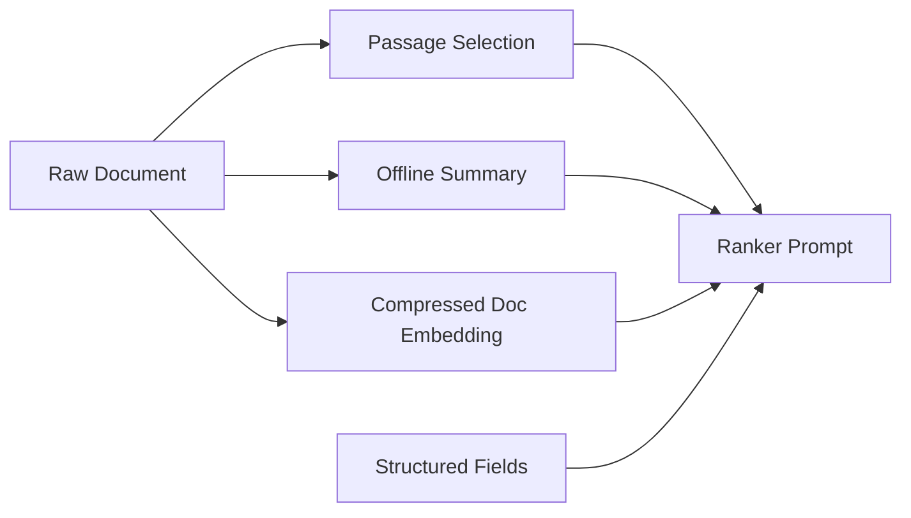

Recommended prompt budget:

| Field | Budget |
|---|---:|
| title/name | 20–50 tokens |
| key metadata | 50–150 tokens |
| selected passages | 200–600 tokens |
| summary | 100–300 tokens |
| user/context features | compact structured text |
| total | usually under 1K tokens |

LinkedIn reports that long item descriptions dominated SLM prompts, so they used offline summarization and embedding compression to reduce inference cost. Their post shows throughput improving from 290 items/sec/GPU with raw text to 2,200 with summarized text and 22,000 with embedding compression, with some NDCG trade-off. ([linkedin.com](https://www.linkedin.com/blog/engineering/search/reimagining-linkedins-search-stack))

---

# 10. Explainability and snippets

Generate snippets after ranking, not before.

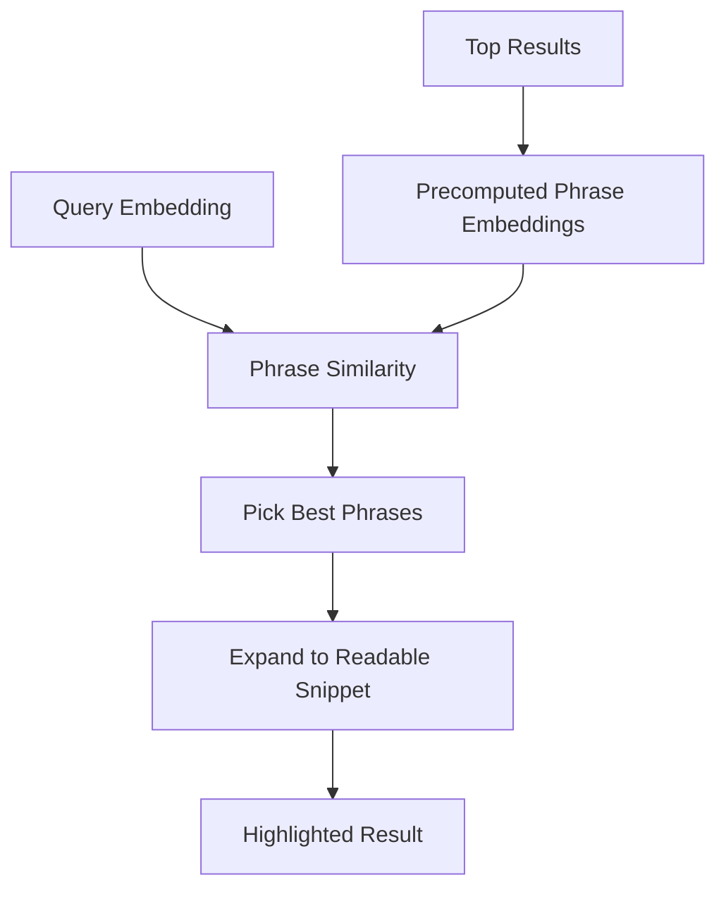

For each document, precompute:

- important phrases
- phrase embeddings
- source offsets
- section names
- readable fallback summary

At serving time:

1. Fetch top result phrase embeddings.
2. Compute similarity to query embedding.
3. Pick best phrase(s).
4. Expand to sentence/window.
5. Highlight matched terms and semantic phrases.

LinkedIn uses a similar approach for semantic snippets: precomputed phrase embeddings are compared with the query embedding, then top phrases are expanded into readable snippets. ([linkedin.com](https://www.linkedin.com/blog/engineering/search/reimagining-linkedins-search-stack))

---

# 11. Online serving flow

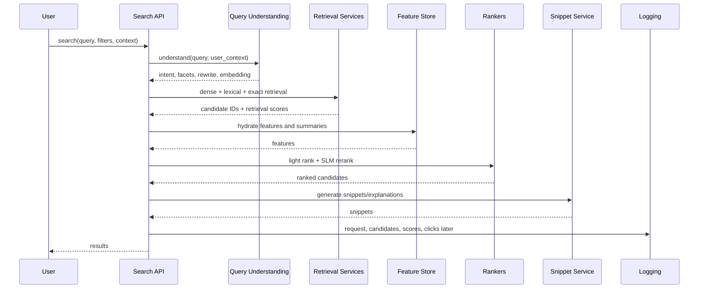

Latency budget example:

| Component | P95 budget |
|---|---:|
| API gateway/auth | 5–15 ms |
| query understanding | 10–50 ms |
| query embedding | 5–30 ms |
| retrieval | 20–80 ms |
| feature hydration | 10–50 ms |
| light ranking | 5–20 ms |
| SLM reranking | 30–200 ms |
| snippets | 10–50 ms |
| total | 100–500 ms |

Use parallelism aggressively: dense, lexical, exact, feature prefetch, and cache reads should run concurrently.

---

# 12. Training system

## 12.1 Embedding model training

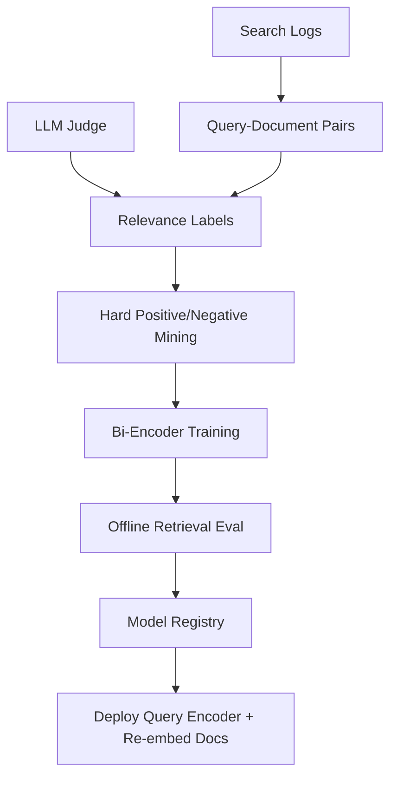

Training data:

- clicked results
- skipped results
- purchased/applied/booked/converted results
- manually labeled judgments
- LLM-judged query-document pairs
- synthetic queries
- hard negatives
- cold-start examples

Loss:

```text id="q0yo8p"
L = λ1 * InfoNCE + λ2 * pairwise_margin_loss + λ3 * regularization
```

Use hard negatives where the current model ranks an irrelevant item too high, and hard positives where it ranks a relevant item too low. LinkedIn uses this exact idea with LLM-judged hard positives and negatives. ([linkedin.com](https://www.linkedin.com/blog/engineering/search/reimagining-linkedins-search-stack))

## 12.2 Cross-encoder / SLM training

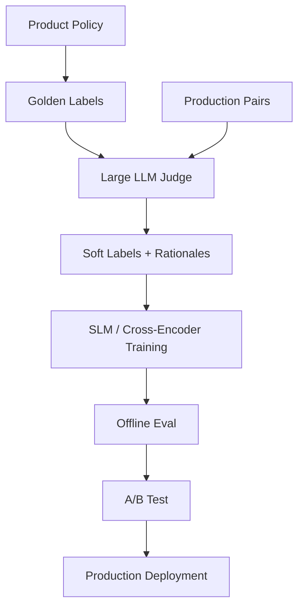

Train the SLM using:

- graded relevance labels
- soft labels from teacher models
- engagement/action labels
- policy labels
- KL divergence to teacher distributions
- pairwise/listwise ranking losses

LinkedIn first aligns an LLM judge with product policy and golden PM labels, then distills larger teacher models into smaller evaluator/ranker models that can run at scale. ([linkedin.com](https://www.linkedin.com/blog/engineering/search/reimagining-linkedins-search-stack))

---

# 13. Continuous evaluation

You need two evaluation loops: offline and online.

## 13.1 Offline relevance evaluation

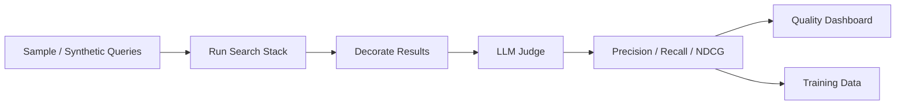

Metrics:

| Metric | Purpose |
|---|---|
| Recall@K | retrieval quality |
| Precision@K | top result quality |
| NDCG@K | ranking quality |
| MRR | known-answer search |
| Coverage | how many queries get usable results |
| Diversity | avoid near-duplicate result pages |
| Freshness | new content surfacing |
| Latency/cost | serving efficiency |
| Fairness/safety | policy compliance |

LinkedIn’s continuous evaluation loop samples or synthesizes queries, retrieves results, decorates documents, grades them with an LLM judge, and computes precision, recall, and NDCG. ([linkedin.com](https://www.linkedin.com/blog/engineering/search/reimagining-linkedins-search-stack))

## 13.2 Online evaluation

Track:

- CTR
- long clicks / dwell time
- conversion
- reformulation rate
- zero-result rate
- abandonment
- hide/report actions
- result diversity
- latency impact
- revenue/business KPIs, where relevant

Use A/B tests, interleaving, and guardrails.

---

# 14. Caching strategy

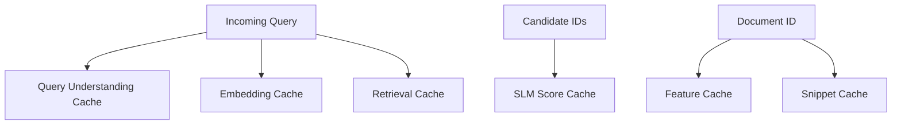

Cache layers:

| Cache | Key | TTL |
|---|---|---:|
| query understanding | normalized query + locale | minutes to days |
| query embedding | model version + normalized query | days |
| retrieval results | query embedding hash + filters | seconds to minutes |
| feature cache | document id + feature version | minutes to hours |
| SLM score cache | query hash + doc id + model version | minutes to days |
| snippet cache | query hash + doc id | minutes to days |

Invalidate on:

- document updates
- permission changes
- model version changes
- index version changes
- major feature changes

---

# 15. Scalability and reliability

## 15.1 Sharding

Shard by:

- tenant
- language
- geography
- document type
- embedding index partition
- hash of document ID

For very large corpora:

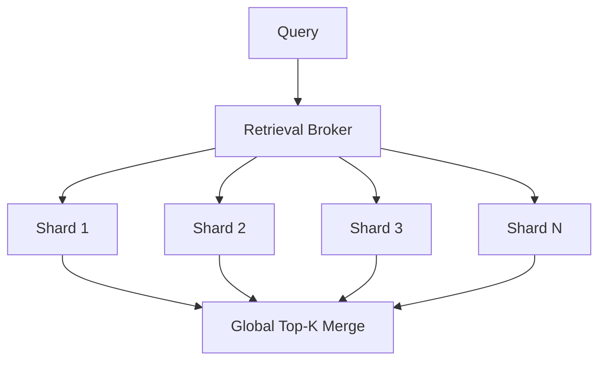

Each shard returns local top-K. Broker merges global top-K.

## 15.2 Multi-region

Use:

- active-active read serving
- region-local indexes
- async replication
- failover to lexical search if vector cluster fails
- graceful ranker degradation

Degradation order:

1. Disable snippets.
2. Lower SLM rerank depth.
3. Use cached SLM scores.
4. Use light ranker only.
5. Use retrieval score only.
6. Fall back to lexical search.

## 15.3 Traffic shaping

At peak load:

- lower rerank depth
- prioritize high-value traffic
- route repeated queries to cache
- batch model inference
- shed non-critical explanation/snippet work
- use smaller models
- apply per-tenant quotas

LinkedIn explicitly mentions traffic shaping to balance load during peak traffic. ([linkedin.com](https://www.linkedin.com/blog/engineering/search/reimagining-linkedins-search-stack))

---

# 16. Security, privacy, and permissions

Semantic search can leak data if ACLs are applied too late.

Rules:

1. Apply tenant and ACL filters before final ranking.
2. Never cache unauthorized result sets across users.
3. Include permission version in cache keys.
4. Encrypt embeddings and metadata at rest.
5. Treat embeddings as sensitive: they can reveal semantic content.
6. Keep audit logs for search requests.
7. Support right-to-delete by removing raw doc, index entries, embeddings, summaries, and caches.
8. Redact PII from training data unless explicitly allowed.
9. Separate public, private, and restricted corpora.

---

# 17. APIs

## Search API

```http id="r2ifnj"
POST /search
```

```json id="xpx7mn"
{
  "query": "best family hotels near beach in Barcelona",
  "filters": {
    "language": "en",
    "price_max": 300,
    "availability_date": "2026-07-20"
  },
  "context": {
    "user_id": "u123",
    "locale": "en-US",
    "device": "mobile"
  },
  "page_size": 20,
  "cursor": null
}
```

Response:

```json id="j3oajd"
{
  "results": [
    {
      "id": "doc_1",
      "title": "Family Beach Hotel Barcelona",
      "snippet": "Close to the beach with family rooms...",
      "score": 0.93,
      "explanation": "Matches family, beach, and Barcelona preferences",
      "metadata": {}
    }
  ],
  "cursor": "opaque_cursor",
  "debug": {
    "query_intent": "hotel_search",
    "filters_applied": ["price_max", "availability_date"]
  }
}
```

## Indexing API

```http id="5z5t5w"
PUT /documents/{id}
DELETE /documents/{id}
POST /documents:bulk_upsert
```

Document upsert should trigger:

- metadata update
- embedding generation
- lexical index update
- vector index update
- feature update
- cache invalidation

---

# 18. Technology choices

A practical stack:

| Layer | Options |
|---|---|
| API | Envoy, NGINX, FastAPI, gRPC, Java/Kotlin/Go services |
| Event bus | Kafka, Pulsar, Pub/Sub, Kinesis |
| Batch | Spark, Ray, Beam, Flink batch |
| Orchestration | Airflow, Flyte, Dagster |
| Streaming | Flink, Kafka Streams, Beam |
| Vector serving | FAISS GPU, ScaNN, Milvus, Vespa, OpenSearch k-NN, custom CUDA |
| Lexical search | Elasticsearch, OpenSearch, Solr, Vespa |
| Feature store | Feast, Redis, Venice-like KV, DynamoDB/Cassandra |
| Model serving | Triton, vLLM, SGLang, TorchServe, custom GPU service |
| Cache | Redis, Memcached, Couchbase |
| Warehouse | BigQuery, Snowflake, Hive, Iceberg, Delta |
| Observability | Prometheus, Grafana, OpenTelemetry, Datadog |

LinkedIn specifically mentions SGLang for SLM deployment, Spark/Flyte for offline workflows, Flink for nearline updates, and distributed storage for embeddings and summaries. ([linkedin.com](https://www.linkedin.com/blog/engineering/search/reimagining-linkedins-search-stack))

---

# 19. MVP to full-scale roadmap

## Phase 1: MVP

- Use off-the-shelf embedding model.
- Build document embedding pipeline.
- Store vectors in managed vector DB.
- Use BM25 + vector hybrid retrieval.
- Use a simple reranker or hosted cross-encoder.
- Add search logs and basic metrics.

## Phase 2: Production quality

- Fine-tune bi-encoder on real query-document pairs.
- Add query understanding.
- Add hard-negative mining.
- Add feature store.
- Add LambdaMART/light ranker.
- Add cross-encoder reranking.
- Add A/B testing.

## Phase 3: Large scale

- Build GPU or optimized ANN retrieval.
- Add ranking-depth controller.
- Add score caching.
- Add traffic shaping.
- Add summarization/compression.
- Add nearline updates.
- Add multi-region serving.

## Phase 4: Self-improving system

- LLM judge aligned with product policy.
- Continuous relevance dashboards.
- Teacher-student distillation.
- Multi-objective ranking.
- Automated regression detection.
- Query-category-specific evaluation.

---

# 20. Key design decisions

| Decision | Recommendation |
|---|---|
| Dense only or hybrid? | Hybrid. Dense search misses exact-match queries. |
| ANN or exhaustive GPU? | ANN for simplicity/cost; exhaustive GPU when recall and scale justify it. |
| One model or cascade? | Cascade. Spend expensive compute only on top candidates. |
| Raw document in reranker? | No. Use summaries, selected passages, and compressed embeddings. |
| Manual labels only? | No. Combine PM labels, behavior logs, and LLM-judge labels. |
| Cache aggressively? | Yes, but include model/index/permission versions in keys. |
| Apply ACL after retrieval? | Retrieval may over-fetch, but final output must be ACL-safe before ranking/serving. |
| Optimize relevance only? | Start with relevance, then add engagement, quality, diversity, safety, and business constraints. |

---

# 21. Reference production flow

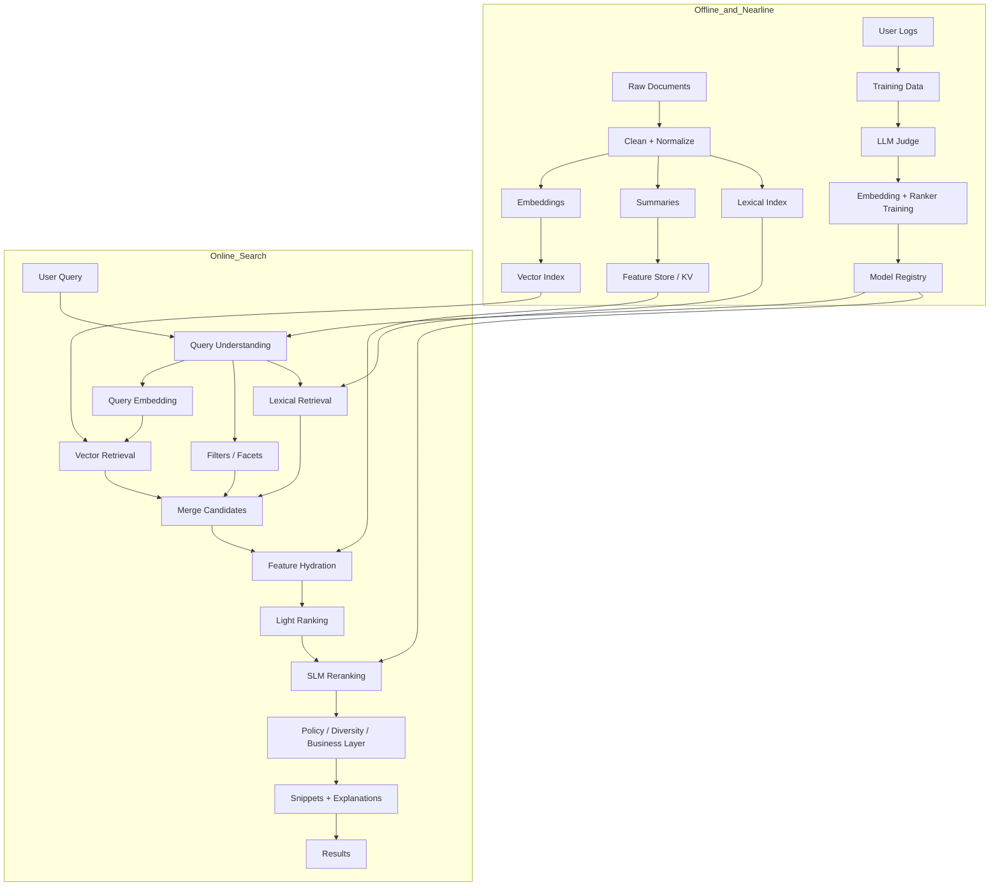

The essential pattern is: **understand the query, retrieve broadly, rank deeply, compress context, cache aggressively, evaluate continuously, and retrain from judged/logged data.** This is the same strategic shape LinkedIn presents, generalized beyond jobs and people search to any high-scale semantic-search domain.
