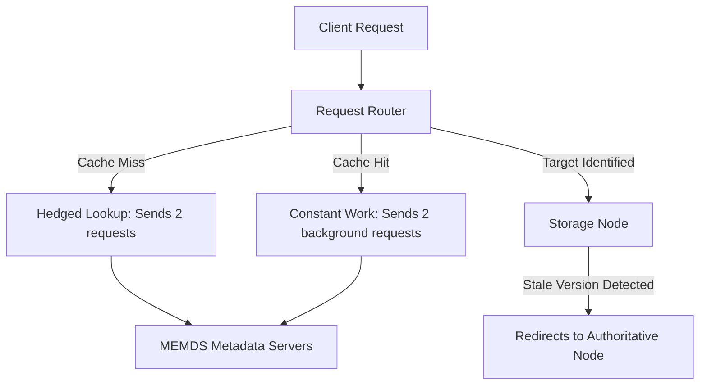

> [!quote] The Philosophy of Scale
> "If you have a large team... you cannot have centralized decision making. We have tenets... so that we can push down decision making into the organization."

## 📌 The 4 Core Tenets of DynamoDB
Every architectural decision in DynamoDB is driven by four non-negotiable tenets, ranked in order of priority:
1. **Security**: Data is always encrypted at rest.
2. **Durability**: Data is written to multiple Availability Zones (AZs) before being committed.
3. **Availability**: The system must survive the complete loss of an AZ.
4. **Predictable (Low) Latency**: The defining feature of DynamoDB; guarantees single-digit millisecond latency at *any* scale.

---

## 🧩 Designing for Distributed State
Stateful distributed systems are exponentially more complex than stateless ones, especially when processing up to 151 million requests per second.

### The "Magic Number 3" for Replicas
When determining the size of a replication cluster, DynamoDB settled on **three nodes** for each partition of data.
- **Why not 2 or 4?** Even numbers risk "split-brain" scenarios during network partitions, where both sides think they are healthy and accept diverging writes. Odd numbers ensure a clear majority.
- **Why not 5 or 1,000?** While larger clusters survive more simultaneous failures, they require writing to a massive majority (e.g., 502 nodes out of 1,001), degrading latency and inflating costs. With 5 nodes, the system is just racing to repair a failed node before another fails.
- **The Solution:** Thousands of nodes are organized into highly efficient, manageable **groups of three**.

---

## 🏎️ Request Routing & Network Latency
Because physical distance dictates network latency, DynamoDB is relentlessly optimized to avoid cross-AZ network hops.

* **Split-Horizon DNS:** Clients receive IP addresses for Load Balancers located in their *own* specific Availability Zone.
* **Local AZ Routing:** For eventually consistent reads, Request Routers prioritize sending traffic to the storage replica located in the same AZ. (Strongly consistent reads are naturally distributed because 1/3 of partition leaders are kept in each AZ).
* **Idle Capacity for Failure:** Traffic is strictly managed so no AZ handles more than 1/3 of the load. If an AZ goes down, the remaining AZs must absorb a 50% traffic spike without degradation. This idle capacity is baked into DynamoDB's pricing.

---

## 🧠 Metadata & Caching: Solving the "Cold Cache" Problem
To route a request, DynamoDB must know which of its hundreds of thousands of storage nodes holds your specific data partition. This requires a metadata service (MEMDS).

> [!warning] The Danger of Caches
> "If you're ever building a cache and a large fleet drives a small fleet, be very careful... What happens if hundreds of thousands of caches go stale? Your partition metadata will fall over."

To safely scale metadata lookup in tens of microseconds, DynamoDB employs brilliant distributed system patterns:

### 1. Authoritative Eventual Consistency
DynamoDB uses a two-tier eventually consistent cache. To prevent routing errors from stale caches, **data is versioned**. The storage nodes act as the ultimate authority. If a Request Router uses a stale cache to send a request (e.g., Version 20) to a node that has already split or moved the partition (Version 21), the storage node rejects it and immediately redirects the request to the correct, new location.

### 2. Hedging Requests
To guarantee predictable low latency, Request Routers **"hedge"** their metadata lookups on cache misses by sending *two* simultaneous requests to two different MEMDS servers. By taking the fastest response, they defeat statistical tail latency.

### 3. "Constant Work" Pattern
To prevent the metadata service from crashing if the entire Request Router fleet loses its cache simultaneously, DynamoDB forces **Constant Work**.
- Even on a **cache hit**, the Request Router still sends two background requests to the MEMDS servers.
- The metadata service is essentially tricked into running at worst-case capacity 100% of the time, ensuring it will never buckle during an actual cache stampede.

---

## 🚦 Understanding DynamoDB Limits
Every limit in DynamoDB exists to protect the tenet of **Predictable (Low) Latency** on shared physical infrastructure.

* **Partition Count is Meaningless:** Customers often ask how many partitions their table has, but this is useless because partitions manage different fractions of the key range. Instead, use the **Table Warm Throughput** feature to see exactly how much traffic your table can handle before throttling. (Note: "IOPS dilution" from table splitting is a myth of the past; new partitions retain full partition-level limits).
* **Transaction Limits (100 items):** DynamoDB uses standard two-phase commits for write transactions. Limits exist because modifying too many items concurrently causes high contention, degrading availability and latency.
* **No "Hung" Transactions:** Unlike relational databases where a developer can open a transaction and go to lunch, DynamoDB requires all transaction items to be specified at once.
* **Item Size (400 KB):** Prevents "noisy neighbor" impacts on shared hardware.
* **Global Secondary Indexes (20 max):** Bounded to ensure consistent, predictable replication lag.

> [!tip] Developer Best Practices for DynamoDB
> - **Use Long-Lived Connections:** Right-size your connection pools. Establishing new connections forces you to new Request Routers, causing cache misses for your identity/metadata.
> - **Hedge Your Application Requests:** If you want low latency in your own apps, send two simultaneous requests (make sure writes are idempotent!) and take the fastest response. Do not change default timeouts.
