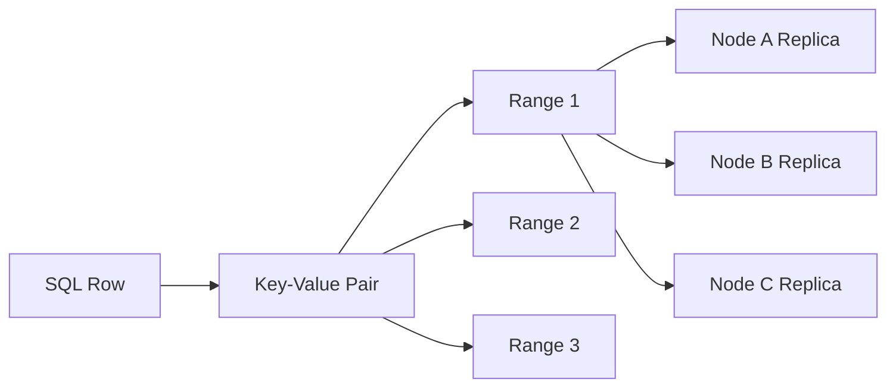
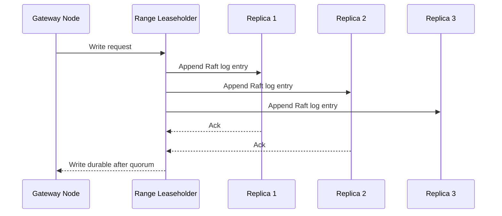
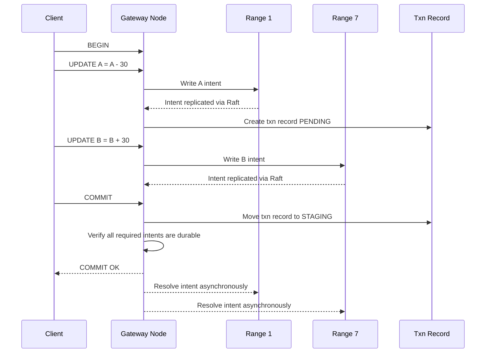
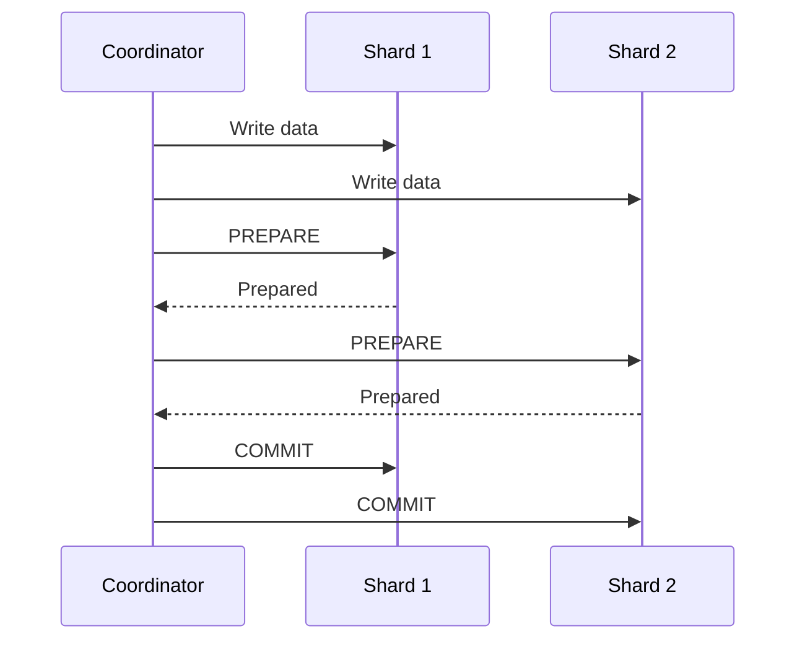
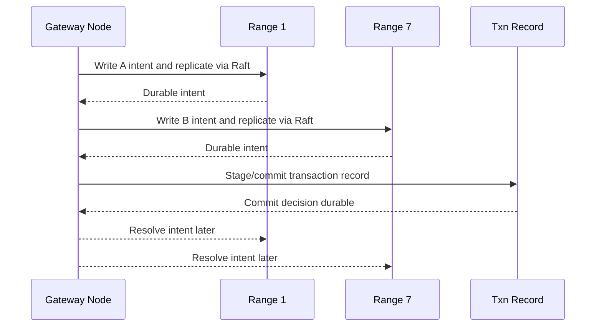

## Big Idea

CockroachDB supports **distributed ACID transactions** across multiple nodes, ranges, and tables. It does this by combining:

- **MVCC** for timestamped versions of data
- **Raft replication** for durability and consistency within each range
- **Transaction intents** for provisional writes
- **Transaction records** for the transaction's final state
- **Parallel Commits** to avoid a classic 2PC-style prepare round trip

A transaction can touch data spread across many ranges and nodes, but CockroachDB still makes it appear as if the transaction happened atomically.

---

## Core Storage Model

CockroachDB stores SQL rows as key-value pairs. The global keyspace is split into **ranges**. Each range is replicated across multiple nodes using **Raft**.



Each range has a leaseholder/leader that coordinates reads and writes for that range. Writes are replicated to a Raft quorum before they are considered durable.

---

## What Raft Does

Raft is used **inside each range** to replicate writes consistently.

For a write to Range 1:



Raft gives CockroachDB durable, ordered writes within a range. Distributed transactions then coordinate writes across multiple such ranges.

---

## MVCC: Versioned Values

CockroachDB uses **MVCC**, meaning each value is stored with a timestamp.

Instead of overwriting a value directly:

```text
account:A = 100
```

CockroachDB stores versions:

```text
account:A @ t1  = 100
account:A @ t10 = 70
```

A transaction reads from a consistent timestamp, which helps provide serializable isolation.

---

## Transaction Intents

When a transaction writes, CockroachDB does not immediately create a normal committed value. It writes a **transaction intent**.

A transaction intent is a provisional MVCC value plus metadata saying which transaction owns it.

Example:

```text
account:A @ t10 = 70 [intent owned by txn123]
```

This means:

> Transaction `txn123` intends to write `account:A = 70`, but the transaction is not fully committed yet.

The important point is that the intent is replicated through Raft as part of the normal write path.

So the write is not merely:

```text
A = 70
```

It is more like:

```text
A @ t10 = 70
owner = txn123
txn record location = Range 1
```

---

## Transaction Record

Each transaction has a **transaction record**. This record stores the official state of the transaction.

Typical states:

```text
PENDING   -> transaction is still running
STAGING   -> transaction is in the parallel commit path
COMMITTED -> transaction committed
ABORTED   -> transaction rolled back
```

The transaction record is stored in the range of the transaction's **first write**.

Example:

```sql
BEGIN;
UPDATE accounts SET balance = balance - 30 WHERE id = 'A';
UPDATE accounts SET balance = balance + 30 WHERE id = 'B';
COMMIT;
```

If the first write is to `account:A`, and `account:A` lives in Range 1, then the transaction record is stored in Range 1.

```text
Range 1:
  account:A         -> 70 [intent by txn123]
  txn-record:txn123 -> PENDING

Range 7:
  account:B         -> 80 [intent by txn123]
```

The intent on `account:B` points back to the transaction record in Range 1.

---

## Example: Money Transfer

Initial state:

```text
A = 100
B = 50
```

Transaction:

```sql
BEGIN;
UPDATE accounts SET balance = balance - 30 WHERE id = 'A';
UPDATE accounts SET balance = balance + 30 WHERE id = 'B';
COMMIT;
```

Assume:

```text
account:A is in Range 1
account:B is in Range 7
```

### Step 1: Write Intent for A

```text
Range 1:
  account:A @ t10 = 70 [intent by txn123]
  txn-record:txn123 = PENDING
```

This is replicated through Raft for Range 1.

### Step 2: Write Intent for B

```text
Range 7:
  account:B @ t10 = 80 [intent by txn123]
```

This is replicated through Raft for Range 7.

### Step 3: Commit

At commit time, CockroachDB verifies that the required intents were successfully written and replicated. With **Parallel Commits**, the transaction record can move to `STAGING`, and once all required writes are known to be durable, the transaction is considered committed.

```text
txn-record:txn123 = STAGING

Required intents:
  account:A intent exists and is durable
  account:B intent exists and is durable

Result:
  transaction can commit
```

### Step 4: Async Cleanup

After the transaction is considered committed, CockroachDB cleans up the intents asynchronously.

Before cleanup:

```text
Range 1:
  account:A @ t10 = 70 [intent by txn123]
  txn-record:txn123 = COMMITTED or STAGING-resolvable

Range 7:
  account:B @ t10 = 80 [intent by txn123]
```

After cleanup:

```text
Range 1:
  account:A @ t10 = 70 [committed]

Range 7:
  account:B @ t10 = 80 [committed]
```

Cleanup is not on the critical path of the transaction commit.

---

## Transaction Flow Diagram



---

## Parallel Commits

Parallel Commits is CockroachDB's optimization that avoids a traditional 2PC prepare round trip.

In a classic distributed transaction system, the transaction often does:

```text
1. Write data
2. Prepare all participants
3. Commit all participants
```

CockroachDB instead makes the normal writes create durable transaction intents. These intents are already replicated through Raft. Therefore, by commit time, the prepare-like information already exists.

CockroachDB's flow is closer to:

```text
1. Write durable intents
2. Commit transaction record after proving required intents exist
3. Resolve intents asynchronously
```

---

## Why It Is Better Than Classic 2PC

Classic 2PC has a separate prepare phase. Each participant must durably record that it is prepared, then later receive the final commit decision.



CockroachDB avoids the separate prepare round because the writes themselves create durable intents.



The key improvement:

> CockroachDB merges the prepare-like durability work into the normal write path and removes intent cleanup from the commit critical path.

---

## Round Trips: Mental Model

For a distributed write transaction, the critical path is roughly:

```text
write round trips + commit round trip
```

If writes are sequential:

```text
Write A intent  -> round trip
Write B intent  -> round trip
Commit record   -> round trip
```

If writes are batched or pipelined:

```text
Parallel writes -> round trip
Commit record   -> round trip
```

So in the happy path, CockroachDB avoids the extra synchronous prepare round trip that classic 2PC requires.

---

## Failure Handling

### Case 1: Transaction crashes before commit

```text
Range 1:
  account:A = 70 [intent by txn123]
  txn-record:txn123 = PENDING

Range 7:
  account:B unchanged
```

Another transaction that encounters the intent can inspect the transaction record. If the transaction is abandoned or aborted, the intent can be removed.

Final state:

```text
A = 100
B = 50
```

### Case 2: Transaction commits but cleanup does not finish

```text
Range 1:
  account:A = 70 [intent by txn123]
  txn-record:txn123 = COMMITTED/STAGING-resolvable

Range 7:
  account:B = 80 [intent by txn123]
```

A later reader can check the transaction record and resolve the intents. The transaction remains atomic even if cleanup was delayed.

---

## Concise Mental Model

```text
Normal write = provisional MVCC value + txn intent + Raft replication

Commit = prove all required intents are durable and finalize txn record

Cleanup = remove intent markers asynchronously
```

Even shorter:

```text
Durable intents + transaction record + Raft = distributed ACID transaction
```

---

## Key Takeaways

- CockroachDB splits data into ranges.
- Each range is replicated using Raft.
- A distributed transaction may write to many ranges.
- Writes create durable transaction intents.
- The transaction record is stored in the range of the first write.
- Intents point back to the transaction record.
- Parallel Commits avoid a separate 2PC prepare round trip.
- Cleanup of committed intents happens asynchronously.
- If a node sees an unresolved intent later, it can check the transaction record and resolve it.

