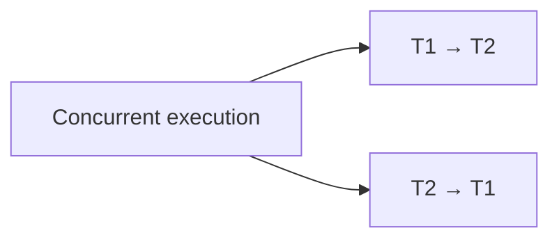
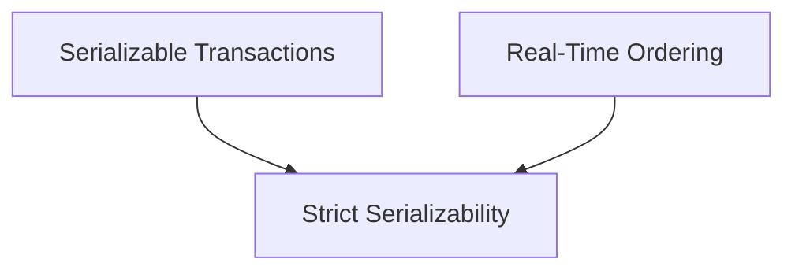

> [!summary]
> 
> - **Linearizability** → operations appear atomic and respect **real-time order**
>     
> - **Serializability** → transactions behave like they ran **one at a time**
>     
> - **Strict Serializability** → serializable transactions that also respect **real-time order**
>     

---

## Linearizability

Linearizability applies to **individual operations**.

Each operation appears to happen at one instant between its start and completion.

```text
A finishes before B starts
        ↓
A must appear before B
```

Example:

```text
Write x=42
    ✓ completes

        Read x
        → must see 42
```

If two operations overlap, either ordering is allowed.

```text
Write ──────────────
       Read ──────────────
```

Could be ordered as:

```text
Write → Read
```

or:

```text
Read → Write
```

> [!important]  
> Linearizability preserves **real-time ordering**.

---

## Serializability

Serializability applies to **transactions**.

Concurrent transactions must produce a result equivalent to executing them one at a time.



For example:

```text
T1:
  read A
  write B

T2:
  read B
  write A
```

They may execute concurrently, but the result must be equivalent to either:

```text
T1 → T2
```

or:

```text
T2 → T1
```

However, serializability does **not necessarily respect real time**.

```text
T1 completes

        T2 starts
```

A serializable system could theoretically choose:

```text
T2 → T1
```

---

## Strict Serializability

Strict serializability combines both guarantees:

```text
Serializability
      +
Real-time ordering
      =
Strict Serializability
```



If:

```text
T1 commits
    ↓
T2 starts
```

then the serialization order **must** be:

```text
T1 → T2
```

---

## Mental Model

|Guarantee|Unit|Serial order|Respects real time|
|---|---|---|---|
|**Linearizability**|Operation|✅|✅|
|**Serializability**|Transaction|✅|❌ not required|
|**Strict Serializability**|Transaction|✅|✅|

> [!tip]  
> **Strict serializability is essentially linearizability generalized to transactions.**

---

## One-Line Definitions

**Linearizability**

> Operations appear instantaneous and respect real-time ordering.

**Serializability**

> Transactions behave as if they executed one at a time in some order.

**Strict Serializability**

> Transactions behave as if they executed one at a time **in an order consistent with real time**.

---

## Related

- [[DynamoDB MRSC]]
    
- [[Distributed Systems]]
    
- [[Transactions]]
    
- [[Isolation Levels]]
    
- [[Consensus]]