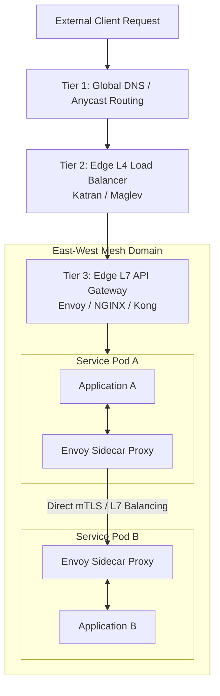
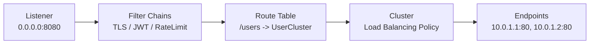
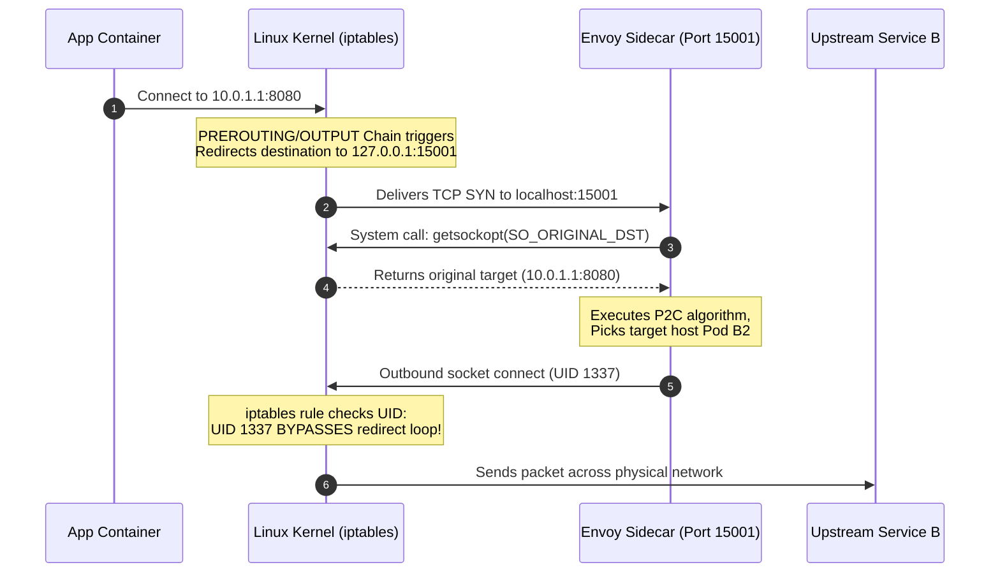

> [!abstract] Summary
> Modern microservice architectures rely on a **decentralized, multi-tiered routing model** to manage traffic at scale. While traditional edge proxying handles incoming internet traffic (North-South), internal service communications (East-West) are managed via sidecar proxies like **Envoy** or kernel-level programs like **eBPF**, bypassing centralized bottleneck proxies.

---

## 1. Multi-Tiered Load Balancing Architecture

Traffic in large-scale systems is divided into two major patterns:
- **North-South Traffic:** Requests entering or leaving the data center from external clients.
- **East-West Traffic:** Inter-service communications within the cluster network.



### The 4 Tiers Breakdown

| Tier | Layer | Primary Function | Industry Standard Tools |
| :--- | :--- | :--- | :--- |
| **Tier 1: Global Routing** | DNS / BGP | Routes users to the closest datacenter/region via Anycast or GeoDNS | Cloudflare, AWS Route 53, Akamai |
| **Tier 2: Edge L4 LB** | Layer 4 (TCP/UDP) | Handles millions of packets/sec, stateful/stateless packet forwarding | Katran (Meta), Maglev (Google), AWS NLB |
| **Tier 3: Edge L7 Gateway** | Layer 7 (HTTP/gRPC) | Terminates TLS, handles authentication, rate-limiting, and path routing | Envoy, NGINX, Kong, Traefik |
| **Tier 4: Internal Mesh** | Layer 7 (Client-Side) | Microservice-to-microservice resilience, discovery, and mTLS | Envoy, Linkerd2-proxy, Cilium |

---

## 2. Load Balancing Types & Algorithms

### Operational Types
- **Layer 4 (L4):** Operates on raw IP addresses and ports. High performance, ultra-low CPU overhead, but blind to payload (headers, paths).
- **Layer 7 (L7):** Operates on application payloads (HTTP headers, gRPC streams). Enables routing by path, header manipulation, and canary deployments.
- **Client-Side Balancing:** The calling service queries dynamic discovery endpoints and balances requests locally, eliminating middleman proxies.

### Modern Algorithms

> [!tip] Algorithmic Standard: P2C + Peak EWMA
> Traditional **Round-Robin** fails under variable load, creating hot-spots. Modern proxies default to **Power of Two Random Choices (P2C) with Peak Exponentially Weighted Moving Average (EWMA)**.
> 1. Select two healthy target backend instances at random.
> 2. Pick the instance with the lower active connection count and lower historical response latency.

- **Consistent Hashing (Ketama):** Hashes specific request parameters (e.g., `user_id`). Guarantees requests for the same user land on the exact same backend server, maximizing CPU cache utilization and state retention.

---

## 3. Deep Dive: Envoy Proxy

Envoy is an open-source, high-performance C++ proxy designed by Lyft for cloud-native microservices. It runs out-of-process as a **sidecar proxy** next to application containers.

### The 5 Core Abstractions



1. **Listener:** Binds to a specific socket (IP:Port) to accept incoming network connections.
2. **Filter Chains:** Modular pipeline processing connection bytes (L4) or HTTP streams (L7).
3. **Route Table:** Matches requests (HTTP paths, headers) to target upstream Clusters.
4. **Cluster:** A logical group of backend servers configured with specific load balancing algorithms, health checks, and circuit breakers.
5. **Endpoints:** Concrete network destinations (`IP:Port`) representing active running instances.

### Dynamic Management: The xDS APIs

Envoy does **not** require process restarts or static config updates. It updates its state dynamically via gRPC streams from a Control Plane (e.g., Istio):

- **LDS (Listener Discovery Service):** Updates ports and network filters.
- **RDS (Route Discovery Service):** Updates HTTP path tables.
- **CDS (Cluster Discovery Service):** Updates upstream application groups.
- **EDS (Endpoint Discovery Service):** Updates live backend IP address instances.
- **SDS (Secret Discovery Service):** Rotates TLS certificates on the fly.

### Threading Architecture
Envoy uses a single-process, multi-threaded **shared-nothing architecture**:
- **Main Thread:** Handles administration, signals, and xDS updates.
- **Worker Threads:** Non-blocking `epoll`/`kqueue` event loops. Each incoming connection is bound to a single worker thread for its lifetime, eliminating lock contention across cores.

---

## 4. Traffic Interception Mechanics (`iptables`)

To route application traffic through an Envoy sidecar transparently (without application code changes), Linux `iptables` rules trap and redirect sockets inside the container network namespace.



> [!warning] Preventing Infinite Loops
> Since `iptables` traps all outgoing traffic, Envoy's *own* outbound packets would be captured and looped indefinitely. 
> **Solution:** An explicit `iptables` rule filters by Linux Process User ID:
> `iptables -t nat -A OUTPUT -p tcp -m owner ! --uid-owner 1337 -j REDIRECT --to-ports 15001`
> *(Traffic is redirected UNLESS sent by UID 1337 - Envoy).*

---

## 5. Next-Gen Interception & Networking: eBPF

**eBPF (Extended Berkeley Packet Filter)** enables custom, sandboxed bytecode to run directly inside the Linux kernel on specific system hooks—without updating kernel source code or loading risk-prone kernel modules.

> [!info] The Mental Analogy
> **eBPF is to the Linux Kernel what JavaScript is to the Web Browser.** It turns a static, compiled system into a dynamically programmable platform.

```
Traditional iptables Path:
[ App Socket ] ──► [ TCP Stack ] ──► [ iptables NAT ] ──► [ TCP Stack ] ──► [ Envoy Socket ]
                                (Heavy Kernel Overhead)

eBPF sockmap Path:
[ App Socket ] ══════════════► (eBPF Direct Memory Transfer) ══════════════► [ Envoy Socket ]
                               (Bypasses full TCP/IP stack!)
```

### eBPF vs. `iptables` Comparison

| Feature | `iptables` | eBPF (`sockmap` / XDP) |
| :--- | :--- | :--- |
| **Execution Point** | High-level packet evaluation chains | Deep kernel hooks / Network Card driver (XDP) |
| **Processing Overhead** | High (Processes linear rule arrays for each packet) | Near Zero (Direct socket memory transfers) |
| **TCP Stack Overhead** | Full traversal through network stack | Short-circuits TCP stack between local sockets |
| **Security & Safety** | Static rules, potential configuration locks | Strict kernel **Verifier** guarantees no crashes or infinite loops |
| **Primary Ecosystem** | Legacy Kubernetes Networking (kube-proxy) | **Cilium**, Meta’s **Katran**, Falco, Tetragon |

---

## Key Architectural Takeaways

1. **Decentralization is key:** Modern microservices delegate East-West load balancing to distributed sidecar proxies (Envoy) rather than centralized routing hardware.
2. **Dynamic Control:** The xDS protocol transforms Envoy into a programmable software data plane driven real-time by control planes like Istio.
3. **Kernel Evolution:** The industry is moving from legacy packet-rewriting tricks (`iptables`) toward direct kernel-level socket short-circuiting (**eBPF**).