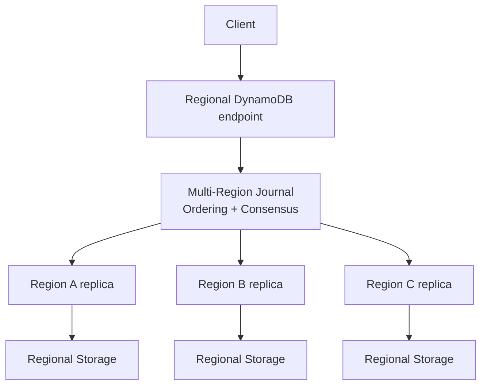
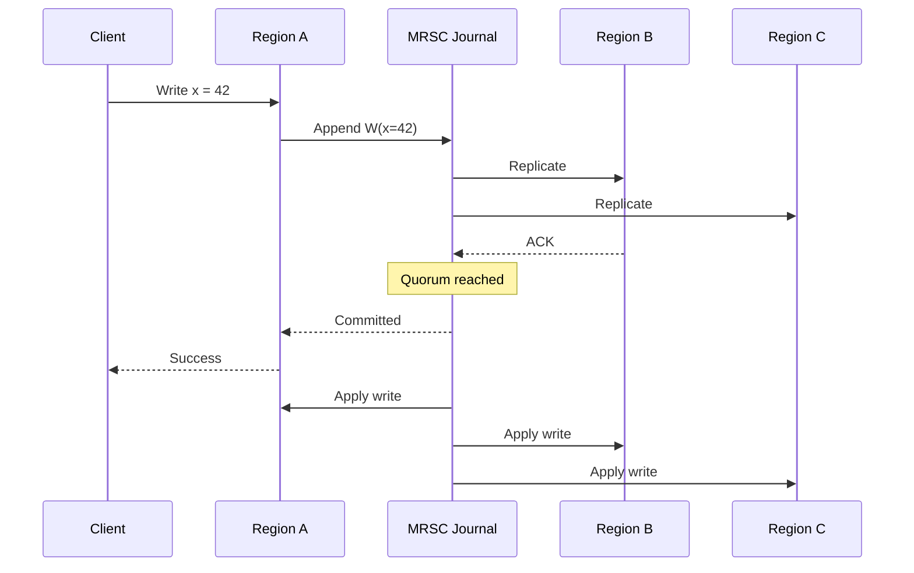
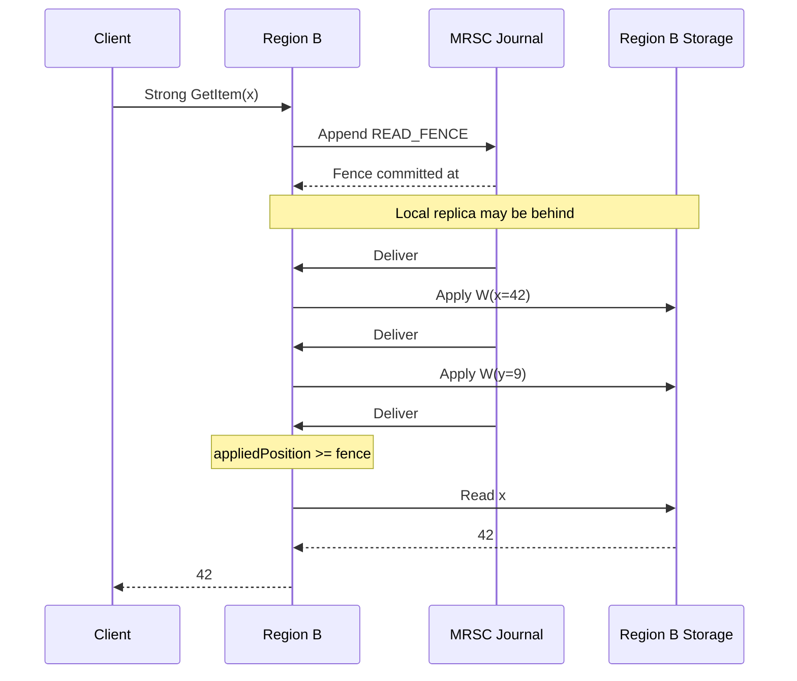
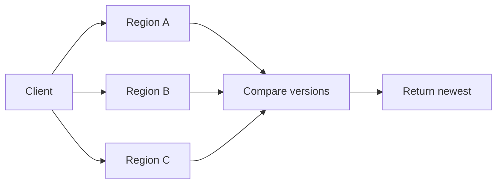
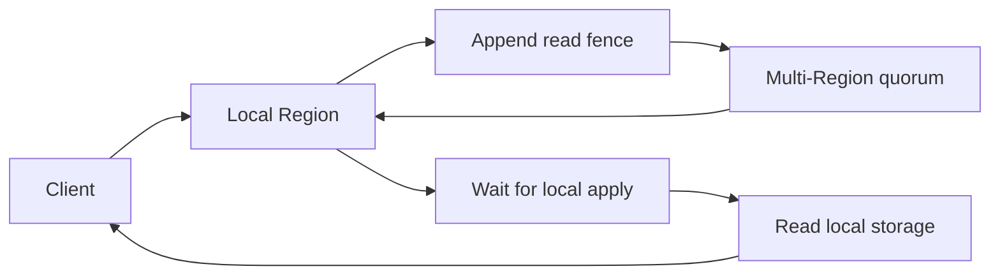

# DynamoDB Multi-Region Strong Consistency (MRSC)

> [!summary]
> DynamoDB MRSC provides **strongly consistent reads and writes across Regions** by combining a **multi-Region replicated journal** with a **read-fencing / heartbeat mechanism**.
>
> The key idea: **writes establish a global order; strong reads insert a fence into that same order and wait until the local replica has caught up to it.**

---

## Mental Model

Think of MRSC as two layers:



- **Journal** → establishes global ordering and consistency.
- **Regional storage** → serves scalable local reads and materializes journal updates.

The journal does **not** need to return the data during a read.  
It only proves that the local replica is sufficiently fresh.

---

## Write Path

A write enters the multi-Region journal and becomes committed once a quorum has accepted it.



With three journal participants:

> **2 / 3 = quorum**

If the write has returned successfully, it has already been ordered and durably accepted by a multi-Region quorum.

---

## Global Ordering

The journal provides one serialization order:

```text
#501  W(x = 41)
#502  W(y = 7)
#503  W(x = 42)
#504  ...
```

Regional replicas consume this journal in order.

A replica may temporarily lag behind:

```text
Journal:          501 502 503 504
Region A applied: 501 502 503 504
Region B applied: 501 502
Region C applied: 501 502 503
```

This lag is fine for **eventual reads**.

It is not enough for a **strong read**.

---

# Strong Reads: Heartbeat / Read Fence

Suppose `x = 42` has already committed:

```text
#503 W(x = 42)
```

but Region B has only applied through `#502`.

Reading Region B immediately could return stale data.

Instead, Region B inserts a special entry into the same journal:

```text
#503 W(x = 42)
#504 W(y = 9)
#505 READ_FENCE(B)
```

The fence is sometimes described as a **heartbeat** or **tracer bullet**.

---

## Read-Fencing Flow



The important invariant is:

```text
localAppliedPosition >= fencePosition
```

Once true:

> Every journal entry ordered before the fence has been applied locally.

Therefore the local read cannot miss a write that completed before the read began.

---

# Why This Is Linearizable

Imagine:

```text
Write x=42 completes
        ↓
#100 W(x=42)

Strong read begins
        ↓
#101 READ_FENCE
```

The journal establishes:

```text
W(x=42) < READ_FENCE
```

The reader cannot proceed until its local Region has applied through `#101`.

Therefore it must also have applied `#100`.


This preserves **real-time ordering**.

---

## Concurrent Write vs Read

If a write races with the read, either ordering is valid.

### Case A — write wins

```text
#200 W(x=43)
#201 READ_FENCE
```

The read must observe `43`.

### Case B — read wins

```text
#200 READ_FENCE
#201 W(x=43)
```

The read may return the previous value.

This is exactly what linearizability allows for concurrent operations.

---

# Why Not Just Ask for the Latest Offset?

This is unsafe:

```text
Reader asks: "What is the latest committed position?"
→ receives #500

Meanwhile:
#501 W(x=42) commits

Reader catches up only to #500
→ stale read
```

A **fence** avoids the race by participating in the ordering itself:

```text
... writes ... → READ_FENCE → later writes ...
```

The read now has a precise serialization point.

---

# Read Fence vs Quorum Read

### Traditional quorum read



Multiple replicas return the actual item.

### DynamoDB-style fencing



The WAN operation answers:

> **"Is my local replica fresh enough?"**

The local database answers:

> **"What is the value?"**

---

# Conflict Handling

Concurrent writers may both start from the same item version.

```text
Region A sees version 17
Region B sees version 17

A proposes: V17 → V18
B proposes: V17 → V18
```

The journal orders them:

```text
#300 Write A
#301 Write B
```

After A succeeds:

```text
currentVersion = 18
```

B's conditional operation expects:

```text
expectedVersion = 17
```

So B loses the race and can be retried.

This avoids two independent successful writes being reconciled later through eventual-consistency conflict resolution.

---

# Failure Behavior

For three journal participants:

```text
A ✓
B ✓
C ✗

Quorum available → strong reads and writes continue
```

But:

```text
A ✓
B ✗
C ✗

No quorum
```

Then:

- ❌ strong writes
- ❌ strongly consistent reads
- ✅ local eventual reads may still be possible

This is a **CP-style trade-off**:

> During a sufficiently large partition, MRSC sacrifices availability rather than consistency.

---

# Latency Cost

Strong operations require cross-Region coordination.

### Eventually consistent read

```text
Client
  ↓
Local Region
  ↓
Local Storage
```

Fast, local path.

### Strongly consistent read

```text
Client
  ↓
Local Region
  ↓
Append READ_FENCE
  ↓
Multi-Region quorum
  ↓
Wait for local apply
  ↓
Local Storage
```

So the cost of strong consistency is fundamentally tied to **inter-Region network latency**.

---

# Core Algorithm

### Write

```text
WRITE(x, value):

    op = createConditionalWrite(x, value)

    position = journal.append(op)

    wait until position reaches quorum

    return success
```

### Strong read

```text
STRONG_READ(x):

    fence = journal.append(READ_FENCE)

    wait until fence reaches quorum

    wait until localAppliedPosition >= fence

    return localRead(x)
```

---

# The Key Insight

> [!important]
> **The heartbeat is not merely a health-check heartbeat.**
>
> It is a **barrier inserted into the same globally ordered replicated log as writes**.

Therefore:

```text
write < fence
```

implies:

```text
write applied locally before read
```

The result is a powerful separation of responsibilities:

| Component | Responsibility |
|---|---|
| Multi-Region Journal | Consensus, ordering, fencing |
| Regional DynamoDB | Scalable materialized state |
| Read Fence | Prove local freshness |
| Conditional writes | Resolve concurrent mutations |

---

## One-Sentence Summary

> **DynamoDB MRSC makes writes globally ordered, then makes strong reads append a globally ordered fence and wait until the local replica has applied everything before that fence.**

---

## Related Concepts

- [[Linearizability]]
- [[Consensus]]
- [[Quorum Replication]]
- [[Raft]]
- [[Paxos]]
- [[MVCC]]
- [[Read Fences]]
- [[Distributed Systems - CAP Theorem]]