> [!abstract]
> Networking knowledge becomes Staff+-level when it stops being a catalogue of protocols and becomes a way to reason about **latency, state, resource ownership, partial failure, overload, topology, and blast radius**.
>
> The important question is rarely “TCP or UDP?” in isolation. It is usually:
>
> **What semantics does the application need, where should those semantics live, what state does the choice create, and how does the system behave when the network becomes slow, lossy, partitioned, or overloaded?**

---

## Executive summary

The most useful mental model for system design is:

> **A network is a collection of finite queues connected by imperfect links, over which distributed components exchange messages with uncertain timing.**

Every network request consumes resources somewhere:

- socket state;
- file descriptors;
- ephemeral ports;
- connection-tracking entries;
- TLS state;
- load-balancer state;
- kernel buffers;
- application queues;
- HTTP/2 or QUIC flow-control windows;
- downstream concurrency;
- memory while waiting for responses.

And every request encounters some combination of:

$$
Latency = Propagation + Serialization + Queueing + Handshake + Processing
$$

At small scale, application processing often dominates.

At large scale or under failure, **queueing, connection management, retries, cross-region hops, congestion, and load-balancer behavior can dominate instead**.

The Staff+ networking principles worth internalizing are:

1. **IP provides reachability, not reliability.**
2. **TCP provides an ordered byte stream, not exactly-once application semantics.**
3. **A timeout creates uncertainty, not proof that an operation failed.**
4. **Connections are distributed state.**
5. **Connection reuse is usually essential for latency and efficiency.**
6. **Flow control protects a receiver; congestion control protects the network.**
7. **Multiplexing removes some forms of head-of-line blocking but can introduce shared fate.**
8. **DNS is a cached, eventually changing control plane—not an instantaneous failover mechanism.**
9. **Load balancing is partly a scheduling problem and partly a control-plane problem.**
10. **Long-lived connections fundamentally change load balancing, deployments, and failure recovery.**
11. **Retries spend capacity and can turn partial failure into total failure.**
12. **Deadlines should propagate through call graphs.**
13. **Backpressure and load shedding are networking concerns even when implemented at the application layer.**
14. **Geography is part of architecture. Physics cannot be abstracted away.**
15. **Transport reliability and business-level delivery guarantees are different layers of the problem.**

---

# 1. Scope and relationship to the baseline video

The baseline material covers:

| Baseline topic | What matters at Staff+ depth |
|---|---|
| OSI / TCP-IP layers | Where state and guarantees actually live |
| IP addressing | CIDR, routing, NAT, MTU, IPv6, anycast |
| DNS | Caching, TTLs, negative caching, service discovery, failover limits |
| TCP vs UDP | Flow control, congestion control, HOL blocking, BDP, failure ambiguity |
| QUIC | Streams, integrated TLS, connection migration, operational trade-offs |
| HTTP / HTTPS | Connection reuse, H1/H2/H3 behavior, TLS termination |
| REST | Request granularity, retries, idempotency |
| GraphQL | Network fanout and aggregation effects |
| gRPC | HTTP/2 channels, streaming, deadlines, retries, client-side LB |
| SSE | Reconnection, replay, connection scale |
| WebSockets | Persistent state, draining, fanout, backpressure |
| WebRTC | ICE/STUN/TURN and relay economics |
| Client-side load balancing | Discovery consistency and client complexity |
| L4 / L7 load balancing | Connection ownership, pooling, routing, failure handling |
| CDNs / regionalization | Data locality, anycast, replication, sovereignty |
| Timeouts / retries | Deadline budgets, retry amplification, overload |
| Circuit breakers | Admission control, bulkheads, outlier detection |

Several common simplifications are useful for an introductory interview explanation but should not become architectural beliefs.

> [!warning] Simplifications to unlearn
>
> - “TCP guarantees delivery” is too strong at the application boundary.
> - “UDP is faster” is not a useful general decision rule.
> - “WebSockets should use an L4 load balancer” is not generally true; modern L7 proxies frequently support them.
> - “DNS automatically fails over traffic” hides caching and convergence behavior.
> - “HTTP is stateless” does **not** imply that an HTTP service is stateless.
> - “gRPC is faster because protobuf is binary” ignores connection behavior, payload shape, CPU, flow control, and workload.
> - “WebRTC is peer-to-peer” describes the desired media path, not the guaranteed operational path; TURN relays are often required.
> - “Retries improve reliability” is true only inside a capacity and idempotency envelope.

---

# 2. The core mental model: the network as queues, state, and uncertainty

Consider a call:

```text
mobile client
    ↓
edge
    ↓
load balancer
    ↓
API service
    ↓
user service
    ↓
database
```

The diagram usually shown in a system design interview hides the actual runtime structure:

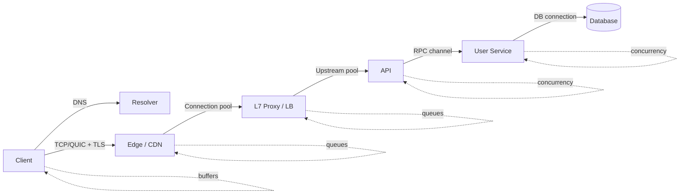

Every line may represent:

- multiple connections;
- reused connections;
- multiplexed streams;
- several queues;
- a retry policy;
- a timeout;
- load balancing;
- TLS;
- connection pooling;
- kernel buffering;
- application-level buffering.

A Staff+ engineer asks:

> **Which layer owns each guarantee and each resource?**

For example:

| Concern | Typical owner |
|---|---|
| Reach destination | IP / routing |
| Ordered bytes | TCP |
| Per-stream transport | QUIC |
| Encryption in transit | TLS |
| Request semantics | HTTP / RPC framework |
| Operation idempotency | Application |
| Exactly-once business effect | Application + durable state |
| Retry | Client / proxy / RPC framework |
| Admission control | Proxy / server |
| Backpressure | Transport + application |
| Geographic routing | DNS / anycast / edge |
| Backend choice | LB / client |
| Authorization | Application / identity infrastructure |

This separation prevents a recurring architectural error: **assuming that a lower-level mechanism provides a higher-level guarantee.**

---

# 3. Latency: reason from physics upward

## 3.1 The latency equation

A useful decomposition is:

$$
T_{request} =
T_{DNS} +
T_{connect} +
T_{TLS} +
T_{queue} +
T_{server} +
T_{dependencies} +
T_{transfer}
$$

On reused connections, DNS/connect/TLS may disappear from the hot path.

For a distributed call graph:

$$
T_{end-to-end}
\neq
\sum T_{service}
$$

because calls can execute concurrently.

For a sequential chain:

$$
T \approx T_A + T_B + T_C
$$

For parallel fanout:

$$
T \approx \max(T_A,T_B,T_C)
$$

plus aggregation overhead.

This makes **tail latency** particularly important.

If one request fans out to 50 backends, the request succeeds quickly only if nearly all 50 backend calls complete quickly.

The more dependencies on the critical path, the more likely one call lands in the tail.

---

## 3.2 Propagation cannot be optimized away

Information cannot travel faster than the physical medium allows.

That makes geography architectural.

A design that repeatedly performs:

```text
Europe API → US database → Europe API → US service
```

has created a latency floor regardless of how optimized the code becomes.

The Staff+ question is therefore not:

> “Can we make this cross-region RPC faster?”

but often:

> “Why does this operation require cross-region synchronization at all?”

This leads directly to:

- regional ownership;
- local reads;
- asynchronous replication;
- caches;
- edge computation;
- partitioned workloads;
- control-plane/data-plane separation.

---

# 4. Layers without the textbook ceremony

The OSI model is useful mainly as a vocabulary for identifying **where a decision is made**.

A pragmatic application-centric view is:

```text
Application        HTTP, gRPC, WebSocket, DNS, WebRTC
                   ↓
Security           TLS
                   ↓
Transport          TCP, UDP, QUIC
                   ↓
Network            IPv4 / IPv6
                   ↓
Link / Physical    Ethernet, Wi-Fi, fiber, etc.
```

The important consequence of layering is **encapsulation**.

An HTTP request may become:

```text
HTTP message
  inside TLS records
    inside TCP segments
      inside IP packets
        inside link-layer frames
```

The application does not generally control how its logical messages map onto lower-level packets.

This matters because TCP is a **byte stream**.

If an application performs:

```text
send("hello")
send("world")
```

the receiver is not promised two matching `recv()` calls.

It may observe:

```text
helloworld
```

or:

```text
hel
lowo
rld
```

Message framing is an application-layer concern.

---

# 5. IP: addressing and reachability

IP's job is fundamentally:

> **Move packets toward a destination address on a best-effort basis.**

It does not promise:

- delivery;
- ordering;
- uniqueness;
- bounded delay;
- congestion recovery.

---

## 5.1 Addresses are topological identifiers

An IP address serves partly as an endpoint identifier and partly as information used by routing.

Routers forward packets using progressively more specific prefixes.

Example:

```text
10.20.16.0/20
```

`/20` means the first 20 bits identify the network prefix.

CIDR gives architects a hierarchy useful for:

- VPC/network allocation;
- subnetting;
- routing policies;
- security boundaries;
- avoiding overlapping address spaces.

---

## 5.2 Private addresses and NAT

IPv4 private ranges commonly used internally come from RFC 1918.

Private addresses are not globally routed on the public Internet.

A NAT device can translate:

```text
10.0.2.15:49152
```

to something like:

```text
203.0.113.8:62001
```

The NAT therefore creates state roughly representing:

```text
internal IP
internal port
external IP
external port
protocol
```

This introduces an important operational resource:

> **NAT mappings are finite state.**

A system with extremely high outbound connection churn can exhaust available mappings or ephemeral source ports.

This is one reason connection pooling matters beyond latency.

---

## 5.3 The 5-tuple

Traditional TCP/UDP flows are commonly identified using:

```text
source IP
source port
destination IP
destination port
protocol
```

This is the **5-tuple**.

It matters for:

- load balancing;
- firewall rules;
- NAT;
- connection tracking;
- packet capture;
- traffic attribution.

A single client IP can create many simultaneous connections because source ports distinguish flows.

---

## 5.4 IPv6 changes addressing more than architecture

IPv6 expands addresses dramatically and restores widespread feasibility of globally unique addressing, but an application architecture still needs:

- routing;
- firewalls;
- discovery;
- authentication;
- load balancing;
- failure handling.

Avoid thinking of NAT as the security boundary.

A firewall/security policy controls reachability.

NAT primarily translates addresses.

---

# 6. Routing, BGP, and anycast

Application engineers normally treat routing as infrastructure.

Staff+ engineers should understand the abstraction boundary because global systems depend on it.

## 6.1 Internet routing

The Internet consists of many independently operated **Autonomous Systems (ASes)**.

BGP distributes reachability information between them.

A simplified model:

```text
Prefix 203.0.113.0/24
        ↓ advertised by
Autonomous System X
        ↓
Neighboring ASes
        ↓
Internet routing tables
```

BGP is policy-driven routing, not simply “shortest physical path.”

Therefore:

- packets can take unintuitive routes;
- network path changes can alter latency;
- routing incidents can affect seemingly unrelated customers;
- “same region” does not always imply identical network behavior.

---

## 6.2 Anycast

With anycast, multiple locations advertise the same service IP.

Routing delivers clients to one of those locations.

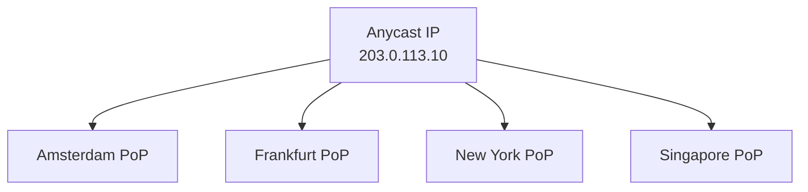

This is common for:

- DNS;
- CDNs;
- edge proxies;
- DDoS protection;
- global ingress.

Anycast is attractive because routing itself directs users toward available topology.

But “nearest” means **routing-nearest**, not necessarily geographically nearest or application-optimal.

### Architectural implication

Anycast works especially well when edge locations are largely interchangeable.

If every connection requires large amounts of location-specific state, path changes become more complicated.

QUIC connection IDs are partly useful because a connection need not be identified solely by an IP/port tuple.

---

# 7. MTU: the networking detail that appears only when it hurts

Every link has a maximum frame/packet size it can carry efficiently: the **Maximum Transmission Unit**.

Ethernet commonly uses an MTU around 1500 bytes, though tunnels, VPNs, overlays, and jumbo-frame environments alter the effective value.

The end-to-end usable size is constrained by the smallest MTU along the path:

\[
PMTU = \min(MTU_1, MTU_2, ..., MTU_n)
\]

This is the **Path MTU**.

---

## 7.1 Why application engineers should care

Encapsulation adds headers:

```text
Inner packet
 + VXLAN
 + UDP
 + outer IP
 + Ethernet
```

The payload available to the inner packet therefore shrinks.

Misconfigured MTU discovery can create:

- connections that establish but stall on larger messages;
- mysterious gRPC failures;
- VPN-only failures;
- packets that disappear after a particular size;
- environments where pings succeed but production traffic does not.

IPv6 routers do not fragment oversized forwarded packets in the same way legacy IPv4 behavior allowed; endpoints are expected to adapt.

> [!tip] Debugging heuristic
> If small requests succeed while sufficiently large ones consistently hang or fail across a particular network path, investigate MTU/PMTU problems.

---

# 8. DNS: naming as a distributed control plane

A conceptual DNS lookup looks like:

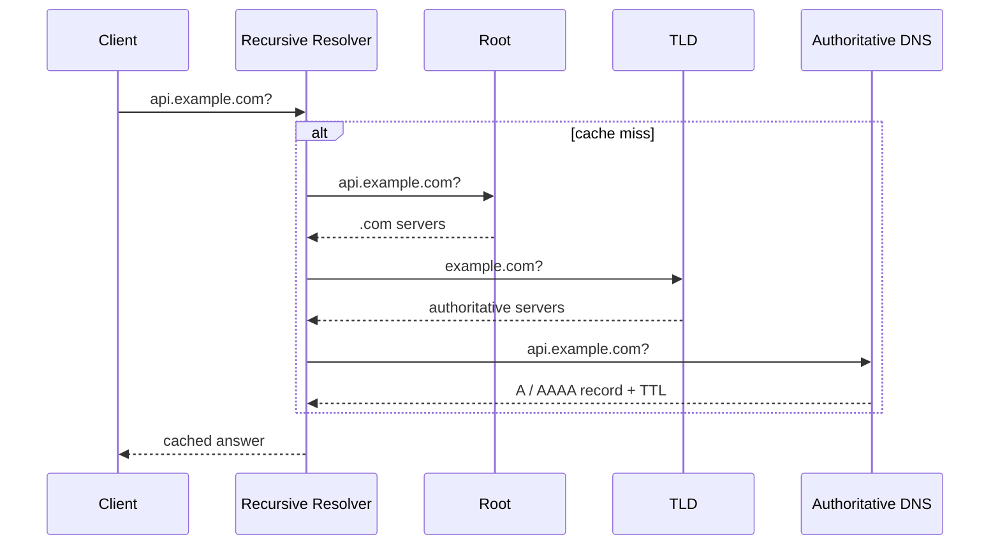

In reality, multiple caches may exist:

- application;
- language runtime;
- operating system;
- local resolver;
- enterprise resolver;
- ISP/public recursive resolver.

---

## 8.1 TTL is a cache lifetime, not a deployment deadline

DNS responses normally carry a TTL.

A common misconception:

> “If TTL = 60 seconds, everyone will switch within 60 seconds.”

Real systems may introduce:

- resolver caching;
- application caching;
- connection reuse after DNS resolution;
- minimum/maximum TTL policies;
- negative caching;
- stale data during outages.

Even after DNS changes, an already-established TCP, WebSocket, or HTTP/2 connection may keep sending traffic to the old destination.

Therefore DNS changes and connection lifetime interact.

---

## 8.2 Negative caching

DNS also caches failures such as:

```text
NXDOMAIN
```

This is operationally important.

Suppose deployment order is:

1. client requests a hostname that does not yet exist;
2. resolver receives `NXDOMAIN`;
3. DNS record is created;
4. resolver continues returning cached negative result.

The infrastructure is now correct while some clients still fail.

This is one reason rollout ordering matters.

---

## 8.3 DNS-based traffic steering

DNS can distribute clients across multiple addresses:

```text
api.example.com
    → 203.0.113.10
    → 203.0.113.20
```

It can also vary results by geography or resolver location.

DNS is attractive because there is no data-plane proxy hop.

But its primary weakness is **slow control**.

It is excellent for relatively coarse routing.

It is poor when routing must react instantly to backend health.

---

## 8.4 DNS vs service discovery

Internal environments often need stronger behavior than Internet DNS alone provides.

A service discovery system answers:

> Which instances currently implement `UserService`?

Possible architecture:

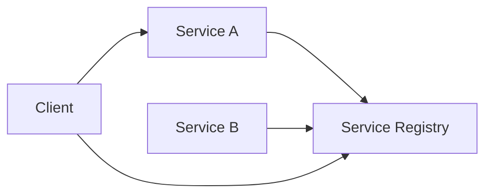

The client may receive endpoints and perform client-side balancing.

Alternatively, a proxy can consume discovery information so application clients remain simple.

This is fundamentally a trade-off between:

### Smart clients

Pros:

- no extra proxy hop;
- rich endpoint choice;
- efficient direct connections.

Cons:

- networking logic duplicated across languages;
- harder coordinated upgrades;
- clients must handle discovery changes correctly.

### Smart proxies

Pros:

- centralized behavior;
- uniform retries, telemetry, policy;
- simpler application libraries.

Cons:

- another resource boundary;
- another queue;
- another failure mode;
- operational complexity.

---

# 9. UDP: deliberately minimal transport

UDP provides datagrams over IP with ports and checksums.

It does **not** provide TCP-style:

- connection establishment;
- retransmission;
- ordering;
- receiver flow control;
- congestion control.

That does not mean these properties cannot exist.

It means:

> **The application or an upper-layer protocol must provide whichever ones it needs.**

QUIC is the canonical modern example: it implements sophisticated reliability and congestion behavior on top of UDP.

---

## 9.1 “UDP is faster” is the wrong model

UDP has less built-in machinery.

But overall application performance depends on:

- loss rate;
- application retransmission;
- congestion behavior;
- message size;
- buffering;
- CPU;
- protocol design;
- network policy.

If an application reimplements half of TCP poorly, UDP may perform worse.

Choose UDP when its **datagram semantics and control model** are useful, not because its header is smaller.

Typical use cases include:

- DNS;
- real-time media;
- games;
- protocols where stale data is less useful than fresh data;
- specialized telemetry;
- QUIC.

---

# 10. TCP: what “reliable” actually means

RFC 9293 defines TCP as providing a reliable, in-order **byte stream**.

That wording is precise.

TCP does not promise your business operation completed.

---

## 10.1 Sequence numbers and retransmission

TCP numbers bytes and acknowledges received ranges.

Conceptually:

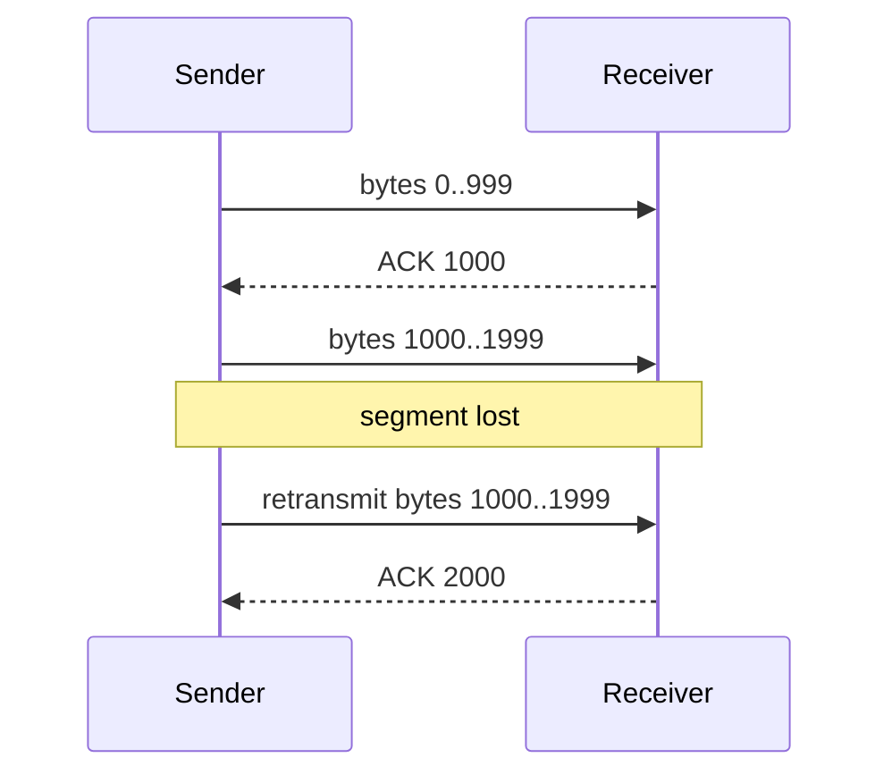

TCP detects loss and retransmits missing data.

Applications generally see a clean ordered stream.

This abstraction is extremely valuable.

But it creates an important consequence:

> Later bytes cannot be delivered to the application before missing earlier bytes are recovered.

This is transport-level **head-of-line blocking**.

---

# 11. The most important TCP distinction: flow control vs congestion control

These mechanisms solve different problems.

## 11.1 Flow control

Question:

> **Can the receiver accept more data?**

The receiver advertises a receive window:

\[
rwnd
\]

This protects the receiver from being overwhelmed.

---

## 11.2 Congestion control

Question:

> **Can the network path safely carry more data?**

The sender maintains a congestion window:

\[
cwnd
\]

The effective amount of unacknowledged data is limited approximately by:

\[
sendWindow = \min(rwnd, cwnd)
\]

So:

```text
receiver slow
    → rwnd constrains throughput

network congested
    → cwnd constrains throughput
```

Conflating the two leads to poor production diagnosis.

---

# 12. Congestion control and slow start

A new TCP connection does not initially know the path capacity.

It probes.

Classic TCP behavior includes:

- slow start;
- congestion avoidance;
- fast retransmit;
- fast recovery.

The precise algorithms continue evolving, but the Staff+ mental model is stable:

> **Transport must infer how much in-flight traffic the path can sustain without causing collapse.**

New connections therefore have performance costs beyond the handshake.

Repeatedly creating connections throws away learned transport state.

This is another reason connection reuse matters.

---

# 13. Bandwidth-delay product

Suppose:

```text
path bandwidth = 1 Gbit/s
RTT            = 100 ms
```

The amount of data needed in flight to fill the path is:

\[
BDP = bandwidth \times RTT
\]

\[
= 1 \text{ Gbit/s} \times 0.1s
= 100 \text{ Mbit}
\approx 12.5 \text{ MB}
\]

If the sender can only have 1 MB outstanding, the 1 Gbit/s path can never be fully utilized.

This is why high-bandwidth, high-latency paths need sufficiently large transport windows.

The principle generalizes:

> **Throughput depends not only on bandwidth but also on how much concurrency/data the protocol permits to be in flight.**

This explains many “the network is 10 Gbit/s; why am I only getting X?” incidents.

---

# 14. TCP connection establishment

A TCP connection typically begins with:

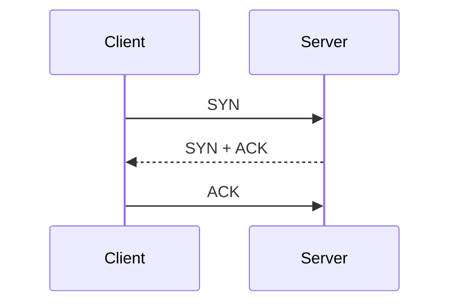

Conceptually this costs one network round trip before ordinary application data flows.

TLS may add additional handshake messages above it.

On WAN paths, these round trips are significant.

---

# 15. Connection reuse is an architectural optimization

Without reuse:

```text
request
  DNS?
  TCP handshake
  TLS handshake
  HTTP
close
```

Repeated many times.

With pooling:

```text
connection established once
    ↓
request
request
request
request
```

Benefits:

- fewer handshakes;
- less CPU;
- less ephemeral-port churn;
- less NAT state churn;
- congestion window already established;
- lower latency.

But pooling introduces state that must be managed.

Important settings include:

- maximum connections;
- idle timeout;
- maximum connection age;
- maximum requests per connection;
- per-host concurrency;
- queue length when pool is saturated.

> [!important]
> A connection pool is a queueing system.
>
> “Pool exhausted” is often an overload signal, not merely a tuning problem.

Blindly increasing the pool size may move the queue into the downstream service and make the outage worse.

---

# 16. TCP does not give exactly-once request semantics

This is one of the most important distributed-systems consequences of networking.

Consider:

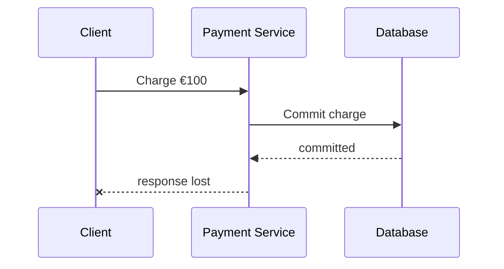

The client observes:

```text
timeout
```

What happened?

Possibilities include:

1. request never reached server;
2. server received request but did not process it;
3. server processed request but transaction failed;
4. server committed transaction but response was lost;
5. response is merely delayed.

A timeout says:

> **The client does not know.**

It does not say:

> “The operation failed.”

This ambiguity is fundamental.

---

# 17. Idempotency belongs above transport

A safe retryable mutation often needs an operation identifier:

```http
Idempotency-Key: 01J...
```

Server-side conceptual logic:

```text
BEGIN

if operation_key already committed:
    return previous result

if operation_key currently running:
    coordinate with existing operation

perform business mutation
persist result + operation_key atomically

COMMIT
```

The important invariant is not “the endpoint is idempotent.”

It is:

> **The same logical operation identifier cannot produce the business effect more than once.**

The durable idempotency record should usually participate in the same consistency boundary as the mutation or be designed carefully around it.

---

# 18. TIME_WAIT, ephemeral ports, and connection churn

TCP connection closure leaves protocol state behind for a period.

Combined with outbound source-port allocation, high connection churn can create:

- ephemeral-port exhaustion;
- NAT port exhaustion;
- large connection-tracking tables;
- CPU spent handshaking rather than processing requests.

This often surfaces at:

- proxies;
- API gateways;
- NAT gateways;
- high-fanout services.

A service may appear to have plenty of CPU while new connections fail.

That is why capacity models should include **connections per second**, not only requests per second.

---

# 19. QUIC: reliability without TCP's connection model

QUIC runs over UDP but provides:

- reliable transport;
- congestion control;
- multiplexed streams;
- per-stream flow control;
- integrated TLS;
- connection IDs;
- connection migration support.

HTTP/3 maps HTTP semantics onto QUIC.

---

## 19.1 Why QUIC exists

HTTP/2 introduced multiplexed streams over one TCP connection:

```text
TCP connection
 ├── HTTP stream A
 ├── HTTP stream B
 └── HTTP stream C
```

At the HTTP layer these streams are independent.

At the TCP layer, all bytes still belong to one ordered stream.

If a TCP packet containing an earlier byte is lost, later bytes cannot be delivered to HTTP until the gap is repaired.

Therefore packet loss can stall unrelated HTTP/2 streams.

QUIC instead exposes independent reliable streams at the transport layer:

```text
QUIC connection
 ├── stream A
 ├── stream B
 └── stream C
```

Loss affecting stream A generally does not require blocking delivery of unrelated stream B data.

> [!note]
> QUIC does not abolish every kind of head-of-line blocking.
>
> Applications can still create ordering dependencies, and shared connection-level congestion limits still exist. QUIC specifically removes TCP's cross-stream transport ordering dependency.

---

## 19.2 Connection IDs and migration

Traditional connection identity is closely tied to addresses and ports.

That is awkward for mobile clients:

```text
Wi-Fi
  ↓
cellular
```

The client's IP address changes.

QUIC can use a connection ID independent of the address tuple, allowing connection migration after validating the new path.

That makes QUIC attractive for unstable/mobile networks.

---

## 19.3 Why QUIC uses UDP

One major deployment reason is practical evolvability.

TCP implementations and middleboxes are deeply embedded throughout the Internet.

QUIC can implement transport behavior in user space while UDP provides basic packet carriage.

This makes protocol evolution faster.

The trade-off is that operators lose some of the passive observability they historically had into TCP because QUIC encrypts more transport information.

---

# 20. TLS: confidentiality is only one property

HTTPS is essentially:

```text
HTTP
over TLS
over TCP
```

for HTTP/1.1 and HTTP/2.

HTTP/3 instead uses TLS integrated with QUIC.

TLS gives applications properties including:

- encryption;
- integrity;
- server authentication;
- optionally client authentication.

---

## 20.1 TLS does not authenticate application claims

TLS might establish:

> “I am securely communicating with `api.example.com`.”

It does not establish:

> “The `userId` field in this JSON body is authorized to access account 123.”

Authentication and authorization remain application concerns.

---

## 20.2 TLS termination defines a trust boundary

Architecture:

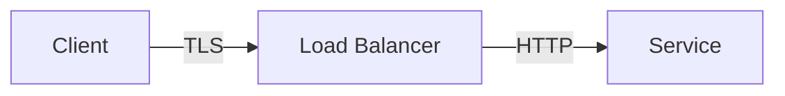

TLS protects:

```text
client → load balancer
```

but not necessarily:

```text
load balancer → service
```

Alternative:

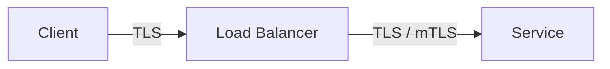

The correct model is therefore:

> **“HTTPS” does not mean one encrypted tunnel from browser to application process.**

You must know where TLS terminates.

---

## 20.3 mTLS

Mutual TLS allows both endpoints to authenticate certificates.

It is useful for machine identity in controlled environments.

But mTLS should not be confused with application authorization.

A valid certificate might establish:

```text
caller = inventory-service
```

The application still needs a policy answering:

```text
may inventory-service call RefundPayment?
```

---

## 20.4 TLS 1.3 and 0-RTT

TLS 1.3 reduced handshake cost and supports session resumption.

It also defines 0-RTT early data.

The architectural catch:

> **0-RTT data has weaker replay guarantees.**

Therefore replay-sensitive mutations need particular care.

“Fewer round trips” can introduce semantic constraints.

This is a recurring Staff+ pattern:

> **Performance features often move complexity into correctness.**

---

# 21. HTTP/1.1, HTTP/2, and HTTP/3

The HTTP version changes how requests share transport resources.

## HTTP/1.1

Typical characteristics:

- persistent TCP connections;
- sequential request/response behavior per connection in common deployments;
- multiple connections often used for concurrency.

Problem:

A slow request can block subsequent work on the same connection.

---

## HTTP/2

HTTP/2 introduces streams:

```text
one TCP connection

stream 1 ───────>
stream 3 ──>
stream 5 ─────────────>
```

Advantages:

- multiplexing;
- header compression;
- fewer TCP connections;
- per-stream flow control.

However:

```text
HTTP/2 streams
      ↓
single TCP byte stream
```

Packet loss can create shared transport-level blocking.

---

## HTTP/3

HTTP/3 provides HTTP semantics over QUIC.

```text
HTTP/3
   ↓
QUIC streams
   ↓
UDP
   ↓
IP
```

Its value is particularly relevant where:

- RTT is meaningful;
- packet loss occurs;
- clients move between networks;
- large numbers of concurrent resources are transferred.

---

## Staff+ heuristic

Do not choose an HTTP version by benchmark headline.

Ask:

- How many concurrent requests share a connection?
- Is RTT high?
- Is packet loss meaningful?
- Do clients roam between networks?
- Does the infrastructure support QUIC well?
- What does connection termination do to load balancing?
- What observability do operators require?

---

# 22. HTTP “statelessness” is commonly misunderstood

HTTP requests are self-contained protocol messages.

But an HTTP application can absolutely maintain state.

Examples:

- server-side sessions;
- shopping carts;
- connection pools;
- authenticated sessions;
- cached authorization context.

When architects say:

> “Make the application servers stateless”

they usually mean:

> **Do not store durable user/session ownership only inside one server process.**

That allows any healthy replica to serve a request.

It is an application architecture property, not an intrinsic consequence of HTTP.

---

# 23. REST, GraphQL, and gRPC from a networking perspective

These are often discussed as API-style choices.

For networking, focus on their effect on:

- request count;
- payload size;
- fanout;
- connection behavior;
- streaming;
- deadlines;
- compatibility.

---

## 23.1 REST

REST over HTTP is an excellent default when:

- external clients need interoperability;
- requests naturally map to resources;
- human-debuggability matters;
- latency is not dominated by serialization.

Its biggest networking advantage is ecosystem compatibility, not theoretical efficiency.

---

## 23.2 GraphQL

GraphQL is better thought of as a query/interface model than as a transport protocol.

A single client request can hide large backend fanout:

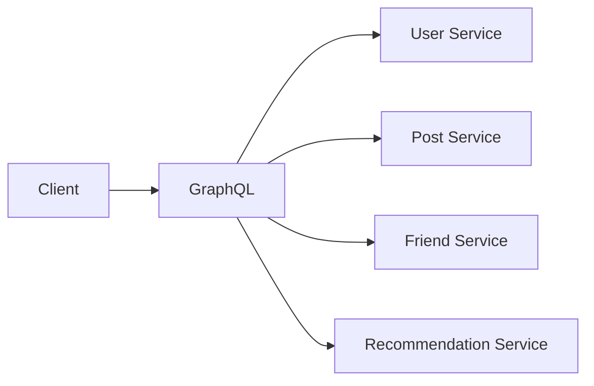

This can reduce client round trips while increasing server-side complexity.

Therefore important controls include:

- query depth;
- query cost;
- resolver batching;
- N+1 avoidance;
- fanout limits;
- deadlines;
- caching.

Network work did not disappear.

It moved.

---

# 24. gRPC

gRPC typically combines:

- Protocol Buffers;
- generated clients/servers;
- HTTP/2;
- unary RPC;
- streaming;
- deadlines;
- structured status codes;
- load-balancing support.

It is especially useful for controlled service-to-service environments.

---

## 24.1 gRPC channels are long-lived

A gRPC client commonly maintains a channel.

Underneath, the channel can maintain one or more HTTP/2 connections/subchannels.

This has an important consequence:

> **Load balancing occurs over long-lived transport state.**

If every client creates one channel to one backend and keeps it forever, adding new servers does not magically redistribute existing traffic.

This becomes relevant during:

- autoscaling;
- regional failover;
- rolling deployments;
- backend imbalance.

---

## 24.2 Deadlines are part of the RPC contract

gRPC does not automatically know how long the caller is willing to wait.

A caller should establish a deadline.

Suppose:

```text
User request budget = 800 ms
```

A poor downstream design is:

```text
Service A timeout: 2 s
Service B timeout: 2 s
Database timeout: 5 s
```

The work may continue long after the user has gone away.

A better design propagates remaining budget:

```text
800 ms total
 ↓
650 ms available after ingress
 ↓
500 ms downstream deadline
 ↓
350 ms DB budget
```

This improves both latency and resource efficiency.

---

# 25. Choosing request-response vs streaming

A useful decision hierarchy:

```text
Do I need server → client updates?
    |
    no → normal HTTP/RPC
    |
    yes
    ↓
Do I need client → server streaming on same channel?
    |
    no → SSE may be enough
    |
    yes
    ↓
Is this browser/application messaging?
    |
    yes → WebSocket
    |
    no / strongly typed services → gRPC streaming may fit
```

For realtime media:

```text
audio/video
    ↓
WebRTC
```

Do not jump directly to WebSockets because the product says “realtime.”

First define communication shape.

---

# 26. Server-Sent Events

SSE creates a long-lived HTTP response carrying a stream of events.

Conceptually:

```text
client  ─── HTTP request ───>
server  ─── event 1 ────────>
        ─── event 2 ────────>
        ─── event 3 ────────>
```

It is server-to-client only.

Advantages:

- native browser API;
- HTTP semantics;
- straightforward intermediary support;
- built-in reconnection behavior.

---

## 26.1 Event IDs are not durable delivery by themselves

SSE supports event IDs.

A reconnecting client can communicate the last observed ID.

That enables an application to implement:

```text
resume after event 842
```

But the server needs a replayable source if missed events matter.

If events exist only in process memory:

```text
disconnect
 ↓
process restarts
 ↓
history gone
```

the ID alone cannot recover them.

So separate:

```text
transport reconnection
```

from:

```text
durable event replay
```

---

# 27. WebSockets

WebSockets provide long-lived bidirectional messaging.

The classic handshake starts as HTTP and upgrades the connection.

Afterward:

```text
client ⇄ server
```

Both peers can send frames independently.

---

## 27.1 The real cost is state

For one connection, state is trivial.

For millions, state becomes architecture.

Each connection can consume:

- file descriptor;
- kernel socket memory;
- application session state;
- TLS state;
- proxy state;
- heartbeat traffic;
- routing ownership.

This changes the scaling unit from:

```text
requests / second
```

to include:

```text
concurrent connections
connections / second
messages / second
bytes / second
fanout / second
```

---

# 28. WebSockets do not require L4 load balancing

A common introductory rule says:

> “Persistent WebSockets → L4 load balancer.”

That is too simplistic.

Modern L7 proxies and cloud application load balancers can terminate HTTP and support WebSocket upgrade.

An L7 proxy may be useful because it can perform:

- TLS termination;
- authentication integration;
- host/path routing;
- observability;
- rate limiting;
- policy.

After a WebSocket is established, the chosen upstream connection is naturally persistent.

The real design questions are:

- Does the proxy support WebSockets correctly?
- What are its idle timeouts?
- How are connections drained?
- What is the connection capacity?
- How are new connections assigned?
- What happens when a backend dies?
- How are users reconnected?
- How is message state recovered?

---

# 29. Long-lived connections and autoscaling

Imagine:

```text
10 servers
100,000 WebSockets
≈10,000/server
```

You add 10 servers.

New connections may reach the new servers.

Existing connections remain where they are:

```text
old servers: ~10,000 each
new servers: near 0 initially
```

Request-based systems rebalance quickly.

Connection-based systems do not.

Possible strategies:

- bounded connection lifetime;
- intentional connection draining;
- reconnect jitter;
- admission limits;
- least-loaded connection assignment;
- rolling migration.

> [!important]
> Autoscaling a persistent-connection tier changes **future placement**, not necessarily existing load.

---

# 30. Connection draining is a deployment primitive

Suppose a WebSocket gateway is being deployed.

Bad shutdown:

```text
process dies
 ↓
100k clients disconnect simultaneously
 ↓
all reconnect immediately
 ↓
reconnection storm
```

Better:

```text
mark server draining
 ↓
stop accepting new connections
 ↓
allow existing sessions to finish / migrate
 ↓
spread reconnects with jitter
 ↓
terminate after grace period
```

This is the connection-oriented equivalent of graceful request draining.

---

# 31. WebSocket backpressure

A client may consume messages more slowly than the server publishes them.

If the server blindly buffers:

```text
producer faster than consumer
        ↓
queue grows
        ↓
memory grows
        ↓
process dies
```

Policies must be explicit:

- block producer;
- drop old messages;
- drop new messages;
- aggregate updates;
- disconnect slow consumers;
- persist to an external log;
- bound queue size.

For a stock ticker, dropping intermediate values might be correct.

For chat messages, it may be unacceptable.

The semantics determine the backpressure policy.

---

# 32. WebRTC: direct when possible, relayed when necessary

WebRTC is more than “UDP between browsers.”

Connection setup commonly involves **ICE**.

ICE gathers candidate paths including:

- direct/local candidates;
- NAT-translated addresses discovered through STUN;
- relayed addresses provided by TURN.

Conceptually:

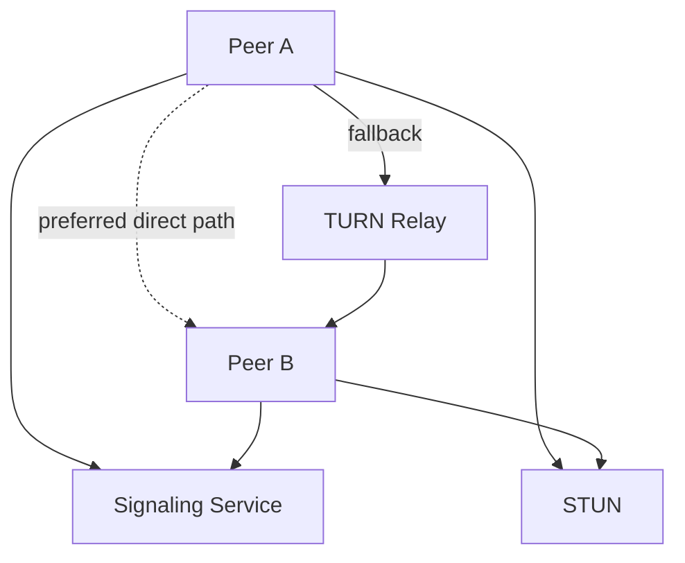

---

## 32.1 STUN

STUN helps a client discover how it appears from outside its NAT.

This can enable direct connectivity.

---

## 32.2 TURN

When direct connectivity fails, TURN relays traffic.

That transforms the economics.

Direct path:

```text
A → B
```

TURN path:

```text
A → relay → B
```

For high-bitrate video, relay bandwidth can become expensive.

Therefore WebRTC architecture should include:

- expected TURN fallback percentage;
- relay bandwidth;
- geography;
- egress cost;
- capacity planning.

---

# 33. Load balancing is scheduling

A load balancer answers:

> **Which backend should receive this work?**

That is a scheduling problem.

But it must solve it using imperfect information.

---

# 34. Client-side vs proxy load balancing

## Client-side

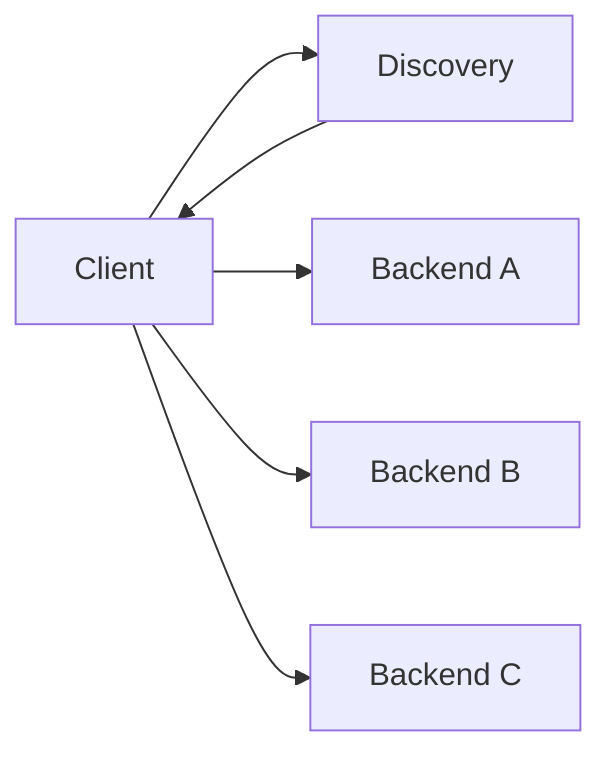

The client receives endpoints and selects one.

### Benefits

- direct connection;
- no data-plane proxy hop;
- sophisticated endpoint selection.

### Costs

- client libraries become infrastructure;
- rollout coordination across languages;
- stale endpoint views;
- retry behavior replicated everywhere.

---

## Proxy-based

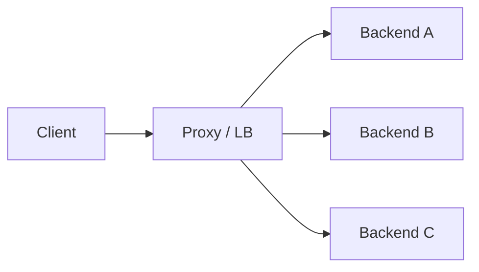

### Benefits

- centralized policy;
- simpler clients;
- rapid endpoint updates;
- uniform observability.

### Costs

- extra hop;
- resource usage;
- another failure boundary;
- queueing.

Neither is universally superior.

---

# 35. L4 vs L7 load balancing

## L4

Makes decisions using transport/network information such as:

```text
source IP
destination IP
source port
destination port
protocol
```

It does not need to understand HTTP semantics.

Useful when:

- generic TCP/UDP forwarding is required;
- very high throughput matters;
- TLS should pass through;
- application-level routing is unnecessary.

---

## L7

Understands application protocols such as HTTP.

Can route using:

```text
Host
path
headers
cookies
method
```

It can:

- terminate TLS;
- authenticate;
- rate limit;
- rewrite;
- route by tenant;
- retry;
- collect application-level metrics.

L7 is not simply “L4 but slower.”

It changes what architecture is possible.

---

# 36. Connection termination changes topology

An L7 proxy frequently creates two distinct connections:

```text
client ──connection A──> proxy ──connection B──> backend
```

These connections have independent:

- TCP state;
- TLS state;
- buffers;
- congestion windows;
- timeouts.

This can be beneficial.

For example, the client may have:

```text
100 ms RTT
```

while the proxy-backend connection has:

```text
0.5 ms RTT
```

The proxy isolates some WAN transport behavior from the service.

But it also means proxy queues and connection pools become part of system behavior.

---

# 37. Load-balancing algorithms

## Round robin

```text
A, B, C, A, B, C...
```

Good when:

- servers are homogeneous;
- request costs are similar;
- requests are short.

Weak when request durations vary significantly.

---

## Least connections / least requests

Prefer endpoints with less active work.

Useful when:

- request durations vary;
- streams are long-lived;
- servers differ in instantaneous load.

But active requests are still an imperfect proxy for true capacity.

---

## Random / power-of-two choices

Randomization avoids centralized precision.

A particularly useful family of algorithms samples a small number of backends and chooses the less-loaded candidate.

This often provides strong balancing behavior at low coordination cost.

The broader principle is:

> **Approximate local decisions often scale better than globally perfect scheduling.**

---

## Consistent hashing

Hash an attribute such as:

```text
tenant ID
user ID
cache key
```

to produce stable backend affinity.

Useful for:

- caches;
- sharded state;
- locality.

But consistency comes at a cost.

A hot tenant can create a hot backend.

Affinity should therefore be justified by a state/locality requirement, not added casually.

---

# 38. Connection pooling can defeat request-level load balancing

Suppose a proxy selects backend B and opens an HTTP/2 connection.

Thousands of subsequent streams may reuse that same connection.

The transport topology is now:

```text
Proxy
  ├── H2 connection → A
  ├── H2 connection → B
  └── H2 connection → C
```

Load distribution depends on:

- number of connections;
- stream concurrency;
- connection lifetime;
- pool policy.

This can surprise engineers expecting every request to independently run the balancing algorithm.

> [!important]
> In modern RPC systems, **connection management and load balancing are inseparable**.

---

# 39. Health checks: “alive” is not “healthy”

A TCP check proves roughly:

```text
something accepts TCP
```

An HTTP `/health` endpoint returning `200` might prove:

```text
process event loop still responds
```

Neither necessarily proves:

```text
server can successfully serve production traffic
```

Possible degraded state:

```text
/health = 200
database pool = exhausted
dependency = failing
request queue = 50,000
```

---

## 39.1 Liveness vs readiness

Useful separation:

### Liveness

> Should this process be restarted?

### Readiness

> Should new traffic be sent here?

A process can be:

```text
alive = true
ready = false
```

during:

- startup;
- warmup;
- dependency outage;
- draining;
- overload.

---

## 39.2 Passive health signals

Active health checks are synthetic.

Real production responses can reveal:

- connection failures;
- timeouts;
- repeated 5xx;
- latency spikes.

Proxies such as Envoy can perform **outlier detection**, temporarily ejecting endpoints behaving badly.

This complements rather than replaces active checks.

---

# 40. Scale-up needs warmup

A newly started replica may have:

- empty caches;
- cold JIT;
- unopened DB connections;
- cold TLS/session state;
- page faults;
- lazy initialization.

Immediately giving it a full traffic share can cause it to fail health checks and flap.

Useful mechanisms include:

- readiness delay;
- slow start;
- progressive traffic ramp;
- prewarming.

This is one example of a general Staff+ principle:

> **Capacity exists only when the full dependency chain is ready to absorb work.**

---

# 41. CDNs: move data, not physics

A CDN keeps cacheable content near users.

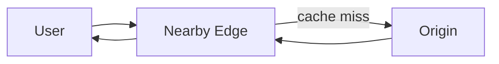

Benefits:

- lower user RTT;
- origin offload;
- connection reuse at the edge;
- DDoS absorption;
- often TLS termination;
- geographic distribution.

---

## 41.1 Cacheability is a consistency decision

A CDN works because some data can tolerate being served from a cache.

Therefore the interesting questions are:

- What may be stale?
- For how long?
- Who invalidates?
- What happens during invalidation failure?
- Is content user-specific?
- What belongs in the cache key?
- Can authorization results be cached safely?

“Put a CDN in front” is incomplete without freshness semantics.

---

# 42. Regional architecture

For a global system, a useful architecture is:

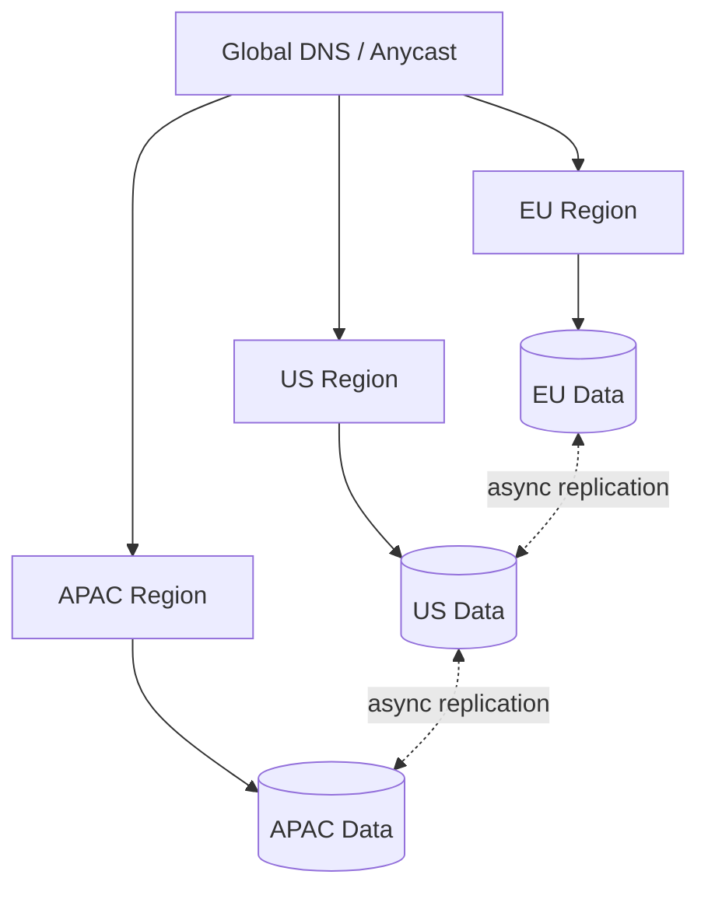

The hard part is rarely deploying compute to multiple regions.

It is deciding:

> **Where does each piece of state belong?**

---

# 43. Regional partitioning

Some domains have natural locality.

Examples:

```text
ride marketplace → city
food delivery    → city
inventory        → warehouse
collaboration    → document
gaming           → match
```

If an entity can have one primary region:

```text
tenant X → EU
tenant Y → US
```

many operations remain region-local.

This can simultaneously improve:

- latency;
- scalability;
- failure isolation;
- regulatory control.

---

## 43.1 The hard part: movement

Natural partitions move.

Users travel.

Tenants migrate.

Games end.

Documents change ownership.

A Staff+ design should consider:

```text
How is ownership discovered?
How is ownership changed?
Can two regions believe they own the entity?
How is in-flight traffic handled during movement?
Can migration be rolled back?
```

Networking topology and data ownership are coupled.

---

# 44. Cross-region calls are architectural debt when placed on the synchronous path

Consider:

```text
EU frontend
 ↓
US service
 ↓
EU database
 ↓
US service
 ↓
EU frontend
```

Even if each service is fast, the physical path is not.

For interactive systems, prefer:

```text
request
 ↓
local region
 ↓
local synchronous dependencies
 ↓
response

background:
local region → asynchronous cross-region replication
```

unless the operation truly requires global coordination.

---

# 45. The central reliability fact: networks fail ambiguously

Possible network failures include:

- packet loss;
- route change;
- connection reset;
- DNS failure;
- TLS failure;
- partial partition;
- high latency;
- complete partition;
- overloaded intermediary;
- one-way reachability.

The dangerous state is not simply:

```text
working / broken
```

It is:

```text
fast
slow
intermittent
partially reachable
duplicating at higher layers
stale
recovering
```

Distributed systems become difficult precisely because components cannot reliably distinguish:

```text
remote machine failed
```

from:

```text
network is slow
```

from:

```text
remote machine succeeded but response disappeared
```

---

# 46. Timeouts are resource-control policies

Without a timeout:

```text
request waits
 ↓
holds memory
holds connection slot
holds concurrency permit
possibly holds DB transaction
```

Eventually the system can exhaust resources.

A timeout says:

> **After this point, continuing to wait is less valuable than releasing resources.**

That is an economic/resource decision, not merely an error-handling feature.

---

## 46.1 Connect timeout vs request timeout

Distinguish:

```text
connect timeout
```

from:

```text
request / response deadline
```

A 100 ms connect budget followed by a 1 s request budget has different semantics than one undifferentiated 1.1 s timeout.

TLS handshake time may also need consideration.

---

# 47. Retry reasoning

Retries are appropriate when:

1. failure may be transient;
2. another attempt has a reasonable chance of succeeding;
3. remaining deadline permits it;
4. retrying will not create an unsafe duplicate effect;
5. system capacity can afford the additional work.

This is much stronger than:

```text
if error → retry 3 times
```

---

# 48. Retry amplification

Suppose:

```text
client retries 3×
API retries 3×
service retries 3×
```

In a pathological case:

\[
3 \times 3 \times 3 = 27
\]

attempts can be generated for one logical request.

If failure is caused by overload, retries create more overload.

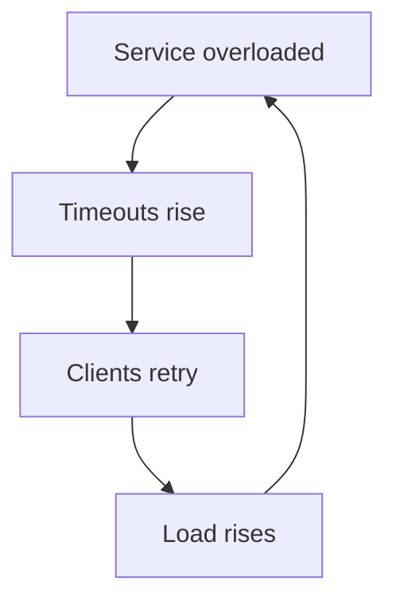

This is one of the most common distributed-systems positive feedback loops.

---

# 49. Exponential backoff and jitter

Backoff spaces retries out:

```text
attempt 1
100 ms
attempt 2
200 ms
attempt 3
400 ms
...
```

But deterministic schedules synchronize clients.

Jitter randomizes delay.

Conceptually:

```text
delay = random(0, backoff_cap)
```

instead of every client retrying at exactly 400 ms.

The objective is not mathematical elegance.

It is to prevent coordinated clients from behaving like a distributed denial-of-service attack.

---

# 50. Retry budgets

A useful architecture-level approach is to limit retries relative to successful traffic or total capacity.

Example policy:

```text
service may spend only a bounded fraction of capacity on retries
```

When that budget is exhausted:

```text
fail fast
```

This ensures retries cannot consume the entire service.

The exact percentage is workload-specific.

The principle is:

> **Reliability mechanisms must themselves have resource limits.**

---

# 51. Circuit breakers

A circuit breaker prevents repeatedly calling a dependency known to be failing.

Conceptual states:

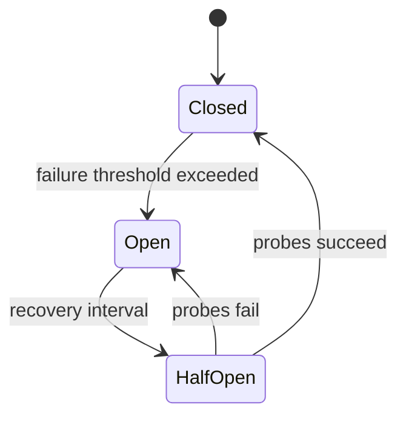

### Closed

Normal traffic.

### Open

Calls fail quickly.

### Half-open

Limited probes test recovery.

---

## 51.1 Circuit breakers are admission control

The deeper interpretation is:

> **Do not admit work that the dependency cannot productively process.**

This protects:

- caller threads;
- connection pools;
- downstream service;
- latency;
- recovery capacity.

Circuit breakers are therefore closely related to:

- load shedding;
- concurrency limits;
- queue bounds;
- bulkheads.

---

# 52. Backpressure

Backpressure communicates:

> “The consumer cannot safely accept work at the producer's current rate.”

TCP flow control is backpressure at the byte-stream layer.

Application systems need equivalent mechanisms.

Examples:

```text
HTTP 429
HTTP 503 + Retry-After
bounded queue
semaphore
stream credit
Kafka consumer lag
gRPC flow control
```

A robust overload policy often looks like:

```text
capacity reached
      ↓
reject new work quickly
      ↓
preserve latency for admitted work
```

rather than:

```text
accept everything
      ↓
queue indefinitely
      ↓
all requests time out
```

---

# 53. Queueing and latency collapse

When offered load approaches service capacity:

\[
utilization \rightarrow 100\%
\]

queueing delay can rise dramatically.

This is why a service at 70% CPU may be healthy while the same service at sustained 99% can have catastrophic p99 latency.

Staff+ capacity planning should therefore ask:

- What is the saturation signal?
- Where is the queue?
- How large is it?
- What happens when it fills?
- Who gets rejected first?
- Is work prioritized?
- How quickly does autoscaling respond?
- Can upstream callers shed work first?

---

# 54. Hedged requests

A hedged request sends another copy when the first call is unusually slow.

Example:

```text
request → server A

after p95 threshold and no response:
          └→ server B
```

Take the first valid response.

This can improve tail latency when:

- requests are idempotent;
- stragglers are uncommon;
- spare capacity exists.

But it deliberately adds work.

Under overload it may make things worse.

Therefore hedging should be:

- delayed;
- bounded;
- capacity-aware;
- observable.

---

# 55. Bulkheads

A bulkhead prevents one dependency or workload class from consuming every resource.

Instead of:

```text
one 100-thread shared pool
```

use isolation such as:

```text
payments pool: 30
recommendations pool: 30
search pool: 40
```

or equivalent concurrency limits.

If recommendations become slow, payment capacity survives.

This is fault-containment architecture.

---

# 56. Persistent connections create failure synchronization

Suppose one gateway serves 200k clients.

When it fails:

```text
200k connections close
      ↓
200k clients reconnect
      ↓
DNS
TLS
authentication
session restore
subscriptions
```

The recovery workload can exceed normal steady-state traffic.

This is a **reconnection storm**.

Mitigations:

- exponential backoff;
- jitter;
- admission control;
- progressive recovery;
- cached authentication;
- connection-rate limits;
- capacity reserved for recovery;
- multiple failure domains.

Steady-state capacity is not enough.

You must model **recovery capacity**.

---

# 57. Network partitions deserve explicit product semantics

During partition:

```text
Region A   X   Region B
```

the system must decide what to sacrifice.

Possible policies:

### Preserve availability

Accept operations independently and reconcile later.

Appropriate only when reconciliation semantics exist.

### Preserve strong consistency

Reject or block operations that cannot safely coordinate.

Appropriate when conflicting writes are unacceptable.

The networking lesson is:

> A partition is not merely an infrastructure incident. It forces an application semantics decision.

---

# 58. Observability: instrument the request path by phase

A single metric:

```text
request latency = 1200 ms
```

does not tell you where the time went.

Prefer decomposition.

Possible phases:

```text
DNS
connect
TLS
request queued
request sent
time to first byte
body transfer
server processing
downstream RPC
```

---

# 59. Useful networking metrics

## Client / edge

- DNS latency and failure rate;
- TCP/QUIC connect latency;
- TLS handshake latency;
- connection reuse rate;
- TTFB;
- protocol version;
- retry count.

## Proxy / load balancer

- active connections;
- new connections/sec;
- requests/sec;
- request queue depth;
- upstream connect latency;
- upstream connection-pool utilization;
- resets;
- timeouts;
- outlier ejections;
- backend selection distribution;
- retry traffic.

## Service

- in-flight requests;
- accepted/rejected requests;
- downstream pool usage;
- downstream deadlines;
- request cancellation;
- bytes sent/received;
- response latency.

## Host/network

Where available:

- RTT;
- retransmissions;
- packet loss;
- socket errors;
- listen/accept queue saturation;
- ephemeral-port usage;
- connection tracking/NAT capacity.

---

# 60. Dimension metrics by topology

Global aggregate:

```text
p99 = 250 ms
```

may hide:

```text
EU-West     80 ms
US-East     90 ms
AP-South  1800 ms
```

Useful dimensions include:

- region;
- availability zone;
- source;
- destination;
- backend;
- protocol;
- network type;
- client version;
- IPv4 vs IPv6.

Networking failures are frequently asymmetric.

Aggregation destroys evidence.

---

# 61. Distributed tracing has blind spots

A trace might show:

```text
A → B = 500 ms
```

but not immediately explain whether those 500 ms were:

- application queue;
- client connection pool wait;
- network transfer;
- proxy queue;
- server queue;
- downstream dependency.

Instrumentation around client libraries and proxies is therefore highly valuable.

Tracing should complement:

- network metrics;
- connection-pool metrics;
- packet capture;
- load-balancer telemetry.

---

# 62. A practical network debugging ladder

When:

```text
client cannot successfully call service
```

debug layer by layer.

### 1. Naming

```text
Does the hostname resolve?
Is the result expected?
Is a negative result cached?
```

### 2. Routing

```text
Can the destination network be reached?
Is traffic taking the expected path?
```

### 3. Transport

```text
Can TCP/QUIC establish?
Are connections resetting?
```

### 4. TLS

```text
Certificate valid?
SNI correct?
Protocol/cipher negotiation succeeds?
```

### 5. Proxy

```text
Did LB accept request?
Did it select a backend?
Did upstream connection succeed?
```

### 6. Application

```text
Did service receive request?
Did it queue?
Did it call dependencies?
```

### 7. Dependency

Repeat recursively.

The layers are a debugging strategy, not merely an educational taxonomy.

---

# 63. Security implications

Networking architecture creates trust boundaries.

Important questions include:

- Where does public traffic terminate?
- Where does TLS terminate?
- Is internal traffic encrypted?
- How are workloads authenticated?
- Which services are reachable from which networks?
- Who can originate trusted proxy headers?
- Where is DDoS mitigation?
- Where are rate limits applied?
- How is egress controlled?

---

## 63.1 Do not blindly trust forwarded client IP headers

Behind a proxy, applications often consume:

```text
X-Forwarded-For
Forwarded
```

If arbitrary Internet clients can inject these headers and the application trusts them directly, IP-based policy becomes spoofable.

The application must know which proxy hops are trusted and how the edge sanitizes/rewrites forwarding metadata.

---

## 63.2 Network location is weak identity

Historically:

```text
inside private network = trusted
```

Modern distributed infrastructure weakens that assumption.

Better:

```text
network controls reachability
identity controls who
authorization controls what
```

Defense in depth uses all three.

---

# 64. Common architecture failure modes

## Failure: retrying at every layer

Effect:

```text
small failure → multiplicative traffic → outage
```

Mitigation:

- define retry ownership;
- propagate deadlines;
- bound retry budgets.

---

## Failure: infinite or huge timeouts

Effect:

- resource retention;
- queue buildup;
- poor recovery.

Mitigation:

- explicit deadlines based on user value and measured latency.

---

## Failure: storing session ownership only on a WebSocket host

Effect:

```text
host failure → session state gone
```

Mitigation:

- separate durable/session state where necessary;
- design reconnect/resume semantics.

---

## Failure: sticky sessions as a shortcut for state architecture

Effect:

- uneven load;
- brittle failover;
- difficult deployment.

Affinity is appropriate when it buys locality.

It should not disguise accidental statefulness.

---

## Failure: instant full traffic to cold replicas

Effect:

```text
new replica overloaded → health failure → removed → retry → repeat
```

Mitigation:

- warmup;
- progressive load;
- readiness.

---

## Failure: connection pools with no bounds

Effect:

```text
upstream overload → more connections → more upstream overload
```

Mitigation:

- bounded concurrency;
- queues;
- admission control.

---

## Failure: queues with no bounds

Effect:

```text
overload → memory growth → latency explosion → crash
```

Mitigation:

- bounded queues;
- load shedding.

---

## Failure: DNS used as sub-second health routing

Effect:

- stale caches;
- old connections;
- inconsistent failover.

Mitigation:

Use DNS for coarse global steering and a more responsive data-plane mechanism where rapid failure handling is required.

---

## Failure: cross-region synchronous chatter

Effect:

- latency;
- increased partition sensitivity;
- egress cost;
- large blast radius.

Mitigation:

- regional ownership;
- local data;
- async replication.

---

# 65. Interview protocol-selection framework

Instead of memorizing:

```text
REST → normal
WebSockets → realtime
UDP → fast
```

ask these questions.

## Communication shape

```text
request-response?
server push?
bidirectional stream?
peer-to-peer media?
```

## Delivery requirement

```text
must every update arrive?
can stale updates be dropped?
must order be preserved?
```

## Connection lifetime

```text
milliseconds?
seconds?
hours?
```

## Scale dimension

```text
requests/sec?
connections?
messages/sec?
bandwidth?
fanout?
```

## Client environment

```text
browser?
mobile?
internal service?
third-party integration?
```

## Failure semantics

```text
how does reconnect work?
how is missed data replayed?
are writes idempotent?
```

Only then select protocol.

---

# 66. Quick protocol comparison

| Mechanism | Communication | Typical transport | Primary strength | Main architectural cost |
|---|---|---|---|---|
| HTTP REST | Request/response | TCP or QUIC | Compatibility | Round-trip/request model |
| GraphQL | Request/response | HTTP | Client query flexibility | Server fanout/complexity |
| gRPC unary | Request/response | HTTP/2 | Typed internal RPC | Client/tooling coupling |
| gRPC streaming | Streaming | HTTP/2 | Typed service streams | Long-lived channel state |
| SSE | Server → client | HTTP | Simple push | One-way only |
| WebSocket | Bidirectional | TCP | Persistent messaging | Connection state |
| WebRTC | Peer/media | Often UDP-based paths | Low-latency media | NAT traversal / TURN |
| Raw UDP | Datagrams | UDP | Application control | Reliability/congestion semantics |
| HTTP/3 | HTTP | QUIC/UDP | Multiplexed transport | Infrastructure/operational complexity |

---

# 67. Worked example: large-scale chat

Requirements:

```text
100M users
10M simultaneously connected
messages should appear quickly
temporary disconnects expected
message history durable
```

Naïve design:

```text
Client
  ↓ WebSocket
Gateway
  ↓
Chat Server
```

Staff+-level decomposition:

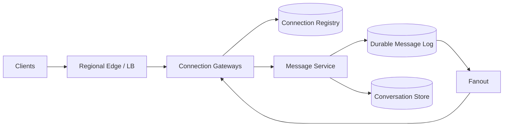

Key distinctions:

### WebSocket transport

Responsible for:

- live connection;
- framing;
- heartbeat;
- reconnect.

### Durable message service

Responsible for:

- message IDs;
- persistence;
- ordering semantics;
- deduplication.

### Fanout system

Responsible for:

- identifying recipient connections;
- cross-gateway delivery;
- backpressure.

TCP delivering bytes reliably does **not** mean:

```text
chat message durably stored
```

or:

```text
recipient displayed message
```

Those acknowledgements live at different layers.

---

# 68. Chat delivery states

A mature protocol may distinguish:

```text
client-created
server-accepted
durably-persisted
delivered-to-recipient-gateway
received-by-device
displayed/read
```

Each acknowledgement has different semantics.

For example:

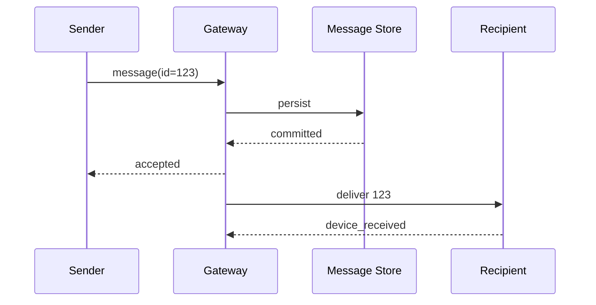

Networking provides transport.

The product defines delivery.

---

# 69. Worked example: global read-heavy API

Requirements:

```text
global users
90% public/cacheable reads
writes relatively rare
p99 latency important
```

Architecture:

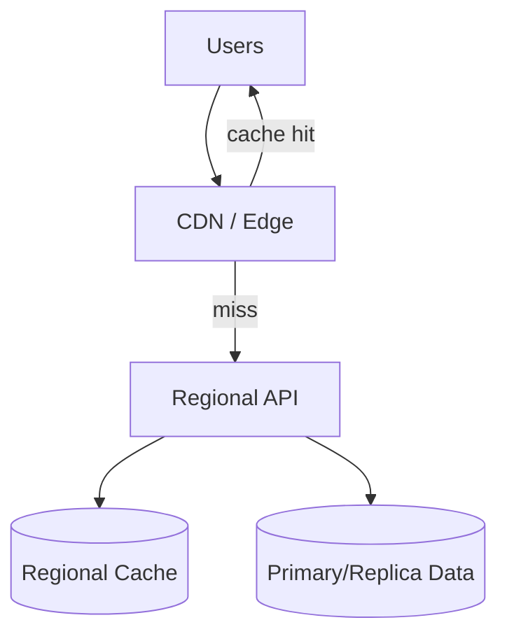

Reasoning:

1. Edge caching removes RTT to origin for hot content.
2. Regional APIs reduce propagation latency.
3. Connection reuse from edge to origin reduces handshake cost.
4. Writes bypass or invalidate cache as required.
5. Cache freshness becomes an explicit product requirement.

The networking optimization is primarily **data placement**, not transport selection.

---

# 70. Worked example: payment API

Requirements:

```text
charge must not execute twice
client may lose connectivity
third-party payment provider can timeout
```

The critical observation:

```text
timeout ≠ payment failed
```

Architecture requires:

```text
operation ID / idempotency key
        ↓
durable operation record
        ↓
provider request
        ↓
reconciliation
```

If provider times out after processing, blindly issuing a brand-new payment request can double-charge.

The retry strategy must preserve the same logical operation identity.

This is networking ambiguity becoming a business invariant.

---

# 71. Worked example: live reactions

Suppose reactions are ephemeral:

```text
❤️ ❤️ 😂 👍
```

Properties:

- extremely frequent;
- individual loss tolerable;
- freshness more valuable than completeness.

Potential architecture:

```text
client events
 ↓
aggregation tier
 ↓
periodic summarized update
 ↓
viewers
```

The interesting optimization might not be “use UDP.”

It could instead be:

```text
coalesce 10,000 individual updates
            ↓
send aggregate every 100 ms
```

This removes orders of magnitude more traffic than changing transport headers.

> [!tip]
> At Staff+ level, optimize the **information model** before optimizing protocol overhead.

---

# 72. Operational review: connections are capacity

For each connection-oriented tier, estimate:

```text
concurrent connections
new connections/sec
average connection lifetime
bytes/sec
messages/sec
per-connection memory
TLS handshakes/sec
reconnect rate under failure
```

Little's Law provides a useful relationship:

\[
L = \lambda W
\]

If:

```text
100,000 new connections/sec
average lifetime = 60 sec
```

then approximately:

\[
6,000,000
\]

connections are concurrently active in steady state.

This allows connection-oriented systems to be capacity-modeled from first principles.

---

# 73. Operational review: throughput is not one number

A service can saturate on:

- requests/sec;
- bytes/sec;
- packets/sec;
- connections/sec;
- concurrent connections;
- TLS handshakes/sec;
- file descriptors;
- ephemeral ports;
- CPU;
- memory;
- proxy queue;
- downstream concurrency.

“Server supports 100k RPS” is incomplete without workload shape.

---

# 74. Staff+ architecture review questions

## Traffic and topology

- Where are users?
- Where is compute?
- Where is authoritative state?
- Which calls cross regions or zones?
- Which flows are north-south vs east-west?
- What is the expected bandwidth?

## Connection model

- Short-lived or persistent?
- How many concurrent connections?
- What is connection churn?
- Who owns pooling?
- How are idle connections removed?
- How are connections drained during deployment?

## Protocol semantics

- Request/response or streaming?
- Required ordering?
- Can messages be dropped?
- How is replay handled?
- Which layer provides framing?

## Reliability

- What does timeout mean for each mutation?
- Which operations are safe to retry?
- Who owns retries?
- How are retry budgets enforced?
- What happens during network partition?
- What is the behavior during dependency recovery?

## Overload

- Where are queues?
- Are they bounded?
- Where is concurrency limited?
- How is backpressure propagated?
- What traffic is shed first?

## Load balancing

- L4 or L7 and why?
- Client or proxy balancing?
- How fresh is service discovery?
- How are unhealthy endpoints removed?
- How do long-lived connections rebalance?
- Is affinity actually necessary?

## Security

- Where does TLS terminate?
- How is east-west traffic protected?
- How are service identities established?
- Are forwarded headers trusted safely?
- What is exposed publicly?

## Operability

- Can DNS, connect, TLS, upstream queueing, and application latency be distinguished?
- Are metrics segmented by region/AZ/backend?
- Can a single bad endpoint be identified?
- Can network failures be injected safely?
- What is the rollback/draining strategy?

---

# 75. Staff+ migration questions

Networking changes should be treated as distributed migrations.

Suppose migrating:

```text
HTTP/1.1 → HTTP/2
TCP → QUIC/HTTP3
old LB → new LB
region A → multi-region
plain HTTP internal → mTLS
```

Ask:

- Can old and new clients coexist?
- Can traffic be mirrored?
- Can protocol support be negotiated?
- What metrics determine success?
- What happens to existing connections?
- How will long-lived connections age out?
- Can DNS cache old endpoints?
- What is the rollback path?
- Does rollback require draining?
- Are connection pools compatible with both worlds?

This is often more important than the target architecture itself.

---

# 76. Failure-domain thinking

The network topology defines blast radius.

Example:

```text
all services
   ↓
one centralized proxy fleet
```

That proxy is now a large correlated failure domain.

Similarly:

```text
all regions
   ↓ synchronous calls
global database
```

makes the global database/network path part of every region's availability.

Staff+ architecture asks:

> **Which failures remain local?**

Good boundaries often align:

```text
traffic
compute
state
networking
operations
```

into cells or regions.

---

# 77. Common interview mistakes

> [!failure] Treating protocol names as architecture
> “I'll use WebSockets because it's realtime.”

Better:

> “The client and server both send frequent unsolicited messages, so I need a persistent bidirectional channel. WebSockets fit browser clients; now I need to handle connection ownership, fanout, reconnect, and backpressure.”

---

> [!failure] Treating TCP reliability as business reliability
> “TCP means the payment cannot be lost.”

Better:

> “TCP reliably transports bytes while connected, but a timeout can leave operation outcome unknown. Payment execution therefore needs an idempotency key and reconciliation.”

---

> [!failure] Retrying every timeout
> “Retry three times with exponential backoff.”

Better:

> “I'll retry only retryable failures, within the request deadline and a retry budget, preserving operation identity for mutations.”

---

> [!failure] Using sticky sessions to solve state
> “Hash user ID to server.”

Better:

> “Do we actually require state locality? If not, keeping durable state external preserves easier balancing and failure recovery.”

---

> [!failure] Ignoring connections in capacity planning
> “The gateway handles 100k RPS.”

Better:

> “The realtime tier is constrained by concurrent sockets, connection churn, message rate, bandwidth, memory, and reconnect capacity—not just RPS.”

---

> [!failure] Assuming DNS failover is immediate
> “We'll change DNS if region A dies.”

Better:

> “DNS gives coarse global steering, but cached results and existing connections slow convergence. The recovery design needs to model those lifetimes.”

---

# 78. Practical design heuristics

> [!tip] Defaults are valuable because they conserve reasoning bandwidth.

### Public synchronous APIs

Default toward:

```text
HTTPS
HTTP semantics
L7 edge/load balancing
connection reuse
explicit timeouts
idempotent retry strategy
```

Use REST-like HTTP unless requirements justify something more specialized.

---

### Internal RPC

A reasonable default is:

```text
HTTP/2-based RPC or HTTP API
connection pooling
service discovery
deadlines
bounded retries
load balancing
```

gRPC is strong when schemas, streaming, and generated clients are beneficial.

---

### Server → browser streaming

Consider SSE first when communication is fundamentally one-way.

---

### Bidirectional browser messaging

Use WebSockets when bidirectional persistent communication is actually needed.

---

### Interactive media

WebRTC is the default family of technologies, with ICE/STUN/TURN treated as first-class infrastructure.

---

### Global read-heavy data

Try:

```text
edge cache
 ↓
regional compute
 ↓
region-local cache/data
```

before inventing exotic transport optimizations.

---

### Internal reliability

Every remote call should trigger questions about:

```text
deadline
retry safety
idempotency
capacity
backpressure
observability
```

---

# 79. A Staff+ mental checklist for every network arrow

When drawing:

```text
A ──────> B
```

mentally annotate:

```text
protocol:
connection:
discovery:
load balancing:
timeout:
retry:
idempotency:
concurrency limit:
queue:
backpressure:
security:
observability:
failure semantics:
regional boundary:
```

You do not need to discuss every item in every interview.

But being able to reason through any of them is the difference between:

```text
boxes and arrows
```

and:

```text
an operable distributed system
```

---

# 80. Compact interview reasoning script

For a normal service boundary:

> “I'll start with HTTPS/request-response and pooled connections. Calls have explicit deadlines. The service tier is stateless and behind an L7 load balancer with readiness checks and bounded upstream connection pools. Reads can retry selected transient failures; mutations require idempotency before retrying. If this becomes a persistent-streaming workload, I'll revisit connection capacity, draining, load balancing, and replay semantics.”

For realtime bidirectional messaging:

> “Because both parties need unsolicited low-latency messages, I'll use persistent WebSocket connections. The connection gateway is a separate scaling tier sized by concurrent connections and reconnect rate. Durable message state lives outside the gateway. We need bounded per-client buffers, heartbeat/reconnect behavior, jittered recovery, and graceful connection draining during deployment.”

For global architecture:

> “I'll route users to nearby regions and keep synchronous state access region-local wherever possible. CDN/edge caching handles immutable or staleness-tolerant reads. Cross-region replication is asynchronous unless the business invariant explicitly requires synchronous global coordination.”

These answers demonstrate mechanisms and trade-offs instead of namedropping technology.

---

# 81. Key takeaways

1. **Networking is primarily about managing uncertainty, state, queues, and topology.**

2. **A remote call has fundamentally different semantics from a local function call.** It can be slow, fail ambiguously, duplicate through retries, and consume resources long after the caller loses interest.

3. **TCP gives a reliable ordered byte stream, not application-level exactly-once execution.**

4. **Flow control and congestion control solve different problems.**

5. **Connection reuse affects latency, congestion behavior, NAT resources, and load balancing.**

6. **HTTP/2 multiplexes requests but shares TCP fate; HTTP/3 moves multiplexing into QUIC transport.**

7. **TLS termination determines the actual encrypted trust boundary.**

8. **Persistent connections turn connection ownership, draining, reconnect storms, and per-client backpressure into architecture concerns.**

9. **DNS is excellent as a distributed naming/control mechanism but poor as an instantaneous health-control loop.**

10. **Load balancing is scheduling with imperfect, potentially stale signals.**

11. **Health, readiness, overload, and outlier detection are related but distinct concepts.**

12. **Retries consume capacity. Their safety requires deadlines, idempotency, backoff, jitter, and budgets.**

13. **Backpressure and bounded queues are fundamental stability mechanisms.**

14. **Geographic distribution is fundamentally a data-locality problem.**

15. **The strongest Staff+ question for any network edge is:**
   
   > What happens to correctness, latency, resource consumption, and blast radius when this dependency becomes slow rather than completely dead?

---

# 82. Further questions to explore

These make useful follow-up deep dives:

- How do Linux socket buffers and accept queues behave under overload?
- How do CUBIC and BBR differ as congestion-control strategies?
- How does ECN signal congestion without waiting for packet loss?
- How do modern L4 load balancers implement connection tracking or direct server return?
- How do Maglev and consistent-hash rings differ operationally?
- How does a service mesh alter the connection topology?
- How should retry budgets interact with autoscaling?
- How does QUIC connection migration interact with load balancer affinity?
- How do HTTP/2 flow-control windows create cross-stream interference?
- What happens during certificate rotation with millions of persistent connections?
- How should large fleets avoid coordinated reconnect storms?
- How do NAT gateways and ephemeral-port limits constrain very high fanout?
- What does zone-aware routing trade against even load distribution?
- When does cross-zone traffic improve availability enough to justify latency and cost?
- How should multi-region systems migrate ownership safely?
- Which networking telemetry is observable from eBPF without application instrumentation?
- How do DDoS mitigation and application rate limiting differ?
- How should load shedding prioritize requests by business value?

---

# 83. Hands-on exercises

## Exercise 1 — inspect a real request

Use tools such as:

```text
dig
curl -v
openssl s_client
traceroute / tracepath
ss
tcpdump / Wireshark
```

For one HTTPS request, identify:

```text
DNS result
IP family
connection establishment
TLS negotiation
HTTP version
connection reuse
server latency
```

---

## Exercise 2 — induce packet loss

Introduce:

```text
50 ms latency
1% packet loss
```

Compare:

```text
HTTP/1.1
HTTP/2
HTTP/3
```

Observe:

- median latency;
- tail latency;
- throughput;
- connection behavior.

---

## Exercise 3 — break MTU

Create a path with a lower MTU and intentionally interfere with PMTU discovery.

Observe the characteristic failure where:

```text
small payload works
large payload stalls
```

---

## Exercise 4 — create retry amplification

Build:

```text
client → service A → service B
```

Give both layers three retries.

Fail B.

Measure the attempts arriving at B.

Then introduce:

```text
single retry owner
deadline
backoff + jitter
retry budget
```

Compare behavior.

---

## Exercise 5 — persistent connection deployment

Create thousands of WebSocket clients.

Restart gateways simultaneously.

Measure:

```text
disconnect rate
reconnect attempts/sec
TLS handshakes/sec
CPU
authentication traffic
```

Then add reconnect jitter and graceful draining.

The difference is the lesson.

---

# 84. Source notes and reliability

## Baseline source

**Hello Interview — “Networking Essentials for System Design Interviews.”**

The linked video has a companion written guide from the same publisher. It is useful as an interview-oriented survey and establishes the coverage baseline for this note.

Where this note differs, it generally does so by expanding or qualifying simplified interview explanations rather than treating them as protocol specifications.

---

## Primary protocol references

The protocol-level claims in this note should preferentially be checked against the relevant IETF standards:

- **RFC 9293 — Transmission Control Protocol (TCP)**
  - Current consolidated TCP specification.
  - Defines TCP as a reliable, in-order byte-stream service.

- **RFC 5681 — TCP Congestion Control**
  - Slow start, congestion avoidance, fast retransmit, and fast recovery.

- **RFC 7323 — TCP Extensions for High Performance**
  - Window scaling and bandwidth-delay-product implications.

- **RFC 1918 — Address Allocation for Private Internets**

- **RFC 3022 — Traditional IP Network Address Translator**

- **RFC 8200 — Internet Protocol, Version 6 (IPv6)**

- **RFC 8201 — Path MTU Discovery for IPv6**

- **RFC 1034 / RFC 1035 — Domain Names**

- **RFC 2308 — Negative Caching of DNS Queries**

- **RFC 4271 — BGP-4**

- **RFC 4786 — Operation of Anycast Services**

- **RFC 8446 — TLS 1.3**
  - Especially important for handshake behavior and the weaker replay properties of 0-RTT data.

- **RFC 9110 — HTTP Semantics**

- **RFC 9112 — HTTP/1.1**

- **RFC 9113 — HTTP/2**
  - Multiplexed streams and flow control.

- **RFC 9000 — QUIC**
  - Streams, connection IDs, migration, transport behavior.

- **RFC 9001 — Using TLS to Secure QUIC**

- **RFC 9114 — HTTP/3**

- **RFC 6455 — The WebSocket Protocol**
  - Opening handshake, frames, ping/pong, connection semantics.

- **RFC 8445 — Interactive Connectivity Establishment (ICE)**

- **RFC 8489 — Session Traversal Utilities for NAT (STUN)**

- **RFC 8656 — Traversal Using Relays around NAT (TURN)**

---

## Production-oriented references

### gRPC documentation

Particularly useful topics:

- deadlines;
- retry configuration;
- service config;
- client-side load balancing;
- name resolution;
- streaming and flow control.

The documentation explicitly emphasizes setting deadlines and carefully controlling retry behavior.

### Amazon Builders' Library

Useful essays include:

- *Timeouts, retries, and backoff with jitter*
- *Making retries safe with idempotent APIs*
- material on overload and queue management.

These are valuable because they connect network failure semantics to fleet-scale operational behavior.

### Envoy documentation

Useful for understanding:

- connection pools;
- request lifecycle;
- least-request balancing;
- consistent hashing / Maglev;
- outlier detection;
- retries;
- circuit breakers.

Envoy's request path is a useful concrete model for how production L7 proxies combine networking, scheduling, and resilience mechanisms.

---

# 85. Final Staff+ perspective

Networking expertise at Staff+ is not demonstrated by remembering TCP flag names.

It is demonstrated by noticing consequences such as:

```text
This retry is unsafe because timeout does not tell us whether the write committed.
```

or:

```text
Adding replicas will not rebalance the existing 2 million WebSocket connections.
```

or:

```text
This cross-region RPC is now in our availability dependency graph, not merely our latency budget.
```

or:

```text
Increasing the connection pool removes backpressure and may overload the database.
```

or:

```text
DNS failover does not evacuate existing HTTP/2 connections.
```

or:

```text
This health check proves process liveness but not request readiness.
```

or:

```text
The client has 400 ms left, so a downstream service with a 2-second timeout is doing work that can no longer create user value.
```

or:

```text
The transport reliably delivered bytes, but we still need application acknowledgements to know whether the business operation became durable.
```

The progression is:

```text
protocol knowledge
      ↓
mechanism knowledge
      ↓
failure-model knowledge
      ↓
resource-model knowledge
      ↓
architecture trade-offs
      ↓
operational judgment
```

That last step is the one expected at Staff+.

> [!summary]
> **Do not reason about networking as “lines between boxes.”**
>
> Reason about every line as a distributed subsystem with:
>
> - state,
> - queues,
> - finite capacity,
> - latency,
> - failure ambiguity,
> - security boundaries,
> - control-plane dependencies,
> - and recovery behavior.
>
> Once you do that, networking becomes one of the most powerful lenses for system design rather than a collection of interview trivia.