> [!summary]
> Redis is best understood not merely as an "in-memory key-value cache," but as a **data-structure execution engine with serialized command execution, expiration, optional persistence, asynchronous replication, and sharding**.
>
> Its biggest architectural advantages are low latency, rich atomic data-structure operations, and a simple execution model. Its biggest traps are treating asynchronous replication as strong durability, confusing Sentinel with sharding, creating hot keys, and issuing operations whose cost grows with unexpectedly large collections.

- [[#Executive Summary|Executive Summary]]
- [[#2.1 In-memory primary access path|2.1 In-memory primary access path]]
- [[#2.2 Mostly serialized command execution|2.2 Mostly serialized command execution]]
- [[#2.3 Network round trips matter|2.3 Network round trips matter]]
	- [[#2.3 Network round trips matter#Pipelining|Pipelining]]
- [[#3.1 Strings|3.1 Strings]]
	- [[#3.1 Strings#Conditional SET|Conditional SET]]
	- [[#3.1 Strings#Atomic counters|Atomic counters]]
	- [[#3.1 Strings#Modeling question|Modeling question]]
	- [[#3.1 Strings#Failure problem|Failure problem]]
	- [[#3.1 Strings#Scaling concern|Scaling concern]]
- [[#Leaderboards|Leaderboards]]
- [[#Priority queues|Priority queues]]
- [[#Scheduling|Scheduling]]
- [[#Sliding-window rate limiting|Sliding-window rate limiting]]
- [[#At-least-once implications|At-least-once implications]]
- [[#How geospatial data works internally|How geospatial data works internally]]
	- [[#How geospatial data works internally#Encoding: GEOADD|Encoding: GEOADD]]
	- [[#How geospatial data works internally#Querying: GEOSEARCH|Querying: GEOSEARCH]]
	- [[#How geospatial data works internally#Distance: GEODIST|Distance: GEODIST]]
	- [[#How geospatial data works internally#Concrete example|Concrete example]]
	- [[#How geospatial data works internally#Why this design works well|Why this design works well]]
	- [[#How geospatial data works internally#Limitations|Limitations]]
- [[#Concrete example: daily active users|Concrete example: daily active users]]
- [[#Approximate structures|Approximate structures]]
- [[#Expiration|Expiration]]
- [[#Eviction|Eviction]]
- [[#5.1 Cache-aside|5.1 Cache-aside]]
	- [[#5.1 Cache-aside#Trade-off|Trade-off]]
	- [[#5.1 Cache-aside#Deeper interpretation|Deeper interpretation]]
	- [[#5.1 Cache-aside#Interview heuristic|Interview heuristic]]
- [[#19.1 Fixed Window|19.1 Fixed Window]]
- [[#Redis is only a cache|Redis is only a cache]]
- [[#Redis is the rate limiter|Redis is the rate limiter]]
- [[#Redis is the job queue|Redis is the job queue]]
- [[#Redis contains authoritative business state|Redis contains authoritative business state]]
- [[#Semantics|Semantics]]
- [[#Authority|Authority]]
- [[#Atomicity|Atomicity]]
- [[#Atomicity locality|Atomicity locality]]
- [[#Partitioning|Partitioning]]
- [[#Boundedness|Boundedness]]
- [[#Failure semantics|Failure semantics]]
- [[#Degradation|Degradation]]
- [[#Memory|Memory]]
- [[#Backpressure|Backpressure]]
- [[#Recovery|Recovery]]
- [[#Organizational coupling|Organizational coupling]]
- [[#"Redis is fast because it's in memory."|"Redis is fast because it's in memory."]]
- [[#"Redis Cluster gives strong consistency."|"Redis Cluster gives strong consistency."]]
- [[#"We have replicas, therefore the data is durable."|"We have replicas, therefore the data is durable."]]
- [[#"We'll use Pub/Sub for reliable jobs."|"We'll use Pub/Sub for reliable jobs."]]
- [[#"We can fix it by adding shards."|"We can fix it by adding shards."]]
- [[#"Redis commands are atomic, so my workflow is atomic."|"Redis commands are atomic, so my workflow is atomic."]]
- [[#"We'll put a distributed lock around it."|"We'll put a distributed lock around it."]]

## Executive Summary

Redis becomes much easier to reason about when you separate five concerns:

1. **Data model** — Strings, Hashes, Lists, Sets, Sorted Sets, Streams, geospatial indexes, bitmaps, and related structures.
2. **Execution semantics** — individual commands execute atomically relative to other commands on the same Redis process.
3. **Persistence** — RDB and AOF determine what survives process or machine failure.
4. **Replication and failover** — replicas, Sentinel, and Redis Cluster increase availability but do not make ordinary Redis writes consensus-committed.
5. **Partitioning** — Redis Cluster divides keys into 16,384 hash slots and distributes those slots across primary nodes.

The most important distributed-systems fact to remember is:

> **Redis replication is normally asynchronous. An acknowledged write can therefore be lost during failover.**

Redis is exceptionally useful when the operation you need maps cleanly onto one of its native atomic data-structure operations:

- counters → `INCR`
- membership → Sets
- leaderboards → Sorted Sets
- simple queues → Lists
- reliable consumer-group processing → Streams
- cache entries → Strings/Hashes + TTL
- rate limiting → counters, Sorted Sets, or scripts
- deduplication → `SET NX`
- proximity search → geospatial indexes

For Staff+ system design, the useful question is not:

> "Where can I add Redis?"

It is:

> **"What state transition or invariant am I trying to implement, and what are the consistency, partitioning, failure, and recovery implications of putting that state in Redis?"**

---

# 1. Mental Model: Redis Is a Data-Structure Server

The useful abstraction is:

```text
Redis
  = key -> typed value
  + server-side operations over that value
  + expiration
  + optional persistence
  + optional replication
  + optional partitioning
```

The server-side operations are the important part.

Suppose multiple application servers need to increment a counter.

A naive application-level implementation is:

```text
read x
x = x + 1
write x
```

Concurrent clients can lose updates.

Redis instead provides:

```redis
INCR x
```

The read-modify-write happens as one Redis operation.

The same idea applies elsewhere:

| Requirement | Redis primitive |
|---|---|
| increment counter | `INCR` |
| create only when absent | `SET ... NX` |
| membership test | `SISMEMBER` |
| ranking | `ZADD`, `ZRANK`, `ZRANGE` |
| blocking queue | `LPUSH`, `BRPOP` |
| durable-ish event consumption | Streams |
| atomic conditional logic | Lua / Redis Functions |

This is why describing Redis merely as an in-memory database misses much of its architectural value.

Redis lets you move some concurrency-sensitive state transitions from application code into a **serialized execution domain**.

---

# 2. Why Redis Is Fast

"Because RAM is fast" is true but incomplete.

Three mechanisms matter.

## 2.1 In-memory primary access path

Most Redis operations manipulate in-memory data structures.

Persistence can write state to disk, but disk generally is not on the synchronous read path for ordinary commands.

This eliminates much of the latency associated with storage engines built primarily around disk-resident data.

---

## 2.2 Mostly serialized command execution

Redis processes ordinary commands in a mostly serialized fashion with respect to the dataset.

Conceptually:

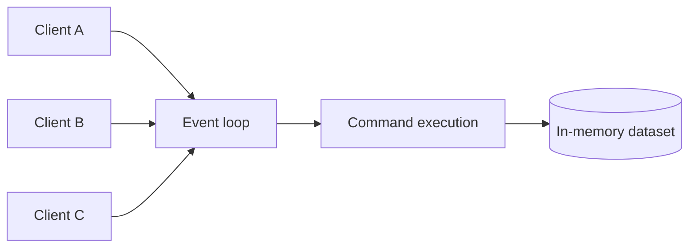

This gives Redis an important property:

> One ordinary command does not observe another command halfway through its mutation.

The trade-off is equally important:

> **A slow command can delay unrelated clients.**

Suppose one client executes an operation that scans millions of elements.

Even if every other client's command normally requires microseconds, they may wait behind the expensive operation.

Therefore:

> **Algorithmic complexity in Redis is also a latency-isolation concern.**

That is why operations such as these deserve scrutiny on large collections:

```redis
KEYS *
SMEMBERS giant-set
HGETALL giant-hash
LRANGE giant-list 0 -1
```

The issue is not that those commands are inherently wrong.

The issue is **unbounded work**.

---

## 2.3 Network round trips matter

A Redis command may execute very quickly, but a client that performs:

```text
GET A
wait
GET B
wait
GET C
wait
```

pays multiple network round trips.

### Pipelining

Redis pipelining lets the client send multiple commands before waiting for replies.

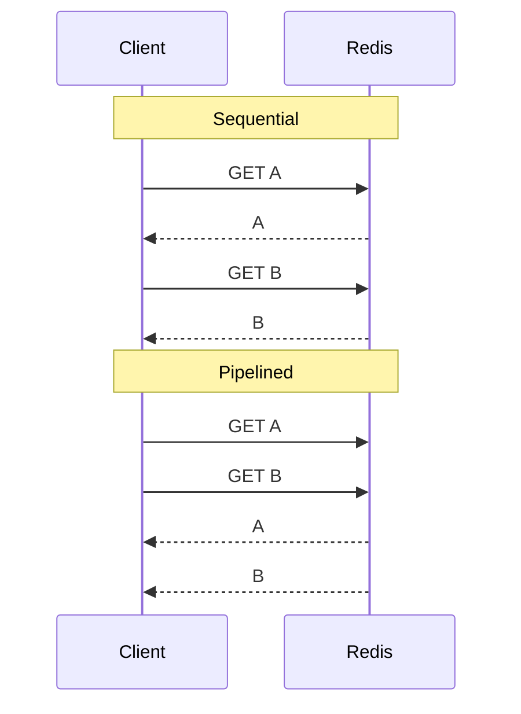

Pipelining reduces RTT overhead.

It does **not** make the commands transactional.

Also avoid enormous pipelines because Redis must retain queued responses until the client consumes them.

---

# 3. Core Data Structures

## 3.1 Strings

Strings are the simplest Redis value type.

Common commands:

```redis
SET
GET
MSET
MGET
INCR
INCRBY
DECR
GETDEL
SETEX
```

Typical models:

```text
session:abc123       -> serialized session
profile:42           -> cached user representation
rate:user:42         -> 117
feature:user:42      -> enabled
idempotency:req-123  -> complete
```

### Conditional SET

One particularly important operation is:

```redis
SET resource value NX EX 30
```

Meaning approximately:

- create the key only if it does not already exist;
- automatically expire it after 30 seconds.

This primitive is useful for:

- deduplication,
- idempotency markers,
- leases,
- best-effort distributed locks.

### Atomic counters

```redis
INCR pageviews:2026-08-19
```

Multiple application servers can increment the same value safely without implementing application-level locks.

---

# 3.2 Hashes

A Redis Hash represents:

```text
key -> {
    field -> value
}
```

Example:

```text
user:123
  name      Alice
  plan      pro
  credits   900
```

Commands include:

```redis
HSET
HGET
HMGET
HGETALL
HINCRBY
HDEL
HSCAN
```

Hashes are useful when you need field-level mutation.

For example:

```redis
HINCRBY user:123 credits -1
```

avoids this application-side workflow:

```text
GET entire object
deserialize
modify one field
serialize
SET entire object
```

### Modeling question

Do not automatically use a Hash because your domain object contains fields.

Choose between String and Hash based on:

- mutation patterns,
- retrieval patterns,
- memory overhead,
- TTL requirements,
- serialization costs.

---

# 3.3 Lists

Redis Lists represent ordered sequences.

Important operations:

```redis
LPUSH
RPUSH
LPOP
RPOP
BLPOP
BRPOP
LMOVE
BLMOVE
LRANGE
```

A basic worker queue can look like:

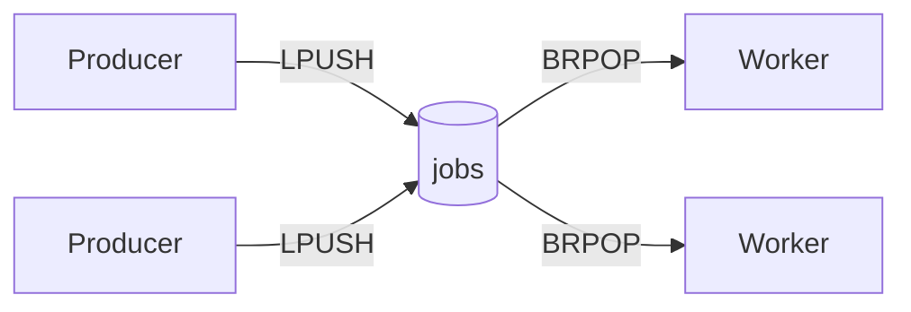

Blocking operations allow workers to sleep until work is available.

### Failure problem

Consider:

```text
worker BRPOP job
worker crashes
```

The job has already been removed from the List.

Without additional bookkeeping, it is lost.

Lists are therefore appropriate for simple queue semantics but less attractive when you need:

- acknowledgements,
- retry tracking,
- consumer ownership,
- dead-worker recovery,
- replay.

For those requirements, Redis Streams are usually a better abstraction.

---

# 3.4 Sets

A Set stores unique unordered members.

Commands include:

```redis
SADD
SREM
SISMEMBER
SCARD
SMEMBERS
SINTER
SUNION
SDIFF
```

Common models:

```text
followers:user123
online-users
permissions:alice
seen:event123
```

Example:

```redis
SISMEMBER permissions:admins alice
```

Useful set operations include:

```redis
SINTER users:projectA users:admins
```

This can answer questions such as:

> Which project members are also administrators?

### Scaling concern

Membership checks are cheap.

Materializing an enormous set or intersection may not be.

Always distinguish between:

```text
point operation
```

and:

```text
return the entire collection
```

---

# 3.5 Sorted Sets

A Sorted Set maps:

```text
member -> score
```

and maintains members ordered by score.

Example:

```text
leaderboard
  alice -> 9200
  bob   -> 8500
  carol -> 7300
```

Important commands:

```redis
ZADD
ZINCRBY
ZSCORE
ZRANK
ZREVRANK
ZRANGE
ZREM
ZPOPMIN
ZPOPMAX
```

## Leaderboards

```redis
ZINCRBY leaderboard 50 alice
ZREVRANK leaderboard alice
ZRANGE leaderboard 0 99 REV WITHSCORES
```

Sorted Sets naturally model:

```text
member = player
score  = points
```

---

## Priority queues

Store:

```text
member = job
score  = priority
```

Then remove the highest- or lowest-priority entries.

---

## Scheduling

Store:

```text
member = job ID
score  = execution timestamp
```

Workers look for:

```text
score <= current time
```

Example conceptual structure:

```text
send-email-1 -> 1787097600
send-email-2 -> 1787097800
```

---

## Sliding-window rate limiting

Store every request timestamp in a Sorted Set.

For each request:

```text
remove timestamps older than window
add current timestamp
count remaining requests
accept if count <= threshold
```

This produces more accurate rate limiting than fixed windows, at the cost of storing one entry per request inside the active window.

---

# 3.6 Streams

Streams are one of the most useful Redis features beyond caching.

Conceptually:

```text
Stream
  = append-only entries
  + ordered IDs
  + consumer-group state
  + pending-message ownership
  + acknowledgement tracking
```

Producer:

```redis
XADD orders * order_id 123 user_id 456
```

Basic reader:

```redis
XREAD ...
```

Consumer groups introduce commands such as:

```redis
XGROUP CREATE
XREADGROUP
XACK
XPENDING
XAUTOCLAIM
```

Architecture:

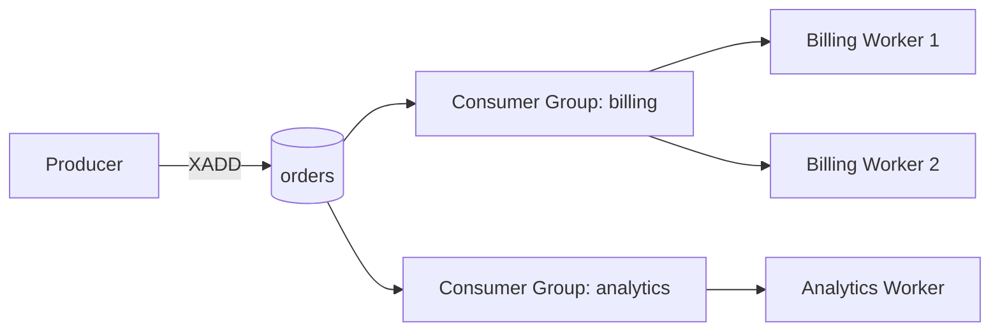

A message delivered to a consumer group remains pending until acknowledged.

If a consumer dies, another consumer can eventually claim stale pending work.

---

## At-least-once implications

Suppose a worker does:

```text
1. receive payment event
2. charge card
3. crash
4. XACK never happens
```

Redis may redeliver the message.

Another worker now sees the same event.

Therefore:

> **Redis Streams do not automatically provide exactly-once business effects.**

The handler needs idempotency.

Example:

```text
event_id -> already processed?
```

or a durable database transaction that records the event's execution together with the business mutation.

---

# 3.7 Pub/Sub

Pub/Sub provides transient broadcast messaging.

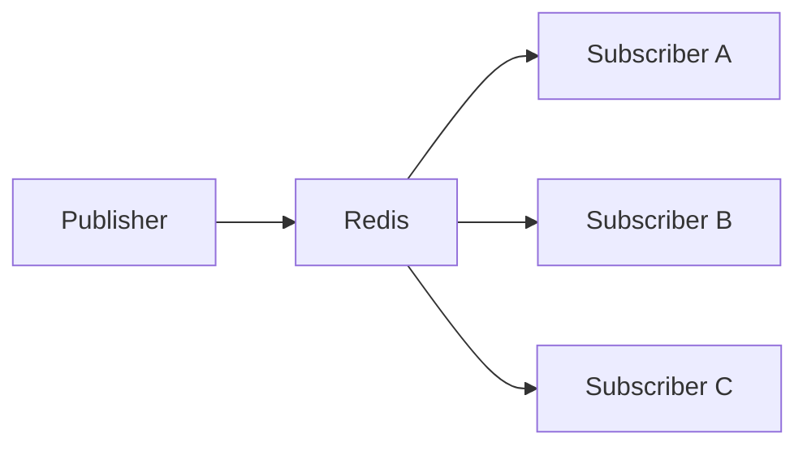

Commands:

```redis
PUBLISH
SUBSCRIBE
PSUBSCRIBE
```

The critical semantic difference from Streams:

> Redis Pub/Sub uses **at-most-once delivery**.

If a subscriber disconnects, it does not later receive historical messages.

Therefore:

| Requirement | Mechanism |
|---|---|
| live notification | Pub/Sub |
| presence update | Pub/Sub |
| cache invalidation hint | Pub/Sub |
| offline consumer must catch up | Stream |
| replay | Stream |
| ACK/retry | Stream |

A common interview mistake is saying:

> "We'll use Redis Pub/Sub for the job queue."

That is incorrect when losing jobs is unacceptable.

---

# 3.8 Geospatial Data

Redis provides commands such as:

```redis
GEOADD
GEOSEARCH
GEODIST
```

Typical applications:

- nearby drivers,
- nearby restaurants,
- delivery zones,
- store locators.

In a ride-sharing design, Redis may maintain rapidly changing driver location indexes.

Example:

```text
Redis:
  currently available driver locations

Durable database:
  authoritative driver and trip records
```

This is often a better design than making Redis the sole source of truth for trip state.

---

## How geospatial data works internally

Redis geo is not a separate data structure. It is a **Sorted Set in disguise**.

The core trick:

```text
(longitude, latitude)
        |
        v
52-bit geohash integer
        |
        v
ZSET score
```

### Encoding: GEOADD

When you execute:

```redis
GEOADD drivers -73.9857 40.7484 "driver:1"
```

Redis internally:

1. Quantizes longitude and latitude into 26-bit integers by repeatedly bisecting the valid ranges:

```text
longitude -> [-180, 180]
latitude  -> [-85.05, 85.05]
```

Each bit answers one question: is the coordinate in the upper half or lower half of the current range?

```text
bit = 1 -> upper half becomes the new range
bit = 0 -> lower half becomes the new range
```

Worked example for longitude `-73.9857`:

```text
step  range                   mid         vs mid    bit   new range
1     [-180,     180    ]      0.0000    below      0     [-180, 0]
2     [-180,       0    ]    -90.0000    above      1     [-90, 0]
3     [-90,        0    ]    -45.0000    below      0     [-90, -45]
4     [-90,      -45    ]    -67.5000    below      0     [-90, -67.5]
5     [-90,      -67.5  ]    -78.7500    above      1     [-78.75, -67.5]
6     [-78.75,   -67.5  ]    -73.1250    below      0     [-78.75, -73.125]
7     [-78.75,   -73.125]    -75.9375    above      1     [-75.9375, -73.125]
...
```

The first bit is effectively the sign: west of the prime meridian is 0, east is 1. For latitude, the first bit is south (0) vs. north (1) of the equator.

Each bit halves the remaining uncertainty. After 26 iterations:

```text
longitude: 360°   / 2^26 ≈ 0.6 meters at the equator
latitude:  170.1° / 2^26 ≈ 0.28 meters
```

Every coordinate on Earth snaps to a cell roughly 0.6m × 0.3m. That quantization is the source of the small bounded distance error in `GEODIST`.

2. Interleaves the bits of the two integers into one 52-bit number.

Interleaving is the important step:

```text
lon bits: L0 L1 L2 L3 ...
lat bits: B0 B1 B2 B3 ...

score:    L0 B0 L1 B1 L2 B2 ...
```

Because the bits alternate at every level of precision, coordinates that are physically close tend to produce numerically close scores.

The geohash is effectively a 1D projection of a 2D location, similar in spirit to a Z-order curve.

3. Stores the result as an ordinary Sorted Set entry:

```text
member = "driver:1"
score  = 1791876145287086
```

You can observe this directly:

```redis
ZRANGE drivers 0 -1 WITHSCORES
```

The geo commands are a specialized interface over the same underlying ZSET.

### Querying: GEOSEARCH

Suppose a rider opens the app and we need:

```redis
GEOSEARCH drivers FROMLONLAT -73.98 40.75 BYRADIUS 5 KM ASC COUNT 10
```

Conceptually, Redis performs:

```text
1. compute the bounding box of the 5 km circle
2. translate that box into geohash score ranges
3. fetch candidates with a sorted-set range query
4. also inspect the 8 neighboring geohash cells
5. filter candidates by exact great-circle distance
6. return the nearest matches
```

Step 4 matters because a point just outside your geohash cell boundary can still lie inside the search radius.

The expensive global scan disappears:

```text
naive approach:
    compare rider against every driver

Redis approach:
    range query on geohash scores
    + exact distance check on a small candidate set
```

Complexity is approximately:

```text
O(log N + candidates)
```

rather than:

```text
O(N)
```

### Distance: GEODIST

```redis
GEODIST drivers driver:1 driver:2 KM
```

Redis decodes both scores back into coordinates and applies the haversine formula.

Because coordinates were quantized into the 52-bit grid during encoding, distances carry a small bounded error.

### Concrete example

```redis
GEOADD drivers -73.9857 40.7484 "driver:1"
GEOADD drivers -73.9910 40.7520 "driver:2"
GEOADD drivers -73.8700 40.6800 "driver:3"
```

Rider requests nearby drivers:

```redis
GEOSEARCH drivers FROMLONLAT -73.9860 40.7490 BYRADIUS 2 KM ASC
```

Conceptual result:

```text
driver:1    0.05 km
driver:2    0.55 km
```

`driver:3` is excluded even though it may share a nearby geohash region, because the exact distance filter rejects it.

### Why this design works well

- Redis reuses the existing Sorted Set implementation, including its skip list, memory optimizations, and cluster sharding.
- Geo keys behave like ordinary ZSET keys, so commands such as `ZREM` still work:

```redis
ZREM drivers driver:1
```

- Sharding follows normal Redis Cluster rules: the geo key maps to one hash slot like any other key.

### Limitations

- Points only; no polygons or arbitrary shapes.
- One geo index per key; modeling multiple location categories requires separate keys.
- Coordinates are quantized, so distances are approximate within a small bounded error.
- Like any single Redis key, an extremely hot geo index can become a hot-key problem.

---

# 3.9 Bitmaps and Approximate Structures

Bitmaps are useful when a domain consists of many boolean flags.

Instead of:

```text
user:1:active -> 1
user:2:active -> 0
user:3:active -> 1
```

you can represent large boolean populations densely.

Example application:

```text
Was user 123 active today?
```

This can be dramatically more memory-efficient than one key per fact.

## Concrete example: daily active users

Suppose you want to track which users were active on a given day.

One key per fact:

```redis
SET active:2026-09-02:user:1 1
SET active:2026-09-02:user:2 1
SET active:2026-09-02:user:3 1
```

With 100 million users, that is up to 100 million keys per day, each carrying key-name bytes, object metadata, and hash-table overhead.

Bitmap approach:

```redis
SETBIT active:2026-09-02 1 1
SETBIT active:2026-09-02 2 1
SETBIT active:2026-09-02 3 1
```

Conceptually, the value is one long bit array where the **offset is the user ID**:

```text
key: active:2026-09-02

offset:  0 1 2 3 4 5 6 7 ...
bit:     0 1 1 1 0 0 0 0 ...
              ^
              user 2 was active
```

Common questions map to single commands:

```redis
GETBIT active:2026-09-02 123        # was user 123 active today?
BITCOUNT active:2026-09-02          # how many users were active today?
```

Bitwise composition answers cross-day questions without materializing per-user sets:

```redis
BITOP AND active:both-days active:2026-09-01 active:2026-09-02
BITCOUNT active:both-days           # users active on both days (retention)
```

Memory comparison at 100 million users:

```text
one key per user:   billions of bytes (key names + metadata dominate)
bitmap:             100,000,000 bits ≈ 12 MB
```

The trade-offs:

- user IDs must map to integer offsets, so this fits numeric ID spaces better than arbitrary strings;
- a sparse ID space wastes memory, since the bitmap grows to the highest offset used;
- `BITOP` on huge bitmaps is another unbounded command, so the boundedness rule still applies.

## Approximate structures

The same "denser representation" idea extends to structures that trade exactness for memory:

```text
HyperLogLog  -> approximate unique counts with tiny fixed memory
Bloom filter -> approximate membership with no false negatives
```

Example:

```redis
PFADD visitors:2026-09-02 user:123
PFCOUNT visitors:2026-09-02
```

A HyperLogLog estimates unique visitors using kilobytes regardless of whether you saw ten users or ten billion, at the cost of a small error rate.

General heuristic:

> Before storing millions of Redis keys, ask whether the information admits a denser representation.

---

# 4. Expiration vs Eviction

These solve different problems.

## Expiration

Application semantics explicitly say:

```redis
SET session:123 ... EX 3600
```

The entry expires after one hour.

Expiration is part of the data's lifecycle.

---

## Eviction

Redis reaches a memory limit and chooses data to remove.

Policies include variants of:

```text
allkeys-lru
allkeys-lfu
allkeys-random
volatile-lru
volatile-lfu
volatile-ttl
noeviction
```

The architectural distinction matters.

Do not casually mix:

```text
recoverable cache data
```

and:

```text
business-critical authoritative data
```

inside the same eviction domain.

Otherwise:

```text
memory pressure
```

can become:

```text
data correctness failure
```

> [!important]
> Always state whether data stored in Redis is **authoritative** or **reconstructable**.

That decision changes almost everything about the architecture.

---

# 5. Redis as a Cache

## 5.1 Cache-aside

Typical read path:

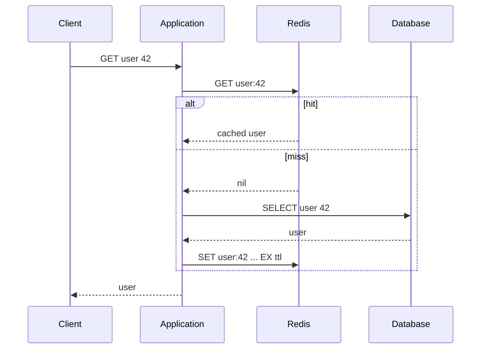

This is simple.

The difficult part is invalidation.

---

# 5.2 Updating Data

A common mutation pattern is:

```text
1. update database
2. delete Redis cache key
```

Deletion is often simpler than writing the new cached value because the next reader reconstructs it from the authoritative source.

But races remain.

Example:

```text
A: cache miss
A: reads DB value V1

B: writes V2 to DB
B: deletes cache

A: writes V1 into cache
```

The old value has now been resurrected.

Mitigations include:

- short TTLs,
- versioned values,
- CDC-based invalidation,
- write-through approaches,
- bounded-staleness acceptance.

Redis does not make distributed cache consistency disappear.

---

# 5.3 Cache Stampede

Suppose:

```text
product:iphone
```

is an extremely popular cached object.

Its TTL expires.

20,000 requests arrive simultaneously.

Without protection:

```text
20,000 cache misses
       |
       v
20,000 database reads
```

Redis is fine.

Your database may not be.

Typical defenses:

- request coalescing,
- singleflight,
- stale-while-revalidate,
- background refresh,
- soft and hard TTLs,
- TTL jitter.

Example jitter:

```text
TTL = 3600 + random(-300, +300)
```

This avoids synchronized expiration.

---

# 5.4 Hot Keys

Suppose a cluster has 100 Redis shards but:

```text
GET celebrity:123
```

represents 30% of traffic.

That key belongs to one slot, therefore one primary handles nearly all those requests.

Adding shards does not help.

Possible solutions:

- client-local caching,
- CDN caching,
- replicated copies,
- application-level key splitting,
- read replicas,
- request coalescing.

General principle:

> **Sharding solves aggregate capacity. It does not automatically solve skew.**

---

# 6. Atomicity

An individual Redis command executes atomically relative to other ordinary Redis commands on the same node.

Example:

```redis
INCR inventory
```

is atomic.

This does **not** mean:

```text
GET
application logic
SET
```

is atomic.

Another client may modify the key between the operations.

---

# 6.1 MULTI / EXEC

Redis transactions use:

```redis
MULTI
...
EXEC
```

The queued commands execute sequentially without ordinary commands from other clients being interleaved.

Redis also supports optimistic concurrency with:

```redis
WATCH
```

Conceptually:

```text
WATCH account

read state

MULTI
write changes
EXEC
```

If a watched key changed before execution, the transaction can fail and the application retries.

Do not assume Redis transactions behave exactly like relational database transactions.

The rollback and error semantics are different.

### No rollback

In a relational database, an error mid-transaction lets you roll back everything:

```text
all commands succeed, or none do
```

Redis instead guarantees only:

```text
all commands run, in order, without interleaving
```

Two error classes behave differently:

**Queue-time errors** (syntax errors, unknown commands) are caught while queueing:

```text
MULTI
SET x 1
BADCOMMAND foo        <- rejected at queue time
EXEC                  <- EXECABORT: nothing runs
```

Nothing executed, so there was nothing to roll back.

**Runtime errors** (syntactically valid commands that fail at execution, such as `WRONGTYPE`) do not stop the transaction:

```text
MULTI
SET x 1
LPUSH x "a"           <- fails: WRONGTYPE
INCR y                <- still executes
EXEC
1) OK
2) (error) WRONGTYPE ...
3) (integer) 1
```

Commands before and after the failure are applied and stay applied. There is no undo.

Redis chose this deliberately: no rollback machinery keeps the hot path simple and fast, and runtime errors like `WRONGTYPE` are treated as programming bugs that should surface during development.

`WATCH` is not rollback either. It is optimistic concurrency control: if a watched key changed before `EXEC`, the transaction simply does not run and the application retries.

Practical implications:

- validate preconditions before `EXEC`, because you cannot undo after;
- Lua scripts share the same caveat: a script that errors midway stops, but its earlier writes are not reverted;
- Redis transactions give you isolation and atomicity of execution order, not atomicity of outcome.

---

# 6.2 Lua Scripts and Redis Functions

Suppose a rate limiter needs:

```text
read counter
if below threshold:
    increment
    set TTL if necessary
    return ALLOW
else:
    return DENY
```

Doing this through separate network commands introduces races.

A Lua script or Redis Function can move the logic into Redis and execute atomically.

## Concrete example: fixed-window rate limiter

The naive client-side version races:

```text
client A: GET rate:user:42        -> 99
client B: GET rate:user:42        -> 99
client A: INCR rate:user:42       -> 100
client B: INCR rate:user:42       -> 101
```

Both clients observed 99, both believed the limit of 100 was not yet reached, and the counter overshot.

The same logic as a Lua script:

```lua
-- KEYS[1] = rate limit key
-- ARGV[1] = limit
-- ARGV[2] = window in seconds

local current = tonumber(redis.call("GET", KEYS[1]) or "0")

if current >= tonumber(ARGV[1]) then
    return 0
end

current = redis.call("INCR", KEYS[1])

if current == 1 then
    redis.call("EXPIRE", KEYS[1], ARGV[2])
end

return 1
```

Invoked as:

```redis
EVAL "..." 1 rate:user:42 100 60
```

The entire read-check-increment-TTL sequence executes as one atomic step. No other client's command can interleave between the `GET` and the `INCR`, so the overshoot above becomes impossible.

Two details worth noticing:

- `INCR` creates the key if absent, so the script treats a missing key as zero.
- The TTL is set only on the first increment of a window, avoiding an `EXPIRE` on every request.

Redis Functions package the same idea as a named, persisted unit instead of sending the script text with each call.

That is useful, but atomicity comes at a cost:

> Redis cannot interleave unrelated commands while your atomic server-side code runs.

Therefore:

```text
long-running atomic script
```

is effectively:

```text
server-wide latency spike
```

for clients sharing that execution path.

> [!warning]
> **Atomic does not imply cheap.**

---

# 7. Standalone vs Replication vs Sentinel vs Cluster

A crucial distinction:

| Deployment | Replication | Automatic failover | Sharding |
|---|---:|---:|---:|
| standalone | no | no | no |
| primary + replicas | yes | not by itself | no |
| Sentinel | yes | yes | no |
| Redis Cluster | yes | yes | yes |

---

# 8. Primary/Replica Replication

Architecture:

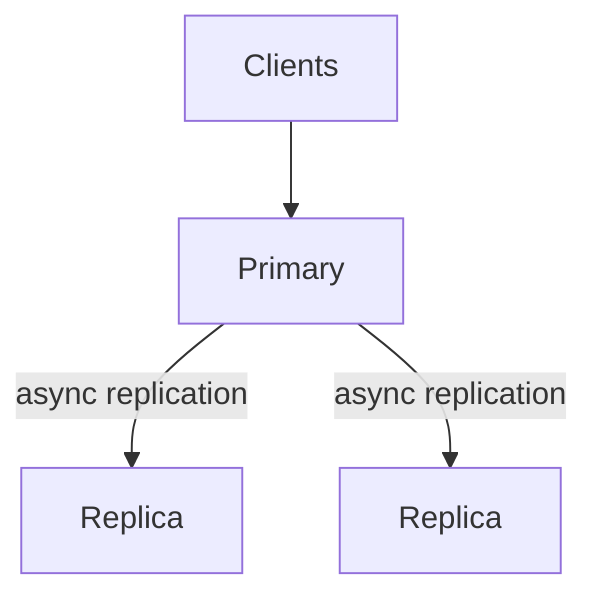

Writes generally go to the primary.

The primary propagates mutations to replicas.

The crucial word is:

> **asynchronously**

That has major consistency consequences.

---

# 8.1 Replication Offsets and Partial Synchronization

Redis tracks replication identity and progress.

Conceptually, a replica reconnecting after a temporary outage says:

```text
I belonged to replication history X
and processed data through offset Y
```

If the primary still has the missing commands in its replication backlog:

```text
send only commands after Y
```

This is a **partial resynchronization**.

Example:

```text
Primary history:

100 101 102 103 104 105 106
        ^
Replica has processed through 102

Primary sends:
103 104 105 106
```

This avoids transmitting the entire dataset.

---

# 8.2 Full Synchronization

If the replica's missing history is no longer present in the replication backlog, Redis must perform a full synchronization.

Conceptually:

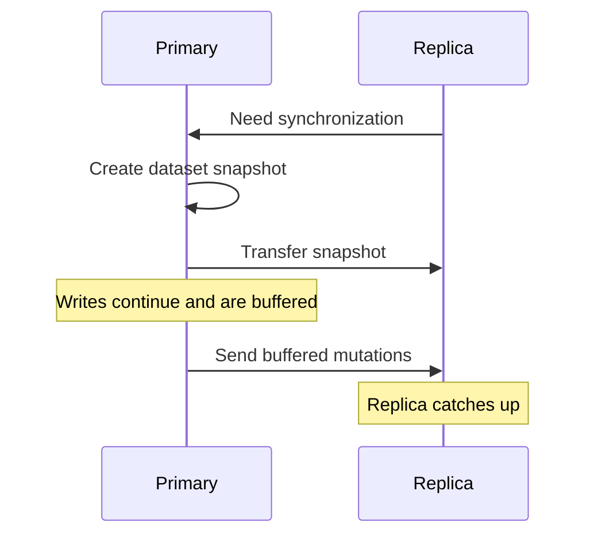

This is significantly more expensive.

It may involve:

- snapshot generation,
- CPU,
- memory,
- network bandwidth,
- replica loading,
- increased recovery time.

Therefore:

> Replication backlog sizing and expected outage duration are related capacity-planning decisions.

---

# 9. Replication Is Not Durability

Consider:

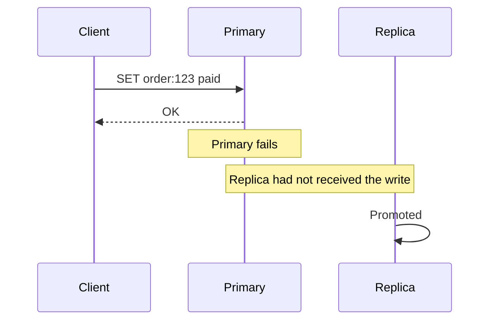

The client observed success.

The newly promoted replica may not contain the write.

Therefore:

> **An acknowledged Redis write can be lost during failover.**

Replication:

```text
reduces the probability of data loss
```

but does not imply:

```text
every acknowledged write is durably committed
```

This is one of the most important Redis interview distinctions.

---

# 9.1 WAIT

Redis provides:

```redis
WAIT 1 100
```

which conceptually means:

> Wait for at least one replica to acknowledge prior writes on this client connection, up to approximately 100 ms.

This reduces the probability that the immediately preceding write disappears during failover.

But:

> `WAIT` does not transform Redis into a linearizable consensus-replicated database.

Useful mental model:

```text
normal async replication
        |
        v
WAIT for replica acknowledgement
        |
        v
smaller practical write-loss window
        |
        X
not equivalent to quorum commit
```

---

# 9.2 Rejecting Writes When Replication Is Unhealthy

Redis can be configured using settings such as:

```text
min-replicas-to-write
min-replicas-max-lag
```

This allows a primary to reject writes when insufficiently healthy replicas exist.

Now the architecture is explicitly trading:

```text
availability
```

for:

```text
lower data-loss risk
```

That is a much stronger way to discuss Redis than simply saying "CAP theorem."

The real design question is:

> Under what failure conditions should the service stop accepting writes rather than risk losing them?

---

# 10. Persistence

Replication and persistence solve different problems.

Replication asks:

> How many live Redis processes currently contain this state?

Persistence asks:

> Can state survive process or machine failure?

Redis supports two major persistence families:

- RDB snapshots,
- AOF.

They can also be combined.

---

# 10.1 RDB

RDB captures point-in-time snapshots.

Conceptually:

```text
---- snapshot ---- writes ---- snapshot ---- writes ---- crash
                                ^
                                latest complete snapshot
```

Advantages:

- compact backup representation,
- good for point-in-time snapshots,
- relatively efficient restore behavior.

Disadvantage:

- changes since the latest snapshot may be lost.

The exact loss window depends on snapshot configuration.

---

# 10.2 AOF

Append Only File records write operations.

Conceptually:

```text
SET x 1
INCR counter
HSET user:42 plan pro
...
```

During recovery, Redis reconstructs state from the operation history.

Trade-offs include:

- additional write I/O,
- larger persistence footprint,
- stronger durability depending on fsync policy,
- AOF rewrite/compaction concerns.

---

# 10.3 Persistence + Replication

Do not reduce the question to:

```text
"Do we have replicas?"
```

A robust production analysis asks:

```text
What happens if the primary process dies?
What happens if the entire host dies?
What happens if an AZ disappears?
What happens if both primary and replica contain corrupt state?
What is our RPO?
What is our RTO?
Can we reconstruct the dataset?
```

If Redis contains only a cache:

```text
RPO may effectively be irrelevant.
```

If Redis contains authoritative financial state:

```text
RPO becomes critical.
```

The storage semantics should follow from the business semantics.

---

# 11. Sentinel

Sentinel provides high availability for a non-sharded Redis deployment.

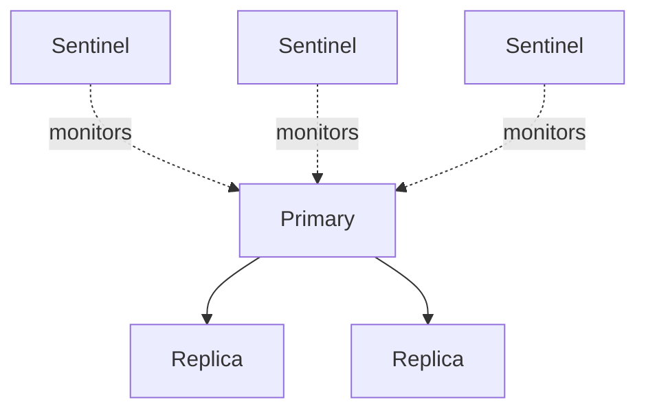

Sentinel is responsible for:

- monitoring,
- failure detection,
- primary discovery,
- failover coordination,
- replica promotion.

It does **not** horizontally partition the dataset.

This distinction matters:

```text
Sentinel
    = high availability

Redis Cluster
    = sharding + high availability
```

---

# 11.1 Subjective vs Objective Failure

In a distributed system:

```text
"I cannot contact node X"
```

does not necessarily mean:

```text
"node X is dead."
```

Your network path may be broken.

Sentinel therefore distinguishes approximately:

```text
SDOWN
    one Sentinel suspects the node is down

ODOWN
    sufficient Sentinel agreement says the node is down
```

This is fundamentally a failure-detection problem under partial information.

Failure detection is suspicion, not omniscience.

---

# 12. Redis Cluster

Redis Cluster horizontally partitions keys.

Instead of:

```text
all keys -> one primary
```

you have:

```text
keys -> hash slots -> primaries
```

Redis Cluster has:

```text
16,384 hash slots
```

A key maps to a slot approximately using:

```text
CRC16(key) mod 16384
```

Architecture:

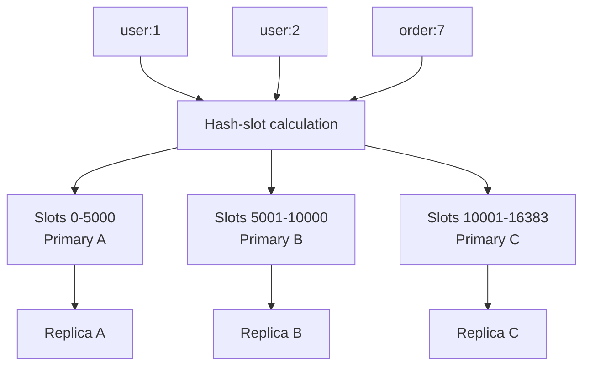

---

# 12.1 Client-Side Routing

Redis Cluster does not require every request to pass through a centralized routing proxy.

Cluster-aware clients learn:

```text
slot range -> node
```

and connect directly to the relevant shard.

If a client sends a request to the wrong node, it can receive a redirection such as:

```text
MOVED
```

During slot migration it may encounter:

```text
ASK
```

Conceptually:

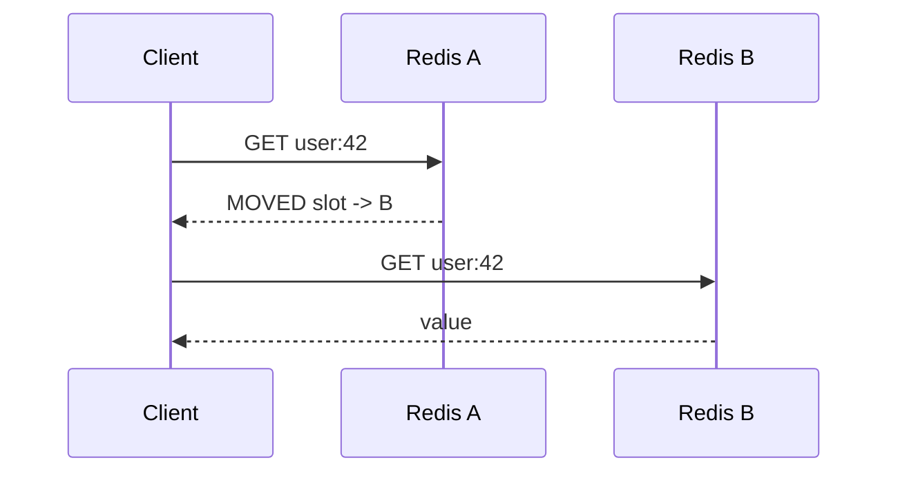

Good Redis clients cache topology information so every operation does not require a redirect.

### Trade-off

Avoiding a central proxy removes a mandatory network hop.

But complexity moves into:

- client libraries,
- routing tables,
- connection pools,
- topology refresh,
- retry logic.

General distributed-systems lesson:

> Removing centralized infrastructure often redistributes complexity instead of eliminating it.

---

# 12.2 Hash Tags

Consider two keys:

```text
user:123:name
user:123:friends
```

They may map to different slots.

Multi-key atomic operations become difficult or impossible if the keys belong to different shards.

Redis provides hash tags:

```text
user:{123}:name
user:{123}:friends
```

The portion inside `{}` determines the hash slot.

Therefore both keys land together.

### Deeper interpretation

A hash tag effectively defines:

> **the locality boundary for atomic multi-key operations.**

That makes key naming part of distributed schema design.

But overusing one hash tag:

```text
{global}:anything
```

forces enormous amounts of data onto one shard and defeats horizontal scaling.

---

# 13. Redis Cluster Failover

Cluster nodes exchange topology and failure information.

Conceptually:

```text
PFAIL
    node is probably failing

FAIL
    cluster has enough evidence to treat it as failed
```

A replica can then participate in a failover election and become the new primary for its master's slots.

High-level flow:


Redis Cluster uses voting and configuration epochs to coordinate failover state.

But this should not be confused with consensus on every user write.

---

# 14. Redis Cluster Is Not Raft

Redis Cluster has distributed coordination mechanisms, but ordinary writes are not typically committed through a synchronous majority consensus protocol.

Compare:

| | Redis Cluster | Raft-style replicated DB |
|---|---|---|
| normal write | primary applies locally | leader proposes entry |
| replication | usually asynchronous | followers replicate |
| client ACK | normally before replica quorum | usually after commit criterion |
| failover data loss | possible | committed entries preserved under model assumptions |
| latency | lower | quorum latency |
| primary design goal | speed + availability + scale | replicated consistency |

That explains much of Redis's behavior.

The right conclusion is not:

> Redis is unsafe.

It is:

> **Redis occupies a different point in the latency/durability/consistency design space.**

---

# 15. Network Partitions

Consider:

```text
majority side                minority side

A  B  C                      D
                              |
                           client X
```

Suppose D is a primary isolated from the majority.

For some period, client X may still communicate with D.

Meanwhile, the majority can determine D is unavailable and promote one of D's replicas.

Eventually there may be:

```text
old D
new promoted D'
```

Recent writes accepted only by D may not exist on D'.

When the partition heals, those writes may disappear from the authoritative cluster state.

This follows directly from asynchronous replication.

Therefore:

> **Redis Cluster does not provide a guarantee that every acknowledged write survives partition + failover.**

---

# 16. Memory Is Often the Real Bottleneck

Redis memory usage is more than:

```text
sum(value sizes)
```

Memory can include:

- key metadata,
- object metadata,
- hash-table structures,
- pointers,
- allocator overhead,
- TTL metadata,
- client buffers,
- replication backlog,
- replication buffers,
- fragmentation,
- persistence-related overhead.

Therefore:

```text
60 GB logical dataset
```

does not mean:

```text
64 GB host is safe
```

Capacity planning should examine real production metrics such as:

```text
used_memory
used_memory_rss
fragmentation
peak usage
client buffer sizes
replication buffer sizes
```

rather than only raw payload estimates.

---

# 17. Big Keys

A "big key" can mean:

```text
String with a huge value
```

or:

```text
Hash/Set/List/ZSet with enormous cardinality
```

Potential consequences:

- long command execution,
- expensive deletion,
- large network responses,
- replication amplification,
- resharding overhead,
- persistence overhead.

Example:

```redis
SMEMBERS users
```

is perfectly reasonable if `users` contains 20 elements.

It is operationally dangerous if it contains 50 million.

Again:

> **Boundedness matters more than command names.**

---

# 18. Distributed Locks

A common lock primitive is:

```redis
SET lock:order123 random-token NX PX 30000
```

Properties:

- `NX`: acquire only if no lock exists.
- `PX`: lease automatically expires.
- unique token: identifies the lock holder.

Release should verify the token before deletion.

Why?

Consider:

```text
A acquires lock
A pauses

lock expires

B acquires lock

A resumes
A DEL lock
```

If A blindly deletes the key, it deletes B's lock.

Conditional deletion avoids that bug.

---

# 18.1 Locks Are Leases

Even with correct token-based deletion:

```text
A acquires 30-second lease
A pauses for 60 seconds
lease expires

B acquires lease
B changes protected resource

A resumes
A changes protected resource
```

A's process may still *believe* it owns the lock.

Therefore:

> A distributed Redis lock is fundamentally a **lease**.

For correctness-critical resources, consider fencing tokens.

Example:

```text
A -> fencing token 51
B -> fencing token 52
```

The protected resource rejects operations using an older token:

```text
token 51 < latest accepted token 52
=> reject
```

This protects against stale lock holders.

### Interview heuristic

Redis locks are often reasonable for:

- duplicate work suppression,
- best-effort coordination,
- efficiency optimizations.

Be more cautious when lock failure could cause:

- financial corruption,
- double execution of irreversible effects,
- unsafe physical behavior,
- conflicting ownership of critical resources.

---

# 19. Rate Limiting

Redis is a natural rate-limit store because many API servers can coordinate against shared state.

There are several common algorithms.

## 19.1 Fixed Window

Example:

```text
rate:user123:2026-08-19T10:03
```

Each request:

```redis
INCR key
EXPIRE key 60
```

Advantages:

- cheap,
- simple,
- low memory.

Problem:

```text
100 requests at 12:00:59
100 requests at 12:01:00
```

A nominal 100/minute limit permits 200 requests in roughly one second.

---

# 19.2 Sliding Window Log

Use a Sorted Set.

```text
score  = timestamp
member = request ID
```

Per request:

```text
remove entries older than window
insert current request
count entries
```

Perform the sequence atomically with a Lua script or Redis Function when necessary.

Advantages:

- accurate sliding semantics.

Disadvantages:

- memory approximately proportional to requests in the active window.

---

# 19.3 Token Bucket

Maintain:

```text
current token count
last refill time
```

Request algorithm:

```text
calculate elapsed time
refill tokens
if enough tokens:
    decrement
    allow
else:
    deny
```

Use atomic server-side execution.

Token bucket is often preferable when you want:

- bounded average rate,
- controlled bursts.

---

# 20. Queue Selection

Use the queue primitive that matches the required semantics.

| Requirement | Redis mechanism |
|---|---|
| simple queue | List |
| blocking dequeue | `BLPOP` / `BRPOP` |
| replay | Stream |
| consumer groups | Stream |
| acknowledgements | Stream |
| pending messages | Stream |
| failed-consumer recovery | Stream |
| transient fan-out | Pub/Sub |
| disconnected consumers catch up | not Pub/Sub |

This choice should be explicit in a system-design interview.

---

# 21. Example: Reliable Worker Queue

Naive design:

```redis
LPUSH jobs job123
BRPOP jobs
```

Failure:

```text
worker receives job
worker crashes before processing
job is gone
```

Streams provide stronger queue semantics:

```text
XADD
XREADGROUP
process
XACK
```

If a worker disappears:

```text
entry remains pending
```

another consumer can claim it.

But then the system becomes at-least-once.

Therefore:

```text
message recovery
        |
        v
possible duplicate processing
        |
        v
idempotent business handler required
```

That final step is the important system-design reasoning.

---

# 22. Example: Leaderboard

Requirements:

```text
increment player's score
find player's rank
return top 100
```

Sorted Set maps almost perfectly.

```redis
ZINCRBY leaderboard 100 user42
ZREVRANK leaderboard user42
ZRANGE leaderboard 0 99 REV WITHSCORES
```

A junior-level answer might stop there.

A stronger answer asks:

```text
How many players?
Is the leaderboard global?
Can one ZSET become a hot key?
Can we partition by region or season?
How often is top-100 requested?
Could we cache top-100 locally?
Do we need historical results?
Is Redis the source of truth?
```

The transition from:

```text
"ZSET solves leaderboards"
```

to:

```text
"What are the scale, authority, and partition boundaries?"
```

is the Staff+ move.

---

# 23. Example: URL Shortener

Bad answer:

> Use Redis because Redis is fast.

Better architecture:

```text
Durable database:
    short_code -> destination
    authoritative record

Redis:
    short_code -> destination
    cache
```

Read path:

```text
GET abc123 from Redis

hit:
    return URL

miss:
    query durable DB
    populate Redis
    return URL
```

Then discuss:

- TTL,
- negative caching,
- hot URLs,
- cache hit ratio,
- cache outage fallback,
- cache stampede protection.

Now Redis has a specific role with explicit failure semantics.

---

# 24. Example: Session Storage

Redis is commonly used for application sessions.

Example:

```text
session:<token> -> session state
TTL             -> session expiration
```

Questions to ask:

- Is losing a session acceptable?
- Is logout implemented by deleting the key?
- How are session tokens generated?
- Does Redis store sensitive information?
- Is encryption needed?
- What happens during Redis failover?
- Should users be forced to re-authenticate if Redis disappears?

This illustrates a general lesson:

> Whether Redis needs strong durability depends on the consequences of losing the state.

Losing a session may be annoying.

Losing a payment record is very different.

---

# 25. Example: Nearby Drivers

Possible architecture:

```text
Driver app
    |
    v
location ingest service
    |
    +----> Redis GEO index
    |
    +----> durable event/storage pipeline
```

Redis supports:

```text
fast changing proximity index
```

while durable infrastructure stores historical or authoritative state.

The interview reasoning should include:

- location update frequency,
- stale-driver expiration,
- geographic partitioning,
- hotspot cities,
- location precision,
- Redis memory requirements,
- failure fallback.

---

# 26. Redis Cluster and Multi-Key Operations

One of the most important implications of Cluster is:

> Your data model now has a physical partition boundary.

Suppose a transaction needs:

```text
account:123
account:456
```

If those keys map to different slots, you cannot treat the cluster like a single-node Redis instance for arbitrary atomic multi-key logic.

This forces architectural choices:

```text
co-locate keys
```

or:

```text
redesign workflow
```

or:

```text
move invariant to another system
```

This is a broader distributed-systems principle:

> **Sharding makes cross-partition invariants expensive.**

Redis simply makes that constraint visible.

---

# 27. Hot Shards

Hot keys are not the only skew problem.

Suppose many unrelated high-traffic keys coincidentally map to the same shard.

Then:

```text
cluster total utilization: 35%
```

may hide:

```text
Shard A: 95%
Shard B: 20%
Shard C: 15%
```

Cluster averages are therefore insufficient.

Production monitoring should include:

```text
per-node CPU
per-node memory
per-node network
per-node operations/sec
per-node latency
```

General principle:

> **Distributed averages hide local saturation.**

---

# 28. Eviction Storms

Suppose your working set is larger than available Redis memory.

Redis repeatedly performs:

```text
evict
cache miss
reload from DB
evict
cache miss
reload from DB
```

The cluster may remain technically healthy.

But the downstream database is now under constant load.

This can create a positive feedback loop:

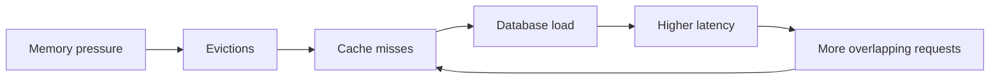

Therefore an eviction rate is not merely a Redis metric.

It can be an early indicator of downstream instability.

---

# 29. Synchronized Expiration

Suppose millions of keys receive:

```text
EXPIREAT midnight
```

At midnight:

- many keys expire,
- cache miss volume rises,
- downstream dependencies receive a spike.

TTL jitter can spread expiration:

```text
base TTL ± random offset
```

when exact expiration timing is not semantically important.

---

# 30. Backpressure with Streams

Suppose:

```text
producer throughput = 100k events/sec
consumer throughput = 60k events/sec
```

Redis Streams will not solve the capacity mismatch.

The queue grows.

Questions to monitor include:

```text
stream length
consumer lag
pending count
oldest pending message age
delivery-attempt count
```

The critical system-level question is:

> What happens when producers permanently outpace consumers?

Possible answers:

- scale consumers,
- throttle producers,
- drop low-value events,
- spool elsewhere,
- apply quotas,
- reject writes,
- provision more capacity.

A queue is not a replacement for backpressure policy.

---

# 31. Operations to Treat Carefully

Examples:

```redis
KEYS *
SMEMBERS giant-set
HGETALL giant-hash
LRANGE huge-list 0 -1
```

Also scrutinize:

- huge set intersections,
- enormous Lua scripts,
- synchronous deletion of giant objects,
- commands producing massive responses.

Prefer incremental approaches such as:

```redis
SCAN
SSCAN
HSCAN
ZSCAN
```

when full materialization is not required.

The general rule:

> Every production Redis operation should have a reasonably understood upper bound.

---

# 32. Observability

Useful metrics include:

```text
latency percentiles
operations/sec
CPU
memory
RSS
fragmentation
cache hit ratio
evictions
expired keys
connected clients
blocked clients
network throughput
replication lag
replica state
slow commands
per-shard utilization
cluster health
```

For Streams:

```text
stream length
consumer lag
pending messages
oldest pending age
consumer activity
redelivery count
```

Useful Redis tooling includes:

```text
INFO
SLOWLOG
latency monitoring
MEMORY-related commands
cluster status
```

---

# 33. What Happens When Redis Disappears?

Every Redis design should answer this.

## Redis is only a cache

Possible behavior:

```text
Redis unavailable
       |
       v
fallback to database
```

But uncontrolled fallback may overload the database.

Therefore cache-outage behavior may require:

- request throttling,
- local caching,
- circuit breakers,
- stale data,
- request coalescing.

---

## Redis is the rate limiter

You must choose:

```text
fail open
```

or:

```text
fail closed
```

Examples:

Security-sensitive login endpoint:

```text
fail closed may be safer
```

Low-risk recommendation API:

```text
fail open may preserve availability
```

This is a business decision, not a Redis decision.

---

## Redis is the job queue

Failure means:

- producers may not enqueue,
- consumers may not read,
- pending work may stop progressing.

Now persistence and recovery objectives matter substantially.

---

## Redis contains authoritative business state

You now need explicit answers for:

```text
persistence
replication
backup
restore
write-loss tolerance
RPO
RTO
failover semantics
```

At that point, reconsider whether Redis should actually be the authoritative store.

---

# 34. Staff+ Architecture Review Questions

## Semantics

> What exact invariant is Redis enforcing?

Is it:

- correctness-critical,
- advisory,
- an optimization?

---

## Authority

> Can every Redis value be reconstructed?

If yes, failure recovery is much simpler.

---

## Atomicity

> Which operations must happen atomically?

Do native Redis commands already express the operation?

---

## Atomicity locality

> Which keys must participate in the same atomic operation?

Will Redis Cluster place them in one slot?

---

## Partitioning

> What determines the hash slot?

Can the chosen key create hot partitions?

---

## Boundedness

> What is the maximum number of elements any critical-path command can touch?

If nobody knows, the design is incomplete.

---

## Failure semantics

> Can an acknowledged write disappear after failover?

If yes, does the business tolerate that?

---

## Degradation

> What does the application do during Redis unavailability?

Fail open?

Fail closed?

Fallback?

Return stale data?

---

## Memory

> What happens at `maxmemory`?

Do we:

- evict,
- reject writes,
- page someone,
- degrade gracefully?

---

## Backpressure

> If consumers become slower than producers, what resource grows?

Queue depth?

Memory?

Pending entries?

Downstream latency?

---

## Recovery

> What happens after losing the entire cache?

Can the underlying datastore withstand cold-cache traffic?

---

## Organizational coupling

> How many services share this Redis deployment?

A shared Redis cluster can create coupling through:

- CPU contention,
- memory pressure,
- eviction policy,
- maintenance windows,
- hot keys,
- failure blast radius.

Sometimes the more important boundary is not technical partitioning but **ownership isolation**.

---

# 35. Interview Anti-Patterns

## "Redis is fast because it's in memory."

Incomplete.

Better:

> Redis combines in-memory data access with optimized native structures, serialized command execution, efficient networking, and pipelining. Command complexity and network RTT still matter.

---

## "Redis Cluster gives strong consistency."

Incorrect.

Ordinary Redis Cluster replication is asynchronous.

Recent acknowledged writes can be lost during failover.

---

## "We have replicas, therefore the data is durable."

Replication and persistence address different failure modes.

---

## "We'll use Pub/Sub for reliable jobs."

Incorrect when missed messages are unacceptable.

Use Streams or another durable messaging system.

---

## "We can fix it by adding shards."

Not necessarily.

Shards do not automatically solve:

- hot keys,
- skew,
- cross-shard invariants.

---

## "Redis commands are atomic, so my workflow is atomic."

Incorrect.

```text
GET
business logic
SET
```

is multiple commands.

Use:

- atomic primitives,
- transactions,
- scripting,
- or redesign the invariant.

---

## "We'll put a distributed lock around it."

Follow immediately with:

> What happens if the lock holder pauses longer than the lease?

If that question threatens correctness, investigate fencing tokens or a stronger coordination mechanism.

---

# 36. Redis Decision Tree

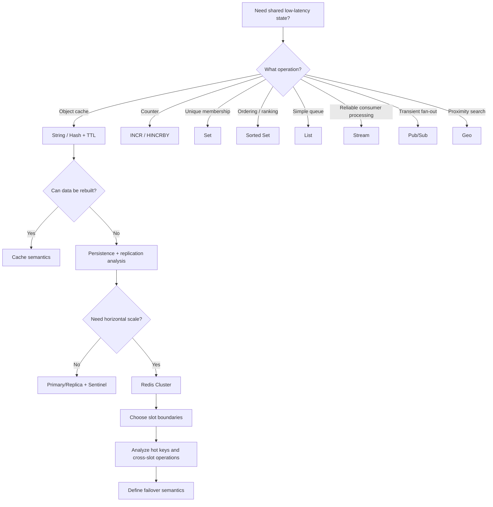

---

# 37. Practical Design Heuristics

1. **Choose the data structure from the operation, not the entity.**

   "Leaderboard" naturally suggests ordering by score.

   "User" does not automatically imply Hash.

2. **Push small atomic state transitions into Redis.**

   Prefer:

   ```redis
   INCR
   ZINCRBY
   SET NX
   ```

   over application-side read-modify-write.

3. **Keep critical commands bounded.**

   Unbounded collection operations are production risks.

4. **Treat key naming as partition design in Redis Cluster.**

5. **Analyze skew before adding shards.**

   Hot keys often dominate system behavior.

6. **Separate reconstructable cache state from authoritative state.**

7. **Assume asynchronous replication can lose recent acknowledged writes.**

8. **Design idempotency together with at-least-once messaging.**

9. **Define fail-open/fail-closed behavior before production.**

10. **Monitor individual shards, not only cluster aggregates.**

11. **Treat queues as backpressure boundaries, not infinite buffers.**

12. **Define Redis's blast radius.**

    Shared infrastructure can couple otherwise independent services.

---

# 38. Key Takeaways

Redis's strongest idea is:

> **server-side data structures with atomic operations**

rather than simply:

> "data stored in RAM."

The deployment progression is:

```text
Standalone Redis
    |
    v
single-node data-structure server

Primary + replicas
    |
    v
asynchronously replicated copies

Sentinel
    |
    v
automatic failover without sharding

Redis Cluster
    |
    v
16,384 hash slots
+ sharding
+ replication
+ failover
```

The consistency progression is:

```text
individual command
    |
    v
atomic on one Redis node

asynchronous replication
    |
    v
replica can lag

failover
    |
    v
recent acknowledged writes may disappear

WAIT / replica-health constraints
    |
    v
reduce practical data-loss risk

but

Redis Cluster != consensus-committed database
```

And the system-design reasoning chain is:

```text
business requirement
        |
        v
required invariant
        |
        v
Redis structure / command
        |
        v
atomicity boundary
        |
        v
partition boundary
        |
        v
hot-key / skew analysis
        |
        v
failure semantics
        |
        v
memory and backpressure
        |
        v
observability and recovery
```

If you can reason through those layers in an interview or architecture review, you are demonstrating more than knowledge of Redis commands.

You are showing that you understand:

- where Redis's guarantees come from,
- where those guarantees stop,
- which invariants Redis can express cleanly,
- how Redis fails,
- how sharding changes your data model,
- and how Redis interacts with the rest of a distributed system.

---

# Further Reading

Primary sources worth studying:

- Redis data types documentation
- Redis Cluster specification
- Redis replication documentation
- Redis Sentinel documentation
- Redis persistence documentation
- Redis Streams documentation
- Redis Pub/Sub documentation
- Redis transactions documentation
- Redis programmability / Functions documentation
- Redis eviction documentation
- Redis latency optimization documentation
- Redis distributed locking documentation

For distributed locking specifically, also read Martin Kleppmann's analysis of distributed locks and fencing tokens alongside Redis's own documentation.

---

# Interview Review Checklist

- [ ] Can I explain why Redis is fast beyond "it's in memory"?
- [ ] Can I distinguish String, Hash, List, Set, Sorted Set, Stream, and Pub/Sub use cases?
- [ ] Can I explain when Streams are preferable to Lists?
- [ ] Can I explain why Pub/Sub is not a reliable queue?
- [ ] Can I describe Redis cache-aside and its invalidation races?
- [ ] Can I explain cache stampede mitigation?
- [ ] Can I explain hot keys and why adding shards may not help?
- [ ] Can I explain individual-command atomicity versus multi-command races?
- [ ] Can I explain `MULTI`/`EXEC`, `WATCH`, and Lua/Functions at a high level?
- [ ] Can I distinguish replication from persistence?
- [ ] Can I explain partial versus full replica synchronization?
- [ ] Can I explain why asynchronous replication can lose acknowledged writes?
- [ ] Can I explain what `WAIT` improves and what it does not guarantee?
- [ ] Can I distinguish Sentinel from Redis Cluster?
- [ ] Can I explain Redis Cluster's 16,384 hash slots?
- [ ] Can I explain `MOVED`, client-side routing, and hash tags?
- [ ] Can I explain why multi-key operations become harder across slots?
- [ ] Can I reason about network partitions and failover?
- [ ] Can I explain why Redis Cluster is not equivalent to Raft?
- [ ] Can I discuss RDB versus AOF?
- [ ] Can I identify big-key and eviction risks?
- [ ] Can I explain Redis-based rate limiting?
- [ ] Can I explain the lease problem with distributed locks?
- [ ] Can I discuss fencing tokens?
- [ ] Can I explain what happens if Redis is unavailable?
- [ ] Can I identify the source of truth for every important piece of Redis-backed state?