- [[#Executive summary|Executive summary]]
- [[#1. Context and problem framing|1. Context and problem framing]]
- [[#2. The right mental model: SQS as a durable lease system|2. The right mental model: SQS as a durable lease system]]
- [[#3. Delivery semantics|3. Delivery semantics]]
	- [[#3.1 Standard queues|3.1 Standard queues]]
	- [[#3.2 FIFO queues|3.2 FIFO queues]]
		- [[#`MessageGroupId`|`MessageGroupId`]]
		- [[#`MessageDeduplicationId`|`MessageDeduplicationId`]]
- [[#4. “Exactly once” needs careful interpretation|4. “Exactly once” needs careful interpretation]]
- [[#5. Designing idempotent consumers|5. Designing idempotent consumers]]
	- [[#5.1 Natural idempotency|5.1 Natural idempotency]]
	- [[#5.2 Explicit idempotency key|5.2 Explicit idempotency key]]
	- [[#5.3 Use domain identity when possible|5.3 Use domain identity when possible]]
- [[#6. The producer-side dual-write problem|6. The producer-side dual-write problem]]
		- [[#Database succeeds, queue send fails|Database succeeds, queue send fails]]
		- [[#Queue send succeeds, database rolls back|Queue send succeeds, database rolls back]]
- [[#7. Visibility timeout as a distributed lease|7. Visibility timeout as a distributed lease]]
	- [[#7.1 Too short|7.1 Too short]]
	- [[#7.2 Too long|7.2 Too long]]
	- [[#7.3 Adaptive visibility / heartbeat|7.3 Adaptive visibility / heartbeat]]
- [[#8. FIFO ordering and head-of-line blocking|8. FIFO ordering and head-of-line blocking]]
- [[#9. Choosing the FIFO message group key|9. Choosing the FIFO message group key]]
- [[#10. Standard fair queues|10. Standard fair queues]]
- [[#11. Retry architecture|11. Retry architecture]]
	- [[#11.1 Transient|11.1 Transient]]
	- [[#11.2 Persistent but potentially recoverable|11.2 Persistent but potentially recoverable]]
	- [[#11.3 Permanent / poison message|11.3 Permanent / poison message]]
- [[#12. Dead-letter queues|12. Dead-letter queues]]
	- [[#12.1 `maxReceiveCount` is a policy decision|12.1 `maxReceiveCount` is a policy decision]]
- [[#13. DLQ redrive is a production operation|13. DLQ redrive is a production operation]]
- [[#14. Long polling|14. Long polling]]
- [[#15. Batching|15. Batching]]
- [[#16. Lambda + SQS|16. Lambda + SQS]]
- [[#17. Partial batch responses|17. Partial batch responses]]
- [[#18. Backpressure and queueing theory|18. Backpressure and queueing theory]]
- [[#19. Queue age is often more meaningful than depth|19. Queue age is often more meaningful than depth]]
		- [[#Queue A|Queue A]]
		- [[#Queue B|Queue B]]
- [[#20. Key CloudWatch signals|20. Key CloudWatch signals]]
- [[#21. Autoscaling consumers|21. Autoscaling consumers]]
- [[#22. In-flight messages are a separate resource|22. In-flight messages are a separate resource]]
- [[#23. Throughput characteristics|23. Throughput characteristics]]
	- [[#Standard|Standard]]
	- [[#FIFO|FIFO]]
- [[#24. Payload sizing|24. Payload sizing]]
- [[#25. Message retention and delay|25. Message retention and delay]]
	- [[#Delay queues|Delay queues]]
- [[#26. Cost model|26. Cost model]]
- [[#27. Security model|27. Security model]]
	- [[#27.1 Identity|27.1 Identity]]
	- [[#27.2 Transport|27.2 Transport]]
	- [[#27.3 Network|27.3 Network]]
	- [[#27.4 Data at rest|27.4 Data at rest]]
- [[#28. Schema evolution|28. Schema evolution]]
- [[#29. Queue topology|29. Queue topology]]
	- [[#One queue per workload|One queue per workload]]
	- [[#One shared queue|One shared queue]]
- [[#30. SQS vs pub/sub|30. SQS vs pub/sub]]
- [[#31. Failure-mode analysis|31. Failure-mode analysis]]
- [[#32. Common architectural mistakes|32. Common architectural mistakes]]
	- [[#Mistake 1 — Treating receive as acknowledgement|Mistake 1 — Treating receive as acknowledgement]]
	- [[#Mistake 2 — Assuming FIFO means no idempotency|Mistake 2 — Assuming FIFO means no idempotency]]
	- [[#Mistake 3 — Global FIFO group|Mistake 3 — Global FIFO group]]
	- [[#Mistake 4 — Scaling only on queue depth|Mistake 4 — Scaling only on queue depth]]
	- [[#Mistake 5 — Unlimited consumer scaling|Mistake 5 — Unlimited consumer scaling]]
	- [[#Mistake 6 — Treating the DLQ as archival storage|Mistake 6 — Treating the DLQ as archival storage]]
	- [[#Mistake 7 — Replaying blindly|Mistake 7 — Replaying blindly]]
	- [[#Mistake 8 — Retry at every layer|Mistake 8 — Retry at every layer]]
- [[#33. Migration and evolution|33. Migration and evolution]]
- [[#34. Architecture-review framework|34. Architecture-review framework]]
	- [[#34.1 Delivery|34.1 Delivery]]
	- [[#34.2 Ordering|34.2 Ordering]]
	- [[#34.3 Capacity|34.3 Capacity]]
	- [[#34.4 Retries|34.4 Retries]]
	- [[#34.5 Recovery|34.5 Recovery]]
	- [[#34.6 Operability|34.6 Operability]]
	- [[#34.7 Security|34.7 Security]]
- [[#35. Staff+ perspective|35. Staff+ perspective]]
- [[#36. Practical design heuristics|36. Practical design heuristics]]
- [[#37. Interview / system-design reasoning pattern|37. Interview / system-design reasoning pattern]]
		- [[#Step 1 — State why asynchronous messaging is needed|Step 1 — State why asynchronous messaging is needed]]
		- [[#Step 2 — Choose delivery semantics|Step 2 — Choose delivery semantics]]
		- [[#Step 3 — Define idempotency|Step 3 — Define idempotency]]
		- [[#Step 4 — Establish concurrency control|Step 4 — Establish concurrency control]]
		- [[#Step 5 — Define lease behavior|Step 5 — Define lease behavior]]
		- [[#Step 6 — Define poison-message handling|Step 6 — Define poison-message handling]]
		- [[#Step 7 — Explain observability|Step 7 — Explain observability]]
- [[#38. Representative design: asynchronous order fulfillment|38. Representative design: asynchronous order fulfillment]]
		- [[#Invariants|Invariants]]
		- [[#Mechanisms|Mechanisms]]
- [[#39. SQS configuration limits worth remembering|39. SQS configuration limits worth remembering]]
- [[#40. Internal architecture|40. Internal architecture]]
	- [[#40.1 Distributed, multi-AZ storage|40.1 Distributed, multi-AZ storage]]
	- [[#40.2 Service-side microservices|40.2 Service-side microservices]]
	- [[#40.3 FIFO partitioning|40.3 FIFO partitioning]]
	- [[#40.4 How the architecture produces the semantics|40.4 How the architecture produces the semantics]]
- [[#41. Key takeaways|41. Key takeaways]]
- [[#42. Further questions|42. Further questions]]
- [[#43. Source notes|43. Source notes]]
- [[#44. Related notes|44. Related notes]]

---

## Executive summary

Amazon Simple Queue Service (SQS) is a managed, pull-based message queue designed primarily for **temporal decoupling, load leveling, asynchronous execution, and failure isolation**.

The most useful mental model is not “SQS delivers events.” It is:

> **SQS owns durable work items while consumers temporarily lease those items for processing.**

A successful `ReceiveMessage` does not remove a message. It creates a temporary lease through the **visibility timeout**. Successful processing must eventually be followed by `DeleteMessage`. If the consumer disappears before deletion, the lease expires and the work becomes eligible for another attempt.

This produces several architectural consequences:

- **Standard queues are at-least-once and best-effort ordered.** Consumers must tolerate duplicates and reordering. Standard queues provide extremely high throughput and are the default choice when strict ordering is unnecessary.
- **FIFO queues add ordered message groups and producer-side deduplication**, but they do not magically make arbitrary downstream side effects exactly-once. Visibility expiry and consumer crashes can still result in repeated processing attempts.
- **Visibility timeout is a distributed lease**, not a lock. Too short creates duplicate concurrent work; too long slows recovery.
- **Idempotency belongs in the application.** Queue semantics cannot atomically couple message acknowledgement with an arbitrary database, API, or external side effect.
- **FIFO parallelism is bounded by active message groups**, not merely by consumer count.
- **Standard fair queues** can use `MessageGroupId` as a tenant identifier to reduce noisy-neighbor dwell-time impact without introducing FIFO ordering.
- **Backlog age usually matters more than backlog size.** Queue depth without arrival rate, processing rate, and age is often operationally ambiguous.
- **DLQs are diagnostic isolation mechanisms, not error handling by themselves.** Redrive must be deliberate, observable, rate-controlled, and safe against repeated side effects.
- The strongest SQS designs explicitly define:
    1. processing invariants,
    2. idempotency boundaries,
    3. retry ownership,
    4. poison-message behavior,
    5. concurrency limits,
    6. overload behavior,
    7. recovery procedures.

---

# 1. Context and problem framing

A synchronous architecture directly couples the availability and latency of producer and consumer:

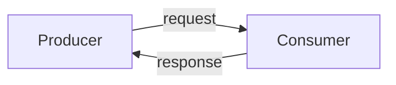

If the consumer slows down:

- producer latency increases,
- producer threads/connections accumulate,
- retries amplify traffic,
- failures propagate upstream,
- transient overload can become a cascading failure.
    

SQS inserts a durable asynchronous boundary:

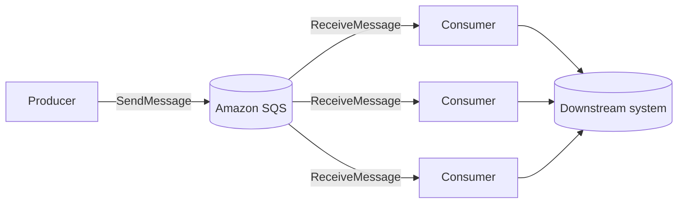

The producer now depends primarily on **SQS availability**, rather than immediate consumer availability.

The queue does **not**, however, eliminate overload. It converts overload into stored work.

> [!important]  
> A queue increases the amount of overload a system can _survive_. It does not increase the amount of work downstream infrastructure can sustainably _perform_.

---

# 2. The right mental model: SQS as a durable lease system

Consider one message:

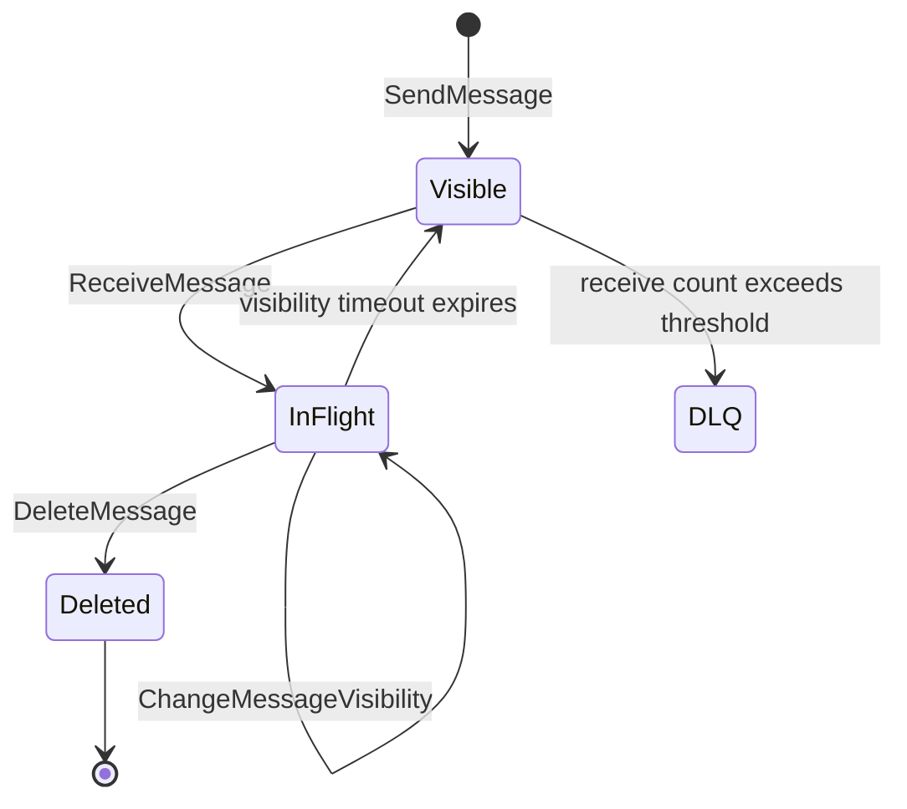

A message broadly moves through three relevant states:

|State|Meaning|
|---|---|
|Visible|Eligible to be returned to a consumer|
|In flight|Received but not yet deleted; temporarily invisible|
|Deleted|Processing acknowledged and queue copy removed|

There is also a distinct **delayed** state for messages intentionally hidden before their first delivery.

When a consumer receives a message, SQS returns a **receipt handle**. Deleting the message requires the receipt handle associated with its latest receive attempt; receiving the same message again can produce a different receipt handle.

The critical invariant is:

> **Receive is not acknowledgement. Delete is acknowledgement.**

This is why the following implementation is unsafe:

```text
receive
delete
perform business operation
```

A crash between delete and the business operation loses the work.

The normal sequencing is:

```text
receive
perform business operation
delete
```

But this creates the opposite failure window:

```text
receive
perform business operation successfully
crash before delete
message becomes visible again
perform business operation again
```

Therefore:

> **At-least-once messaging implies that the business operation itself should generally be idempotent.**

---

# 3. Delivery semantics

## 3.1 Standard queues

Standard queues provide:

- at-least-once delivery,
- best-effort ordering,
- very high throughput,
- redundant message storage across Availability Zones.
    

Conceptually:

```text
Produced:
A B C D E

Possible delivery:
A B C C E D
```

Your application must tolerate:

1. duplicates,
2. reordering,
3. retry after consumer failure.
    

The correct question is therefore not:

> “Will SQS send this twice?”

It is:

> “If this work executes twice or out of order, which invariant could be violated?”

---

## 3.2 FIFO queues

FIFO queues add two major primitives:

### `MessageGroupId`

Messages in the same group are processed in order.

```text
customer-42:
A1 -> A2 -> A3

customer-99:
B1 -> B2 -> B3
```

The groups can proceed concurrently:

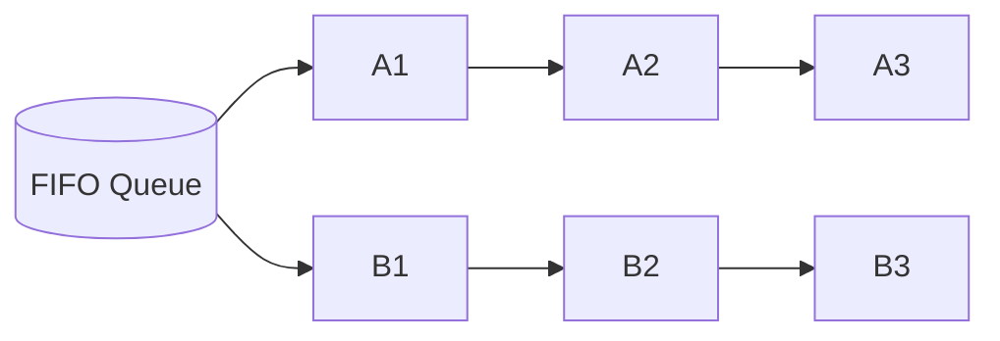

Messages from one group cannot simply be parallelized arbitrarily without violating ordering. Different groups provide the concurrency dimension.

### `MessageDeduplicationId`

FIFO queues track deduplication IDs for a five-minute interval. A repeated send with the same deduplication ID during that window is accepted but does not introduce another deliverable copy. SQS continues tracking that ID even if the first message has already been received and deleted.

Content-based deduplication can derive the ID from a SHA-256 hash of the **message body**; message attributes are not included.

---

# 4. “Exactly once” needs careful interpretation

AWS describes FIFO queues as supporting “exactly-once processing.”

Architecturally, this phrase should be interpreted narrowly.

FIFO solves an important producer problem:

```text
Producer -> SendMessage
          <- acknowledgement lost

Producer cannot know:
"Did SQS accept the message?"
```

With a stable `MessageDeduplicationId`, the producer can retry within the five-minute deduplication interval without inserting another logical message.

But consider the consumer:

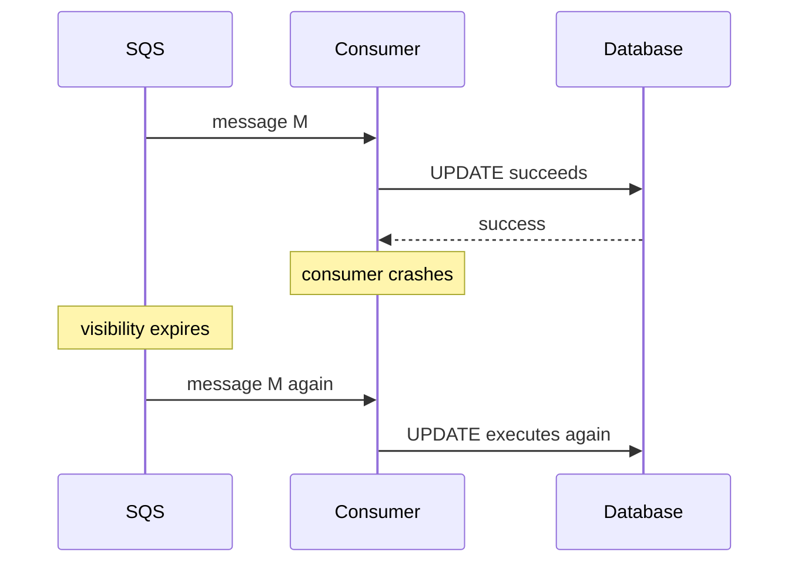

SQS cannot atomically commit:

```text
your database transaction
+
DeleteMessage
```

So end-to-end exactly-once side effects require an application protocol.

> [!warning]  
> **FIFO removes an important source of duplicates. It does not eliminate every way a business operation can execute multiple times.**

AWS documentation explicitly notes that if a consumer does not complete processing before visibility expires, another consumer can receive and process the message.

---

# 5. Designing idempotent consumers

Assume:

$\text{process}(M)$ may execute  $N \ge 1 \text{ times}$

The system should preserve:

$$
f(f(S, M), M) = f(S, M)
$$
where:

- $S$ is system state,
- $M$ is the logical message.
## 5.1 Natural idempotency

Some operations are naturally idempotent:

```sql
UPDATE users
SET desired_state = 'ACTIVE'
WHERE id = :user_id;
```

Repeated execution converges to the same state.

Compare with:

```sql
UPDATE accounts
SET balance = balance - 100
WHERE id = :account_id;
```

The second operation is not naturally idempotent.

---

## 5.2 Explicit idempotency key

A common pattern:

```text
message:
{
  operation_id: "payment-493829",
  ...
}
```

Consumer transaction:

```text
BEGIN

if operation_id exists in processed_operations:
    COMMIT
    return success

perform business mutation

insert operation_id into processed_operations

COMMIT

DeleteMessage
```

If the process crashes after commit but before `DeleteMessage`, the next attempt sees the idempotency record and safely acknowledges the message.

The important boundary is that:

```text
business mutation
+
idempotency marker
```

must be atomically committed.

---

## 5.3 Use domain identity when possible

Avoid deriving idempotency from the SQS receipt handle.

Receipt handles represent receive attempts.

Prefer domain identifiers:

- payment ID,
- command ID,
- order-event ID,
- workflow-step ID,
- source event ID.

This lets idempotency survive:

- redrive,
- republishing,
- queue migration,
- producer retries,
- replay tooling.

---

# 6. The producer-side dual-write problem

Suppose an order service performs:

```text
1. INSERT order
2. SendMessage(order-created)
```

Two failure windows exist.

### Database succeeds, queue send fails

```text
DB = contains order
SQS = no message
```

### Queue send succeeds, database rolls back

```text
DB = no order
SQS = order-created
```

Retries alone cannot make two independent systems atomic.

A typical solution is the [[Transactional Outbox Pattern]]:

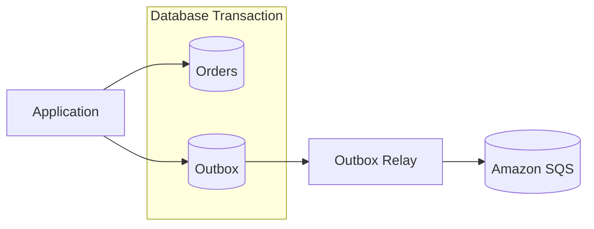

Transaction:

```text
BEGIN
write business state
write outbox record
COMMIT
```

A relay later publishes the outbox record.

AWS Prescriptive Guidance similarly recommends the transactional outbox when a database mutation and message publication must behave atomically, while still recommending idempotent downstream consumers because publication itself may be repeated.

The broader principle:

> **Do not attempt distributed atomicity with optimistic sequencing and retries when a recoverable local transaction plus asynchronous relay will suffice.**

---

# 7. Visibility timeout as a distributed lease

Visibility timeout starts when the consumer receives a message.

The queue-wide default is 30 seconds, and the timeout can be modified per received message using `ChangeMessageVisibility`. The maximum visibility duration is 12 hours from the original receive; extending the lease does not reset that 12-hour bound.

Timeline:

```text
t=0        Receive M
           |
           | hidden from normal receive
           |
t=20       still processing
           |
t=30       visibility expires
           |
           +---- M may be delivered again
```

## 7.1 Too short

Suppose:

```text
P99 processing duration = 75s
visibility timeout      = 30s
```

Then:

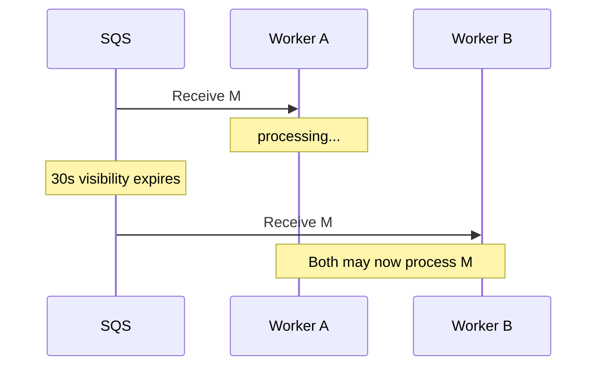

This can produce:

- duplicated downstream load,
- side-effect races,
- increased receive counts,
- misleading DLQ movement,
- wasted compute.

---

## 7.2 Too long

Suppose:

```text
processing duration = 500ms
visibility timeout  = 30 minutes
```

If the worker crashes at 250ms, legitimate retry may be delayed by almost 30 minutes.

---

## 7.3 Adaptive visibility / heartbeat

For long or highly variable work:

```text
Receive M
start lease = 60s

every 30s while healthy:
    ChangeMessageVisibility(M, +60s)

on success:
    DeleteMessage(M)
```

This resembles lease renewal used in distributed coordination systems.

AWS recommends extending visibility programmatically for variable-duration work rather than blindly configuring an enormous timeout.

> [!tip]  
> Treat lease renewal failure as a correctness signal. If the consumer can no longer prove it owns a valid lease, continuing a non-idempotent side effect may be unsafe.

---

# 8. FIFO ordering and head-of-line blocking

FIFO ordering is maintained **per message group**.

Suppose:

```text
Group order-123:
M1 -> M2 -> M3
```

If `M1` is in flight, subsequent messages from that group will not advance normally until `M1` is deleted or its visibility timeout expires. Other groups remain independently processable.

This creates an important failure mode:

```text
one poison message
        ↓
one blocked group
        ↓
all later work for that entity delayed
```

The group key therefore defines both:

1. your ordering boundary,
2. your concurrency boundary.
    

---

# 9. Choosing the FIFO message group key

Suppose an order-processing system needs ordering per order.

Good:

```text
MessageGroupId = order_id
```

Concurrency can then scale approximately with active independent orders.

Bad:

```text
MessageGroupId = "orders"
```

Every order becomes one global serial stream.

Throughput is now fundamentally bounded by the processing latency of that single group.

More groups are not automatically better either.

The correct group key is usually:

> **the smallest domain boundary across which strict relative ordering is actually required.**

Typical candidates:

|Domain|Potential group key|
|---|---|
|Payments|account ID|
|Orders|order ID|
|Inventory|SKU or inventory partition|
|Workflow|workflow instance ID|
|IoT|device ID|
|Customer state|customer ID|

Ask:

> If two messages have different group IDs and execute concurrently, can they violate an invariant?

If yes, the grouping boundary is probably too narrow.

If no, forcing them into the same group unnecessarily sacrifices concurrency.

---

# 10. Standard fair queues

A particularly important modern SQS capability is **fair queues**.

On a Standard queue, producers can attach `MessageGroupId` as a tenant identifier. Unlike FIFO, it **does not create ordering semantics**. Instead, SQS uses it to mitigate noisy-neighbor impact among logical tenants.

Example:

```text
Tenant A: 1,000,000 jobs
Tenant B:       100 jobs
Tenant C:       100 jobs
```

Without fairness, A's burst may substantially increase queue dwell time for B and C.

With fair queues, SQS observes disproportionately represented in-flight groups and preferentially returns work from quieter groups so that their dwell time remains lower. It does not impose a hard per-tenant rate limit: unused consumer capacity can still process the noisy tenant's work.

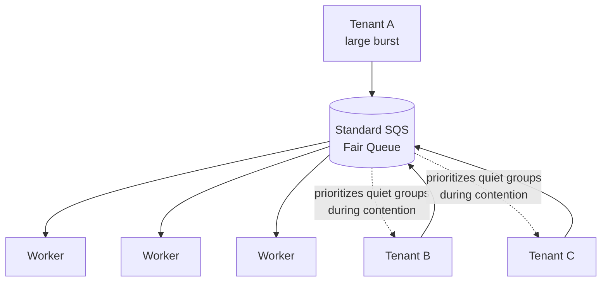

This is useful when:

- many tenants share a queue,
- tenant traffic is bursty,
- separate queue-per-tenant is operationally unattractive,
- dwell-time isolation matters,
- strict ordering is unnecessary.

> [!important]  
> Fairness is not admission control. If aggregate arrival rate exceeds aggregate processing capacity indefinitely, the backlog still grows.

AWS additionally meters fair-queue operations differently when Standard-queue requests involve messages with `MessageGroupId`, so fairness has a cost dimension as well as an isolation benefit.

---

# 11. Retry architecture

SQS gives you redelivery mechanics, but the application still needs a retry policy.

Failures normally fall into three classes.
## 11.1 Transient

Examples:

- database failover,
- API timeout,
- temporary throttling,
- network interruption.

Retry is appropriate.

---

## 11.2 Persistent but potentially recoverable

Examples:
- dependency unavailable for hours,
- customer account temporarily locked,
- a required object has not propagated yet.

Immediate retries may create a retry storm.

Possible strategies:
- longer visibility,
- explicit delayed retry queue,
- exponential backoff,
- scheduled retry orchestration,
- Step Functions for complex workflows.

---

## 11.3 Permanent / poison message

Examples:

- invalid schema,
- impossible state transition,
- corrupted data,
- unsupported version.

Blind retries are counterproductive.

These should generally be isolated to a DLQ after an intentionally chosen number of attempts.

---

# 12. Dead-letter queues

A source queue can configure a **redrive policy** containing `maxReceiveCount`.

After enough receives without successful deletion, the message is moved to the configured DLQ.

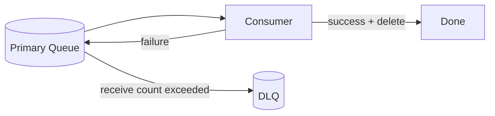

A DLQ is valuable because it changes failure from:

```text
infinite retry loop
```

into:

```text
bounded automated retry
+
isolated investigation/recovery path
```

## 12.1 `maxReceiveCount` is a policy decision

A value of `1` effectively says:

> Any first-attempt failure is considered poison.

That is usually incompatible with normal transient distributed-system failures.

Conversely, an enormous count can make bad messages waste substantial compute and hide defects for hours.

---

# 13. DLQ redrive is a production operation

SQS supports moving messages from a DLQ back toward a destination queue and allows control over redrive velocity. Redriven messages receive a new message ID and enqueue time. Redriven messages may also interleave with newly produced traffic.

This matters because:

```text
DLQ contains 8 million messages
bug is fixed
operator clicks "redrive everything"
```

may become:

```text
8 million jobs
    ↓
consumer fleet
    ↓
database overload
    ↓
new failures
```

A safe redrive process should answer:

- Was the original defect actually fixed?
- Are messages still semantically valid?
- Are downstream mutations idempotent?
- What redrive rate can dependencies absorb?
- Can old events overwrite newer state?
- Will current producers compete with replay traffic?
- How will progress be monitored?
- What is the abort criterion?

> [!important]  
> “Messages are recoverable” is insufficient. A production architecture should define **how recovery is performed safely**.

---

# 14. Long polling

`ReceiveMessage` supports long polling.

A non-zero `WaitTimeSeconds` enables long polling, with a maximum of 20 seconds. Long polling reduces empty receives and false-empty responses and is preferable to short polling in most normal consumer implementations.

Short polling:

```text
Receive
empty
Receive
empty
Receive
message
Receive
empty
...
```

Long polling:

```text
Receive ----------------> message becomes available
          returns immediately with work
```

Operational effects:

- fewer API calls,
- lower cost,
- less useless client activity,
- lower `NumberOfEmptyReceives`.

For manually implemented consumers, make the HTTP client timeout greater than the configured long-poll wait.

---

# 15. Batching

SQS APIs can handle up to 10 messages in common batch operations:

- `SendMessageBatch`
- `DeleteMessageBatch`
- `ChangeMessageVisibilityBatch`
    

`ReceiveMessage` itself can return up to 10 messages.

Batching amortizes:

- HTTP latency,
- connection overhead,
- request cost,
- client CPU.
    

Approximate effective per-message request overhead:

$$C_\text{message} \approx \frac{C_\text{request}}{\text{batch size}}$$

for fixed request-level cost, ignoring payload-size billing.

But batching introduces trade-offs:

|Larger batches|Smaller batches|
|---|---|
|Higher efficiency|Lower per-message latency|
|Fewer API calls|Faster acknowledgement|
|Better amortization|Smaller retry blast radius|
|More work per invocation|Less memory/time variance|

With Lambda, batch failure semantics become particularly important.

---

# 16. Lambda + SQS

When SQS is configured as a Lambda event source, Lambda owns the polling loop through an **event source mapping**.

Conceptually:

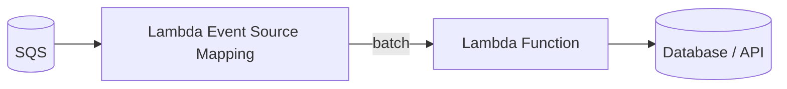

For Standard queues, Lambda begins with multiple concurrent batches and increases concurrency while backlog remains, subject to Lambda and event-source limits. Current AWS documentation describes scaling starting with five concurrent batches and increasing by up to 300 concurrent invokes per minute, with the normal event-source mapping reaching up to 1,250 concurrent invokes unless another limit constrains it. Provisioned mode provides a separately configured polling model.

That means an apparently simple integration can become a substantial downstream load generator.

If:

```text
batch size = 10
Lambda concurrency = 1,000
```

then as many as roughly:

```text
10,000 message executions
```

can be represented in simultaneously executing batches.

The queue is not necessarily the resource that needs protection.

Often the real capacity limit is:

- RDS connections,
- database write IOPS,
- vendor API quota,
- lock contention,
- downstream service concurrency.
    

---

# 17. Partial batch responses

Consider a Lambda batch:

```text
[M1, M2, M3, M4, M5]
```

Suppose:

```text
M1 success
M2 success
M3 failure
M4 success
M5 success
```

If the invocation fails as a whole, successfully processed messages can otherwise become eligible for retry with the failed message.

AWS therefore recommends **partial batch response** handling so the consumer identifies only failed records for retry.

Without it:

```text
one bad item
     ↓
entire batch retried
     ↓
duplicate work amplification
```

With it:

```text
only failed item(s)
     ↓
retry
```

Idempotency remains necessary because a crash can occur after successful downstream mutation but before Lambda reports the batch result.

---

# 18. Backpressure and queueing theory

Let:

- $\lambda$ = incoming messages/sec,
- $\mu$ = processing rate per consumer,
- $C$ = effective consumer concurrency.

Approximate service capacity:

$$R = C\mu$$

For stable steady-state operation:

$$\lambda < R$$

If:

$$\lambda > R$$

then backlog growth is approximately:

$$\frac{dQ}{dt} = \lambda - R$$

Example:

```text
arrival rate   = 50,000 msg/s
processing     = 1,000 consumers × 40 msg/s
capacity       = 40,000 msg/s

backlog growth = 10,000 msg/s
```

After ten minutes:

$$Q \approx 10{,}000 \times 600 = 6{,}000{,}000$$

assuming rates remain constant.

Adding SQS does not change that arithmetic.

---

# 19. Queue age is often more meaningful than depth

Compare:

### Queue A

```text
visible messages = 1,000,000
processing rate  = 500,000/s
```

Approximate drain time:

$$\frac{1{,}000{,}000}{500{,}000/\text{s}} \approx 2\text{ s}$$

### Queue B

```text
visible messages = 10,000
processing rate  = 100/s
```

Approximate drain time:

$$\frac{10{,}000}{100/\text{s}} \approx 100\text{ s}$$

Raw backlog size suggests A is worse.

Customer-visible delay suggests B may be worse.

Therefore monitor:

- `ApproximateNumberOfMessagesVisible`
- `ApproximateNumberOfMessagesNotVisible`
- `ApproximateAgeOfOldestMessage`
- arrival rate,
- completion rate,
- DLQ arrival rate,
- processing latency.
    

SQS's CloudWatch queue-state metrics are intentionally approximate because of its distributed architecture.

> [!tip]  
> Alert on the business consequence of backlog — usually **dwell time / age** — rather than queue depth alone.

---

# 20. Key CloudWatch signals

AWS publishes SQS metrics under `AWS/SQS`. Relevant signals include:

|Metric|Useful interpretation|
|---|---|
|`ApproximateNumberOfMessagesVisible`|Ready backlog|
|`ApproximateNumberOfMessagesNotVisible`|Work currently leased/in flight|
|`ApproximateAgeOfOldestMessage`|Dwell-time pressure|
|`ApproximateNumberOfMessagesDelayed`|Scheduled/delayed work|
|`NumberOfEmptyReceives`|Polling inefficiency|
|`NumberOfMessagesSent`|Producer activity|
|`NumberOfMessagesDeleted`|Successful queue acknowledgements|
|`NumberOfDeduplicatedSentMessages`|FIFO deduplication activity|
|`ApproximateNumberOfGroupsWithInflightMessages`|FIFO group concurrency|

Fair queues additionally expose quiet-group/noisy-group metrics, allowing operators to distinguish:

```text
global backlog is unhealthy
```

from:

```text
one tenant is noisy while quiet tenants remain healthy
```

Relevant metrics include:

- `ApproximateNumberOfNoisyGroups`
- `ApproximateNumberOfMessagesVisibleInQuietGroups`
- `ApproximateAgeOfOldestMessageInQuietGroups`.
    

---

# 21. Autoscaling consumers

A naive scaling rule:

```text
scale consumers based on NumberOfMessagesVisible
```

can work poorly because queue depth does not encode job duration.

A better approximation is:

$$C_\text{required} \approx \frac{Q \times T}{D}$$

where:

- $Q$ = backlog,
- $T$ = average seconds/message,
- $D$ = desired drain time.
    

Example:

```text
Q = 100,000
T = 0.2 seconds
D = 60 seconds
```

$$C \approx \frac{100{,}000 \times 0.2}{60} \approx 333$$

But an architecture review should immediately ask:

> Can the downstream system safely absorb 333 concurrent consumers?

Queue draining should usually be constrained by:

$$C_\text{safe} = \min(C_\text{needed},\ C_\text{consumer},\ C_\text{database},\ C_\text{dependency},\ C_\text{account quota})$$

This distinction separates:

- **desired queue-drain rate**
- from
- **safe end-to-end system throughput**.

---

# 22. In-flight messages are a separate resource

An in-flight message has been received but not deleted.

Standard queues have an approximate in-flight limit around 120,000 under normal conditions. FIFO queues also document an in-flight quota of 120,000 by default, with quota increases available in appropriate cases. Short polling can return `OverLimit` when the Standard limit is reached; long polling may instead simply return no new work until the count falls.

A pathological consumer can therefore create:

```text
receive rapidly
process slowly
delete slowly
```

resulting in:

```text
visible backlog ↓
in-flight backlog ↑
actual throughput unchanged
```

Scaling based only on visible queue depth may falsely conclude that the system is recovering.

---

# 23. Throughput characteristics

## Standard

Standard queues are designed for extremely high throughput and support a nearly unlimited number of API calls per second per action for normal workload design purposes.

A single client connection is still latency-limited:

$$TPS_\text{connection} \approx \frac{1}{\text{round-trip latency}}$$

AWS therefore recommends horizontal client concurrency plus batching for high throughput.

---

## FIFO

FIFO throughput depends on:

- regional quota,
- batching,
- high-throughput FIFO configuration,
- number/distribution of message groups.
    

High-throughput FIFO sets deduplication scope to message-group level and throughput limiting to per-message-group behavior.

Internally, SQS hashes FIFO `MessageGroupId` values to partitions. Poor group distribution can therefore limit usable parallelism even when the queue itself supports considerably more aggregate throughput.

The practical rule:

> **FIFO capacity engineering is partly a cardinality/distribution problem.**

Do not size FIFO based solely on “number of consumers.”

---

# 24. Payload sizing

Current SQS configuration supports messages up to **1 MiB**. Batch payloads are likewise constrained by the aggregate request payload limit.

For larger payloads, AWS provides Extended Client Libraries that store the body in S3 and place a pointer in SQS, supporting payloads up to roughly 2 GB through that pattern. Current AWS documentation provides Java and Python extended-client support.

Architecture:

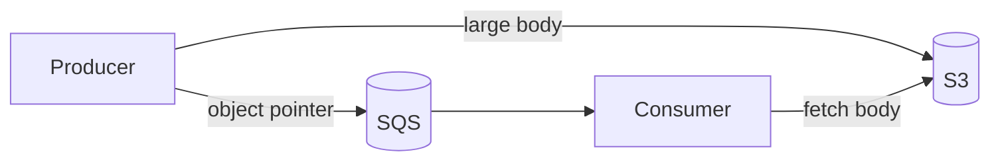

This introduces additional failure modes:

```text
SQS pointer exists but S3 object missing
S3 object exists but SQS send failed
message deleted but S3 object leaked
S3 lifecycle removes payload before delayed processing
cross-resource permissions diverge
```

For large-message workflows, S3 object lifecycle and idempotency become part of the queue protocol.

---

# 25. Message retention and delay

SQS messages are retained for **4 days by default**, configurable from 1 minute to **14 days**.

That means SQS is not an indefinite event archive.

If consumers remain offline longer than retention:

```text
queue != durable event history
```

If replay months later is a requirement, consider separately retaining canonical events or payloads in:

- S3,
- an event log,
- a database,
- another replay-oriented system.
    

---

## Delay queues

SQS supports delivery delay up to **15 minutes**.

Delay is useful for:

- short deferred work,
- basic retry postponement,
- waiting for eventual consistency.
    

But it is usually a poor substitute for a scheduler when the requirement is:

```text
execute this at an arbitrary timestamp next Tuesday
```

A scheduling/orchestration system is more appropriate for long or precise delays.

---

# 26. Cost model

SQS is request-priced.

Important cost mechanics currently include:

- each API action counts as a request,
- batching can place multiple messages in a request,
- each 64 KiB payload chunk is metered as one request unit,
- a 1 MiB payload therefore represents 16 request units,
- FIFO requests have FIFO pricing,
- fair-queue Standard requests involving `MessageGroupId` incur both normal Standard and fair-queue request charges,
- Extended Client usage additionally incurs S3 costs,
- customer-managed KMS encryption can introduce KMS usage costs.
    

Therefore:

$$\text{cost} \neq \text{message count}$$

More accurately:

$$\text{cost} = f(\text{API actions},\ \text{batching},\ \text{payload size},\ \text{queue type},\ \text{poll efficiency},\ \text{retries})$$

This means optimizations such as:

- long polling,
- batching,
- avoiding pathological retries,
    

improve both performance and cost.

---

# 27. Security model

A production SQS security review should cover at least four boundaries.

## 27.1 Identity

SQS supports both identity-based IAM policies and resource-based queue policies.

Separate permissions by role:

```text
Producer:
    sqs:SendMessage

Consumer:
    sqs:ReceiveMessage
    sqs:DeleteMessage
    sqs:ChangeMessageVisibility

Administrator:
    lifecycle / policy operations
```

Avoid broad `sqs:*` permissions for application identities.

---

## 27.2 Transport

AWS recommends enforcing TLS and supports queue-policy conditions such as `aws:SecureTransport` to reject unencrypted access. Current SQS infrastructure requires TLS 1.2 or later.

---

## 27.3 Network

SQS can be accessed through VPC endpoints.

Queue and endpoint policies can restrict access based on VPC/VPC endpoint, reducing exposure through public network paths.

---

## 27.4 Data at rest

New SQS queues receive server-side encryption by default; AWS applied default SSE to SQS queues beginning in 2022.

Architecture reviews should still distinguish:

- AWS-managed encryption,
- customer-managed KMS requirements,
- key policy,
- cross-account access,
- KMS throttling/cost implications.

---

# 28. Schema evolution

Queues decouple deployment timing.

That means:

```text
producer v2
consumer v1
```

may coexist for hours or days.

Messages should therefore be treated as durable API contracts.

Useful envelope:

```json
{
  "event_id": "...",
  "schema_version": 3,
  "type": "OrderApproved",
  "occurred_at": "...",
  "payload": {}
}
```

Consumers should explicitly define behavior for:

- old versions,
- unknown versions,
- missing optional fields,
- newly added fields,
- semantically incompatible changes.
    

A queue often makes deployment coupling **less visible**, not nonexistent.

> [!important]  
> The longer your retention window and backlog recovery time, the longer old schemas remain part of your production compatibility surface.

---

# 29. Queue topology

## One queue per workload

Advantages:

- independent scaling,
- independent alarms,
- independent DLQs,
- independent retry policy,
- smaller blast radius.

Cost:

- more infrastructure objects,
- more operational configuration.

---

## One shared queue

Advantages:

- lower infrastructure cardinality,
- shared fleet utilization.

Risks:

- noisy neighbors,
- mixed SLAs,
- mixed retry semantics,
- more complicated dispatch,
- aggregate blast radius.

Fair queues reduce one dimension of the shared-queue noisy-neighbor problem, but they do not make all workloads operationally equivalent.

A useful heuristic:

> Share a queue when workloads have compatible **latency, retry, security, scaling, and failure-isolation requirements**.

Separate them when those policies materially differ.

---

# 30. SQS vs pub/sub

SQS is fundamentally a queue.

Multiple consumers competing against the same queue normally distribute work:

```text
Message M
   ↓
one successful processing path
```

If three independent systems all need the same event, a single shared queue is usually not enough.

Use fan-out:

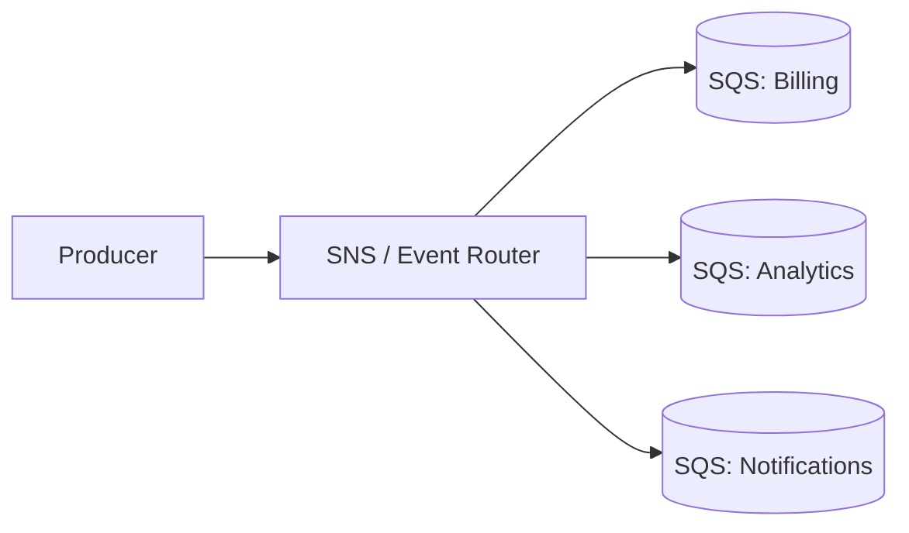

Each subscriber receives an independent durable work stream.

This gives:

```text
fan-out semantics
+
consumer-specific backpressure
+
consumer-specific DLQs
+
independent scaling
```

The Staff+ design question is:

> Are these workers collaborating on the same unit of work, or are these independent consumers of the same event?

The first suggests one queue.

The second suggests fan-out into separate queues.

---

# 31. Failure-mode analysis

|Failure|SQS behavior|Application requirement|
|---|---|---|
|Producer loses send response|Send may or may not have succeeded|Producer retry/idempotency|
|Standard message duplicated|Possible|Idempotent consumer|
|Consumer crashes before delete|Message becomes visible after lease expiry|Retry-safe processing|
|Consumer succeeds then crashes before delete|Side effect may repeat|Idempotent downstream mutation|
|Visibility too short|Concurrent duplicate processing possible|Tune/extend lease|
|Visibility too long|Slow crash recovery|Adaptive lease|
|Poison message|Repeated receives|DLQ|
|FIFO poison message|Group can stall|DLQ + group monitoring|
|Consumer fleet too small|Backlog/age grows|Autoscaling/capacity|
|Consumer fleet too large|Downstream overload|Concurrency caps|
|Dependency outage|Retries can amplify load|Backoff/circuit breaking|
|DLQ mass redrive|Sudden replay load|Rate-controlled redrive|
|Schema incompatibility|Consumer errors|Versioning/compatibility|
|Tenant traffic spike|Shared queue dwell time rises|Fair queue or isolation|
|Long outage > retention|Messages expire|Durable archive/replay design|

---

# 32. Common architectural mistakes

## Mistake 1 — Treating receive as acknowledgement

Correct:

```text
receive -> process -> delete
```

Not:

```text
receive -> delete -> process
```

---

## Mistake 2 — Assuming FIFO means no idempotency

FIFO reduces duplicate sends.

It does not make:

```text
SQS delete
+
database commit
```

one atomic transaction.

---

## Mistake 3 — Global FIFO group

```text
MessageGroupId = "default"
```

quietly converts a scalable queue into a globally serialized workflow.

---

## Mistake 4 — Scaling only on queue depth

```text
queue depth ↓
in-flight ↑
database saturated
```

can still represent a degraded system.

Monitor end-to-end throughput and age.

---

## Mistake 5 — Unlimited consumer scaling

A queue can buffer far more work than the database can safely execute concurrently.

Autoscaling must respect downstream capacity.

---

## Mistake 6 — Treating the DLQ as archival storage

DLQ retention is bounded.

A DLQ is an operational failure surface.

---

## Mistake 7 — Replaying blindly

Old messages may no longer be valid against current state.

Replay is a business operation, not merely a queue operation.

---

## Mistake 8 — Retry at every layer

Suppose:

```text
SQS redelivery:       5 attempts
consumer retry:       4 attempts
HTTP SDK retry:       3 attempts
database retry:       3 attempts
```

Potential underlying attempts can approach:

$$5 \times 4 \times 3 \times 3 = 180$$

for one logical unit of work.

Retry policies need an explicit owner and total retry budget.

---

# 33. Migration and evolution

Changing queue architecture is often a distributed protocol migration.

Examples:

- Standard → FIFO,
- group-key change,
- old schema → new schema,
- one queue → sharded queues,
- direct SQS → SNS/EventBridge fan-out,
- consumer fleet → Lambda,
- queue encryption/key-policy changes.
    

A safe migration commonly looks like:

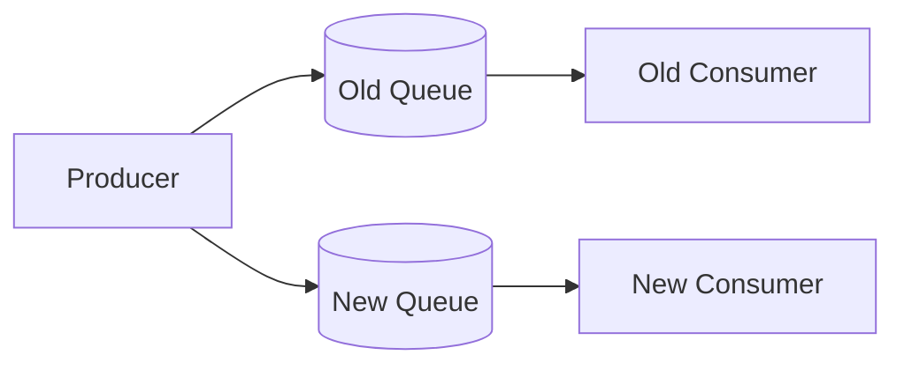

Phases:

1. make consumers idempotent,
2. introduce compatibility support,
3. optionally dual-publish,
4. validate both paths,
5. shift traffic,
6. drain old queue,
7. observe retention window,
8. remove legacy path.
    

Dual publishing itself creates a consistency problem, so the design must define which stream is canonical and how duplicate cross-stream processing is handled.

> [!tip]  
> Queue migrations become dramatically easier when messages already carry stable domain event IDs.

---

# 34. Architecture-review framework

When reviewing an SQS design, start with invariants rather than configuration.

## 34.1 Delivery

- Can a message execute more than once?
- Can messages execute out of order?
- What happens if processing succeeds but acknowledgement fails?
- What is the domain idempotency key?
    

## 34.2 Ordering

- Is ordering actually necessary?
- Across which entities?
- Why is the selected FIFO group key the correct invariant boundary?
- What is the expected number of simultaneously active groups?
- What happens when one group contains a poison message?
    

## 34.3 Capacity

- Peak $\lambda$?
- Sustainable consumer rate?
- Burst duration?
- Maximum acceptable queue age?
- Expected drain time?
- Which downstream dependency limits concurrency?
    

## 34.4 Retries

- Which failures are retriable?
- Who owns retry policy?
- Is there exponential backoff?
- How many total underlying attempts are possible?
- What causes DLQ admission?
    

## 34.5 Recovery

- Who owns the DLQ?
- What alerts fire?
- How are failed messages inspected?
- How is redrive rate selected?
- Can replay violate present-day state?
    

## 34.6 Operability

- Queue-age SLO?
- DLQ alarm?
- Consumer success rate?
- Processing-duration distribution?
- In-flight saturation?
- FIFO active-group count?
- Tenant-level fairness signals?
    

## 34.7 Security

- Producer permissions?
- Consumer permissions?
- Cross-account policy?
- VPC endpoint requirements?
- KMS requirements?
- Are message contents sensitive?
- Is sensitive information leaked through queue names or metadata?
    

---

# 35. Staff+ perspective

At senior scope, the question often sounds like:

> “How do we process messages from SQS?”

At Staff+ scope, the questions become:

> What invariant does this asynchronous boundary protect?

> How much backlog can the business tolerate?

> Which subsystem owns retry behavior?

> What prevents retry amplification during a dependency outage?

> Which downstream resource becomes the bottleneck when the queue suddenly releases millions of messages?

> How will operators recover poison messages at 3 a.m. without creating a second incident?

> What happens to schema compatibility when a three-day backlog meets a newly deployed consumer?

> Should one tenant's burst be allowed to affect every other tenant?

> Can the selected FIFO grouping scheme support expected growth two years from now?

> What is the migration strategy if that grouping assumption turns out to be wrong?

This is the difference between configuring a queue and designing a messaging subsystem.

---

# 36. Practical design heuristics

1. **Default to Standard unless strict ordering is a real business invariant.**
2. **Make consumers idempotent even when using FIFO.**
3. **Use domain operation IDs, not transport-specific IDs, for idempotency.**
4. **Treat visibility timeout as a renewable lease.**
5. **Measure processing-duration percentiles before selecting lease duration.**
6. **Use long polling for normal custom consumers.**
7. **Batch when throughput/cost matter, but understand batch retry semantics.**
8. **Scale on queue age and desired drain time, bounded by downstream capacity.**
9. **Separate queues when workloads need different retry, scaling, security, or SLO policies.**
10. **Use FIFO group IDs at the narrowest boundary requiring ordering.**
11. **Use Standard fair queues when tenant isolation matters but FIFO ordering does not.**
12. **Treat DLQ redrive as controlled production traffic.**
13. **Keep retry policy comprehensible across every layer.**
14. **Version messages as durable contracts.**
15. **Use an outbox when persistence and publication must behave atomically.**
16. **Do not use SQS as your only long-term event history if replay beyond retention is required.**
    

---

# 37. Interview / system-design reasoning pattern

When SQS appears in a design interview, avoid saying merely:

> “We'll put a queue between the services.”

Instead reason in this order.

### Step 1 — State why asynchronous messaging is needed

Example:

```text
We want to decouple request latency from image processing
and absorb burst traffic without scaling the image processors
to instantaneous peak load.
```

### Step 2 — Choose delivery semantics

```text
Processing is independent and order doesn't matter,
so Standard SQS is preferable to FIFO.
```

### Step 3 — Define idempotency

```text
Each image job carries an immutable job ID.
The result table has a uniqueness constraint on job ID,
so duplicate deliveries converge to one result.
```

### Step 4 — Establish concurrency control

```text
Workers scale based on queue age, but concurrency is capped
to protect the downstream object store and database.
```

### Step 5 — Define lease behavior

```text
P99 processing is 40 seconds.
We use an initial 60-second visibility timeout and heartbeat
for unusually long jobs.
```

### Step 6 — Define poison-message handling

```text
After bounded retries the message enters a DLQ,
which has alarms and a rate-controlled replay procedure.
```

### Step 7 — Explain observability

```text
Primary SLO signal is oldest-message age rather than
queue depth alone.
```

This demonstrates system-level reasoning rather than AWS feature memorization.

---

# 38. Representative design: asynchronous order fulfillment

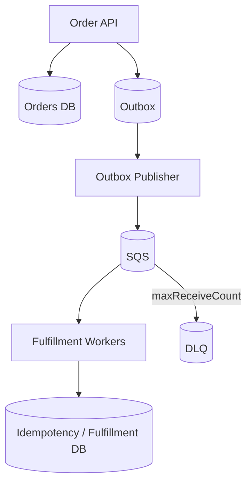

### Invariants

1. Accepted orders must eventually produce fulfillment work.
2. One logical order must not be fulfilled twice.
3. Temporary fulfillment outages must not make order creation unavailable.
4. Permanent malformed jobs must not block all valid work.
    

### Mechanisms

- DB + outbox commit atomically.
- Outbox publisher may retry.
- Stable `event_id` identifies the logical operation.
- Consumer commits fulfillment state and event ID atomically.
- Delete occurs only after successful processing.
- DLQ isolates poison jobs.
- Queue-age alarms detect failure to meet fulfillment latency.
- Consumer concurrency is capped according to downstream capacity.
    

The architecture does not rely on “messages never duplicate.”

It relies on:

```text
duplicates are safe
+
loss is recoverable
+
failures are observable
```

That is a much stronger design.

---

# 39. SQS configuration limits worth remembering

As of the current AWS documentation:

|Property|Current characteristic|
|---|---|
|Maximum normal message size|1 MiB|
|Batch size|Up to 10 messages|
|Default retention|4 days|
|Maximum retention|14 days|
|Maximum delay|15 minutes|
|Maximum long-poll wait|20 seconds|
|Default visibility timeout|30 seconds|
|Maximum visibility duration|12 hours from initial receive|
|Standard delivery|At least once|
|Standard ordering|Best effort|
|FIFO producer deduplication window|5 minutes|
|FIFO ordering|Per `MessageGroupId`|
|Typical Standard in-flight quota|~120,000|
|FIFO in-flight default quota|120,000|

Relevant AWS documentation:

Treat quota and throughput numbers as deploy-time inputs rather than architectural constants: several limits and FIFO throughput quotas can vary by Region or be raised.

---

# 40. Internal architecture

AWS does not publish a complete specification of SQS internals, but the Developer Guide, the high-throughput FIFO documentation, and AWS engineering posts together reveal the broad shape of the system.

## 40.1 Distributed, multi-AZ storage

A queue is not a process or a single server. It is a logical name over **redundantly distributed state**:

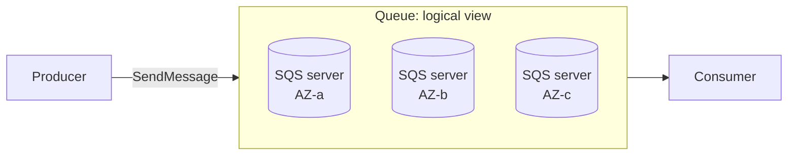

Key facts from the Developer Guide:

- The queue "redundantly stores the messages across multiple Amazon SQS servers."
- For Standard queues, `SendMessage` is acknowledged **only after the message is redundantly stored across multiple Availability Zones**. Durability precedes acknowledgement — no single computer, network, or AZ failure can make a stored message inaccessible.
- All queue data lives within a single Region, spread across that Region's AZs. SQS is Region-scoped; cross-region durability is the application's problem.

This distribution directly explains Standard-queue semantics:

> On rare occasions, one of the servers that stores a copy of a message might be unavailable when you receive or delete a message.

That sentence is the architectural root cause of **at-least-once delivery**: a delete can fail to reach every copy, so a surviving copy is delivered again later. Duplicates are not a bug in SQS; they are the price of acknowledging writes before full distributed consensus on every operation.

## 40.2 Service-side microservices

Like many AWS services, SQS is implemented as a collection of internal microservices. AWS's engineering blog describes two of them:

|Layer|Role|
|---|---|
|**Customer front-end**|Accepts, authenticates, and authorizes API calls (`SendMessage`, `ReceiveMessage`, ...), then routes each request to the storage back-end|
|**Storage back-end**|Persists messages. Organized as a **cell-based** model: each cell/cluster contains multiple hosts, each customer queue is assigned to one or more clusters, and each cluster serves many queues|

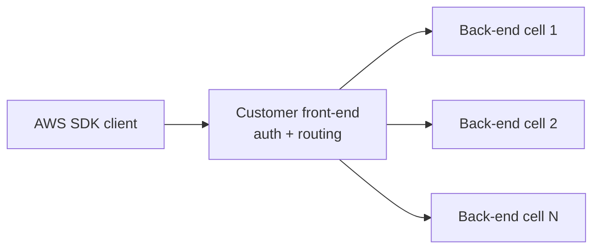

Two design points worth noting:

- **Cells are a blast-radius and scaling mechanism.** Capacity is added by adding cells, and a failure in one cell affects only the queues mapped to it. This is the same cell-based architecture pattern used across AWS services.
- **Front-end ↔ back-end communication uses a proprietary binary framing protocol** that multiplexes many requests over a single connection, using 128-bit request IDs and checksumming to prevent crosstalk. AWS reports this reduced latency (double-digit percentages at high percentiles) and raised per-host request capacity, replacing an older connection-per-request model that pushed front-ends toward open-connection limits.

AWS talks additionally describe a **metadata layer** (reportedly DynamoDB-backed) that the front-end consults to resolve whether a queue exists, its policy, and which back-end cluster owns it — plus a **load manager** that continuously watches cluster utilization and repartitions or migrates queues off hot clusters and onto idle ones. These movements are transparent to users. Treat these particular details as informative rather than contractual; they come from conference talks, not the Developer Guide, and can change.

## 40.3 FIFO partitioning

The high-throughput FIFO documentation is more explicit about data layout:

- FIFO queue data is stored in **partitions** — allocations of storage automatically replicated across multiple AZs. Partition management (adding, removing, rebalancing) is fully automatic and transparent.
- Placement is by hash: `MessageGroupId` is fed into an **internal hash function**, and the output determines which partition stores the message.
- Partitions are **added** when the request rate approaches what existing partitions support (up to the regional quota) and **removed** when utilization is low.
- In batch APIs, messages routed to the same partition are grouped and processed in a **single transaction**.
- The hash function and partition count can change at any time, so which groups share a partition is not stable or guaranteed.

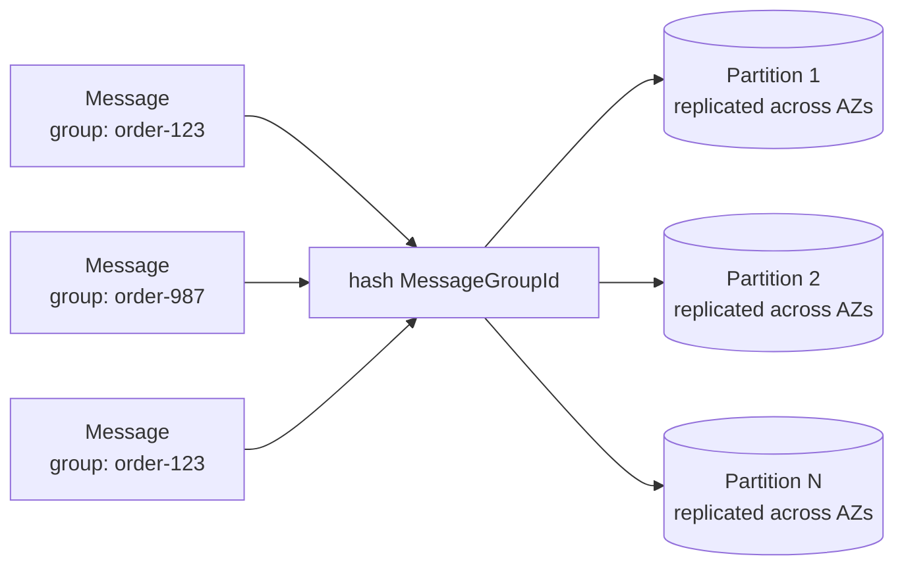

This is why FIFO ordering is tractable: **routing all messages of a group to one partition turns distributed ordering into a local, per-partition sequencing problem.** It is also why the group key is a scalability decision (see §9) — a hot group is a hot partition, and no amount of consumer scaling fixes skewed hash input.

## 40.4 How the architecture produces the semantics

The documented behaviors of SQS fall out of the architecture rather than existing alongside it:

|Observed behavior|Architectural cause|
|---|---|
|Standard: at-least-once delivery|Redundant copies; a delete may not reach every copy before one is redelivered|
|Standard: best-effort ordering|Messages spread across many servers with no global sequencing coordination|
|Standard: nearly unlimited throughput|Work is load-balanced across cells/hosts; no per-queue serialization point|
|FIFO: per-group ordering|Group ID hashing confines a group to a partition with local sequencing|
|FIFO: throughput ceilings|Per-partition/per-group serialization is the ordering mechanism itself|
|Approximate CloudWatch metrics|Queue state is distributed; exact global counts would require coordination|
|Short-poll false empties|Short polling samples a subset of servers, not the full distributed state|
|Automatic FIFO scaling|Partition count tracks request rate without user involvement|

> [!important]
> Design against the **documented semantics** (at-least-once, per-group ordering, approximate counts), not against the implementation details above. AWS can and does change the internals — the front-end/back-end protocol rewrite is a documented example — while keeping the semantics stable.

---

# 41. Key takeaways

> [!summary]  
> **1. SQS is best understood as durable work ownership plus temporary processing leases.**

> [!summary]  
> **2. Standard queues require duplicate-safe, reorder-safe consumers.**

> [!summary]  
> **3. FIFO ordering is per message group, so the group key is simultaneously a correctness boundary and scalability boundary.**

> [!summary]  
> **4. FIFO deduplication does not remove the need for application-level idempotency.**

> [!summary]  
> **5. Visibility timeout controls the trade-off between duplicate work and failure-recovery latency.**

> [!summary]  
> **6. A queue converts overload into backlog; it does not create downstream capacity.**

> [!summary]  
> **7. `ApproximateAgeOfOldestMessage` is often a better operational SLO signal than queue depth alone.**

> [!summary]  
> **8. DLQ ownership and redrive procedures are part of the production architecture, not an afterthought.**

> [!summary]  
> **9. Standard fair queues provide useful multi-tenant dwell-time isolation without requiring FIFO semantics.**

> [!summary]  
> **10. The strongest SQS systems are designed around invariants, retry budgets, blast-radius control, and recoverability—not around optimistic assumptions about message delivery.**

---

# 42. Further questions

Questions worth exploring when extending this note:

- How does SQS compare operationally with [[Apache Kafka]]?
- When should [[SNS]] + SQS be preferred over [[EventBridge]]?
- How should SQS consumer autoscaling work with ECS and Kubernetes?
- How does Lambda's SQS polling algorithm interact with reserved concurrency?
- What is the best strategy for delayed retries longer than 15 minutes?
- How should idempotency records be expired safely?
- How should event IDs work across transactional outbox and replay?
- How should queue topology change in multi-region architectures?
- How do FIFO message groups interact with hot-key distributions?
- How should tenant fairness be measured end-to-end rather than only at the queue?
- When is an event log more appropriate than a work queue?
- What does disaster recovery mean when SQS queues are Region-scoped?
    

---

# 43. Source notes

The note primarily relies on first-party AWS documentation. Particularly useful references:

1. **Amazon SQS standard queues** — delivery guarantees, throughput model, redundancy.
2. **Amazon SQS visibility timeout** — lease lifecycle, in-flight behavior, extension and 12-hour bound.
3. **Exactly-once processing in Amazon SQS** — FIFO producer deduplication.
4. **FIFO queue delivery logic** — per-group ordering and concurrency behavior.
5. **Amazon SQS fair queues** — multi-tenant noisy-neighbor mitigation on Standard queues.
6. **Amazon SQS CloudWatch metrics** — approximate queue-state and fairness metrics.
7. **Using dead-letter queues in Amazon SQS** — redrive policies and DLQ behavior.
8. **DLQ redrive configuration** — controlled replay and redrive velocity.
9. **Using Lambda with Amazon SQS** — batching and partial-batch behavior.
10. **AWS Prescriptive Guidance: Transactional outbox** — atomic persistence/publication pattern.
11. **Amazon SQS security best practices** — IAM, TLS, SSE and VPC endpoints.
12. **Amazon SQS pricing** — request, payload-size, FIFO, fair-queue, S3 and KMS metering considerations.
13. **Basic Amazon SQS architecture / distributed queues** (Developer Guide) — redundant multi-server, multi-AZ message storage and its relationship to at-least-once delivery.
14. **High throughput for FIFO queues** (Developer Guide) — partitions, `MessageGroupId` hash-based placement, automatic partition management, batch transaction grouping.
15. **AWS News Blog: Optimizing Amazon SQS for speed and scale** — front-end/storage back-end microservices, cell-based model, and the multiplexed binary framing protocol.
    

---

# 44. Related notes

- [[Message Queues]]
- [[Delivery Semantics]]
- [[At-Least-Once Delivery]]
- [[Exactly-Once Semantics]]
- [[Idempotency]]
- [[Transactional Outbox Pattern]]
- [[Dead Letter Queues]]
- [[Backpressure]]
- [[Queueing Theory]]
- [[Event-Driven Architecture]]
- [[Apache Kafka]]
- [[Amazon SNS]]
- [[Amazon EventBridge]]
- [[AWS Lambda]]
- [[Retry Storms]]
- [[Distributed Leases]]
- [[Schema Evolution]]
- [[Noisy Neighbor Problem]]