> [!info] Version baseline  
> This note targets **Apache Flink 2.3.0**, released on June 25, 2026, and uses the stable 2.3 documentation unless explicitly stated otherwise. DataStream API V2 and `ForStStateBackend`/disaggregated state are discussed separately because Apache currently marks important parts of those surfaces as experimental or not fully production-ready.

- [[#Executive Summary|Executive Summary]]
- [[#1. When Flink Belongs in a System Design|1. When Flink Belongs in a System Design]]
	- [[#1.1 Strong Flink use cases|1.1 Strong Flink use cases]]
		- [[#Stateful event-driven decision systems|Stateful event-driven decision systems]]
		- [[#Continuous aggregations and materialized projections|Continuous aggregations and materialized projections]]
		- [[#Event-time joins and correlation|Event-time joins and correlation]]
		- [[#Large-scale streaming enrichment|Large-scale streaming enrichment]]
		- [[#Stateful CDC/changelog processing|Stateful CDC/changelog processing]]
	- [[#1.2 Cases where Flink is often unnecessary|1.2 Cases where Flink is often unnecessary]]
- [[#2. Core Mental Model: A Distributed Stateful Dataflow|2. Core Mental Model: A Distributed Stateful Dataflow]]
- [[#3. Runtime Architecture|3. Runtime Architecture]]
	- [[#3.1 Dispatcher|3.1 Dispatcher]]
	- [[#3.2 ResourceManager|3.2 ResourceManager]]
	- [[#3.3 JobMaster|3.3 JobMaster]]
	- [[#3.4 TaskManager|3.4 TaskManager]]
- [[#4. From User Program to Runtime Execution|4. From User Program to Runtime Execution]]
- [[#5. Operator Chaining, Tasks, Threads, and Slots|5. Operator Chaining, Tasks, Threads, and Slots]]
	- [[#5.1 Why chaining matters operationally|5.1 Why chaining matters operationally]]
- [[#6. Task Slots Are Not CPU Cores|6. Task Slots Are Not CPU Cores]]
- [[#7. Partitioning: The Most Important Data-Architecture Decision|7. Partitioning: The Most Important Data-Architecture Decision]]
	- [[#7.1 Why the partition key is architectural|7.1 Why the partition key is architectural]]
- [[#8. Key Groups and Maximum Parallelism|8. Key Groups and Maximum Parallelism]]
	- [[#8.1 Staff+ rule|8.1 Staff+ rule]]
- [[#9. Types of State|9. Types of State]]
	- [[#9.1 Keyed state|9.1 Keyed state]]
	- [[#9.2 Operator state|9.2 Operator state]]
	- [[#9.3 Broadcast state|9.3 Broadcast state]]
- [[#10. State Backend Architecture|10. State Backend Architecture]]
	- [[#10.1 HashMapStateBackend|10.1 HashMapStateBackend]]
	- [[#10.2 EmbeddedRocksDBStateBackend|10.2 EmbeddedRocksDBStateBackend]]
		- [[#Production use|Production use]]
	- [[#10.3 ForSt and disaggregated state|10.3 ForSt and disaggregated state]]
	- [[#10.4 State backend decision matrix|10.4 State backend decision matrix]]
- [[#11. State TTL Is Not Business-Time Expiration|11. State TTL Is Not Business-Time Expiration]]
- [[#12. Timers and KeyedProcessFunction|12. Timers and KeyedProcessFunction]]
- [[#13. Event Time and Watermarks|13. Event Time and Watermarks]]
	- [[#13.1 Event time|13.1 Event time]]
	- [[#13.2 Watermarks|13.2 Watermarks]]
	- [[#13.3 Watermark strategy at the source|13.3 Watermark strategy at the source]]
	- [[#13.4 Idle partitions|13.4 Idle partitions]]
	- [[#13.5 Watermark alignment|13.5 Watermark alignment]]
- [[#14. Windows and Late Data|14. Windows and Late Data]]
	- [[#14.1 Design implication|14.1 Design implication]]
- [[#15. Checkpointing: The Core Fault-Tolerance Mechanism|15. Checkpointing: The Core Fault-Tolerance Mechanism]]
	- [[#15.1 Barrier intuition|15.1 Barrier intuition]]
	- [[#15.2 Failure recovery|15.2 Failure recovery]]
- [[#16. Checkpoint Storage vs State Backend|16. Checkpoint Storage vs State Backend]]
- [[#17. Checkpoint Configuration Example|17. Checkpoint Configuration Example]]
- [[#18. Aligned vs Unaligned Checkpoints|18. Aligned vs Unaligned Checkpoints]]
	- [[#18.1 Aligned checkpoints|18.1 Aligned checkpoints]]
	- [[#18.2 Unaligned checkpoints|18.2 Unaligned checkpoints]]
- [[#19. End-to-End Exactly Once|19. End-to-End Exactly Once]]
	- [[#19.1 Source|19.1 Source]]
	- [[#19.2 Managed state|19.2 Managed state]]
	- [[#19.3 Sink|19.3 Sink]]
		- [[#Transactional sink|Transactional sink]]
		- [[#Idempotent sink|Idempotent sink]]
		- [[#Deduplicating consumer|Deduplicating consumer]]
- [[#20. Kafka Exactly-Once Sink Example|20. Kafka Exactly-Once Sink Example]]
	- [[#20.1 Latency implication|20.1 Latency implication]]
- [[#21. Savepoints vs Checkpoints|21. Savepoints vs Checkpoints]]
- [[#22. Stable Operator UIDs Are Part of Your Persistent Schema|22. Stable Operator UIDs Are Part of Your Persistent Schema]]
- [[#23. State Schema Evolution|23. State Schema Evolution]]
	- [[#Staff+ implication|Staff+ implication]]
- [[#24. State TTL Migration Nuance in Flink 2.3|24. State TTL Migration Nuance in Flink 2.3]]
- [[#25. Backpressure|25. Backpressure]]
	- [[#25.1 Root causes|25.1 Root causes]]
	- [[#25.2 Backpressure and checkpoints|25.2 Backpressure and checkpoints]]
- [[#26. Skew: The Enemy Hidden by Averages|26. Skew: The Enemy Hidden by Averages]]
	- [[#26.1 Strategies|26.1 Strategies]]
- [[#27. Async I/O for External Enrichment|27. Async I/O for External Enrichment]]
	- [[#27.1 Staff+ concern: dependency amplification|27.1 Staff+ concern: dependency amplification]]
- [[#28. Streaming SQL and Dynamic State|28. Streaming SQL and Dynamic State]]
	- [[#28.1 Prefer naturally bounded joins when possible|28.1 Prefer naturally bounded joins when possible]]
	- [[#28.2 SQL state TTL|28.2 SQL state TTL]]
- [[#29. Windowed SQL Example|29. Windowed SQL Example]]
- [[#30. Production Reference Architecture|30. Production Reference Architecture]]
- [[#31. Deployment Modes|31. Deployment Modes]]
	- [[#31.1 Application Mode|31.1 Application Mode]]
	- [[#31.2 Session Mode|31.2 Session Mode]]
	- [[#31.3 Staff+ default|31.3 Staff+ default]]
- [[#32. Kubernetes Deployment Model|32. Kubernetes Deployment Model]]
	- [[#Production Kubernetes concerns|Production Kubernetes concerns]]
- [[#33. JobManager High Availability|33. JobManager High Availability]]
- [[#34. Multi-Job Application Mode Caveat|34. Multi-Job Application Mode Caveat]]
- [[#35. Memory Architecture|35. Memory Architecture]]
	- [[#Staff+ consequence|Staff+ consequence]]
- [[#36. Scaling Model|36. Scaling Model]]
	- [[#36.1 Design for recovery capacity, not normal capacity|36.1 Design for recovery capacity, not normal capacity]]
- [[#37. Checkpoint Capacity Model|37. Checkpoint Capacity Model]]
- [[#38. Operational Metrics That Actually Matter|38. Operational Metrics That Actually Matter]]
	- [[#38.1 Input health|38.1 Input health]]
	- [[#38.2 Processing health|38.2 Processing health]]
	- [[#38.3 State|38.3 State]]
	- [[#38.4 Checkpoints|38.4 Checkpoints]]
	- [[#38.5 Runtime|38.5 Runtime]]
	- [[#38.6 Product correctness|38.6 Product correctness]]
- [[#39. Interpreting Checkpoint Symptoms|39. Interpreting Checkpoint Symptoms]]
	- [[#Symptom: checkpoint duration spikes|Symptom: checkpoint duration spikes]]
- [[#40. Failure Modes and Edge Cases|40. Failure Modes and Edge Cases]]
	- [[#40.1 Poison record restart loop|40.1 Poison record restart loop]]
	- [[#40.2 Hot key|40.2 Hot key]]
	- [[#40.3 Watermark stall|40.3 Watermark stall]]
	- [[#40.4 Incorrect watermark too aggressive|40.4 Incorrect watermark too aggressive]]
	- [[#40.5 External enrichment outage|40.5 External enrichment outage]]
	- [[#40.6 Checkpoint storage outage|40.6 Checkpoint storage outage]]
	- [[#40.7 Local RocksDB disk exhaustion|40.7 Local RocksDB disk exhaustion]]
	- [[#40.8 Unbounded SQL join|40.8 Unbounded SQL join]]
	- [[#40.9 Transaction timeout mismatch|40.9 Transaction timeout mismatch]]
	- [[#40.10 State migration failure|40.10 State migration failure]]
- [[#41. Backfills and Reprocessing|41. Backfills and Reprocessing]]
	- [[#Strategy A — replay Kafka|Strategy A — replay Kafka]]
	- [[#Strategy B — bounded historical source|Strategy B — bounded historical source]]
	- [[#Strategy C — bootstrap from existing materialized state|Strategy C — bootstrap from existing materialized state]]
	- [[#Staff+ recommendation|Staff+ recommendation]]
- [[#42. Dual-Running and Safe Migration|42. Dual-Running and Safe Migration]]
- [[#43. DataStream API vs Table/SQL|43. DataStream API vs Table/SQL]]
- [[#44. DataStream API V2 in Flink 2.3|44. DataStream API V2 in Flink 2.3]]
- [[#45. Full Production Java Skeleton|45. Full Production Java Skeleton]]
- [[#46. Architecture Review: Questions a Staff+ Engineer Should Ask|46. Architecture Review: Questions a Staff+ Engineer Should Ask]]
	- [[#Semantics|Semantics]]
	- [[#State|State]]
	- [[#Partitioning|Partitioning]]
	- [[#Event time|Event time]]
	- [[#Fault tolerance|Fault tolerance]]
	- [[#External effects|External effects]]
	- [[#Operations|Operations]]
	- [[#Change management|Change management]]
	- [[#Organizational boundaries|Organizational boundaries]]
- [[#47. Decision Framework: Should This System Use Flink?|47. Decision Framework: Should This System Use Flink?]]
- [[#48. Design Principles|48. Design Principles]]
- [[#49. Anti-Patterns|49. Anti-Patterns]]
	- [[#Anti-pattern: "Kafka + business logic = Flink"|Anti-pattern: "Kafka + business logic = Flink"]]
	- [[#Anti-pattern: synchronous DB query per event|Anti-pattern: synchronous DB query per event]]
	- [[#Anti-pattern: TTL chosen only to stop OOM|Anti-pattern: TTL chosen only to stop OOM]]
	- [[#Anti-pattern: no stable UIDs|Anti-pattern: no stable UIDs]]
	- [[#Anti-pattern: checkpoint interval copied from another job|Anti-pattern: checkpoint interval copied from another job]]
	- [[#Anti-pattern: one giant shared Flink cluster for all teams|Anti-pattern: one giant shared Flink cluster for all teams]]
	- [[#Anti-pattern: "scale it" as the answer to skew|Anti-pattern: "scale it" as the answer to skew]]
	- [[#Anti-pattern: treating Kafka lag as the only health metric|Anti-pattern: treating Kafka lag as the only health metric]]
- [[#50. Practical Production Checklist|50. Practical Production Checklist]]
- [[#51. Interview / System Design Reasoning Template|51. Interview / System Design Reasoning Template]]
	- [[#Step 1 — Define semantics|Step 1 — Define semantics]]
	- [[#Step 2 — Define state|Step 2 — Define state]]
	- [[#Step 3 — Define fault boundary|Step 3 — Define fault boundary]]
	- [[#Step 4 — Define partition/scaling model|Step 4 — Define partition/scaling model]]
	- [[#Step 5 — Define failure semantics|Step 5 — Define failure semantics]]
	- [[#Step 6 — Define operations|Step 6 — Define operations]]
- [[#52. Example System Design: Real-Time Payment Fraud|52. Example System Design: Real-Time Payment Fraud]]
	- [[#Requirements|Requirements]]
	- [[#Architecture|Architecture]]
	- [[#Why Flink|Why Flink]]
	- [[#Partitioning|Partitioning]]
	- [[#State|State]]
	- [[#Semantics|Semantics]]
- [[#53. Example System Design: Real-Time Analytics|53. Example System Design: Real-Time Analytics]]
- [[#54. Example System Design: Dynamic Rules via Broadcast State|54. Example System Design: Dynamic Rules via Broadcast State]]
- [[#55. Cost Model|55. Cost Model]]
- [[#56. Staff+ Perspective: Second-Order Effects|56. Staff+ Perspective: Second-Order Effects]]
	- [[#56.1 Increasing checkpoint frequency|56.1 Increasing checkpoint frequency]]
	- [[#56.2 Increasing parallelism|56.2 Increasing parallelism]]
	- [[#56.3 Increasing allowed lateness|56.3 Increasing allowed lateness]]
	- [[#56.4 Adding an enrichment API|56.4 Adding an enrichment API]]
	- [[#56.5 Sharing a Flink cluster|56.5 Sharing a Flink cluster]]
- [[#57. Key Takeaways|57. Key Takeaways]]
- [[#58. Further Reading / Source Notes|58. Further Reading / Source Notes]]
	- [[#Primary baseline|Primary baseline]]
	- [[#State and fault tolerance|State and fault tolerance]]
	- [[#Event time and operators|Event time and operators]]
	- [[#Connectors and SQL|Connectors and SQL]]
	- [[#Experimental/current surfaces|Experimental/current surfaces]]
- [[#59. Quiz — 20 Apache Flink MCQs|59. Quiz — 20 Apache Flink MCQs]]
- [[#Answers|Answers]]

## Executive Summary

Apache Flink is best understood not as "a Kafka consumer framework with windows," but as a **distributed runtime for continuously executing stateful dataflow graphs**.

Its architectural center of gravity is the combination of:

1. continuously running operators,
2. partitioned state colocated with the operators that use it,
3. event-time processing and watermarks,
4. coordinated distributed snapshots,
5. replayable input,
6. rescalable state partitioning,
7. explicit integration with sources and sinks for delivery guarantees.

Flink becomes especially compelling when a system needs **large amounts of mutable state**, **event-time correctness**, **continuous low-latency computation**, and **recovery without rebuilding all state from an external database**.

The most important production mental model is:

```text
Flink is a distributed database-like state machine whose input log is usually external.
```

A keyed operator is conceptually a massive sharded collection of state machines. `keyBy()` determines which state machine handles a record. Checkpoints establish recoverable cuts through those state machines and their input positions.

This explains many Flink design decisions:

- why partition keys are architectural decisions,
- why state schemas become long-lived contracts,
- why maximum parallelism matters years after launch,
- why replayable sources matter,
- why sink semantics determine whether "exactly once" is actually end-to-end,
- why checkpoint health is a production SLO,
- why skew is often more dangerous than average throughput,
- and why a Flink topology should be treated more like a database schema than disposable application code.

Apache's production checklist explicitly calls out operator UIDs, explicit maximum parallelism, state backend choice, checkpoint interval, JobManager HA, and cluster security as production decisions rather than optional tuning.

> [!important] The single most important correctness distinction  
> **Flink's exactly-once state semantics do not automatically mean end-to-end exactly-once effects.**
>
> Flink can recover its managed state consistently when the source participates in snapshotting. End-to-end exactly-once delivery additionally requires a sink capable of coordinating its effects with Flink checkpoints, such as transactional Kafka output, or an idempotent/transactional external protocol with equivalent semantics.

# 1. When Flink Belongs in a System Design

Apache describes three broad categories of Flink applications:

- event-driven applications,
- streaming analytics,
- data pipelines / ETL.

At Staff+ level, however, the useful question is not "Can Flink do this?" It usually can.

The useful question is:

> **What architectural property makes a continuously stateful distributed runtime preferable to a service, database, stream consumer, or batch engine?**

## 1.1 Strong Flink use cases

### Stateful event-driven decision systems

Examples:

- fraud detection,
- account takeover detection,
- anomaly detection,
- policy/rule evaluation,
- operational alerting,
- IoT device state machines,
- order/shipment lifecycle monitoring,
- SLA violation detection,
- sessionization.

The defining characteristic is that decisions depend on **history across multiple events**, often under event-time constraints.

For example:

```text
"Alert if the same payment instrument is used from 3 countries
 within 10 event-time minutes."
```

A stateless consumer cannot answer this without repeatedly querying external storage. Flink can keep the relevant history as partitioned local state.

### Continuous aggregations and materialized projections

Examples:

- per-merchant minute/hour/day metrics,
- operational dashboards,
- live counters,
- continuously updated customer features,
- incremental derived tables,
- leaderboard maintenance,
- monitoring aggregates.

Flink is particularly attractive when recomputing the entire aggregate repeatedly is expensive but updating it incrementally per event is cheap.

### Event-time joins and correlation

Examples:

- order + payment matching,
- impression + click attribution,
- transaction + authorization correlation,
- telemetry streams joined by device/session,
- CDC facts joined against versioned reference data.

The key requirement is generally:

```text
correctness is based on when an event happened,
not merely when Flink happened to observe it.
```

### Large-scale streaming enrichment

Examples:

- augment events with customer/account metadata,
- query an external feature service,
- merge low-volume rule/configuration streams with high-volume traffic.

Flink provides asynchronous I/O operators specifically so remote I/O does not require blocking the processing thread for each request. Capacity is bounded per subtask; once exhausted, the async operator backpressures upstream. Ordered and unordered modes trade ordering for latency and buffering.

### Stateful CDC/changelog processing

Flink SQL's dynamic-table model is naturally suited to streams that contain inserts, updates, and deletes rather than append-only facts.

Typical architectural uses include:

- maintaining denormalized projections,
- consuming CDC streams,
- continuously evaluating SQL over changing tables,
- producing upsert/changelog output.

## 1.2 Cases where Flink is often unnecessary

> [!tip] Staff+ heuristic  
> Do not introduce Flink merely because events are delivered through Kafka.

Flink may be excessive when the workload is:

| Workload | Usually consider first |
| --- | --- |
| Stateless map/filter/route | Normal Kafka consumer, Kafka Connect, stream-native service |
| Request/response workflow | Application service |
| Transactional OLTP workflow | Database + application transaction |
| Small periodic aggregation | SQL warehouse / scheduled job |
| Pure message transport | Broker / connector framework |
| Workflow with human waits and retries | Durable workflow engine |
| Offline recomputation over bounded data | Batch engine / warehouse |
| Tiny local Kafka-only topology | Kafka Streams may be simpler |

Flink's operational cost is justified when its **stateful streaming semantics** remove greater complexity elsewhere.

# 2. Core Mental Model: A Distributed Stateful Dataflow

A Flink job is a directed graph of operators.

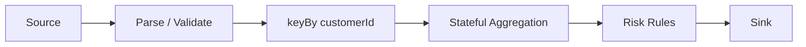

Each logical operator may have many parallel instances called **subtasks**.

For parallelism `p = 4`:

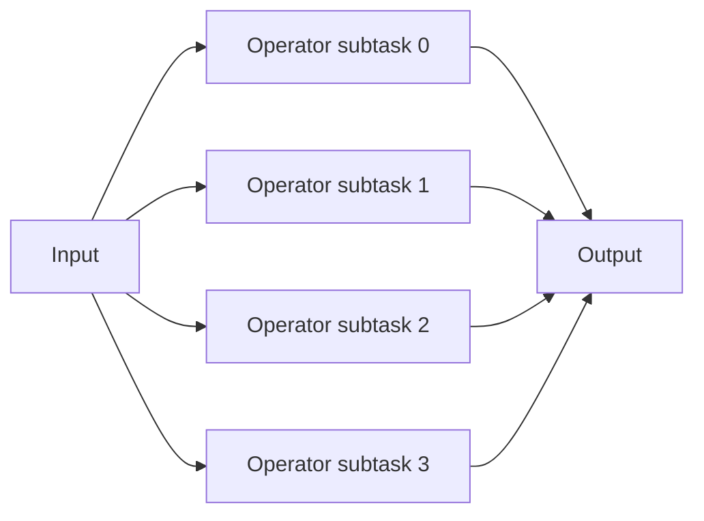

The parallelism of an operator is therefore not "four copies doing arbitrary work." Distribution follows the semantics of the connecting edge:

- forwarding,
- rebalance,
- keyed/hash partitioning,
- broadcasting,
- source-specific partition assignment,
- etc.

# 3. Runtime Architecture

The Flink runtime consists of:

- a **JobManager** process,
- one or more **TaskManager** worker processes.

The JobManager includes three major logical components:

- **Dispatcher**
- **ResourceManager**
- **JobMaster**

A separate JobMaster manages each submitted `JobGraph`. TaskManagers execute the actual operator tasks and exchange streaming data.

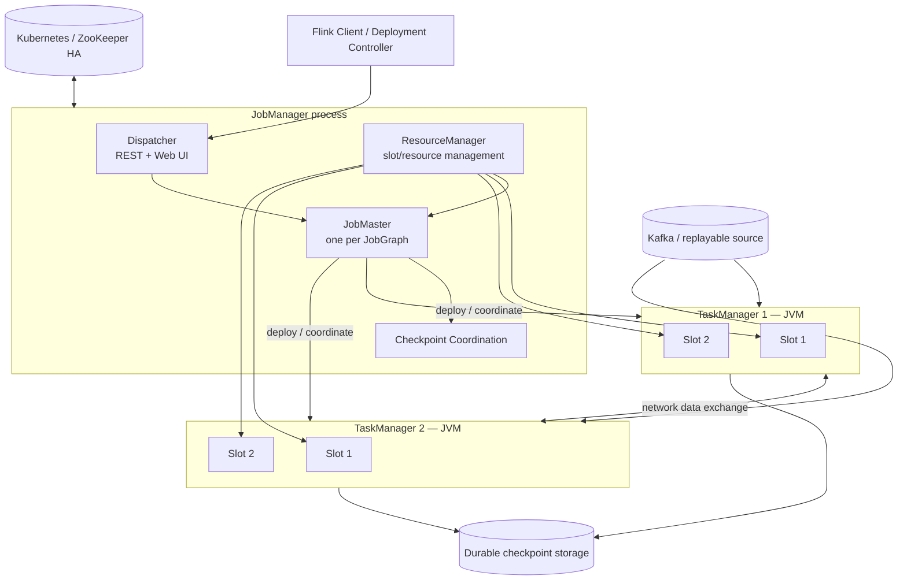

## 3.1 Dispatcher

The Dispatcher:

- exposes Flink's REST endpoint,
- hosts the Web UI,
- receives applications/jobs,
- starts a JobMaster for each submitted job.

## 3.2 ResourceManager

The Flink ResourceManager manages resource allocation and **task slots**.

Its concrete behavior depends on deployment environment.

For example, native Kubernetes integration can communicate with Kubernetes to allocate and deallocate TaskManagers dynamically.

Do not confuse Flink's ResourceManager with Kubernetes itself. Kubernetes owns pods/nodes; Flink's ResourceManager translates Flink's scheduling/resource requirements into the relevant resource-provider operations.

## 3.3 JobMaster

Each job receives its own JobMaster.

It is responsible for coordinating execution of that job's graph, including scheduling/recovery responsibilities represented by the JobManager architecture.

An important architectural implication is:

```text
Cluster != job.
```

A session cluster may contain multiple independent jobs, each with its own JobMaster.

## 3.4 TaskManager

A TaskManager:

- is a worker JVM,
- executes operator subtasks,
- buffers and exchanges records,
- owns local state for its assigned subtasks,
- provides task slots to the scheduler.

TaskManager failure therefore potentially destroys the current **local working copy** of state for its subtasks. Durable recovery comes from restoring the latest checkpoint and replaying input.

This is why local RocksDB is not itself the durable copy of the application's state.

# 4. From User Program to Runtime Execution

A useful conceptual compilation path is:

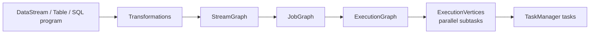

At architecture-review level:

- **logical transformations** describe what computation exists,
- **JobGraph** represents execution operators/stages submitted to the cluster,
- **ExecutionGraph** expands logical vertices into concrete parallel execution vertices and tracks runtime attempts,
- subtasks are scheduled onto TaskManagers.

The important design implication is that apparently small code changes can alter the execution graph, operator chaining, shuffles, state mappings, or resource requirements.

That is one reason stable operator UIDs matter for stateful upgrades.

# 5. Operator Chaining, Tasks, Threads, and Slots

Flink can chain compatible adjacent operator subtasks into one task. A task executes in one thread.

Chaining reduces:

- thread-to-thread handoff,
- serialization/buffering overhead between chained operators,
- latency,

while improving throughput in many pipelines.

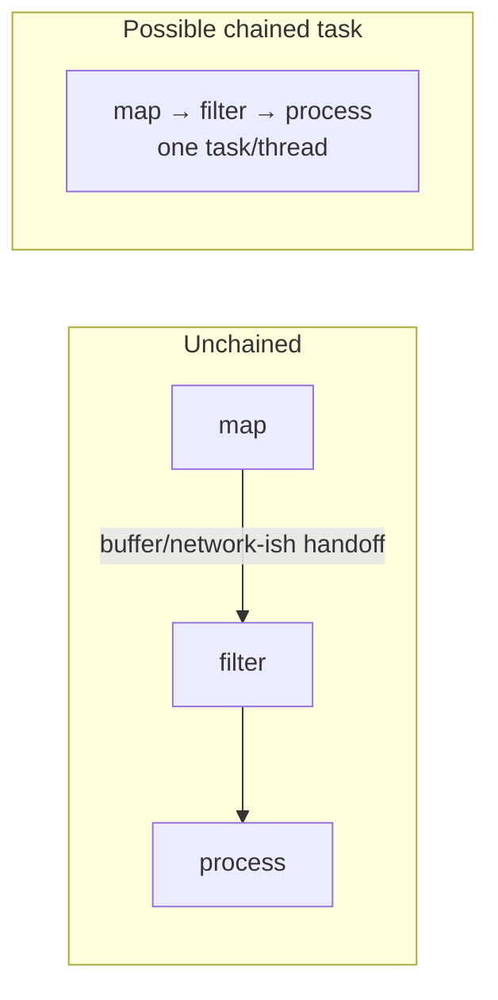

## 5.1 Why chaining matters operationally

Chaining creates a shared failure/performance boundary.

Suppose:

```text
deserialize -> map -> CPU-heavy model -> sink serialization
```

all run in the same chain.

A flame graph or "busy" metric may tell you that the chain is saturated without immediately identifying which logical operator is responsible.

For diagnostics or resource isolation, deliberately breaking a chain may occasionally be useful, but that should be justified because it increases data movement and buffering.

# 6. Task Slots Are Not CPU Cores

This distinction is regularly misunderstood.

A TaskManager is a JVM with one or more **task slots**.

Slots partition **managed memory**, but ordinary slotting does **not provide CPU isolation**. Multiple subtasks from the same job can share a slot, and Flink's default slot sharing allows one slot to contain subtasks from different operators in the same job.

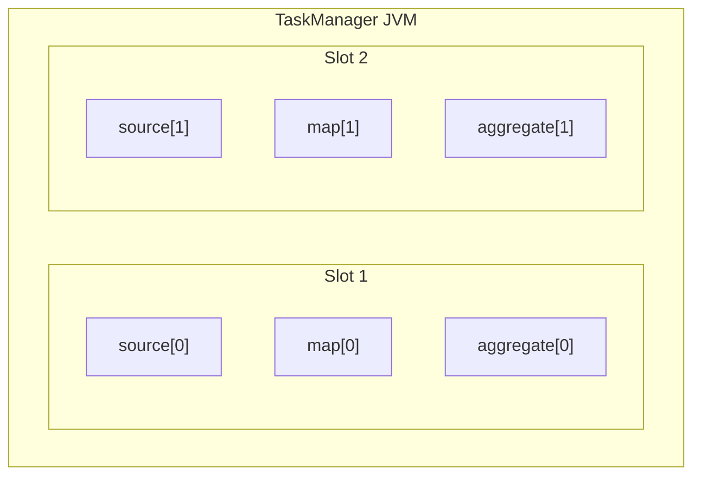

Under default slot sharing, the cluster generally needs as many slots as the **highest operator parallelism**, not the sum of all operator parallelisms.

> [!warning] Architecture-review trap  
> "8 slots" does not mean "8 reserved CPU cores."
>
> If CPU isolation matters, reason about Kubernetes/YARN container resources, TaskManager sizing, slot sharing groups, and potentially fine-grained resource management—not slot count alone.

# 7. Partitioning: The Most Important Data-Architecture Decision

Consider:

```java
orders
    .keyBy(Order::customerId)
    .process(new CustomerRiskFunction());
```

`keyBy()` performs two coupled operations:

1. records with the same key are routed to the same logical keyed partition;
2. state accessed by the downstream keyed operator is scoped to that key.

Apache's stable state API documentation explicitly describes the record stream and corresponding keyed state as partitioned by `keyBy()`.

Conceptually:

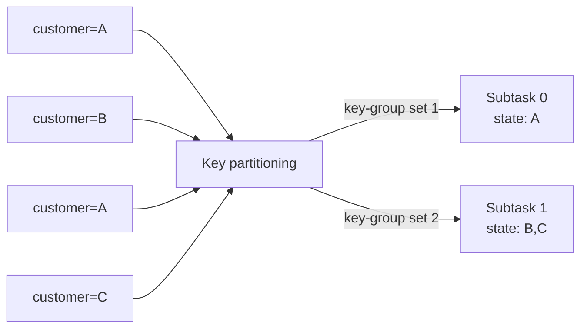

## 7.1 Why the partition key is architectural

Changing:

```text
key = customerId
```

to:

```text
key = accountId
```

can alter:

- ordering scope,
- state distribution,
- hotspot behavior,
- state migration requirements,
- correctness semantics,
- join feasibility,
- downstream scaling characteristics.

Treat key design like a database primary-key decision.

# 8. Key Groups and Maximum Parallelism

Flink does not directly assign every key permanently to a subtask.

Keyed state is divided into **key groups**, which are the atomic units Flink redistributes when stateful operators are rescaled.

The number of key groups corresponds to the operator's **maximum parallelism**.

Therefore:

```text
maxParallelism = future rescaling ceiling for keyed state
```

Apache recommends explicitly configuring maximum parallelism for production. Once state exists, changing explicit maximum parallelism is state-incompatible without discarding/migrating that state. The current documented range is bounded by `2^15`.

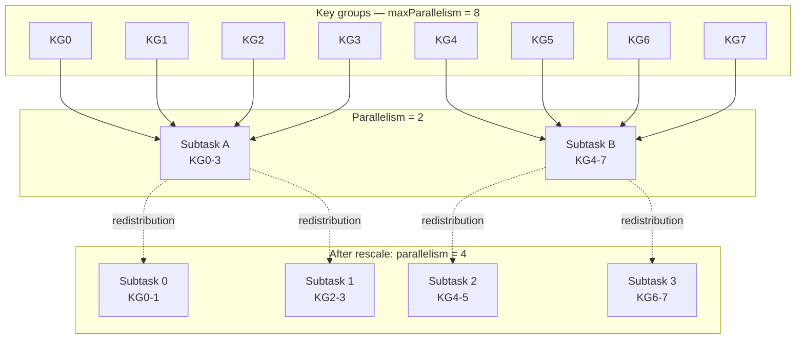

## 8.1 Staff+ rule

Do not pick maximum parallelism based only on today's load.

Choose it based on:

```text
expected multi-year scaling envelope
× key distribution
× acceptable key-group metadata overhead
× operational migration cost if the ceiling is ever exceeded
```

Setting it absurdly high is also not free: Flink maintains metadata tied to key groups, so Apache explicitly advises choosing a value large enough for future scaling but low enough to avoid unnecessary overhead.

# 9. Types of State

## 9.1 Keyed state

Available only after keyed partitioning.

Common primitives include:

- `ValueState`
- `ListState`
- `MapState`
- `ReducingState`
- `AggregatingState`

Conceptually:

```text
state[operator][key] -> value
```

This is the default tool for per-entity state machines.

## 9.2 Operator state

Operator state belongs to a **parallel operator instance**, rather than an individual business key.

It is useful for state such as:

- source split assignments,
- local buffers,
- operator-local metadata.

During rescaling, operator state has redistribution modes such as even redistribution and union-style redistribution.

Use it when the state logically belongs to the operator instance rather than a keyed entity.

## 9.3 Broadcast state

Broadcast state is useful when a small control stream must be available to every downstream parallel task.

Typical example:

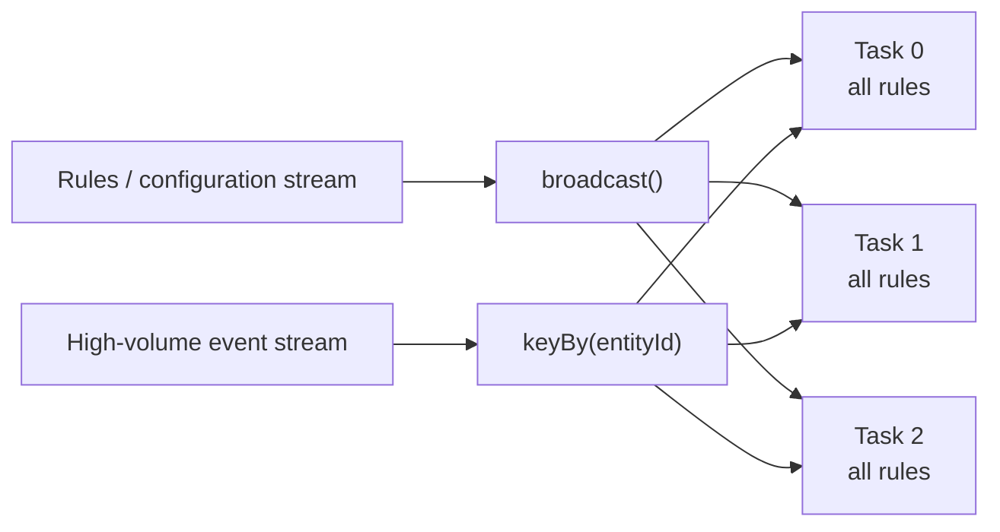

Good uses include:

- dynamic fraud rules,
- feature flags affecting stream logic,
- small reference datasets.

Important constraints:

- each task receives the broadcast updates,
- arrival order may differ across tasks,
- therefore updates must not rely on arrival ordering,
- all tasks checkpoint their broadcast state,
- the runtime copy is in memory, so large broadcast datasets can create significant memory and checkpoint amplification.

> [!warning] Do not use broadcast state as a replicated distributed database  
> If the reference data is millions of large records and continually changing, broadcasting it to every task is usually the wrong state topology.

# 10. State Backend Architecture

The **state backend** determines how Flink holds working state while the job is executing.

This is separate from **checkpoint storage**, which determines where durable snapshots are persisted.

```text
State backend      = active working representation
Checkpoint storage = durable recovery snapshots
```

Confusing the two leads to bad infrastructure decisions.

## 10.1 HashMapStateBackend

`HashMapStateBackend` holds state as Java objects on the JVM heap.

Advantages:

- direct in-memory object access,
- low state-access overhead,
- simpler performance characteristics.

Constraint:

```text
working state must fit into available JVM heap
```

Therefore it is most attractive when state is predictably small enough that heap pressure and GC remain comfortable.

## 10.2 EmbeddedRocksDBStateBackend

`EmbeddedRocksDBStateBackend` stores active state as serialized bytes in a local RocksDB database, normally using TaskManager local storage.

This allows state to grow beyond heap memory and up to available local disk capacity. The trade-off is serialization and RocksDB access overhead relative to direct heap state. It supports asynchronous snapshots and incremental checkpoints.

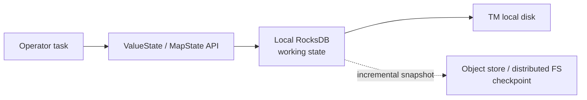

Flink normally budgets RocksDB memory using TaskManager managed memory, including shared caches/write buffers at slot level.

### Production use

RocksDB is often the pragmatic baseline for:

- large keyed state,
- long retention,
- many windows/timers,
- jobs where heap state would be operationally risky.

Do not choose it merely because "production uses RocksDB." Benchmark the state-access pattern.

## 10.3 ForSt and disaggregated state

Flink 2.3 includes `ForStStateBackend`, designed to place SST files in remote storage such as S3/HDFS so state can exceed TaskManager local-disk capacity.

However, Apache explicitly states that the backend remains **experimental and not fully available for production**. It also has savepoint/checkpoint limitations compared with established backends.

Its architecture is roughly:

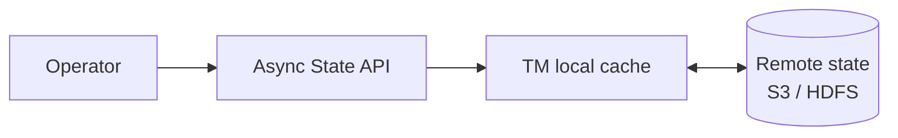

Remote state introduces network latency into the state access path; asynchronous state access exists partly to hide that latency through concurrency.

> [!danger] 2.3 production position  
> Treat ForSt/disaggregated state as an explicit technology-risk decision, not the default choice for a critical Flink deployment.

## 10.4 State backend decision matrix

| Requirement | HashMap | Embedded RocksDB | ForSt |
| --- | --: | --: | --: |
| Lowest state access overhead | ✅ Best | ◑ | ◑ |
| State larger than JVM heap | ❌ | ✅ | ✅ |
| State larger than local disk | ❌ | ❌ | ✅ |
| Incremental checkpoints | ❌ | ✅ | ✅ / inherent |
| Mature production default | ✅ | ✅ | ❌ currently experimental |
| Remote-state latency | None | None for active state | Possible |
| Serialization on access | No equivalent RocksDB boundary | Yes | Yes / async-oriented |
| Large-state operational headroom | Low | High | Very high |

# 11. State TTL Is Not Business-Time Expiration

Flink keyed state can be configured with TTL.

In Flink 2.3, state TTL is based on **processing time**, and physical removal is performed on a best-effort/background basis depending on backend and cleanup configuration. Expired values can nevertheless be configured to behave as logically unavailable before physical deletion.

This distinction is critical.

Suppose the requirement is:

```text
"Invalidate an authorization exactly 30 event-time minutes after
the authorization event."
```

Do **not** implement that semantic solely as:

```java
StateTtlConfig.newBuilder(Duration.ofMinutes(30))
```

because that TTL measures processing/wall-clock time.

Use an **event-time timer** for business semantics, then use TTL as a defensive storage bound if appropriate.

```text
Event-time timer = semantic deadline
State TTL        = state lifecycle / cleanup mechanism
```

# 12. Timers and KeyedProcessFunction

`KeyedProcessFunction` provides direct access to:

- keyed state,
- processing-time timers,
- event-time timers.

Flink synchronizes `processElement()` and `onTimer()` invocation for an operator, avoiding concurrent mutation of its keyed state from those callbacks. Timers are deduplicated per key and timestamp.

Example: flag a payment that never receives a matching confirmation within five event-time minutes.

```java
public final class PaymentTimeoutFunction
        extends KeyedProcessFunction<String, PaymentEvent, Alert> {

    private transient ValueState<PaymentEvent> pending;

    @Override
    public void open(OpenContext ctx) {
        ValueStateDescriptor<PaymentEvent> descriptor =
                new ValueStateDescriptor<>("pending-payment", PaymentEvent.class);

        pending = getRuntimeContext().getState(descriptor);
    }

    @Override
    public void processElement(
            PaymentEvent event,
            Context ctx,
            Collector<Alert> out) throws Exception {

        if (event.type() == PaymentEvent.Type.STARTED) {
            pending.update(event);

            long deadline = event.eventTimeMillis()
                    + Duration.ofMinutes(5).toMillis();

            ctx.timerService().registerEventTimeTimer(deadline);
        }

        if (event.type() == PaymentEvent.Type.CONFIRMED) {
            pending.clear();
        }
    }

    @Override
    public void onTimer(
            long timestamp,
            OnTimerContext ctx,
            Collector<Alert> out) throws Exception {

        PaymentEvent event = pending.value();

        if (event != null) {
            out.collect(new Alert(
                    event.paymentId(),
                    "Payment was not confirmed before event-time deadline"));
            pending.clear();
        }
    }
}
```

The mechanism is straightforward; the harder architecture questions are not.

Ask:

- What watermark progression causes the timer to fire?
- What happens when a partition is idle?
- How late can confirmations arrive?
- Must a late confirmation retract the alert?
- How is the alert sink made idempotent?
- What is the state-retention bound for keys that never receive usable watermarks?

Those are the production design questions.

# 13. Event Time and Watermarks

## 13.1 Event time

Event time represents when the event occurred in the domain.

Example:

```json
{
  "payment_id": "p123",
  "occurred_at": "2026-09-10T10:00:03Z"
}
```

The record may reach Flink at `10:00:08`, `10:00:30`, or after a retry several minutes later.

Processing-time correctness would use arrival time.

Event-time correctness uses `occurred_at`.

## 13.2 Watermarks

A watermark is Flink's statement about **event-time progress**.

Roughly:

```text
watermark = W

=> the system believes it has progressed past event time W
```

It is not an absolute promise that no older record can ever arrive.

Watermarks allow the system to decide when event-time timers and windows can progress despite out-of-order streams.

For multi-input operators, effective watermark progress is constrained by the slowest relevant input; Flink documents two-input operator watermark progress as the minimum of its inputs.

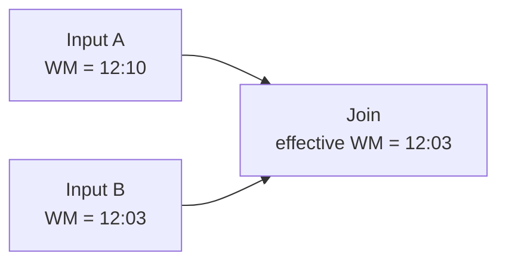

## 13.3 Watermark strategy at the source

Flink recommends assigning watermark strategies directly on sources where possible because sources can exploit split/partition knowledge. Kafka, for example, can generate per-partition watermarks before combining them.

Example:

```java
KafkaSource<OrderEvent> source =
        KafkaSource.<OrderEvent>builder()
                .setBootstrapServers("kafka:9092")
                .setTopics("orders")
                .setGroupId("order-risk-v1")
                .setStartingOffsets(OffsetsInitializer.earliest())
                .setValueOnlyDeserializer(new OrderEventDeserializer())
                .build();

WatermarkStrategy<OrderEvent> watermarks =
        WatermarkStrategy
                .<OrderEvent>forBoundedOutOfOrderness(Duration.ofSeconds(10))
                .withTimestampAssigner(
                        (event, previousTimestamp) -> event.eventTimeMillis())
                .withIdleness(Duration.ofMinutes(1));

DataStream<OrderEvent> orders =
        env.fromSource(source, watermarks, "orders-source")
           .uid("orders-source");
```

## 13.4 Idle partitions

Suppose one Kafka partition becomes quiet.

If Flink waits indefinitely for its watermark, global event time can stall even though all other partitions continue processing.

`withIdleness(...)` lets an inactive split stop holding back watermark progression.

This is why a system can have:

```text
healthy throughput + low Kafka lag + windows that never close
```

Watermarks deserve dedicated observability.

## 13.5 Watermark alignment

The opposite problem occurs when one source races far ahead of another.

For stateful downstream operations such as joins, the faster side may accumulate a large amount of buffered state while waiting for the slower side.

Watermark alignment lets Flink throttle/pause a source that has advanced too far beyond its alignment group. It applies to FLIP-27 sources and requires appropriate source support for split-level pause/resume.

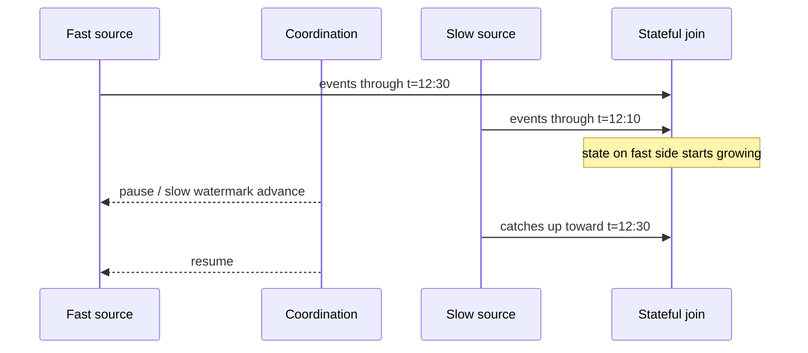

Watermark alignment is therefore not merely a correctness feature. It can be a **state-size control mechanism**.

# 14. Windows and Late Data

Flink's event-time windows remain until the watermark progresses beyond the window end plus configured allowed lateness.

By default, allowed lateness is zero. Late elements beyond the accepted boundary can be dropped or routed through a side output. Late-but-accepted events can cause additional firings, so downstream consumers must be able to interpret updated results.

```mermaid
timeline
    title Event-time window
    12:00 : window starts
    12:05 : logical window end
    12:05 : first firing when watermark passes boundary
    12:06 : allowed lateness expires
    12:06 : window state can be removed
```

## 14.1 Design implication

If your output is:

```text
merchant M -> transaction_count = 100
```

and a late firing later produces:

```text
merchant M -> transaction_count = 102
```

the sink needs a clearly defined semantic:

- append both and let consumers reconcile,
- upsert by `(merchant, window_start)`,
- produce a correction/retraction stream,
- or discard late updates by product decision.

"Window finished" is not enough specification.

# 15. Checkpointing: The Core Fault-Tolerance Mechanism

Checkpointing captures a consistent recovery point spanning:

- operator state,
- relevant source positions,
- and, where supported, connector transaction state.

Flink's mechanism is based on distributed asynchronous snapshots inspired by Chandy-Lamport.

Checkpointing is **disabled by default** and requires replayable/durable input to realize the intended recovery semantics.

## 15.1 Barrier intuition

Checkpoint barriers flow through the same dataflow as records.

For an aligned checkpoint:

```mermaid
sequenceDiagram
    participant C as Checkpoint coordinator
    participant S1 as Source partition A
    participant S2 as Source partition B
    participant O as Stateful operator
    participant Store as Durable storage

    C->>S1: Trigger checkpoint N
    C->>S2: Trigger checkpoint N

    S1->>O: records
    S1->>O: barrier N
    S2->>O: records

    Note over O: barrier from A arrived;<br/>alignment may wait for B

    S2->>O: barrier N

    O->>Store: async snapshot state for N
    O-->>C: checkpoint acknowledgement

    Note over C,Store: Once all required acknowledgements<br/>complete, checkpoint N succeeds
```

The barrier establishes a logical cut through the distributed computation.

## 15.2 Failure recovery

Conceptually:

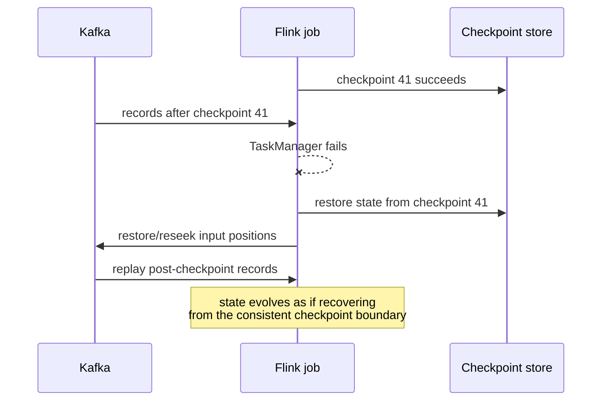

Records may physically execute again after failure.

That does not violate Flink's exactly-once **state** semantics.

> [!important]  
> Exactly-once does **not** mean "the user function executes one physical time."
>
> It means recovery prevents a record from affecting the recoverable managed state more than once relative to the consistent checkpoint history.

# 16. Checkpoint Storage vs State Backend

These must remain separate in your mental model.

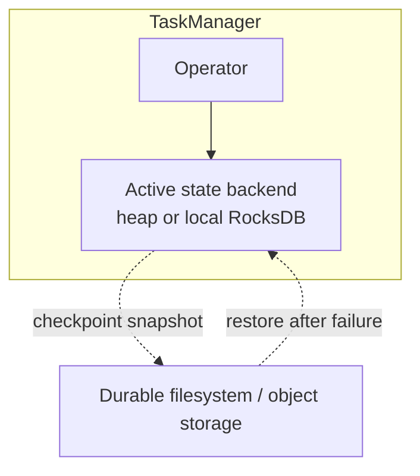

Apache recommends `FileSystemCheckpointStorage` for HA setups; JobManager-hosted checkpoint storage is intended for small/local use cases because checkpoint data must fit the JobManager's memory constraints.

Production systems should therefore treat checkpoint object storage as critical infrastructure.

# 17. Checkpoint Configuration Example

A simplified baseline:

```java
StreamExecutionEnvironment env =
        StreamExecutionEnvironment.getExecutionEnvironment();

env.enableCheckpointing(30_000);

CheckpointConfig checkpoints = env.getCheckpointConfig();

checkpoints.setCheckpointingMode(CheckpointingMode.EXACTLY_ONCE);
checkpoints.setMinPauseBetweenCheckpoints(10_000);
checkpoints.setCheckpointTimeout(120_000);
checkpoints.setMaxConcurrentCheckpoints(1);

checkpoints.setExternalizedCheckpointRetention(
        CheckpointConfig.ExternalizedCheckpointRetention
                .RETAIN_ON_CANCELLATION);

Configuration config = new Configuration();
config.set(CheckpointingOptions.CHECKPOINT_STORAGE, "filesystem");
config.set(
        CheckpointingOptions.CHECKPOINTS_DIRECTORY,
        "s3://company-flink-checkpoints/prod/order-risk");

env.configure(config);
```

The numbers above are examples, **not universal production recommendations**.

Checkpoint interval is a product/operations trade-off involving:

- maximum replay after failure,
- recovery objectives,
- checkpoint bandwidth and CPU cost,
- state size,
- downstream visibility latency for checkpoint-committed sinks.

Apache's production checklist explicitly notes that exactly-once sinks such as Kafka/FileSink may make output visible only after checkpoint completion, so checkpoint cadence can become part of application delivery latency.

# 18. Aligned vs Unaligned Checkpoints

## 18.1 Aligned checkpoints

At multi-input operators, barriers from one input may wait for barriers from other inputs.

Under strong backpressure this waiting can dominate checkpoint duration.

## 18.2 Unaligned checkpoints

Unaligned checkpoints allow barriers to overtake buffered in-flight data by including that data in the checkpoint.

This can make checkpoint duration much less sensitive to backpressure, but increases checkpoint I/O/state size because in-flight buffers are now part of the snapshot. Apache recommends them when checkpoint duration is high specifically because of backpressure—not when checkpoint storage I/O itself is the bottleneck.

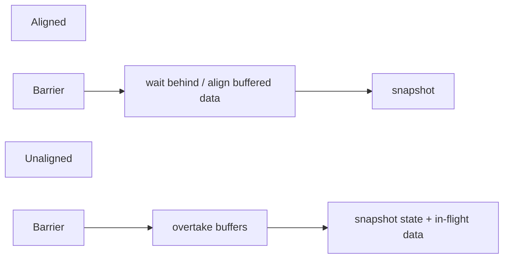

Flink also supports an aligned-checkpoint timeout:

```java
env.getCheckpointConfig().enableUnalignedCheckpoints();

env.getCheckpointConfig()
   .setAlignedCheckpointTimeout(Duration.ofSeconds(30));
```

This starts checkpoints aligned and switches to unaligned if alignment takes too long.

> [!warning]  
> Unaligned checkpoints are a recovery/checkpoint mechanism, **not a throughput fix**.
>
> If the sink can consume 80k events/s and the source produces 120k events/s forever, no checkpoint mode changes that arithmetic.

# 19. End-to-End Exactly Once

Correctly reasoning about exactly-once requires separating three layers.

```text
1. Source recovery semantics
2. Flink managed-state semantics
3. External sink effect semantics
```

## 19.1 Source

The source needs to be replayable or otherwise checkpoint-aware.

Kafka is a canonical example because offsets/partitions provide replay positions.

Apache documents Kafka as providing exactly-once state-update semantics when integrated with Flink's checkpointing mechanism.

## 19.2 Managed state

On recovery:

```text
restore checkpoint state
+
restore/replay source position
=
consistent state evolution
```

## 19.3 Sink

The external sink must prevent replayed records from producing duplicate committed effects.

Common strategies:

### Transactional sink

```text
write outputs into transaction T
checkpoint completes
commit T
```

### Idempotent sink

```text
write(eventId, result)
repeat same write safely
```

### Deduplicating consumer

```text
emit stable event ID
consumer stores processed IDs / versions
```

These are not semantically identical. Choose deliberately.

# 20. Kafka Exactly-Once Sink Example

`KafkaSink` supports:

- `NONE`,
- `AT_LEAST_ONCE`,
- `EXACTLY_ONCE`.

Its default is `NONE`.

`AT_LEAST_ONCE` and `EXACTLY_ONCE` require checkpointing. Under `EXACTLY_ONCE`, records are written into Kafka transactions committed on checkpoint completion. Consumers need `read_committed` semantics if they must not observe uncommitted transactions. Transaction IDs must be unique between applications, and Kafka transaction timeout must accommodate checkpoint/restart timing.

```java
KafkaSink<FraudAlert> sink =
        KafkaSink.<FraudAlert>builder()
                .setBootstrapServers("kafka:9092")
                .setRecordSerializer(
                        KafkaRecordSerializationSchema
                                .<FraudAlert>builder()
                                .setTopic("fraud-alerts")
                                .setValueSerializationSchema(
                                        new FraudAlertSerializer())
                                .build())
                .setDeliveryGuarantee(DeliveryGuarantee.EXACTLY_ONCE)
                .setTransactionalIdPrefix("fraud-engine-prod-v1-")
                .build();

alerts
    .sinkTo(sink)
    .name("fraud-alert-kafka-sink")
    .uid("fraud-alert-kafka-sink");
```

## 20.1 Latency implication

If output visibility waits for checkpoint commit, user-visible latency can include:

```text
ingestion delay
+ processing delay
+ watermark delay (if relevant)
+ checkpoint scheduling
+ checkpoint duration
+ Kafka transaction visibility
```

Thus an architecture requirement of:

```text
"fraud block must become visible in < 500 ms"
```

should immediately trigger a conversation about whether checkpoint-committed transactional output is compatible with the requirement.

Exactly-once is not a free checkbox.

# 21. Savepoints vs Checkpoints

Use this mental model:

```text
Checkpoint ≈ automated recovery mechanism
Savepoint  ≈ user-controlled operational snapshot
```

Apache compares them to recovery logs versus backups.

Checkpoints are Flink-owned and optimized for recovery. Savepoints are user-owned and intended for planned operations such as changing job code, topology, or Flink version. Canonical savepoints favor portability; native formats can trade portability for faster creation/restoration.

| Property | Checkpoint | Savepoint |
| --- | --- | --- |
| Main purpose | Failure recovery | Planned operational change |
| Triggering | Usually automatic | User/operator controlled |
| Ownership | Flink | User |
| Lifecycle | Managed by Flink | Managed by operator |
| Upgrade workflow | Sometimes usable | Preferred explicit mechanism |
| Portability focus | Lower | Higher for canonical format |
| Frequency | Often frequent | Occasional |

# 22. Stable Operator UIDs Are Part of Your Persistent Schema

Consider:

```java
events
    .keyBy(Event::accountId)
    .process(new RiskFunction())
    .uid("account-risk-v1");
```

Flink maps saved operator state back onto the upgraded graph using operator identifiers.

Generated IDs depend on graph structure and can change when the topology changes. Apache therefore recommends explicit UIDs for production jobs using state/savepoints.

> [!danger] Treat `.uid()` like a database schema identifier  
> Renaming/removing an operator UID casually can make state restoration impossible or map state incorrectly during an upgrade workflow.

A good naming scheme is stable and semantic:

```text
orders-source
validated-orders
customer-risk-state
fraud-alert-kafka-sink
```

not implementation-version noise such as:

```text
map-4-new-final-v7
```

unless a deliberate state break is desired.

# 23. State Schema Evolution

State schema becomes a long-lived compatibility contract.

Flink 2.3 documents automatic state schema evolution for supported **POJO and Avro** state under defined compatibility rules.

Important limitations include:

- changing the schema of a **key** is not supported,
- Kryo-based state does not provide Flink's schema-evolution guarantees,
- serializer compatibility ultimately determines whether saved state can be restored.

A safe upgrade workflow is:

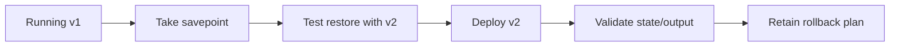

## Staff+ implication

Your deployment system should test **state restoration**, not merely compilation/unit tests.

A job that builds successfully but cannot restore its 4 TB of production state is not deployable.

# 24. State TTL Migration Nuance in Flink 2.3

Starting with Flink 2.2, Apache documents support for enabling/disabling TTL across the major heap/RocksDB state backends during restore, subject to serializer and migration limitations. Existing non-TTL state does not become retroactively expired merely because TTL is enabled.

This is a good example of why version-specific documentation matters.

Do not rely on remembered behavior from older Flink releases when designing a state migration.

# 25. Backpressure

Backpressure is what happens when downstream processing cannot keep up.

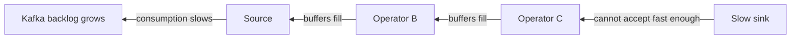

This is desirable as a safety mechanism: Flink does not want unbounded in-memory queues.

But persistent backpressure indicates that sustainable capacity is below offered load.

## 25.1 Root causes

Typical causes include:

- hot keys,
- slow external service,
- undersized sink,
- insufficient parallelism,
- expensive serialization,
- RocksDB cache misses/compaction pressure,
- CPU saturation,
- network limits,
- blocking synchronous I/O,
- pathological windows,
- excessive timer firings,
- sink throttling,
- object-store checkpoint bottlenecks.

## 25.2 Backpressure and checkpoints

Heavy backpressure can delay aligned checkpoint barriers.

Apache specifically recommends investigating the actual backpressure source first, reducing in-flight buffering where appropriate, or enabling unaligned checkpoints when checkpoint alignment delay is the problem.

The Staff+ reasoning sequence should be:

```text
Symptom: checkpoint duration increased

          ↓

Is barrier alignment/start delay high?
          ↓ yes

Is the job backpressured?
          ↓ yes

Where is the first saturated downstream operator?
          ↓

Why is its service rate insufficient?
          ↓

Fix capacity/skew/I/O first
          ↓
Optionally change checkpoint strategy
```

# 26. Skew: The Enemy Hidden by Averages

Suppose 100 subtasks process:

```text
average = 10k events/s
```

but one customer receives 20% of all traffic and is assigned to a single key.

If all events for that customer must remain ordered under the same keyed state:

```text
global parallelism cannot split that single key.
```

Adding another hundred TaskManagers does not solve a fundamentally unsplittable hot key.

## 26.1 Strategies

Possible redesigns include:

- hierarchical/sharded keys,
- two-phase aggregation,
- local partial aggregation before keyed aggregation,
- separating hot tenants,
- dedicated jobs for extreme outliers,
- changing the domain invariant if strict single-key serialization is unnecessary.

Example two-stage aggregation:

```mermaid
flowchart LR
    EVENTS[Events]
    SHARD["keyBy(customerId, shard)"]
    PARTIAL["Partial aggregates"]
    FINAL["keyBy(customerId)"]
    RESULT["Final aggregate"]

    EVENTS --> SHARD --> PARTIAL --> FINAL --> RESULT
```

This works only when the operation is decomposable.

For associative aggregations such as counts/sums, often yes.

For a strict per-customer state machine requiring total order, maybe not.

# 27. Async I/O for External Enrichment

Never casually put blocking database/network calls inside a `map()` or `processElement()` function.

If each request takes 50 ms and a subtask processes one synchronously:

```text
maximum idealized throughput ≈ 1 / 0.05 = 20 requests/s
```

Async I/O allows multiple requests in flight.

```mermaid
sequenceDiagram
    participant Flink as Async operator
    participant API as External service

    Flink->>API: request A
    Flink->>API: request B
    Flink->>API: request C

    API-->>Flink: response B
    API-->>Flink: response A
    API-->>Flink: response C
```

Apache's async I/O API defines:

- **timeout**: maximum request lifecycle,
- **capacity**: maximum concurrent requests per parallel operator instance,
- retry strategy,
- **ordered** mode,
- **unordered** mode.

When capacity is exhausted, backpressure is applied rather than letting pending requests grow without bound.

## 27.1 Staff+ concern: dependency amplification

Suppose:

```text
parallelism = 200
async capacity = 500
```

Potential concurrent requests:

```text
200 × 500 = 100,000
```

An innocent-looking Flink tuning parameter can therefore become a 100k-request denial-of-service attack against your dependency.

Capacity planning must be negotiated with the dependency owner.

# 28. Streaming SQL and Dynamic State

Flink SQL is highly valuable because many streaming computations can be expressed declaratively.

But SQL syntax hides physical state.

This query looks harmless:

```sql
SELECT *
FROM Orders o
JOIN Payments p
  ON o.order_id = p.order_id;
```

For an unrestricted **regular streaming join**, Flink must retain records from both inputs so future changes can match previous records. Apache explicitly warns that regular joins can cause state to grow indefinitely. TTL can bound the state, but may change query correctness.

> [!danger] SQL abstraction does not remove state economics  
> Every streaming `JOIN`, `GROUP BY`, `DISTINCT`, `Top-N`, deduplication, or window should trigger:
>
> **"What state is this query materializing, and what bounds its cardinality and lifetime?"**

## 28.1 Prefer naturally bounded joins when possible

Examples:

- interval joins,
- window joins,
- temporal/versioned joins where semantics permit,
- bounded lookup/reference designs.

The goal is not "avoid joins."

The goal is to encode a domain constraint that lets state expire **without changing correctness**.

Compare:

```text
"Orders may match payments forever."
```

versus:

```text
"A payment must match an order within 24 event-time hours."
```

The second requirement gives the architecture a legitimate state bound.

## 28.2 SQL state TTL

Flink 2.3 supports `STATE_TTL` hints for relevant stateful SQL operations such as regular joins and group aggregation.

Example form:

```sql
SELECT /*+ STATE_TTL('o'='3d', 'p'='1d') */
       *
FROM Orders AS o
LEFT JOIN Payments AS p
  ON o.order_id = p.order_id;
```

This is a resource-control tool, not magic correctness.

If a legitimate matching record appears after its counterpart has been evicted, the result may differ from an infinite-retention query.

# 29. Windowed SQL Example

A typical event-time aggregation:

```sql
CREATE TABLE orders (
    merchant_id STRING,
    amount DECIMAL(18, 2),
    event_time TIMESTAMP_LTZ(3),
    WATERMARK FOR event_time AS event_time - INTERVAL '10' SECOND
) WITH (
    'connector' = 'kafka',
    'topic' = 'orders'
    -- connector-specific options omitted
);

SELECT
    merchant_id,
    window_start,
    window_end,
    COUNT(*) AS order_count,
    SUM(amount) AS gross_amount
FROM TABLE(
    TUMBLE(
        TABLE orders,
        DESCRIPTOR(event_time),
        INTERVAL '1' MINUTE
    )
)
GROUP BY
    merchant_id,
    window_start,
    window_end;
```

The architecture questions remain:

- What does ten seconds of watermark delay mean to the business?
- How are later records handled?
- Is output append-only or updated?
- What sink consumes it?
- What is the expected key cardinality?
- Are merchants evenly distributed?
- What happens during a two-hour Kafka backlog replay?

SQL does not eliminate these decisions.

# 30. Production Reference Architecture

A common production architecture is:

```mermaid
flowchart LR
    PRODUCERS["Application services"]
    KIN[(Kafka<br/>input topics)]

    subgraph FLINK["Flink Application Cluster"]
        SOURCE["KafkaSource"]
        VALIDATE["Parse / validate"]
        KEY["keyBy(domain key)"]
        STATE["Stateful processing<br/>RocksDB"]
        RULES["Rules / enrichment"]
        SINK["KafkaSink"]
    end

    KOUT[(Kafka<br/>output / changelog)]
    DOWN["Downstream services"]
    OLAP["Realtime OLAP / serving layer"]

    CKPT[(Object storage<br/>checkpoints/savepoints)]
    HA["Kubernetes HA"]
    METRICS["Metrics / dashboards / alerts"]
    LOGS["Central logs"]

    PRODUCERS --> KIN
    KIN --> SOURCE
    SOURCE --> VALIDATE --> KEY --> STATE --> RULES --> SINK
    SINK --> KOUT
    KOUT --> DOWN
    KOUT --> OLAP

    STATE -. snapshots .-> CKPT
    FLINK <--> HA
    FLINK --> METRICS
    FLINK --> LOGS
```

Why Kafka-to-Flink-to-Kafka is common:

- replay boundary before computation,
- independent decoupling after computation,
- Kafka sink can participate in checkpoint-driven transactions,
- downstream consumers do not need to understand Flink state,
- reprocessing can publish a new version/topic.

This is not mandatory, but it creates clean failure domains.

# 31. Deployment Modes

Flink 2.3 documents two main deployment modes:

- **Application Mode**
- **Session Mode**.

## 31.1 Application Mode

Application Mode dedicates a Flink cluster to an application.

Advantages:

- stronger application isolation,
- lifecycle isolation,
- easier resource ownership,
- smaller cross-application blast radius.

Flink's native Kubernetes documentation recommends Application Mode for production because it provides better application isolation.

## 31.2 Session Mode

A Session cluster allows multiple applications/jobs to share TaskManagers.

Benefits:

- potentially better resource utilization,
- lower startup overhead,
- useful for interactive or many smaller jobs.

Costs:

- noisy-neighbor risk,
- shared TaskManager failure domain,
- broader capacity-management coupling,
- upgrade coordination.

## 31.3 Staff+ default

For independently owned, business-critical streaming applications:

```text
prefer Application Mode unless resource economics provide
a compelling reason for a shared Session cluster.
```

Isolation tends to be worth more than marginal bin-packing efficiency once multiple teams and different SLOs are involved.

# 32. Kubernetes Deployment Model

Flink supports native Kubernetes integration and also provides a Kubernetes Operator for lifecycle management. Native integration can allocate/deallocate TaskManagers through Kubernetes.

A conceptual Application Mode layout:

```mermaid
flowchart TB
    subgraph K8S["Kubernetes cluster"]
        subgraph APP["Flink application"]
            JM["JobManager pod"]
            TM1["TaskManager pod"]
            TM2["TaskManager pod"]
            TM3["TaskManager pod"]
        end

        API["Kubernetes API / HA metadata"]
    end

    JM --> TM1
    JM --> TM2
    JM --> TM3
    JM <--> API

    OBJ[(S3 / durable filesystem)]
    TM1 --> OBJ
    TM2 --> OBJ
    TM3 --> OBJ
```

## Production Kubernetes concerns

Reason explicitly about:

- requested vs limited CPU,
- memory/container limits,
- local ephemeral-disk requirements for RocksDB,
- pod eviction,
- node disruption,
- topology spread / availability zones,
- object-store bandwidth,
- service-account permissions,
- HA metadata,
- graceful savepoint/upgrade workflow,
- image/version immutability,
- secret handling.

A TaskManager with RocksDB can be storage-heavy even when checkpoint storage is remote.

# 33. JobManager High Availability

Without HA, the JobManager is a central failure point.

Flink supports HA services including:

- Kubernetes HA,
- ZooKeeper-based HA.

Conceptually:

```mermaid
flowchart LR
    ACTIVE["Active JobManager"]
    STANDBY["Standby JobManager"]
    HA[(HA metadata / leader election)]
    CKPT[(Durable state)]

    ACTIVE <--> HA
    STANDBY <--> HA
    ACTIVE --> CKPT
    STANDBY -. recovery metadata .-> CKPT
```

Flink's production checklist strongly recommends JobManager HA for production.

HA and checkpoints solve different problems:

```text
HA           = coordinator availability/re-election
Checkpoint   = dataflow state recovery
```

You generally need both.

# 34. Multi-Job Application Mode Caveat

Flink 2.3 supports applications whose `main()` submits multiple jobs, but the deployment documentation explicitly notes HA limitations for multi-job Application Mode: HA is supported for a single streaming job or multiple batch jobs, not arbitrary multiple concurrent streaming jobs in one Application application.

Staff+ lesson:

> Do not bundle unrelated streaming jobs into one Application cluster just because the API permits multiple `executeAsync()` calls.

Separate deployment boundaries usually provide clearer failure ownership.

# 35. Memory Architecture

A TaskManager's memory is not just Java heap.

Operationally it includes categories such as:

- JVM heap,
- framework/task memory,
- managed memory,
- network buffers/direct memory,
- native components such as RocksDB,
- JVM metaspace/overhead.

For RocksDB, Flink normally uses managed-memory budgets to bound major RocksDB caches/write buffers at slot scope.

## Staff+ consequence

"Kubernetes pod uses 14 GB while `-Xmx` is 8 GB" does not automatically imply a leak.

Likewise:

```text
container limit = JVM heap
```

is an unsafe capacity model for a native-memory-heavy Flink job.

# 36. Scaling Model

The first-order throughput model is:

```text
required parallelism
≈ peak input rate
  / sustainable per-subtask processing rate
  × safety factor
```

But production capacity cannot be estimated from that formula alone.

Also account for:

- key skew,
- source partition count,
- sink limits,
- state size per key,
- RocksDB write amplification,
- checkpoint bandwidth,
- network shuffle volume,
- async dependency quotas,
- backlog catch-up targets,
- rescaling/recovery overhead.

## 36.1 Design for recovery capacity, not normal capacity

Suppose normal traffic is:

```text
100k events/s
```

and the job is provisioned for:

```text
110k events/s
```

After a one-hour incident, backlog may be enormous.

At only 10% spare throughput:

```text
catch-up time can be many hours.
```

A streaming system with no catch-up budget is not truly resilient.

Define:

```text
normal utilization ceiling
backlog catch-up rate
maximum tolerated recovery time
```

as explicit SLO inputs.

# 37. Checkpoint Capacity Model

Checkpoint duration roughly depends on:

```text
state snapshot work
+ data written
+ storage bandwidth
+ barrier delay
+ network contention
```

For RocksDB incremental checkpoints, the amount uploaded per checkpoint can be much smaller than full state because only changes since prior completed checkpoints need to be captured. Apache recommends considering incremental checkpoints for large state.

But remember:

```text
small incremental checkpoint != small total recoverable state
```

Monitor both incremental checkpoint size and full state size where available.

# 38. Operational Metrics That Actually Matter

A useful production dashboard should cover six categories.

## 38.1 Input health

- records/events per second,
- Kafka/source lag,
- partition-level skew,
- deserialization failures,
- watermark progress.

## 38.2 Processing health

- busy time,
- backpressured time,
- idle time,
- records in/out,
- operator latency where instrumented,
- async I/O pending/failure/timeout counts.

## 38.3 State

- keyed-state size,
- RocksDB disk usage,
- local disk free space,
- RocksDB compaction/read/write behavior,
- timer counts where relevant,
- state growth rate.

## 38.4 Checkpoints

- checkpoint success/failure count,
- end-to-end duration,
- checkpointed data size,
- full checkpoint size,
- alignment duration,
- start delay,
- bytes buffered during alignment,
- time since last successful checkpoint.

The stable Flink UI exposes checkpoint history/configuration and detailed per-operator/subtask statistics.

## 38.5 Runtime

- TaskManager restarts,
- JobManager failovers,
- pod/container restarts,
- CPU,
- JVM GC,
- heap,
- direct/native memory,
- network,
- disk I/O.

## 38.6 Product correctness

Infrastructure metrics are not enough.

Also expose:

- late-event rate,
- rule hit rate,
- deduplication count,
- dropped invalid events,
- business reconciliation mismatches,
- output correction/retraction counts.

The worst Flink incident is often:

```text
job is green
but answers are wrong
```

# 39. Interpreting Checkpoint Symptoms

## Symptom: checkpoint duration spikes

Possible investigation tree:

```mermaid
flowchart TD
    A["Checkpoint duration ↑"]

    A --> B{"Alignment/start delay ↑?"}
    B -->|Yes| C["Investigate backpressure/skew"]
    B -->|No| D{"Async snapshot time ↑?"}

    D -->|Yes| E["State/storage/RocksDB I/O"]
    D -->|No| F{"Checkpoint data size ↑?"}

    F -->|Yes| G["State growth / in-flight data"]
    F -->|No| H["Storage/network instability"]
```

Do not jump directly from:

```text
checkpoint slow
```

to:

```text
increase timeout
```

A timeout increase may only hide the degradation.

# 40. Failure Modes and Edge Cases

## 40.1 Poison record restart loop

A deterministic exception for one input event can produce:

```text
restore checkpoint
→ replay poison event
→ crash
→ restore
→ replay poison event
→ crash
```

Mitigations:

- validate at the boundary,
- route malformed events to a dead-letter/side output,
- classify retryable vs deterministic failures.

## 40.2 Hot key

One key saturates one task.

Increasing overall parallelism may not help.

Mitigation requires repartitioning semantics, not merely more compute.

## 40.3 Watermark stall

One inactive/unhealthy partition prevents event-time progress.

Symptoms:

- input records still flowing,
- event-time timers don't fire,
- window state grows.

Configure/observe idleness appropriately.

## 40.4 Incorrect watermark too aggressive

If watermarks advance beyond realistic out-of-order behavior, valid events appear late.

Possible consequences:

- discarded events,
- corrective late firings,
- incorrect joins.

Watermark policy is a correctness policy.

## 40.5 External enrichment outage

Async calls accumulate to capacity.

Then:

```text
dependency latency ↑
→ async queue fills
→ Flink backpressure
→ Kafka lag ↑
```

This is desirable containment, but only if the backlog/recovery plan exists.

## 40.6 Checkpoint storage outage

Without successful checkpoints:

- recovery point becomes older,
- replay requirement increases,
- sink transactions may not commit,
- eventually checkpoint failure policy may destabilize the job.

Object storage is therefore part of the runtime dependency graph.

## 40.7 Local RocksDB disk exhaustion

Even when checkpoints use S3, active RocksDB state is normally local.

If local disk fills:

```text
state writes/compaction fail
→ task fails
→ replacement restores state
→ may fail again if sizing unchanged
```

Remote checkpoint storage does not remove local-disk sizing requirements for Embedded RocksDB.

## 40.8 Unbounded SQL join

State continuously grows because query semantics never permit eviction.

TTL may stop resource growth at the cost of changing semantics.

The architectural fix is often to establish a valid time/domain bound.

## 40.9 Transaction timeout mismatch

Exactly-once Kafka transactions remain uncommitted until checkpoints.

Kafka transaction timeout must exceed realistic checkpoint/restart timing. Apache explicitly warns that expiring these transactions prematurely can cause data-loss semantics.

## 40.10 State migration failure

A deployment changes:

- operator UID,
- key schema,
- incompatible serializer,
- topology/state association.

The new binary starts successfully but cannot restore production state.

Treat restore compatibility as a pre-deployment test.

# 41. Backfills and Reprocessing

A production streaming architecture must answer:

> How do we recompute history when business logic changes?

Options include:

## Strategy A — replay Kafka

Start from earlier offsets with a new consumer group/job and emit to a new versioned output.

Best when source retention covers the required period.

## Strategy B — bounded historical source

Replay historical data from durable object storage/data lake.

Useful when Kafka retention is shorter than business history.

## Strategy C — bootstrap from existing materialized state

Use snapshots/savepoints or another state bootstrap technique when full history replay is prohibitively expensive.

This is more operationally sophisticated and increases coupling to state schema.

## Staff+ recommendation

Design backfill before launch.

Explicitly define:

```text
source of truth
maximum replay horizon
output versioning strategy
how live and historical computation converge
how duplicate side effects are prevented
```

If the only answer is "we would rerun Kafka somehow," the design is incomplete.

# 42. Dual-Running and Safe Migration

For high-risk changes, prefer:

```mermaid
flowchart LR
    SOURCE[(Input)]

    SOURCE --> OLD["Flink v1"]
    SOURCE --> NEW["Flink v2 shadow"]

    OLD --> PROD["Production output"]
    NEW --> SHADOW["Shadow output"]

    PROD --> COMPARE["Reconciliation"]
    SHADOW --> COMPARE

    COMPARE --> CUTOVER["Cut over after confidence"]
```

Use this when:

- changing algorithms,
- changing state topology,
- changing partitioning,
- migrating between APIs,
- replacing sinks,
- performing large runtime upgrades.

Do not make the stateful streaming job itself the only place capable of determining whether its new results are correct.

# 43. DataStream API vs Table/SQL

A useful decision model:

| Requirement | Prefer |
| --- | --- |
| Standard projection/filter/aggregation | SQL/Table API |
| Declarative joins/windows | SQL/Table API |
| Complex per-key state machine | DataStream |
| Explicit timers | DataStream |
| Dynamic low-level event logic | DataStream |
| CEP/pattern logic | CEP/DataStream as appropriate |
| Analyst/domain-owned transformation | SQL |
| Fine-grained state lifecycle | DataStream |

Hybrid architectures are legitimate.

For example:

```text
SQL normalization
→ DataStream custom risk engine
→ Table API aggregation
```

Do not choose DataStream merely because it feels more "engineering-grade." Declarative plans provide optimizer leverage and can be easier to evolve.

# 44. DataStream API V2 in Flink 2.3

Flink 2.3 includes DataStream API V2, but Apache explicitly labels it **experimental and not fully available for production**.

Therefore:

```text
Critical production system in Flink 2.3
→ stable DataStream API remains the conservative baseline.
```

V2 is worth studying because it signals future API direction, particularly around asynchronous state access, but production adoption should follow its maturity rather than novelty.

# 45. Full Production Java Skeleton

The following intentionally focuses on architecture rather than domain implementation:

```java
public final class FraudJob {

    public static void main(String[] args) throws Exception {

        StreamExecutionEnvironment env =
                StreamExecutionEnvironment.getExecutionEnvironment();

        // ---- Recovery contract ----
        env.enableCheckpointing(30_000);

        env.getCheckpointConfig()
           .setCheckpointingMode(CheckpointingMode.EXACTLY_ONCE);

        env.getCheckpointConfig()
           .setMinPauseBetweenCheckpoints(10_000);

        env.getCheckpointConfig()
           .setCheckpointTimeout(120_000);

        env.getCheckpointConfig()
           .setMaxConcurrentCheckpoints(1);

        // ---- Stable rescaling envelope ----
        env.setMaxParallelism(1024);

        // ---- Durable checkpoints ----
        Configuration checkpointConfig = new Configuration();
        checkpointConfig.set(
                CheckpointingOptions.CHECKPOINT_STORAGE,
                "filesystem");
        checkpointConfig.set(
                CheckpointingOptions.CHECKPOINTS_DIRECTORY,
                "s3://company-flink/prod/fraud/checkpoints");

        env.configure(checkpointConfig);

        // ---- Replayable source ----
        KafkaSource<Transaction> source =
                KafkaSource.<Transaction>builder()
                        .setBootstrapServers("kafka:9092")
                        .setTopics("transactions")
                        .setGroupId("fraud-engine-v1")
                        .setStartingOffsets(
                                OffsetsInitializer.earliest())
                        .setValueOnlyDeserializer(
                                new TransactionDeserializer())
                        .build();

        WatermarkStrategy<Transaction> watermarks =
                WatermarkStrategy
                        .<Transaction>forBoundedOutOfOrderness(
                                Duration.ofSeconds(15))
                        .withTimestampAssigner(
                                (tx, previousTimestamp) ->
                                        tx.eventTimeMillis())
                        .withIdleness(Duration.ofMinutes(1));

        DataStream<Transaction> transactions =
                env.fromSource(
                           source,
                           watermarks,
                           "transactions-source")
                   .uid("transactions-source");

        // ---- Stateful domain boundary ----
        SingleOutputStreamOperator<FraudAlert> alerts =
                transactions
                        .keyBy(Transaction::accountId)
                        .process(new AccountFraudFunction())
                        .name("account-fraud-engine")
                        .uid("account-fraud-engine");

        // ---- Transactional output boundary ----
        KafkaSink<FraudAlert> alertSink =
                KafkaSink.<FraudAlert>builder()
                        .setBootstrapServers("kafka:9092")
                        .setRecordSerializer(
                                KafkaRecordSerializationSchema
                                        .<FraudAlert>builder()
                                        .setTopic("fraud-alerts")
                                        .setValueSerializationSchema(
                                                new FraudAlertSerializer())
                                        .build())
                        .setDeliveryGuarantee(
                                DeliveryGuarantee.EXACTLY_ONCE)
                        .setTransactionalIdPrefix(
                                "fraud-prod-v1-")
                        .build();

        alerts
                .sinkTo(alertSink)
                .name("fraud-alert-sink")
                .uid("fraud-alert-sink");

        env.execute("fraud-detection");
    }
}
```

What makes this "production-oriented" is not the amount of code.

It makes explicit:

```text
input replay boundary
event-time policy
state partition key
max-parallelism envelope
checkpoint contract
stable operator identity
output delivery semantics
```

The environment-specific values still need benchmarking and operational validation.

# 46. Architecture Review: Questions a Staff+ Engineer Should Ask

## Semantics

- What is the exact unit of ordering?
- What state does each key own?
- Which calculations require event time?
- What counts as "late"?
- Are corrections/retractions acceptable?
- What exactly does "exactly once" mean at the external API boundary?

## State

- What bounds state cardinality?
- What bounds state lifetime?
- How large is state at P50/P95/P99 key sizes?
- What happens for pathological keys?
- Which backend is chosen and why?
- Can state exceed local disk?
- What happens when the retention assumption is wrong by 10×?

## Partitioning

- What is the key?
- How skewed is it?
- Can one tenant dominate?
- Can a hot key be split without violating semantics?
- What maximum parallelism gives enough long-term headroom?

## Event time

- Where do timestamps originate?
- How much out-of-order arrival is normal?
- What watermark policy encodes that?
- What happens during idle partitions?
- What happens during backlog replay?
- Is watermark alignment required between sources?

## Fault tolerance

- What is the replayable source?
- Where are checkpoints stored?
- What is checkpoint frequency?
- What is acceptable replay after failure?
- What is recovery-time objective?
- What if checkpoint storage is unavailable?
- What if Kafka retention is shorter than outage duration?

## External effects

- Is the sink transactional?
- If not, is it idempotent?
- What stable idempotency key exists?
- Can replay send an email/payment/API call twice?
- Which side effects cannot be rolled back?

## Operations

- Which metrics page the team?
- What indicates watermark stall?
- What indicates state leak?
- What indicates hot-key skew?
- What is the backlog catch-up plan?
- Can the team restore from a savepoint under pressure?

## Change management

- Are all stateful operators assigned stable UIDs?
- Is state schema compatibility tested?
- Can the key schema change?
- How is a Flink upgrade rehearsed?
- Can v1 and v2 dual-run?
- How is historical backfill performed?

## Organizational boundaries

- Who owns input schemas?
- Who owns downstream compatibility?
- Who owns checkpoint/object storage?
- Who approves increases in async dependency concurrency?
- Is one shared Flink cluster coupling teams with different SLOs?

# 47. Decision Framework: Should This System Use Flink?

Score the following questions.

| Question | If "yes" |
| --- | --- |
| Does computation depend on history across events? | +Flink |
| Is event-time correctness important? | +Flink |
| Is state large/high-cardinality? | +Flink |
| Must the system react continuously with low latency? | +Flink |
| Are sources replayable? | +Flink |
| Do we need sophisticated windows/timers/joins? | +Flink |
| Is processing mostly stateless routing? | −Flink |
| Is request/response latency the core model? | −Flink |
| Is authoritative state already transactional in one DB? | Maybe −Flink |
| Is workload naturally periodic/bounded? | Maybe −Flink |
| Does the team lack capacity to operate distributed state? | Strong −Flink |

The deciding question is often:

> **Does Flink eliminate more distributed-state complexity than it introduces operationally?**

# 48. Design Principles

> [!abstract] Principle 1 — State is architecture, not implementation detail  
> Partition key, schema, retention, backend, and rescaling envelope must be designed explicitly.

> [!abstract] Principle 2 — Exactly once ends at the side-effect boundary  
> Never quote Flink's internal guarantee as proof that a database/API/email/payment effect occurs once.

> [!abstract] Principle 3 — Watermarks are product semantics  
> A watermark policy encodes the system's tolerance for out-of-order reality.

> [!abstract] Principle 4 — Bounded state beats cleanup  
> Prefer domain semantics that naturally bound retention over arbitrary TTL eviction.

> [!abstract] Principle 5 — Provision for replay  
> A streaming system must have capacity to recover backlog, not merely survive steady-state traffic.

> [!abstract] Principle 6 — Skew dominates averages  
> Capacity models based only on aggregate throughput routinely miss hot-key failure modes.

> [!abstract] Principle 7 — Checkpoints are an SLO  
> Time since last successful checkpoint is as important as ordinary service health.

> [!abstract] Principle 8 — State compatibility is a deployment contract  
> A binary that cannot restore yesterday's state is not a valid upgrade.

> [!abstract] Principle 9 — Prefer isolation for critical jobs  
> Application Mode makes failure/resource ownership clearer than a large shared Session cluster.

> [!abstract] Principle 10 — Backpressure is information  
> Do not suppress it blindly. Find which downstream service rate is lower than offered load.

# 49. Anti-Patterns

## Anti-pattern: "Kafka + business logic = Flink"

Use Flink when stateful streaming semantics justify it.

## Anti-pattern: synchronous DB query per event

Creates latency-bound throughput and dependency coupling.

Prefer:

- async I/O,
- broadcast state for genuinely small reference data,
- streaming joins/CDC when appropriate,
- cached/local state.

## Anti-pattern: TTL chosen only to stop OOM

If TTL changes the business answer, you have converted an infrastructure problem into a correctness bug.

## Anti-pattern: no stable UIDs

Eventually makes routine topology evolution a state-restoration incident.

## Anti-pattern: checkpoint interval copied from another job

Checkpoint behavior depends on:

- state,
- mutation rate,
- storage,
- sink,
- recovery SLA,
- visibility requirements.

Benchmark it.

## Anti-pattern: one giant shared Flink cluster for all teams

Creates:

- resource coupling,
- noisy neighbors,
- shared upgrades,
- broader failure domains,
- organizational coordination costs.

## Anti-pattern: "scale it" as the answer to skew

Parallelism does not subdivide one indivisible keyed state machine.

## Anti-pattern: treating Kafka lag as the only health metric

A job can have near-zero lag while:

- checkpoints fail,
- watermarks stall,
- outputs are incorrect,
- state grows indefinitely.

# 50. Practical Production Checklist

Before launch:

-  Application ownership and SLO are explicit
-  Flink version pinned
-  Experimental APIs avoided unless deliberately approved
-  Application Mode considered/defaulted for critical production jobs
-  JobManager HA configured
-  Durable checkpoint storage configured
-  Checkpoint interval/load tested
-  Checkpoint failure alert configured
-  Time since successful checkpoint monitored
-  State backend chosen from measured requirements
-  Local disk sized for RocksDB if used
-  Explicit maximum parallelism configured
-  Stable UIDs assigned
-  Partition-key skew tested
-  Watermark/idleness strategy tested
-  Late-event behavior defined
-  State-retention bounds documented
-  Sink delivery semantics documented
-  External side effects are transactional/idempotent
-  Kafka transaction timeout validated for exactly-once sink
-  Async external-call capacity budgeted globally
-  Savepoint restore tested
-  State schema upgrade tested
-  Backlog/replay procedure documented
-  Historical backfill strategy exists
-  Cluster access protected; UI/REST not exposed publicly
-  Chaos/restart recovery tested

Apache's own production checklist emphasizes max parallelism, UIDs, backend choice, checkpoint interval, HA, and secure access; Flink explicitly supports remote code execution capabilities, so public cluster exposure is unsafe.

# 51. Interview / System Design Reasoning Template

When Flink appears in a system-design interview, avoid saying:

```text
"We'll use Flink because we need real-time processing."
```

Instead reason structurally.

## Step 1 — Define semantics

```text
Input: payment events
Key: accountId
Ordering scope: per account
Required event-time horizon: 10 minutes
Late tolerance: 2 minutes
```

## Step 2 — Define state

```text
Per account:
- recent payment locations
- amount aggregate
- active rule state
```

Estimate:

```text
10 million active accounts
× average state bytes/account
= expected working state
```

## Step 3 — Define fault boundary

```text
Kafka
→ checkpointed Flink state
→ transactional Kafka output
```

Explain replay and checkpoint recovery.

## Step 4 — Define partition/scaling model

```text
Kafka partitions
→ Flink source parallelism
→ keyBy(accountId)
→ state distributed through key groups
```

Discuss hot accounts separately.

## Step 5 — Define failure semantics

"What happens if the job fails after producing an alert but before checkpoint completion?"

That question demonstrates actual understanding of exactly-once.

## Step 6 — Define operations

Mention:

- checkpoint health,
- lag,
- backpressure,
- watermark progression,
- state growth,
- skew,
- savepoints/upgrades.

That moves the discussion from Senior implementation thinking toward Staff+ architecture thinking.

# 52. Example System Design: Real-Time Payment Fraud

## Requirements

Assume:

```text
500k average transactions/s
1M peak transactions/s
detect suspicious behavior in near-real time
event timestamps may be ~30 s out of order
per-account history required for 15 minutes
alerts must survive failures
downstream alert processing should avoid duplicates
```

## Architecture

```mermaid
flowchart LR
    PAY["Payment services"]
    KTX[(Kafka: transactions)]

    subgraph FLINK["Flink Fraud Application"]
        SRC["KafkaSource"]
        WM["Per-partition watermarks<br/>+ idleness"]
        KEY["keyBy(accountId)"]
        STATE["Account state<br/>RocksDB"]
        PROC["KeyedProcessFunction<br/>rules + event-time timers"]
        OUT["KafkaSink<br/>EXACTLY_ONCE"]
    end

    ALERTS[(Kafka: fraud-alerts)]
    ACTION["Fraud action service"]
    DB[(Case database)]

    CKPT[(S3 checkpoint storage)]

    PAY --> KTX
    KTX --> SRC --> WM --> KEY --> STATE --> PROC --> OUT
    OUT --> ALERTS
    ALERTS --> ACTION
    ACTION --> DB

    STATE -. checkpoint .-> CKPT
```

## Why Flink

State:

```text
recent activity per account
```

must be continually updated at high scale.

Event time matters because network/retry delay should not change whether two transactions occurred within the fraud horizon.

Kafka provides replayable input.

Transactional Kafka output provides a clean checkpoint-coordinated effect boundary.

The action service can then add another idempotency boundary using `alert_id`.

## Partitioning

Primary key:

```text
accountId
```

because fraud logic requires coherent history per account.

Potential issue:

```text
merchant/system accounts may become hot keys.
```

Architecture must test worst-case account traffic rather than assuming uniform distribution.

## State

Prefer compact aggregate/state representations rather than retaining every raw event where possible.

For example:

```text
MapState<country, lastSeenTimestamp>
ValueState<rollingAmount>
ValueState<lastDevice>
```

rather than:

```text
ListState<all transactions for 15 minutes>
```

when the algorithm does not actually need every transaction.

State structure directly drives:

- storage,
- checkpoint cost,
- recovery time,
- RocksDB I/O.

## Semantics

Event-time timer:

```text
business retention / decision horizon
```

Processing-time TTL:

```text
defensive cleanup beyond expected semantic lifecycle
```

Output:

```text
stable alert ID
+
Kafka transactional sink
+
idempotent action service
```

This creates defense in depth against duplicate side effects.

# 53. Example System Design: Real-Time Analytics

```mermaid
flowchart LR
    EVENTS[(Kafka)]
    FLINK["Flink SQL"]
    MIN["1-minute aggregates"]
    OUT[(Upsert/changelog stream)]
    OLAP[(Realtime OLAP DB)]
    API["Dashboard API"]

    EVENTS --> FLINK --> MIN --> OUT --> OLAP --> API
```

Flink is responsible for:

- event-time semantics,
- incremental aggregation,
- handling out-of-order input,
- producing changing aggregates.

The OLAP store is responsible for:

- interactive ad-hoc reads,
- filtering,
- serving dashboard queries.

> [!tip]  
> Flink is usually the computation layer, not the interactive query-serving database.

Trying to make downstream clients query operator state directly often couples serving availability to the streaming runtime.

# 54. Example System Design: Dynamic Rules via Broadcast State

```mermaid
flowchart LR
    RULEDB[(Rule database)]
    RULETOPIC[(Rule CDC/config topic)]
    EVENTTOPIC[(Events)]

    RULEDB --> RULETOPIC
    RULETOPIC --> B["Broadcast stream"]

    EVENTTOPIC --> K["keyBy(entityId)"]

    B --> F["KeyedBroadcastProcessFunction"]
    K --> F

    F --> ALERT[(Alerts)]
```

Appropriate when:

- rules are relatively small,
- every task must evaluate the same logical rules,
- changes must propagate without redeploying the job.

Not appropriate when the "rules" dataset is effectively a huge replicated database.

Remember that broadcast-state update logic must be deterministic despite potentially different arrival order across subtasks.

# 55. Cost Model

Flink cost is driven by more than CPU.

Think in:

```text
Compute cost
+ active-state storage
+ checkpoint object storage
+ checkpoint write bandwidth
+ shuffle/network traffic
+ local SSD
+ Kafka traffic
+ external enrichment traffic
+ operational engineering cost
```

A design with more state can produce second-order costs:

```mermaid
flowchart LR
    STATE["State ↑"] --> DISK["Local disk ↑"]
    STATE --> CK["Checkpoint bytes ↑"]
    CK --> NET["Network/object-store traffic ↑"]
    STATE --> REC["Recovery time ↑"]
    REC --> CAP["More catch-up capacity needed"]
```

State cardinality is therefore a financial architecture variable.

# 56. Staff+ Perspective: Second-Order Effects

## 56.1 Increasing checkpoint frequency

First-order effect:

```text
less replay after failure
```

Second-order effects:

```text
more checkpoint I/O
more object-store requests
more CPU/native snapshot work
higher Kafka transaction commit frequency
potentially lower sink visibility latency
```

## 56.2 Increasing parallelism

First-order:

```text
more compute
```

Second-order:

```text
more tasks
more network connections
more checkpoint writers
more sink connections
more external async concurrency
different key-group assignment
potentially more broadcast-state copies
```

## 56.3 Increasing allowed lateness

First-order:

```text
accept later events
```

Second-order:

```text
window state lives longer
more late firings
more update/retraction traffic
more downstream complexity
```

## 56.4 Adding an enrichment API

First-order:

```text
richer event
```

Second-order:

```text
new availability dependency
new rate-limit dependency
new latency tail
new backpressure path
new retry storm possibility
new capacity negotiation between teams
```

## 56.5 Sharing a Flink cluster

First-order:

```text
better resource utilization
```

Second-order:

```text
organizational coupling
shared incident blast radius
joint upgrades
resource contention
harder cost attribution
```

Staff+ architecture is largely the discipline of identifying these second-order effects before production does.

# 57. Key Takeaways

1. **Flink is a distributed stateful dataflow runtime**, not merely a Kafka processing library.
2. `keyBy()` simultaneously defines record routing and keyed-state ownership.
3. **Maximum parallelism** defines the future rescaling envelope because keyed state is partitioned into key groups.
4. Task slots partition managed memory but are **not CPU-isolation boundaries**.
5. Heap state favors access speed; Embedded RocksDB favors state scale and supports incremental checkpoints.
6. ForSt/disaggregated state is promising but still explicitly experimental in Flink 2.3.
7. Event time and watermarks encode product correctness assumptions about out-of-order data.
8. Idle inputs can stall watermarks; overly fast inputs can produce excessive join/window state, which watermark alignment can help control.
9. State TTL in the stable API is processing-time-based; do not substitute it for event-time business deadlines.
10. Checkpoints combine recoverable state with source positions so failed jobs can restore and replay consistently.
11. Exactly-once state does not automatically provide exactly-once external side effects.
12. Kafka `EXACTLY_ONCE` output uses checkpoint-coordinated Kafka transactions and therefore affects visibility latency.
13. Checkpoints are for automated recovery; savepoints are primarily user-controlled operational snapshots.
14. Stable operator UIDs and state schemas are persistent compatibility contracts.
15. Streaming SQL can hide enormous state; unrestricted regular joins may retain both sides indefinitely.
16. Backpressure is a signal of insufficient downstream service rate—not inherently a Flink bug.
17. Hot keys cannot necessarily be fixed by adding parallelism.
18. Production capacity must include **recovery/backlog catch-up capacity**.
19. Application Mode is generally the stronger isolation boundary for critical Kubernetes deployments.
20. Staff+ Flink design is fundamentally about **invariants, state ownership, failure boundaries, state evolution, replay, and blast radius**.

# 58. Further Reading / Source Notes

The technical assertions in this note prioritize Apache Flink's current primary documentation and release material.

### Primary baseline

- Apache Flink PMC — **Apache Flink 2.3.0 Release Announcement**, June 25, 2026.
- Apache Flink 2.3 — **Flink Architecture**.
- Apache Flink 2.3 — **Deployment Overview**.
- Apache Flink 2.3 — **Native Kubernetes**.
- Apache Flink 2.3 — **Production Readiness Checklist**.

### State and fault tolerance

- Apache Flink 2.3 — **Working with State**.
- Apache Flink 2.3 — **State Backends**.
- Apache Flink 2.3 — **Stateful Stream Processing**.
- Apache Flink 2.3 — **Checkpointing**.
- Apache Flink 2.3 — **Checkpoints**.
- Apache Flink 2.3 — **Checkpoints vs Savepoints**.
- Apache Flink 2.3 — **Checkpointing under Backpressure**.
- Apache Flink 2.3 — **State Schema Evolution**.
- Apache Flink 2.3 — **State TTL Migration Compatibility**.
- Apache Flink 2.3 — **Parallel Execution / Maximum Parallelism**.

### Event time and operators

- Apache Flink 2.3 — **Generating Watermarks**.
- Apache Flink 2.3 — **Windows**.
- Apache Flink 2.3 — **Process Function**.
- Apache Flink 2.3 — **Async I/O**.
- Apache Flink — **Broadcast State Pattern**.

### Connectors and SQL

- Apache Flink 2.3 — **Fault Tolerance Guarantees of Data Sources and Sinks**.
- Apache Flink 2.3 — **Kafka DataStream Connector**.
- Apache Flink 2.3 — **SQL Joins**.
- Apache Flink 2.3 — **SQL STATE_TTL Hints**.

### Experimental/current surfaces

- Apache Flink 2.3 — **DataStream API V2 Overview**: explicitly experimental/not fully production-ready.
- Apache Flink 2.3 — **Disaggregated State Management**.

# 59. Quiz — 20 Apache Flink MCQs

## Question 1

What is the most accurate mental model for a stateful Flink job?

A. A set of independent stateless Kafka consumers  
B. A distributed continuously executing stateful dataflow  
C. A distributed object cache in front of Kafka  
D. A batch scheduler executing SQL periodically

## Question 2

Which component manages the execution of an individual Flink `JobGraph`?

A. Dispatcher  
B. Kubernetes scheduler  
C. JobMaster  
D. Task slot

## Question 3

What does a Flink task slot primarily isolate in the normal slot model?

A. CPU cores  
B. Managed memory  
C. Network interfaces  
D. Kafka partitions

## Question 4

Why is `keyBy()` particularly important for stateful Flink architecture?

A. It permanently maps every Kafka partition to one TaskManager  
B. It determines both record partitioning and keyed-state ownership  
C. It automatically creates exactly-once Kafka transactions  
D. It forces every operator to have the same parallelism

## Question 5

What is the purpose of Flink key groups?

A. They identify Kafka consumer groups  
B. They are atomic units used to redistribute keyed state during rescaling  
C. They provide CPU isolation between jobs  
D. They determine checkpoint frequency

## Question 6

A stateful operator has `maxParallelism = 128`. What is the most important implication?

A. It must always run with exactly 128 subtasks  
B. It cannot process more than 128 Kafka partitions  
C. 128 forms the upper parallelism bound for rescaling that operator's keyed state  
D. It may store at most 128 state entries

## Question 7

Which statement about Embedded RocksDB state is correct?

A. Its active state must fit entirely in JVM heap  
B. It stores active state in local RocksDB and can support incremental checkpoints  
C. It automatically provides end-to-end exactly-once HTTP calls  
D. It removes the need for durable checkpoint storage

## Question 8

What is the status of `ForStStateBackend` in Apache Flink 2.3?

A. The mandatory backend for production  
B. Removed  
C. Experimental / not fully production-ready  
D. Supported only for batch processing

## Question 9

Which statement best describes a Flink watermark?

A. A guarantee that no earlier timestamp can ever arrive  
B. A signal representing progress of event time  
C. A Kafka offset commit  
D. A checkpoint identifier

## Question 10

Why can an idle Kafka partition be problematic for event-time processing?

A. It always causes Flink to terminate the job  
B. It can prevent a combined watermark from advancing  
C. It disables checkpointing permanently  
D. It forces processing-time timers to stop

## Question 11

What is the primary purpose of watermark alignment?

A. Guarantee exactly-once Kafka transactions  
B. Prevent fast inputs from getting excessively ahead of slower inputs and causing excessive downstream state  
C. Redistribute key groups after scaling  
D. Synchronize JobManager clocks

## Question 12

Which is the safest way to implement the business rule "expire this entity exactly 30 event-time minutes after its event"?

A. State TTL only  
B. JVM garbage collection  
C. Event-time timer, optionally with TTL as defensive cleanup  
D. Kafka retention

## Question 13

What does Flink's exactly-once state guarantee **not** inherently guarantee?

A. Consistent managed-state recovery  
B. Replay from a participating source position  
C. Exactly-once arbitrary external side effects  
D. Consistent checkpoint state

## Question 14

How does `KafkaSink` implement `DeliveryGuarantee.EXACTLY_ONCE`?

A. By writing every record twice  
B. By storing all output in JobManager memory  
C. By using Kafka transactions coordinated with checkpoint completion  
D. By disabling Kafka acknowledgements

## Question 15

Why can exactly-once Kafka output increase end-to-end result visibility latency?

A. Kafka must repartition every record  
B. Output transactions become committed/visible in coordination with checkpoints  
C. Flink disables operator chaining  
D. Exactly-once forces all state onto JVM heap

## Question 16

What is the best conceptual distinction between a savepoint and a checkpoint?

A. Savepoints are only for batch; checkpoints only for streams  
B. Checkpoints primarily support automatic failure recovery, while savepoints support planned user-controlled operational changes  
C. Savepoints are stored only in JobManager heap  
D. Checkpoints are portable but savepoints never are

## Question 17

Why should production Flink operators have stable explicit UIDs?

A. UIDs determine CPU limits  
B. They provide a stable mapping between saved operator state and operators across upgrades  
C. They determine Kafka topic names  
D. They encrypt checkpoints

## Question 18

Why is an unrestricted regular streaming SQL join potentially dangerous?

A. Flink converts it into a batch job  
B. It necessarily disables checkpoints  
C. Both sides may need to be retained in state indefinitely  
D. It can only run at parallelism one

## Question 19

A Flink topology is persistently backpressured because an external sink sustains 80k events/s while the source continuously produces 120k events/s. What is the fundamental problem?

A. Aligned checkpoints are enabled  
B. The downstream service rate is lower than the offered load  
C. Maximum parallelism is too high  
D. Watermarks are advancing too quickly

## Question 20

A job has 100 parallel subtasks, but one business key represents 30% of all events and requires strict per-key ordering. Why might simply doubling parallelism fail to solve the bottleneck?

A. Checkpoints prohibit parallelism above 100  
B. Kafka does not support more than 100 consumers  
C. One indivisible key must still be processed by a single keyed partition/subtask at a time  
D. RocksDB supports only one TaskManager

# Answers

### 1. **B**

Flink's core abstraction is a continuously executing distributed dataflow whose operators may maintain fault-tolerant state.

### 2. **C**

The **JobMaster** manages execution of one `JobGraph`.

### 3. **B**

Normal Flink task slots partition **managed memory**. They do not inherently provide CPU isolation.

### 4. **B**

`keyBy()` partitions records and determines the scope/ownership of downstream keyed state.

### 5. **B**

Key groups are the atomic units Flink redistributes when keyed state is rescaled.

### 6. **C**

Maximum parallelism determines the upper rescaling bound for that operator's keyed state because it determines the number of key groups.

### 7. **B**

Embedded RocksDB stores active state in a local RocksDB representation and supports incremental checkpoints.

### 8. **C**

Apache marks ForSt/disaggregated state as experimental/not fully production-ready in Flink 2.3.

### 9. **B**

A watermark communicates Flink's progress through **event time**. It is not a mathematical guarantee that an older event can never arrive.

### 10. **B**

Combined watermark progression is constrained by slow/idle inputs unless idleness is handled, so a quiet partition can stall event-time progress.

### 11. **B**

Watermark alignment prevents a fast input from advancing too far beyond slower inputs, which can otherwise cause large buffering/state growth downstream.

### 12. **C**

Business-time expiration belongs to an **event-time timer**. Current stable state TTL is processing-time-based and is better viewed as state lifecycle/cleanup.

### 13. **C**

Flink cannot automatically make arbitrary HTTP calls, emails, payments, or unsupported database writes exactly once. The effect boundary must have transactional or idempotent semantics.

### 14. **C**

`KafkaSink` uses Kafka transactions whose commit is coordinated with Flink checkpoints.

### 15. **B**

Transactional output may remain uncommitted until a checkpoint succeeds, so checkpoint cadence and duration become part of visibility latency.

### 16. **B**

Checkpoints are primarily Flink-managed recovery snapshots; savepoints are user-controlled snapshots for planned operations such as upgrades and topology changes.

### 17. **B**

Stable UIDs let Flink reliably associate persisted state with the corresponding operator after job-graph changes.

### 18. **C**

A regular streaming join may need records from both sides for arbitrary future matches, so its state can grow indefinitely unless semantics or TTL provide a bound.

### 19. **B**

The sink's sustainable service rate is below continuous offered load. Checkpoint tuning cannot fix the underlying throughput deficit.

### 20. **C**

Strict ordering/state ownership for one key makes that key effectively indivisible. Additional global parallelism helps other keys but cannot automatically split that single state machine.
