> [!abstract] Interview one-liner
> **Kafka is a distributed, durable append-only event log** that gives you high-throughput asynchronous communication, replayability, per-partition ordering, and horizontal scale through partitions and consumer groups.
>
> In an interview, don't just say **"use Kafka."** Explain:
> 1. **why async/event streaming is needed,**
> 2. **what your partition key is,**
> 3. **what ordering you require,**
> 4. **how consumers scale,**
> 5. **what delivery/durability guarantee you need,** and
> 6. **what happens on failure.**

> [!tip] What to remember if you only have 60 seconds
> - **Topic** = logical stream.
> - **Partition** = ordered append-only log and unit of parallelism.
> - **Broker** = Kafka server storing partition replicas.
> - **Producer** writes records; **consumer** reads them.
> - A **consumer group** load-balances partitions across consumers.
> - Ordering is guaranteed **within a partition**, not globally across a topic.
> - The partition key is one of the most important design decisions.
> - Scale with **more partitions + more brokers + more consumers**, but each solves a different bottleneck.
> - Replication + `acks=all` + a sensible `min.insync.replicas` gives strong durability.
> - Default application-level processing is usually **at-least-once**, so consumers should be idempotent.
> - Keep large blobs out of Kafka; put the blob in object storage and send a pointer/event through Kafka.
> - Watch **consumer lag**, hot partitions, throughput per partition/broker, and rebalance behavior.

---

## Video map

The source video is structured roughly as:

- **00:00 — Intro**
- **01:53 — Motivating example**
- **08:09 — Kafka overview**
- **18:41 — When to use Kafka**
- **23:43 — Interview deep dives**
- **41:54 — Conclusion**

The deep-dive areas emphasized in the video are:

1. **Scalability**
2. **Fault tolerance & durability**
3. **Errors & retries**
4. **Performance optimizations**
5. **Retention policies**

This note expands those into interview-ready explanations and examples.

---

# 1. Mental model

Think of Kafka as a collection of distributed logs.

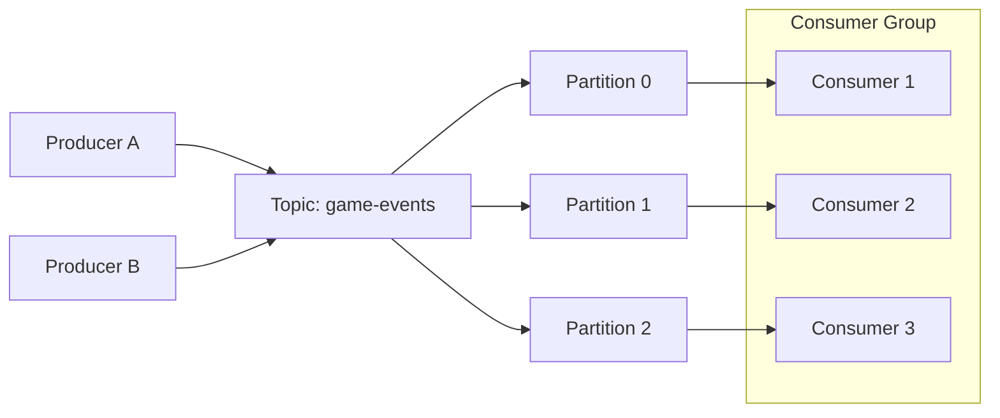

A topic is split into **partitions**. Each partition is an ordered sequence:

```text
Partition 0
offset:   100     101     102     103
          |       |       |       |
record:  eventA  eventB  eventC  eventD
```

Consumers do not delete a message when they read it. They advance an **offset**. Because data remains in the log according to retention policy, it can be replayed.

That single property is a major conceptual difference between Kafka and a simple ephemeral queue.

---

# 2. Core terminology

| Concept | Interview explanation |
|---|---|
| **Broker** | A Kafka server. Stores partition replicas and serves producer/consumer requests. |
| **Topic** | Logical event stream, e.g. `payments`, `ad-clicks`, `video-uploaded`. |
| **Partition** | Ordered, append-only log. The main unit of storage, ordering, and parallelism. |
| **Producer** | Publishes records to topics. |
| **Consumer** | Polls records from partitions. |
| **Consumer group** | Multiple consumers cooperating so each partition is assigned to one consumer in the group at a time. |
| **Offset** | Position of a record in one partition. Consumers commit offsets to track progress. |
| **Leader replica** | Replica that handles writes and normally serves reads for a partition. |
| **Follower replica** | Replicates the leader's log and can be promoted after failure. |
| **ISR** | In-sync replicas: replicas sufficiently caught up with the leader. |
| **Partition key** | Determines which partition a keyed record is routed to. Critical for ordering and load distribution. |
| **Retention** | Determines how long/how much data Kafka keeps. |
| **Log compaction** | Keeps at least the latest value for each key rather than retaining every historical update forever. |

---

# 3. Motivating example from the video: World Cup events

Suppose a site emits:

```json
{
  "gameId": "ARG-BRA-2026",
  "type": "GOAL",
  "team": "ARG",
  "playerId": "p123",
  "minute": 67
}
```

The basic system is:

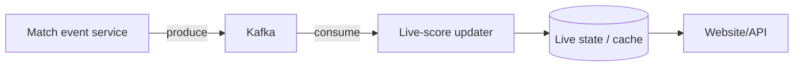

### Why a single queue becomes a problem

If thousands of games happen concurrently:

- one queue server may run out of throughput,
- one consumer cannot process fast enough,
- random distribution can break the ordering of events for the same match.

### Kafka's answer

Partition by `gameId`.

```text
partition = hash(gameId) % number_of_partitions
```

All events for `ARG-BRA-2026` land in the same partition and are therefore processed in partition order.

> [!important] Interview rule
> **Choose a key based on the smallest entity for which ordering matters.**
>
> Examples:
> - game events → `gameId`
> - account ledger events → `accountId`
> - ride state transitions → `rideId`
> - order lifecycle events → `orderId`

Do **not** claim Kafka provides global ordering across every partition.

---

# 4. The lifecycle of a Kafka record

A record conceptually contains:

```text
key
value
timestamp
headers
```

Example:

```json
{
  "key": "order_987",
  "value": {
    "type": "PAYMENT_CAPTURED",
    "amount": 4200,
    "currency": "EUR"
  },
  "headers": {
    "trace-id": "9fbc...",
    "schema-version": "3"
  }
}
```

Flow:

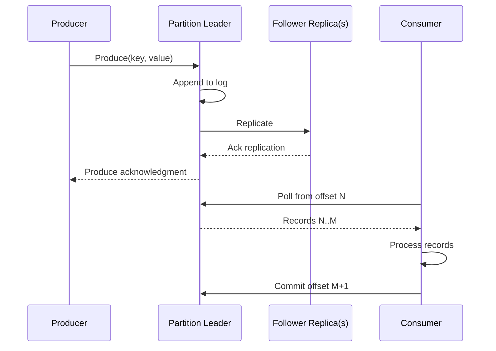

---

# 5. Partitioning: the most important Kafka interview topic

## Why partitions exist

Partitions provide:

1. **parallel writes**
2. **parallel reads**
3. **horizontal distribution across brokers**
4. **ordering within a bounded scope**

If a topic has 24 partitions, a traditional consumer group can process up to 24 partitions concurrently.

> [!warning] Consumer scaling ceiling
> With traditional Kafka consumer groups, adding consumer instances beyond the number of assigned partitions does not add useful parallelism for that topic.

Example:

```text
Topic: 8 partitions

2 consumers  -> about 4 partitions each
4 consumers  -> about 2 partitions each
8 consumers  -> about 1 partition each
12 consumers -> 4 consumers are effectively idle for this topic
```

## Keyed partitioning

Conceptually:

```java
int partition = positiveHash(record.key()) % partitionCount;
```

Example producer:

```java
Properties props = new Properties();
props.put(ProducerConfig.BOOTSTRAP_SERVERS_CONFIG, "kafka:9092");
props.put(ProducerConfig.KEY_SERIALIZER_CLASS_CONFIG, StringSerializer.class);
props.put(ProducerConfig.VALUE_SERIALIZER_CLASS_CONFIG, StringSerializer.class);

try (KafkaProducer<String, String> producer = new KafkaProducer<>(props)) {
    var record = new ProducerRecord<>(
        "order-events",
        "order_987", // key: preserves order for this order
        """
        {"type":"ORDER_CONFIRMED","orderId":"order_987"}
        """
    );

    producer.send(record);
}
```

## The subtle scaling trap: adding partitions

Increasing partition count is not always free.

If routing behaves like:

```text
hash(key) % partition_count
```

then changing:

```text
partition_count: 16 -> 32
```

can change the destination partition for an existing key.

That means:

- older events for `order_987` may be in partition 5,
- new events for `order_987` may now go to partition 21,
- you can no longer assume total ordering for that key across the resize boundary.

> [!important] Interview takeaway
> If strict long-lived key ordering matters, discuss partition growth **before** casually saying "we'll just add partitions."

Possible strategies:

- provision enough partitions up front,
- tolerate ordering only within a time/version boundary,
- route through an application-owned stable shard map,
- use a stable virtual-shard layer, then map virtual shards to Kafka partitions,
- redesign so strict ordering is localized or unnecessary.

---

# 6. When Kafka is a great solution

## A. Asynchronous processing / smoothing bursts

### Example: video transcoding

Bad design:


Better:

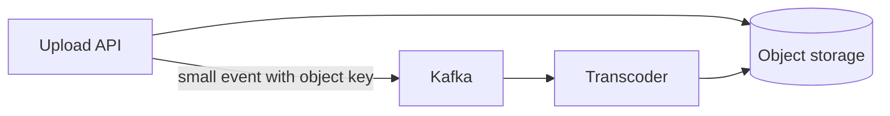

Event:

```json
{
  "videoId": "v123",
  "objectKey": "uploads/v123/source.mp4",
  "profiles": ["480p", "720p", "1080p"]
}
```

Why Kafka helps:

- upload request finishes without waiting for every encoding,
- workers can be scaled independently,
- bursts are buffered,
- failed workers can resume/reprocess.

> [!warning] Large-message anti-pattern
> Kafka is optimized for event records, not giant application blobs. Store the blob externally and put the **reference + metadata** in Kafka.

---

## B. Real-time stream processing

### Example: ad-click aggregation

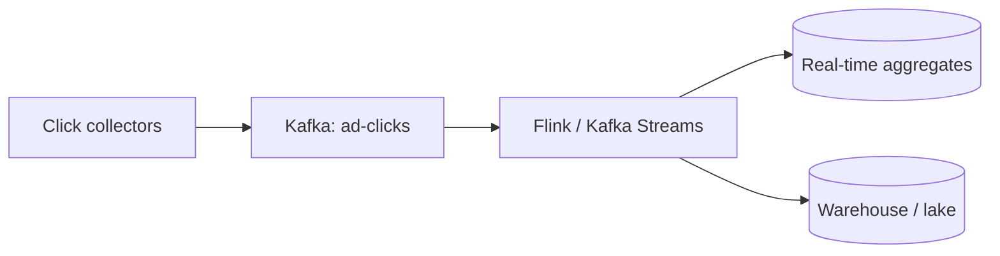

Events:

```json
{
  "adId": "nike-lebron-2026",
  "userId": "u42",
  "campaignId": "c700",
  "timestamp": 1786992000123
}
```

Kafka is useful because:

- click ingestion can be extremely bursty,
- multiple independent consumers can read the same stream,
- a stream processor can aggregate in near real time,
- data can be replayed if aggregation logic changes.

---

## C. Pub/sub fan-out

### Example: live comments

One comment can feed different consumer groups:

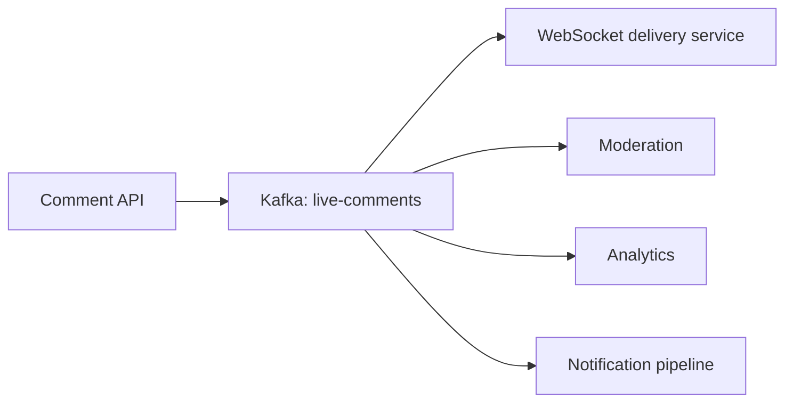

Each consumer group maintains its own progress.

That is one of Kafka's strongest architectural benefits: **producers do not need to know every downstream consumer**.

---

## D. Ordered entity workflows

### Example: order lifecycle

```text
ORDER_CREATED
PAYMENT_AUTHORIZED
INVENTORY_RESERVED
ORDER_CONFIRMED
ORDER_SHIPPED
```

Partition by `orderId`.

This makes Kafka useful when transitions for **one entity** must be consumed in order, while different entities can be processed concurrently.

---

## E. Event-driven integration / CDC

Example:

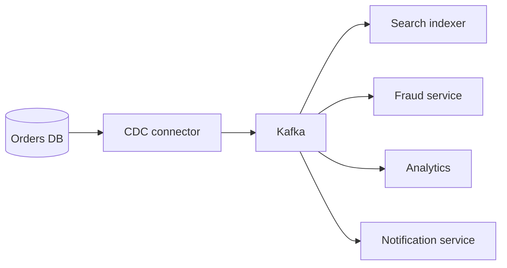

Kafka acts as a durable integration backbone.

---

# 7. When Kafka is probably the wrong answer

> [!danger] Do not force Kafka into every interview

Kafka is weaker when:

- you need a simple low-volume work queue,
- you need built-in per-message delay / visibility timeout semantics,
- you need simple consumer retries and DLQs with minimal infrastructure,
- the operation must be synchronous and immediately return a result,
- you need global ordering at huge scale,
- the payload is a large binary/blob,
- the team cannot justify the operational complexity,
- a database transaction alone solves the problem more simply.

For task queues with straightforward retries / DLQ behavior, systems such as SQS or RabbitMQ may be a cleaner answer depending on requirements.

A strong interview answer often sounds like:

> "Kafka fits because I need high-throughput durable event streaming, replay, and multiple independent consumer groups. If this were merely a small work queue with delayed retries, I would choose a simpler queue."

---

# 8. Scaling Kafka — interview deep dive

## Step 1: estimate the workload first

Before saying "scale Kafka", estimate:

```text
events/sec
average event bytes
peak multiplier
retention
replication factor
consumer processing cost
```

Example:

```text
peak events/sec       = 200,000
average event size    = 800 B
ingress                ~= 160 MB/s

7-day logical storage:
160 MB/s * 86,400 * 7 ~= 96.8 TB

with RF=3:
raw replicated storage ~= 290 TB
(before compression and operational headroom)
```

This immediately leads to better design discussion:

- How many brokers?
- How many partitions?
- How much disk/network?
- What retention is actually necessary?
- Can historical data move to cheaper storage?

---

## Technique 1: add partitions

More partitions can provide:

- more producer parallelism,
- more consumer parallelism,
- more opportunities to spread traffic over brokers.

But more partitions also mean:

- more files/metadata,
- more replication work,
- more partition leadership,
- longer/heavier rebalances,
- more operational complexity.

> [!note] Rule
> **Partitions are a concurrency budget, not a free performance knob.**

Choose a count based on expected throughput and consumer parallelism, with growth headroom.

---

## Technique 2: add brokers

More brokers give you more:

- CPU
- disk
- network bandwidth
- partition hosting capacity

But adding a broker by itself does not magically move existing partition data to it.

Existing partitions need to be **reassigned/rebalanced** onto the new brokers.

Interview phrasing:

> "If broker disk or network is saturated, I'll add brokers and rebalance partition replicas across them. I also need enough partitions for the new brokers to carry useful work."

---

## Technique 3: choose a good partition key

Good key properties:

- high cardinality,
- reasonably uniform distribution,
- preserves the ordering scope you require.

Good:

```text
rideId
orderId
accountId
gameId
```

Potentially bad:

```text
country
eventType
celebrityId
single campaignId
```

The bad keys may send a disproportionate amount of traffic to one partition.

---

## Technique 4: handle hot partitions

### Example: viral ad campaign

Naive key:

```text
key = adId
```

If one ad gets 30% of traffic, one partition can become the bottleneck even while most of the cluster is idle.

### Option A — no key

Use when ordering does not matter.

```text
key = null
```

Kafka can distribute records across partitions much more evenly.

Trade-off: no per-entity ordering guarantee.

### Option B — salt the key

```text
partitionKey = adId + ":" + random(0..15)
```

Example:

```text
nike-ad:0
nike-ad:1
...
nike-ad:15
```

Now one logical ad can use up to 16 partition routes.

Consumer aggregation:

```java
// conceptual
Map<String, Long> partialCounts = consumeAndAggregateBySaltedKey();

// remove salt, then merge
Map<String, Long> finalCounts = mergeByOriginalAdId(partialCounts);
```

Trade-off: you gain parallelism but lose a single total order for that ad and require a merge step.

### Option C — compound key

```text
adId + region
adId + userBucket
merchantId + storeId
tenantId + shard
```

This is preferable when the second dimension is meaningful and naturally distributes load.

### Option D — explicit backpressure / reduce producer rate

If downstream consumers cannot keep up, Kafka durably absorbs a **temporary** burst, but it cannot make a sustained producer rate greater than consumer capacity safe. Consumer lag will grow until retention/disk limits are reached.

Apply backpressure at the producer's ingress boundary:

```text
client/API -> rate limiter or bounded work queue -> producer -> Kafka
                         ↑                         |
                         +---- lag / saturation ----+
```

Practical controls:

- **Rate-limit admission** per tenant, endpoint, or event class (token bucket / leaky bucket); return `429`, defer, or coalesce low-priority work.
- **Use a bounded upstream queue**. Once full, block or reject new work rather than accumulating unbounded memory.
- **Pause or slow pollers/readers** that create events (for example, CDC or database scan workers), with exponential backoff and jitter.
- **Shed or sample non-critical events** such as debug telemetry; never silently drop state-changing business events.
- **Coalesce updates** when only the latest state matters (for example, publish one presence update per user per second rather than every change).
- **Apply Kafka client/broker quotas** as a guardrail so a misbehaving producer/client cannot consume unlimited broker bandwidth; quotas throttle the client rather than solve an underprovisioned downstream system.

Do not rely on `max.block.ms`, a full producer buffer, or broker throttling as the primary control loop: those are saturation signals and eventually make `send()` block or fail. Observe consumer lag and its growth rate, producer buffer wait time, request latency/errors, and broker disk/network utilization; trigger the policy before the retention window is threatened.

> [!important] Better interview answer
> Do not say "Kafka handles backpressure" and stop.
>
> Say: "I alert on sustained consumer-lag growth. For a temporary burst, Kafka buffers it. For sustained overload, I scale consumers if possible; otherwise I rate-limit or defer low-priority producer work at the API/ingestion boundary, using a bounded queue and explicit rejection. I preserve critical events and use quotas only to prevent a noisy producer from harming the cluster."

---

## Technique 5: scale the consumer group

If consumer processing is the bottleneck:

```text
1 consumer  -> 1 process
4 consumers -> partitions divided across 4 processes
N consumers -> parallelism up to partition assignment limits
```

But increasing consumers causes **rebalancing** when membership changes.

A consumer should generally:

- keep processing bounded,
- avoid very long blocking operations in the poll loop,
- make processing idempotent,
- commit offsets at an intentional point.

---

## Technique 6: batching

Networking one record at a time is inefficient.

Kafka producers batch records per partition.

Conceptual producer tuning:

```java
props.put(ProducerConfig.BATCH_SIZE_CONFIG, 64 * 1024);
props.put(ProducerConfig.LINGER_MS_CONFIG, 5);
```

Trade-off:

```text
larger batch / longer linger
        ↓
higher throughput, better compression
        ↓
potentially more per-record latency
```

Modern Kafka versions use a small default linger because batching can improve efficiency without necessarily hurting end-to-end latency under load.

---

## Technique 7: compression

```java
props.put(ProducerConfig.COMPRESSION_TYPE_CONFIG, "zstd");
```

Common choices include:

- `lz4`
- `snappy`
- `zstd`
- `gzip`

Trade-off:

```text
less network + disk
vs.
more CPU for compression/decompression
```

Compression works especially well with batching because similar records compress together.

---

## Technique 8: retention and storage tiers

If Kafka is retaining too much data, ask:

> "Do we really need the hot Kafka cluster to keep all of this history?"

Options:

- reduce `retention.ms`,
- reduce `retention.bytes`,
- use log compaction for keyed state,
- archive to data lake/object storage,
- use Kafka tiered storage where appropriate.

Example topic intent:

```text
fraud-events:
  hot retention = 3 days
  archive = object storage for 7 years
```

Kafka remains the **hot streaming layer**, not necessarily the cheapest permanent archive.

---

## Technique 9: rack / availability-zone awareness

Replicas should not all live in the same failure domain.

Example:

```text
Partition 12 replicas:
leader   -> broker A in AZ-1
follower -> broker B in AZ-2
follower -> broker C in AZ-3
```

This allows a rack/AZ failure without losing every replica of the partition.

---

# 9. Fault tolerance & durability

Kafka replicates each partition.

Example:

```text
partition 7
  leader:   broker-1
  follower: broker-4
  follower: broker-8
```

Replication factor:

```text
RF = 3
```

means 3 total replicas, not 3 followers.

## `acks`

Producer durability is controlled partly by acknowledgment policy.

### `acks=0`

Producer does not wait for broker confirmation.

```text
fastest
weakest durability
```

Rarely the right answer for important business events.

### `acks=1`

Leader writes the record and acknowledges without waiting for all in-sync replicas.

If the leader dies before followers replicate the record, acknowledged data can be lost.

### `acks=all`

The leader waits for the required in-sync replicas according to Kafka's replication rules.

For important events, a common interview baseline is:

```properties
acks=all
enable.idempotence=true
```

and a topic with:

```text
replication.factor = 3
min.insync.replicas = 2
```

This configuration is a useful durability baseline because a write can require at least two healthy in-sync copies while still tolerating a broker outage.

> [!warning] Availability trade-off
> Stronger durability settings can make writes fail when too few replicas are available.
>
> That is the correct trade-off for many financial or state-changing events: **reject the write rather than falsely acknowledge a write that may disappear.**

---

# 10. Consumer failure and offset commits

A core interview question:

> **When do you commit the offset?**

Suppose a consumer handles:

```text
offset 51 = "download page X"
```

## Commit before processing

```text
read
commit offset
process
```

Crash after commit but before process:

```text
message may never be processed
```

This trends toward **at-most-once** processing.

## Commit after processing

```text
read
process successfully
commit offset
```

Crash after processing but before commit:

```text
message will likely be processed again
```

This gives **at-least-once** processing.

For most business workflows, prefer at-least-once plus an idempotent consumer.

---

# 11. Idempotent consumer pattern

Suppose payment events can be replayed.

Bad:

```java
balance += event.amount();
```

If the event is processed twice, the side effect happens twice.

Better: assign every event a stable `eventId` and deduplicate.

```sql
BEGIN;

INSERT INTO processed_events(event_id)
VALUES ('evt_123')
ON CONFLICT DO NOTHING;

-- Only apply business side effect if the insert actually happened.
UPDATE merchant_balance
SET amount = amount + 42.00
WHERE merchant_id = 'm7';

COMMIT;
```

In real code, the dedupe marker and business write should be part of the **same database transaction**.

Alternative idempotency designs:

- upsert by entity/version,
- unique constraint on `eventId`,
- compare-and-set state version,
- naturally idempotent overwrite,
- transactional inbox table.

> [!tip] Interview phrase
> "Kafka can redeliver records in normal failure scenarios, so I design the consumer side effect to be idempotent."

---

# 12. Producer retries

Producers can retry transient send failures.

A strong baseline for important records:

```java
Properties props = new Properties();

props.put(ProducerConfig.BOOTSTRAP_SERVERS_CONFIG, "kafka:9092");
props.put(ProducerConfig.ACKS_CONFIG, "all");
props.put(ProducerConfig.ENABLE_IDEMPOTENCE_CONFIG, "true");

// Throughput optimizations
props.put(ProducerConfig.LINGER_MS_CONFIG, 5);
props.put(ProducerConfig.BATCH_SIZE_CONFIG, 64 * 1024);
props.put(ProducerConfig.COMPRESSION_TYPE_CONFIG, "zstd");
```

Why idempotence matters:

```text
producer sends event
        ↓
broker writes event
        ↓
ack is lost on network
        ↓
producer retries
```

Without idempotent production, retry ambiguity can result in duplicate log entries.

---

# 13. Consumer retries, retry topics, and DLQs

Kafka's normal consumer model does not behave like a queue with a built-in per-message visibility timeout.

A common application pattern:

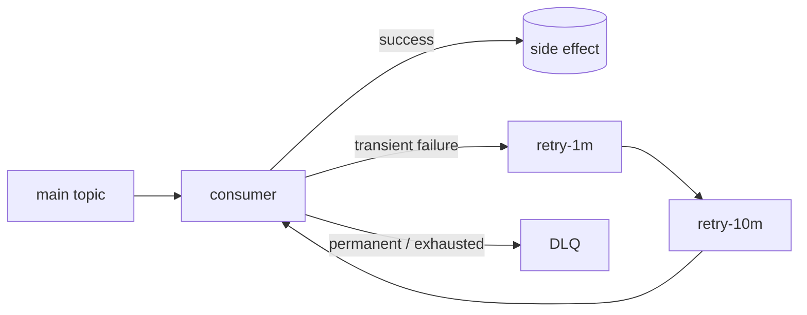

Record metadata should include:

```json
{
  "eventId": "evt_123",
  "attempt": 3,
  "originalTopic": "payment-events",
  "errorClass": "PartnerTimeout",
  "firstFailedAt": "2026-08-17T19:01:22Z"
}
```

Retry logic:

```java
try {
    process(record);
    commit(record);
} catch (TransientException e) {
    publish("payment-events-retry-1m", withRetryMetadata(record, e));
    commit(record); // only after retry record is durably published
} catch (PermanentException e) {
    publish("payment-events-dlq", withFailureMetadata(record, e));
    commit(record);
}
```

> [!warning] Ordering vs retries
> Moving a failed event to a retry topic can let later events for the same key overtake it.
>
> If strict per-key ordering is mandatory, you may need to pause that partition/key, retry inline, or design the state machine to tolerate delayed/reordered attempts.

---

# 14. Delivery semantics: at-most-once, at-least-once, exactly-once

## At-most-once

```text
may lose work
never intentionally retry it
```

Useful only when occasional loss is acceptable.

## At-least-once

```text
do not lose acknowledged work
duplicates are possible
```

This is the most common application-level model.

Design consumers to be idempotent.

## Exactly-once

"Exactly once" needs careful wording.

Kafka can provide transactional exactly-once processing for Kafka-to-Kafka workflows using idempotent producers, transactions, committed offsets, and appropriate consumer isolation.

But if your consumer writes to an external system:

```text
Kafka -> consumer -> third-party HTTP API
```

Kafka alone cannot magically make the external API exactly once.

You still need:

- external idempotency key,
- transactional coordination,
- deduplication,
- or an application-level protocol.

> [!important] Interview answer
> Say **"exactly-once processing within the Kafka transactional boundary"**, not "Kafka makes my entire distributed system exactly once."

---

# 15. The transactional outbox pattern

A classic failure:

```text
1. write order to database ✅
2. publish ORDER_CREATED to Kafka ❌
```

Now the DB says the order exists but downstream services never learn about it.

The opposite ordering also fails:

```text
1. publish event ✅
2. database transaction ❌
```

Now downstream services see an event for state that never committed.

## Solution: transactional outbox

Write business state and an outbox record in the **same DB transaction**.

```sql
BEGIN;

INSERT INTO orders(id, user_id, status)
VALUES ('o123', 'u7', 'CREATED');

INSERT INTO outbox(event_id, aggregate_id, event_type, payload)
VALUES (
  'evt789',
  'o123',
  'ORDER_CREATED',
  '{"orderId":"o123","userId":"u7"}'
);

COMMIT;
```

Then a separate relay/CDC pipeline publishes the outbox rows into Kafka.

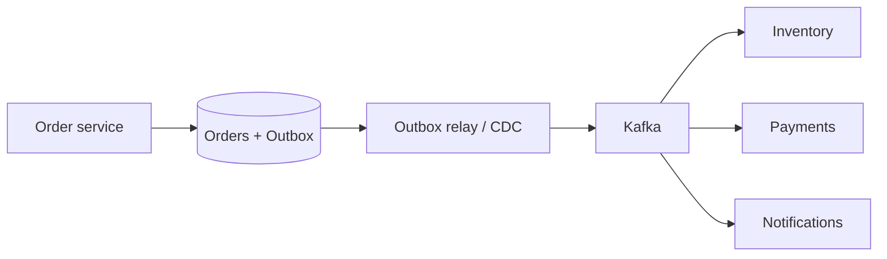

This is one of the most useful Kafka-adjacent patterns to mention in system design interviews.

---

# 16. Performance: why Kafka is fast

Kafka's performance comes from architectural choices, not from "disk is magically fast."

Important reasons:

- append-heavy sequential log writes,
- batching,
- compression,
- efficient OS page cache use,
- efficient transfer of log data to clients,
- partition-level parallelism,
- consumers pull and can batch fetches.

## Zero-copy transfer

When a consumer fetches data that is already in the broker's OS page cache, Kafka can use the operating system's `sendfile`-style path to transfer bytes from the log file to the network socket **without copying those bytes through a Kafka broker user-space buffer**.

```text
Traditional path:
disk/page cache -> kernel buffer -> broker process buffer -> socket buffer -> network

Zero-copy path:
disk/page cache -> kernel -> socket -> network
```

This reduces CPU work, memory copying, and garbage-collection pressure on brokers, particularly when many consumers read the same retained data. It complements sequential I/O and the page cache; it does not mean Kafka avoids all copies everywhere or that disk reads disappear.

> [!note]
> The optimization applies most directly to untransformed plaintext data. If the broker must transform bytes—for example, terminate TLS or perform other processing—it may need a user-space copy, reducing or removing the zero-copy benefit.

**Interview phrasing:** "Kafka uses zero-copy file-to-socket transfer where possible, so the broker can serve log segments from the OS page cache without repeatedly copying record bytes into application memory."

> [!tip] Interview depth
> A good explanation:
>
> "Kafka turns random-message queue operations into mostly sequential append/read operations. Combined with batching, compression, page cache, and partition parallelism, that gives high throughput."

---

# 17. Retention vs log compaction

## Time/size retention

Use when you want a replay window.

```text
retain events for:
- 24 hours
- 7 days
- 30 days
- up to N GB per partition
```

Typical configurations:

```properties
retention.ms=604800000
retention.bytes=...
```

Use case:

```text
clickstream events
audit processing window
temporary event replay
```

## Log compaction

Use when each key represents mutable logical state and you mostly care about the latest value.

Example stream:

```text
user-42 -> plan=FREE
user-42 -> plan=PRO
user-42 -> plan=ENTERPRISE
```

Compaction eventually lets Kafka discard obsolete values while retaining the latest state for `user-42`.

Useful for:

- changelog topics,
- CDC state,
- caches/state reconstruction,
- entity configuration streams.

> [!note]
> Compaction does not mean "keep exactly one record at all times." It is an asynchronous log-cleaning process.

---

# 18. Rebalancing

When consumers join, leave, crash, or partition assignments change, the group can rebalance.

Effects:

- partitions move between consumers,
- processing can temporarily pause or shift,
- consumers must safely hand off offsets/state.

Mitigations include:

- avoid flapping autoscaling,
- keep consumer processing healthy,
- use cooperative rebalancing where supported,
- use static membership for stable instances where appropriate,
- monitor rebalance frequency and duration.

Modern Kafka also has a newer consumer rebalance protocol, but in interviews the important mental model is still:

> **group membership changes can move partition ownership, so state and offset handling must survive reassignment.**

---

# 19. Modern Kafka note: KRaft, not ZooKeeper

The video was published in 2024. For current interviews:

> [!info] 2026 update
> Apache Kafka 4.x runs in **KRaft mode**; ZooKeeper mode was removed in Kafka 4.0.
>
> If asked about Kafka's control plane today, talk about Kafka's integrated KRaft controllers / metadata quorum. Mention ZooKeeper only as legacy architecture.

This is an easy way to avoid sounding dated.

---

# 20. Capacity planning heuristics

A useful interview method:

## 1. Ingress

```text
ingress_bytes/sec =
peak_events/sec * average_record_bytes
```

## 2. Replication network/storage

With replication factor `RF`:

```text
replicated_write_volume ≈ logical_write_volume * RF
```

This is a simplification, but good for first-pass sizing.

## 3. Retention storage

```text
logical_storage =
average_ingress_bytes/sec * retention_seconds
```

Then add:

- replication,
- peak/headroom,
- indexes/log segment overhead,
- compaction/retention operational margin.

## 4. Partition count

Estimate based on the largest of:

- producer throughput requirement,
- consumer throughput requirement,
- desired consumer concurrency,
- broker distribution needs.

Avoid pretending there is a universal "X MB/s per partition" constant; hardware, record size, replication, compression, and workload shape matter.

---

# 21. Monitoring signals to mention in an interview

If you introduce Kafka, show that you know how to operate it.

Watch:

### Consumer side
- consumer lag per partition
- records consumed/sec
- processing latency
- commit failures
- rebalance count/duration

### Broker side
- disk utilization
- network throughput
- request latency
- under-replicated partitions
- ISR shrink/expand behavior
- partition/leader skew
- broker CPU and page-cache pressure

### Producer side
- send latency
- retry/error rate
- record queue/buffer pressure
- batch size
- compression ratio

> [!important]
> **Consumer lag is not just a metric; it is a signal of a capacity mismatch.**
>
> If lag is monotonically increasing:
>
> ```text
> production rate > sustainable consumption rate
> ```
>
> You must scale consumers, reduce processing cost, increase partitions if necessary, or reduce upstream rate.

---

# 22. Common interview traps

## Trap 1 — "Kafka guarantees ordering"

Correct version:

> Kafka guarantees ordering **within a partition**.

---

## Trap 2 — "More consumers always means more throughput"

Correct version:

> Traditional consumer-group parallelism is bounded by assigned partitions.

---

## Trap 3 — "Add more brokers and Kafka scales automatically"

Correct version:

> New brokers add capacity, but existing partition replicas need to be distributed onto them, and the topic must have enough partitions to exploit the capacity.

---

## Trap 4 — "We'll put the video/image/file in Kafka"

Correct version:

> Put the blob in object storage. Kafka carries a small event containing the object's location and metadata.

---

## Trap 5 — "Exactly once"

Correct version:

> Clarify the boundary. Kafka transactions can give exactly-once processing for Kafka-native pipelines, but external side effects need their own idempotency/coordination.

---

## Trap 6 — bad partition key

```text
partition by country
```

when 70% of traffic is from one country = hot partition.

Instead, explain your ordering scope and distribution.

---

## Trap 7 — auto-committing before the side effect is safe

If the external write fails after the offset was committed, work can be lost.

Tie commit timing to the durability of the side effect.

---

## Trap 8 — retrying poison messages forever

Use:

- bounded retry,
- exponential backoff,
- retry topics or pause,
- DLQ,
- alerting,
- operator tooling.

---

# 23. Kafka vs a traditional queue

| Question | Kafka | Traditional task queue |
|---|---|---|
| Durable replay | Excellent | Often limited / not primary model |
| Multiple independent consumer groups | Excellent | Depends on product |
| Stream processing | Excellent | Usually weaker |
| Per-key ordering | Strong within partition | Varies |
| Huge sequential throughput | Strong | Varies |
| Simple delayed retry / visibility timeout | Requires design/tooling | Often first-class |
| DLQ simplicity | Usually application pattern | Often built in |
| Operational simplicity | More complex | Often simpler |
| Event history | First-class | Often message disappears after successful processing |

Use this table to justify technology choice rather than name-dropping Kafka.

---

# 24. Example system-design answers

## Example A — "Design YouTube upload processing"

> "The upload API writes the source video directly to object storage. Once the upload is durable, it publishes a small `VideoUploaded` event to Kafka containing the object key and video ID. A transcoding consumer group processes jobs asynchronously. I would partition by `videoId`, which keeps all state transitions for one video ordered while allowing different videos to process in parallel. I would not place raw video bytes in Kafka."

Deep dive:

- consumer lag during upload spikes,
- retry failed encodes,
- idempotent output by `(videoId, profile)`,
- DLQ for corrupt files,
- autoscale workers,
- object storage is the source blob store.

---

## Example B — "Design an ad-click aggregator"

> "Collectors append clicks to Kafka. Stream processors consume the topic and maintain windowed counts. My first partition key might be `adId`, but that creates a hot-partition risk for viral ads. If exact ordering per ad isn't required, I can salt the key with a bucket and merge partial aggregates downstream."

Deep dive:

- `adId:bucket`,
- event-time windows,
- late data,
- checkpointing,
- replay,
- hot keys,
- approximate counting if extreme scale.

---

## Example C — "Design Ticketmaster"

Kafka can be useful for ordered admission events or downstream event processing, but be precise.

If you use it as a virtual waiting queue:

- define the ordering scope,
- define whether strict FIFO is actually required,
- avoid claiming global FIFO across many partitions,
- separate admission-control state from downstream asynchronous events.

Kafka is excellent for:

```text
reservation-created
payment-started
payment-completed
ticket-issued
analytics events
email notifications
```

Partition order lifecycle events by `reservationId`.

For the actual scarce-seat lock/transaction, use a database or contention-control mechanism appropriate to the consistency requirement rather than expecting Kafka alone to prevent double booking.

---

## Example D — "Design a payment system"

Possible event flow:

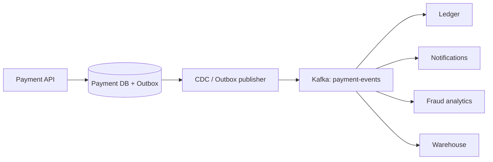

Important:

- the database transaction remains the authoritative state change,
- use outbox/CDC to avoid dual-write loss,
- partition by `paymentId` or `accountId` depending on ordering requirements,
- use idempotency keys,
- prefer strong producer durability,
- consumers must dedupe.

---

# 25. Interview decision tree

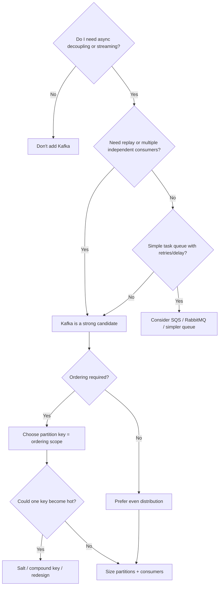

---

# 26. A polished Kafka deep-dive answer to memorize

> [!quote] 90-second interview answer
> "I’m using Kafka because this part of the system is asynchronous, high-throughput, and benefits from durable replay and independent downstream consumers. I’d put events in a topic partitioned by the entity whose ordering I need — for example `orderId` — because Kafka only guarantees order within a partition.
>
> I’d size the topic with enough partitions for expected producer and consumer parallelism, then spread those partitions across multiple brokers. If a key can become disproportionately popular, I’d watch for hot partitions and either remove the ordering requirement, salt/compound the key, or split aggregation into two stages.
>
> For durability I’d use replication across failure domains, `acks=all`, and an appropriate `min.insync.replicas`. Consumers would commit offsets only after their side effects are durable and would be idempotent because reprocessing is possible. For transient consumer failures I’d use bounded retries and retry/DLQ topics, and I’d monitor consumer lag, partition skew, under-replicated partitions, and rebalance behavior.
>
> Finally, I’d keep large blobs outside Kafka in object storage and only publish references and metadata."

---

# 27. Quick cheat sheet

## Use Kafka when

- [ ] asynchronous processing is useful
- [ ] producers and consumers need independent scaling
- [ ] traffic is high/bursty
- [ ] replay is valuable
- [ ] multiple consumer groups need the same events
- [ ] per-entity ordering matters
- [ ] real-time aggregation / stream processing is needed

## Explain these in the interview

- [ ] topic
- [ ] partition count
- [ ] partition key
- [ ] ordering guarantee
- [ ] producer throughput
- [ ] consumer group size
- [ ] offset commit timing
- [ ] replication factor
- [ ] `acks`
- [ ] `min.insync.replicas`
- [ ] retries / DLQ
- [ ] idempotency
- [ ] retention
- [ ] hot partitions
- [ ] consumer lag

## Strong phrases

- "Ordering is per partition, not global."
- "The partition key is also a load-balancing decision."
- "The number of partitions bounds useful traditional consumer-group parallelism."
- "I prefer at-least-once delivery plus idempotent side effects."
- "I will commit the offset only after the side effect is durable."
- "I won't put blobs in Kafka; Kafka carries the pointer."
- "Adding a broker adds capacity, but I still need to redistribute partitions."
- "Exactly-once depends on the transactional boundary."

---

# 28. Extra interview extensions beyond the video

These are worth knowing for senior/staff interviews.

## Schema evolution

Long-lived streams need stable schemas.

Common approach:

```text
Avro / Protobuf / JSON Schema
+ schema registry
+ backward/forward compatibility rules
```

Avoid casually changing:

```json
{"userId": 123}
```

to:

```json
{"userId": {"id": 123}}
```

without a compatibility plan.

Headers can carry:

```text
schema-version
trace-id
source-service
correlation-id
```

---

## Event design: event vs command

Event:

```text
PaymentCaptured
```

means something happened.

Command:

```text
CapturePayment
```

asks a specific worker/service to do something.

Kafka can carry both, but mixing the semantics without clear topic ownership makes systems hard to reason about.

---

## Multi-region Kafka

Be careful with a single synchronous Kafka cluster stretched over high-latency regions.

Cross-region replication can introduce:

- latency,
- bandwidth cost,
- failover complexity,
- ordering/conflict issues.

A common architecture is separate regional clusters plus asynchronous replication, with an explicit strategy for ownership and disaster recovery.

---

# 29. Sources / further reading

Primary video and matching written guide:

- [Hello Interview — Kafka System Design Deep Dive (YouTube)](https://www.youtube.com/watch?v=DU8o-OTeoCc)
- [Hello Interview — Kafka Deep Dive written guide](https://www.hellointerview.com/learn/system-design/deep-dives/kafka)

Current Apache Kafka references used to sanity-check / update details:

- [Apache Kafka 4.3 — Design](https://kafka.apache.org/43/design/design/)
- [Apache Kafka 4.3 — Producer configuration](https://kafka.apache.org/43/configuration/producer-configs/)
- [Apache Kafka 4.3 — Basic operations / partition reassignment](https://kafka.apache.org/43/operations/basic-kafka-operations/)
- [Apache Kafka 4.3 — Consumer configuration](https://kafka.apache.org/43/configuration/consumer-configs/)
- [Apache Kafka 4.3 — Upgrading / KRaft](https://kafka.apache.org/43/getting-started/upgrade/)

---

# 30. Related Obsidian notes to create

If building a system-design vault, this note connects naturally to:

- [[Message Queues]]
- [[Event-Driven Architecture]]
- [[Stream Processing]]
- [[Consumer Idempotency]]
- [[Transactional Outbox]]
- [[Change Data Capture]]
- [[Distributed Logs]]
- [[Consistent Hashing]]
- [[Backpressure]]
- [[Exactly-Once Semantics]]
- [[System Design - Capacity Estimation]]
- [[System Design - Ticketmaster]]
- [[System Design - YouTube]]
- [[System Design - Ad Click Aggregator]]
- [[System Design - Payment System]]
