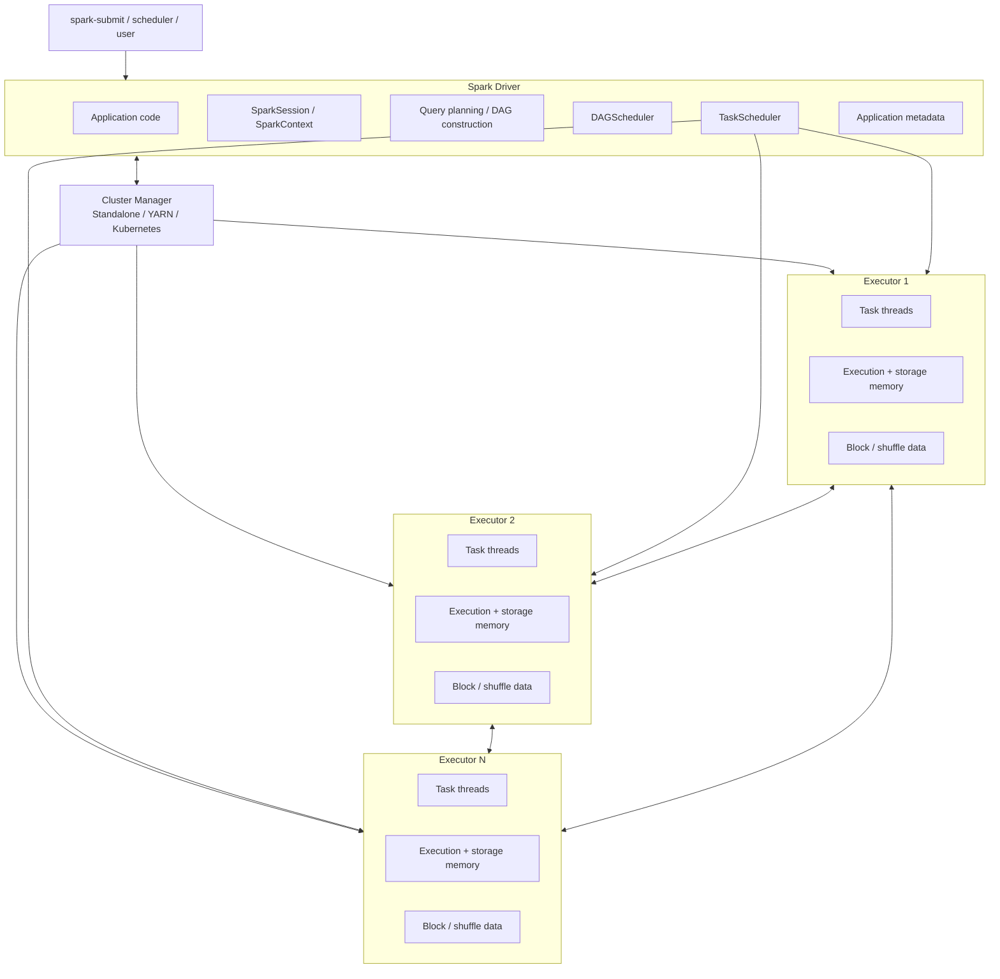
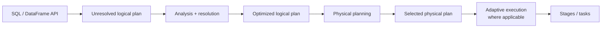
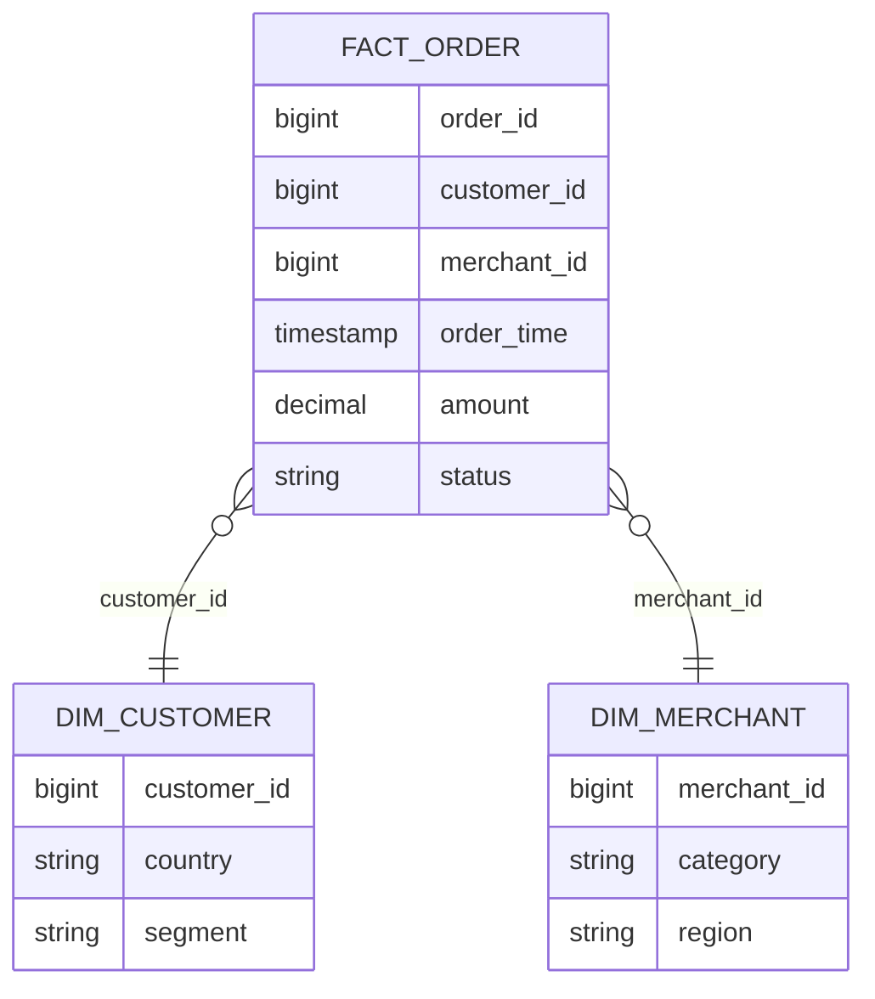
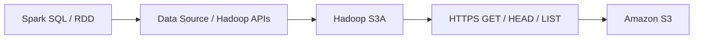
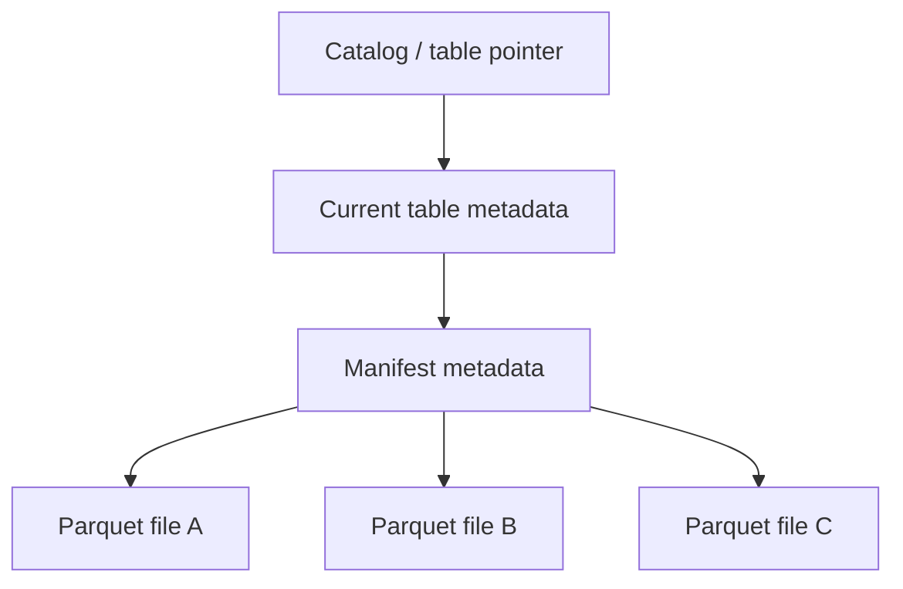
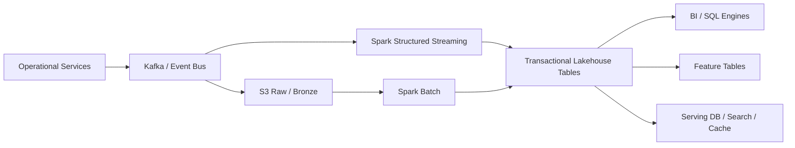
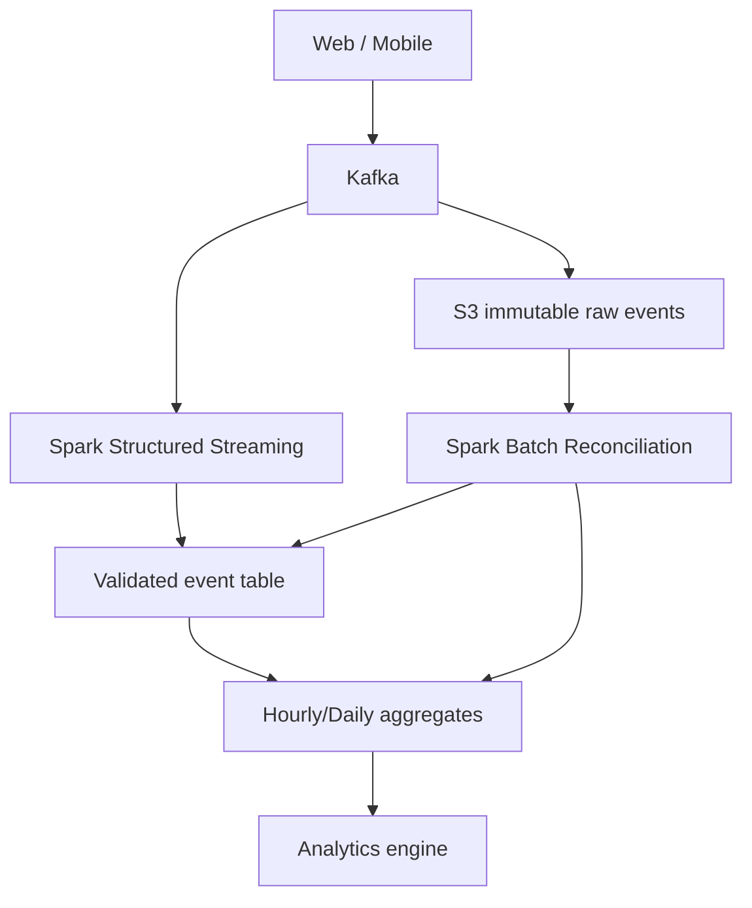
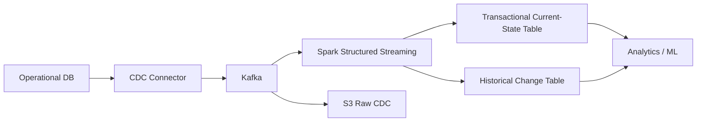
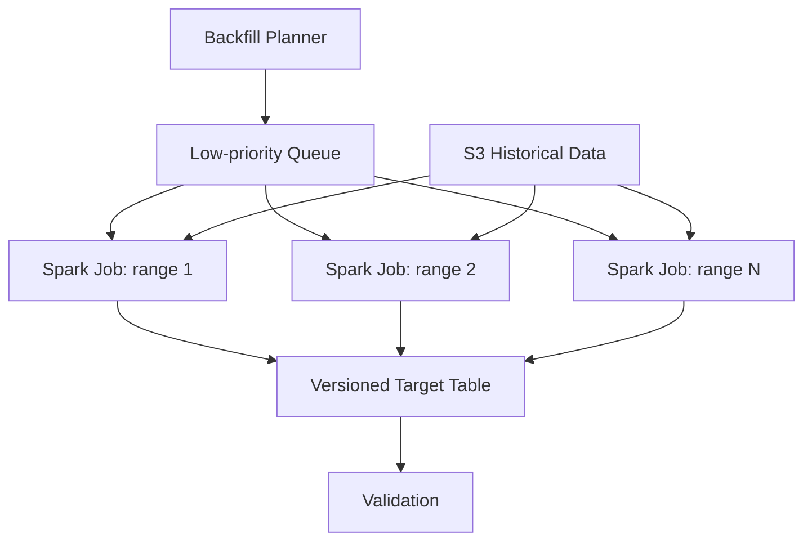

# Apache Spark — Architecture, Data Modeling, S3, and Production System Design

> [!abstract]  
> **Scope**
> 
> This note treats Apache Spark as a distributed execution engine rather than merely an ETL framework. The emphasis is on:
> 
> - Spark's execution architecture.
>     
> - RDD/DataFrame/Dataset and partition semantics.
>     
> - Catalyst, physical planning, shuffles, joins, and AQE.
>     
> - Data modeling and physical data layout.
>     
> - Spark over Amazon S3/object storage.
>     
> - Structured Streaming and state.
>     
> - Production architecture, failure modes, observability, security, and cost.
>     
> - Staff+ design-review reasoning.
>     
> 
> Apache Spark **4.2.0**, released July 14, 2026, is the current stable version used as the version-sensitive reference for this note.

---

# 1. Executive Summary

Apache Spark is best understood as a **distributed query and computation engine**. It is not a database, durable storage system, transaction manager, message broker, or orchestration system. A production Spark architecture therefore consists of Spark plus several surrounding systems: durable storage, a catalog/table format, a resource manager, orchestration, observability, and—when streaming—a replayable event source and suitably reliable sink.

A Spark application contains a **driver** and one or more **executors**. The driver constructs computations, plans work, coordinates execution, and tracks application state. Executors execute tasks and hold application-specific cached/shuffle data. A cluster manager—Standalone, YARN, or Kubernetes—provides resources. Actions create jobs; jobs are divided into stages; stages contain tasks, normally one task per input partition.

The most important Spark performance model is:

```text
wall-clock cost
≈ scan cost
+ shuffle cost
+ compute/serialization cost
+ spill cost
+ remote-storage cost
+ scheduling overhead
+ retries/recomputation
```

For large analytical workloads, **bytes moved** are frequently more important than instruction count. Shuffle requires serialization, network transfer, local disk I/O, sorting/aggregation structures, and potentially spilling. Poor partitioning, skew, unnecessary wide transformations, excessive files, and large Python serialization boundaries can therefore dominate otherwise simple business logic.

For structured workloads, prefer **DataFrame/SQL** APIs unless you genuinely need RDD-level semantics. Structured APIs expose schema and relational intent to Spark SQL, allowing optimization that arbitrary RDD functions cannot generally receive. Spark SQL's optimizer lineage traces back to **Catalyst**, while Spark's binary processing/code-generation work substantially reduced object allocation and CPU overhead.

For S3-backed architectures, remember one statement above all others:

> [!warning]  
> **S3 is an object store, not HDFS with cheaper disks.**

Amazon S3 now provides strong read-after-write and LIST consistency, and updates of an individual key are atomic. But S3 does **not** acquire filesystem semantics such as an atomic constant-time directory rename. Hadoop S3A implements rename through copy/delete operations, so algorithms relying on filesystem rename for atomic commit can be unsafe and expensive.

For important lakehouse tables, raw directories of Parquet files should therefore be distinguished from a **transactional table abstraction**. Formats such as Apache Iceberg or Delta Lake add metadata and commit protocols over object storage. Iceberg, for example, updates table state through metadata files without requiring file rename.

Structured Streaming should likewise be reasoned about end-to-end rather than by repeating "`exactly once`" as a Spark property. Spark tracks offsets and processing progress through checkpointing; end-to-end exactly-once behavior depends on a replayable source plus a sink whose write semantics tolerate reprocessing, such as an idempotent or transactional sink.

---

# 2. What Spark Is—and What It Is Not

## 2.1 The useful abstraction

Think of Spark as:

```text
declarative/functional computation
        ↓
logical distributed DAG
        ↓
optimized physical plan
        ↓
partitioned tasks
        ↓
distributed execution across executors
```

Spark is particularly strong when a problem has all or most of these properties:

- Data volume exceeds what is comfortable on one machine.
    
- Operations can be expressed as partition-parallel transformations.
    
- High-throughput processing matters more than request-level millisecond latency.
    
- Intermediate state can be recomputed or checkpointed.
    
- Significant relational processing is present.
    
- Workloads perform scans, joins, aggregations, feature computation, or large transformations.
    

Typical uses include:

- Batch ETL/ELT.
    
- Large-scale SQL analytics.
    
- Data-lake/lakehouse transformations.
    
- Historical backfills.
    
- CDC processing and consolidation.
    
- Sessionization and event aggregation.
    
- ML feature generation and preprocessing.
    
- Large-scale deduplication.
    
- Streaming enrichment and aggregation.
    
- Log/event processing.
    

Spark is usually a poor primary choice for:

- OLTP.
    
- Point reads/writes serving synchronous APIs.
    
- Sub-millisecond or tightly bounded per-event processing.
    
- Fine-grained mutable shared state.
    
- Distributed transaction coordination for operational services.
    
- Tiny workloads whose coordination overhead exceeds computation.
    
- Workloads fundamentally dependent on random record-by-record remote updates.
    

> [!tip]  
> A Staff+ architecture question should rarely be **"Can Spark do this?"**
> 
> Ask instead:
> 
> **"Does this workload have Spark-shaped economics and failure semantics?"**

---

# 3. The Core Distributed-Systems Mental Model

Spark's original RDD design solved an important distributed-systems problem: how can a cluster keep useful working data in memory without requiring every intermediate mutation to be synchronously replicated?

The answer was **lineage**.

An RDD is immutable and is produced from another dataset through deterministic coarse-grained transformations. Instead of synchronously replicating every intermediate result, Spark can often reconstruct a lost partition from the transformations that created it. This trade trades replication/storage overhead for recomputation. The original RDD paper explicitly describes RDDs as fault-tolerant distributed memory based on coarse-grained transformations rather than arbitrary fine-grained shared-memory mutation.

Conceptually:

```text
Input partitions
      │
      ├── map
      │
      ├── filter
      │
      └── project
           │
           ▼
      Intermediate RDD
           │
        shuffle
           │
           ▼
      Aggregated RDD
```

If an intermediate partition disappears:

```text
lost partition
      ↓
find lineage
      ↓
re-read necessary parent partitions
      ↓
re-run transformations
      ↓
reconstruct partition
```

This works particularly well when transformations are:

- deterministic;
    
- side-effect-free;
    
- coarse-grained;
    
- reproducible from durable input.
    

It works badly if a task depends on an external side effect that cannot safely be retried.

That leads to one of Spark's most important production invariants:

> [!important]  
> **Assume a task may execute more than once.**
> 
> Executor loss, task retry, speculative execution, stage retry, or application replay may cause repeated computation.
> 
> External writes must therefore be idempotent, transactional, or protected by a durable deduplication/commit protocol.

---

# 4. Spark Cluster Architecture

## 4.1 High-level topology



An application consists of a driver program plus executors. Executors are application-specific processes that run tasks and retain data in memory or local disk for the application. Spark currently supports Standalone, YARN, and Kubernetes as primary deployment options.

## 4.2 Driver responsibilities

The driver is fundamentally the application's **control plane**.

It is responsible for things such as:

- executing user control-flow code;
    
- maintaining the Spark context/session;
    
- constructing logical computations;
    
- scheduling jobs;
    
- dividing jobs into stages;
    
- coordinating tasks;
    
- collecting task/stage metadata;
    
- maintaining broadcast and scheduler metadata;
    
- coordinating Structured Streaming queries;
    
- receiving results that explicitly return to the driver.
    

The driver is therefore not simply another worker.

### Why driver failures are special

Losing an executor normally means Spark can retry/recompute work.

Losing the driver means losing the coordinator itself.

For a batch application, the common recovery mechanism is usually **application resubmission**.

For Structured Streaming, durable checkpoint state lets a restarted application recover processing progress, provided the deployment system restarts the driver and the restarted query remains checkpoint-compatible.

> [!warning]  
> The driver is frequently underestimated during capacity planning.
> 
> Driver pressure can come from:
> 
> - enormous query plans;
>     
> - millions of input/output files;
>     
> - large metadata listings;
>     
> - collecting large results;
>     
> - large broadcast construction;
>     
> - scheduling enormous numbers of tasks;
>     
> - excessive event/logging state;
>     
> - accidental `collect()` / `toPandas()`.
>     

---

## 4.3 Executors

Executors are long-lived processes allocated to one Spark application.

They:

- execute tasks;
    
- perform transformations;
    
- read source data;
    
- produce shuffle blocks;
    
- fetch shuffle blocks;
    
- cache persisted blocks;
    
- spill intermediate data to local disk;
    
- communicate status/results to the driver.
    

Multiple tasks can execute concurrently in an executor according to available cores/task CPUs.

An executor's memory is not simply a giant RDD cache. Spark distinguishes memory used for **execution**—joins, sorts, shuffle aggregation, etc.—from memory used for **storage**, such as cached blocks. Modern Spark uses a unified memory region allowing these areas to share capacity under defined eviction rules.

---

## 4.4 Cluster manager

The cluster manager answers a different question from Spark's scheduler.

```text
Cluster manager:
"Which machines/resources may this application have?"

Spark scheduler:
"Which Spark tasks should execute on those resources?"
```

This separation matters.

A Kubernetes scheduler may successfully place executor pods while Spark still has poor task-level parallelism.

Conversely, Spark may have thousands of runnable tasks but no executor capacity because the resource manager cannot satisfy requests.

Production debugging therefore needs visibility into **both control planes**.

---

# 5. Job → Stage → Task

Spark's execution hierarchy is:

```text
Application
 ├── Job
 │    ├── Stage
 │    │    ├── Task
 │    │    ├── Task
 │    │    └── Task
 │    └── Stage
 │         ├── Task
 │         └── ...
 └── Job
```

A Spark **action** triggers a job.

Examples include conceptually:

```text
count
collect
save
write
```

A job is divided into stages, with shuffle boundaries forming important stage boundaries. A task is the unit of work sent to an executor.

If a stage processes 4,000 partitions, the stage commonly contains roughly 4,000 tasks.

This yields a crucial mental model:

```text
partition count
      ↓
available task parallelism
      ↓
resource utilization + per-task working set
```

Too few partitions:

- insufficient parallelism;
    
- huge task working sets;
    
- stragglers;
    
- memory pressure.
    

Too many tiny partitions:

- excessive scheduler overhead;
    
- tiny files;
    
- excessive metadata;
    
- excessive remote storage requests.
    

The correct partition count is therefore an **economic balance**, not a magic Spark constant.

---

# 6. Narrow vs Wide Dependencies

## 6.1 Narrow dependency

A narrow dependency exists when each child partition depends on only a small number of parent partitions.

Spark documents narrow dependencies as permitting **pipelined execution**.

Typical conceptual examples:

```text
map
filter
mapPartitions
```

Illustration:

```text
P1 ──map/filter──> C1
P2 ──map/filter──> C2
P3 ──map/filter──> C3
```

Data generally stays within one task pipeline.

---

## 6.2 Wide dependency / shuffle

A wide transformation redistributes data between partitions.

Conceptually:

```text
Map partitions                  Reduce partitions

M1 ───┬─────────────────────► R1
      ├─────────────────────► R2
      └─────────────────────► R3

M2 ───┬─────────────────────► R1
      ├─────────────────────► R2
      └─────────────────────► R3

M3 ───┬─────────────────────► R1
      ├─────────────────────► R2
      └─────────────────────► R3
```

Operations that commonly require shuffling include:

- joins where data is not already suitably partitioned;
    
- `groupBy`;
    
- `distinct`;
    
- repartitioning;
    
- sorting;
    
- many aggregations.
    

Shuffle is expensive because it can involve:

1. serialization;
    
2. partitioning records;
    
3. sorting/aggregation;
    
4. local disk writes;
    
5. network transfer;
    
6. reduce-side fetching;
    
7. deserialization;
    
8. additional in-memory aggregation;
    
9. spill and merge operations.
    

Spark's RDD documentation explicitly describes shuffle as involving disk I/O, serialization, network I/O, and potentially large heap structures/spills.

> [!important]  
> At Staff+ level, read an architecture diagram and ask:
> 
> **"Where do bytes cross partition boundaries?"**
> 
> Those boundaries usually deserve more attention than individual transformation functions.

---

# 7. RDD: The Fundamental Distributed Data Structure

Although modern structured applications should usually start from DataFrames, RDDs remain useful for understanding Spark's mechanics.

Spark documents five defining properties for an RDD:

1. a set of partitions;
    
2. a function for computing a partition;
    
3. dependencies on parent RDDs;
    
4. optionally, a partitioner for key/value data;
    
5. optionally, preferred locations for computing partitions.
    

That is an exceptionally useful architectural definition.

An RDD is not merely:

> "a distributed collection."

It is closer to:

```text
RDD =
  partition topology
+ lineage/dependency graph
+ partition-compute function
+ optional partition placement semantics
```

## 7.1 Immutability

RDD transformations create new RDDs rather than mutating existing ones.

That simplifies distributed recovery because the engine can reason about deterministic partition production.

---

## 7.2 Lazy evaluation

Transformations are lazy.

```python
events = ...
valid = events.filter(...)
counts = valid.map(...).reduceByKey(...)
```

These lines construct transformations.

An action eventually requires materialization:

```python
counts.write(...)
```

Laziness allows Spark to pipeline transformations and, for structured APIs, optimize larger expressions rather than executing every line as an independent distributed operation.

---

## 7.3 Pair RDD aggregation

Consider:

```text
groupByKey
```

versus:

```text
reduceByKey
```

If the objective is an associative aggregation, `reduceByKey` can perform map-side combination before sending data over the shuffle. Spark's documentation explicitly recommends `reduceByKey`/`aggregateByKey` instead of `groupByKey` for aggregation use cases and notes that `reduceByKey` merges locally before reducer transfer.

The reusable principle is broader than Spark:

> [!tip]  
> **Reduce cardinality before crossing an expensive distributed boundary.**

This principle appears in:

- combiners;
    
- pre-aggregation;
    
- predicate pushdown;
    
- projection pushdown;
    
- partial aggregation;
    
- local filtering;
    
- Bloom filters;
    
- map-side joins.
    

---

# 8. DataFrame and Dataset

A DataFrame is a distributed dataset organized into named columns.

Scala/Java also expose typed `Dataset[T]`; Scala's `DataFrame` is effectively `Dataset[Row]`. Python exposes DataFrames but not the JVM typed Dataset API.

The important difference from arbitrary RDD code is not syntax.

It is **semantic visibility**.

Given:

```sql
SELECT customer_id, SUM(amount)
FROM orders
WHERE order_date >= ...
GROUP BY customer_id
```

Spark knows:

- required columns;
    
- predicates;
    
- grouping keys;
    
- aggregate expressions;
    
- data types;
    
- join predicates where present.
    

That knowledge lets Spark:

- prune columns;
    
- push filters where connectors support it;
    
- reorder or select execution strategies;
    
- choose join algorithms;
    
- leverage statistics;
    
- generate optimized execution code;
    
- adapt portions of the plan at runtime.
    

With an opaque arbitrary function:

```text
RDD[T] -> arbitrary user function -> RDD[U]
```

Spark cannot generally infer equivalent relational semantics.

> [!important]  
> **Structured APIs are an optimization contract between the application and engine.**
> 
> Giving Spark more semantic information gives the optimizer more freedom.

---

# 9. Spark SQL Execution Pipeline

A useful conceptual pipeline is:



## 9.1 Catalyst

The Spark SQL paper describes **Catalyst** as an extensible optimizer built around composable transformations/rules.

A simplified mental model:

### Analysis

Resolve things such as:

- table names;
    
- columns;
    
- functions;
    
- data types.
    

### Logical optimization

Transform equivalent logical plans into cheaper representations.

Examples conceptually include:

- predicate simplification;
    
- projection pruning;
    
- constant folding;
    
- filter movement.
    

### Physical planning

Choose physical operators.

Examples:

- broadcast hash join;
    
- sort-merge join;
    
- shuffled hash join;
    
- scans;
    
- exchanges;
    
- hash aggregation.
    

### Runtime adaptation

Adaptive Query Execution can adjust parts of the physical plan using runtime information.

---

# 10. Tungsten and Execution Efficiency

Spark's Project Tungsten focused on CPU and memory efficiency, notably:

- compact/binary processing;
    
- reduced Java object overhead;
    
- better memory management/accounting;
    
- cache-aware algorithms;
    
- generated code.
    

This explains an important architectural point.

Spark performance is not simply:

```text
"keep everything as Java/Python objects in RAM"
```

For structured workloads, efficient execution often depends on operating over compact representations and columnar/binary batches rather than constructing enormous object graphs.

The distinction also explains why "Spark is fast because memory" is an incomplete mental model.

Better:

> Spark gained much of its analytical performance from combining distributed scheduling, optimized relational planning, efficient memory representation, vectorized/columnar I/O, generated execution, and in-memory reuse where useful.

---

# 11. Data Source V2 and Pushdown

Spark's Data Source V2 connector interfaces allow data sources to expose capabilities including:

- column pruning;
    
- filter pushdown;
    
- aggregate pushdown where supported;
    
- partitioning;
    
- ordering;
    
- catalog operations;
    
- columnar scans;
    
- row-level operations;
    
- streaming integration.
    

Architecturally:

```text
Query
  ↓
Spark logical optimizer
  ↓
"What can the source execute?"
  ↓
Connector
  ↓
Storage engine
```

The optimal architecture moves cheap/high-selectivity work toward the source **when the source can execute it more efficiently than Spark can after transferring the data**.

But pushdown creates a new architecture-review question:

> Are we reducing work, or merely pushing an uncontrolled workload into a production database?

For JDBC-backed sources especially, an aggressive Spark scan can accidentally convert the operational database into Spark's storage layer.

Production safeguards often include:

- replica isolation;
    
- explicit predicates;
    
- controlled partitioned reads;
    
- rate limits/concurrency limits;
    
- extracts/CDC instead of repeated full scans.
    

---

# 12. Partitioning: Three Different Concepts

"Partitioning" is overloaded.

Always clarify which of these is meant.

## 12.1 Spark execution partitions

These determine units of parallel work.

```text
DataFrame/RDD
    ↓
N Spark partitions
    ↓
approximately N tasks for a stage
```

---

## 12.2 Storage partitions

For file tables:

```text
s3://lake/orders/
  order_date=2026-09-09/
  order_date=2026-09-10/
  order_date=2026-09-11/
```

Storage partitioning enables partition pruning when queries filter on partition values.

Spark's documentation explicitly warns that directory partitioning has limited applicability to high-cardinality columns.

Bad partition candidates often include:

```text
request_id
order_id
user_id
UUID
timestamp_to_millisecond
```

These can explode:

- directory/object count;
    
- metadata;
    
- file count;
    
- listing cost;
    
- commit overhead.
    

---

## 12.3 Streaming state partitions

Stateful Structured Streaming operators partition state by key.

Importantly, Spark documents that changing `spark.sql.shuffle.partitions` after a stateful query has run from a checkpoint is not supported because the state itself is physically partitioned.

This means partition count can become part of your **persistent state schema**.

That's a much stronger concept than an ordinary tuning parameter.

---

# 13. Data Modeling for Spark

Spark benefits from logical data models that also respect the physical economics of distributed scans and shuffles.

## 13.1 Separate semantic modeling from physical layout

Logical model:

```text
orders(
  order_id,
  customer_id,
  merchant_id,
  order_time,
  status,
  amount,
  currency
)
```

Physical layout decisions include:

```text
file format
partition transform
sort/clustering keys
file size
statistics
table format
compression
```

Do not encode storage implementation details into domain semantics unnecessarily.

---

# 14. Fact and Dimension Modeling

A common analytical model:



Spark can efficiently scan and aggregate very large fact tables while dimensions may sometimes be small enough to broadcast.

The modeling implication is powerful:

```text
large fact
JOIN
small dimension
```

may become:

```text
parallel fact scan
+
dimension broadcast to executors
```

instead of a symmetric shuffle of both datasets.

---

# 15. Join Strategies

## 15.1 Broadcast join

If one side is sufficiently small, it can be broadcast so the large side does not need to be repartitioned for the join.

Conceptually:

```text
           small dimension
                 |
          broadcast once
          /      |      \
         v       v       v

Large P1      Large P2      Large P3
  join          join          join
```

Spark 4.2's default `spark.sql.autoBroadcastJoinThreshold` is 10 MiB, although a hint can request broadcasting beyond the automatic threshold and Spark may still reject an unsupported strategy.

### Failure mode

Do not confuse:

```text
"small on disk"
```

with:

```text
"safe to materialize and broadcast"
```

Deserialized/in-memory size can differ substantially.

A bad broadcast decision can pressure:

- driver memory while collecting/building broadcast data;
    
- executor memory;
    
- network;
    
- GC.
    

---

## 15.2 Sort-merge join

For two large equi-join inputs, a sort-merge strategy is common.

Conceptually:

```text
Left  -> shuffle by key -> sort \
                               merge
Right -> shuffle by key -> sort /
```

Excellent at large scale, but expensive in data movement.

---

## 15.3 Shuffled hash join

Both sides may be repartitioned, after which a hash structure is built from one side of each partition.

Potentially useful when partition-local build sides are appropriately sized.

---

## 15.4 Storage Partition Join

Spark 4.2 can use compatible Data Source V2-reported storage partitioning to avoid some shuffle operations through **Storage Partition Join**.

Staff+ implication:

> Physical table layout can become part of the execution plan.

But never assume your layout eliminates a shuffle.

Verify with:

```text
EXPLAIN
Spark SQL UI
actual runtime plan
```

---

# 16. Adaptive Query Execution

Adaptive Query Execution allows Spark to use runtime information to adjust execution.

Capabilities include:

- coalescing post-shuffle partitions;
    
- skew partition handling;
    
- changing certain join strategies;
    
- optimizing skewed joins.
    

This changes how Staff+ engineers should approach tuning.

Old model:

```text
perfectly predict every partition size before execution
```

Better model:

```text
provide sensible initial layout
+
accurate statistics where possible
+
allow adaptive correction
+
observe actual runtime distributions
```

AQE is not a license to ignore modeling.

It cannot cheaply rescue every pathological distribution.

---

# 17. Data Skew

Suppose user activity is partitioned by `customer_id`.

Most customers:

```text
~10,000 events
```

One customer:

```text
500,000,000 events
```

Hash partitioning preserves key co-location.

Therefore all 500 million records for that key may land in one logical partition.

Adding executors does not divide that single key automatically.

This creates:

```text
999 tasks: 30 seconds
1 task:    45 minutes
```

The stage completes in roughly:

```text
max(task duration)
```

not:

```text
average(task duration)
```

## 17.1 Common skew strategies

- AQE skew handling.
    
- Pre-aggregation.
    
- Salt hot keys.
    
- Isolate known heavy hitters.
    
- Broadcast the opposite side where appropriate.
    
- Change the data model.
    
- Use two-phase aggregation.
    

Example salting:

```text
original key:
customer_42

temporary keys:
customer_42#0
customer_42#1
...
customer_42#31
```

Phase 1 distributes partial work.

Phase 2 combines 32 partial values back into `customer_42`.

The cost is increased complexity and an extra aggregation phase.

> [!important]  
> Skew is often a **domain-distribution problem masquerading as infrastructure trouble**.

---

# 18. Parquet and ORC

For analytical data, columnar formats are generally preferable to row-oriented text formats.

Spark's Parquet reader supports vectorized decoding and predicate-related optimizations; the vectorized reader is enabled by default in Spark 4.2. ORC similarly supports vectorized reads and filter pushdown in its native implementation.

## 18.1 Why columnar storage matters

For:

```sql
SELECT customer_id, SUM(amount)
FROM orders
WHERE order_date = ...
GROUP BY customer_id
```

you do not necessarily want to decode:

```text
shipping_address
device_agent
notes
raw_payload
...
```

Column-oriented storage enables:

```text
read only required columns
+
use metadata/statistics for pruning
+
vectorized decoding
```

---

# 19. File Size and the Small-File Problem

Suppose one terabyte is represented as:

```text
10 files
```

You may not expose enough scan parallelism.

Now suppose it is represented as:

```text
10,000,000 tiny files
```

The data itself may still be one terabyte, but you have created a metadata and request problem.

Costs include:

- S3 LIST/HEAD/GET activity;
    
- task scheduling;
    
- file opening;
    
- table metadata;
    
- driver planning;
    
- footer reads;
    
- commit overhead.
    

A practical starting heuristic—not an Apache Spark guarantee—is to aim for **reasonably large analytical files, often on the order of hundreds of MiB**, then tune based on scan patterns, compression, concurrency, and object-store behavior.

Do not optimize toward a universal file-size number.

Optimize toward:

```text
enough parallelism
without
pathological object count
```

---

# 20. Why `repartition(1)` Is Usually an Architecture Smell

`repartition(1)` expresses:

```text
"all output must pass through one Spark partition"
```

That means:

- one final task;
    
- bounded throughput;
    
- large task working set;
    
- single-straggler exposure.
    

It can be valid for genuinely small output.

It is usually a poor way to solve:

> "I want one file because a downstream interface was designed around one file."

Better question:

> Why does the downstream system require a single physical object?

Sometimes the better architecture is:

- manifest plus many objects;
    
- transactional table;
    
- archive packaging after distributed computation;
    
- database load protocol;
    
- partitioned export.
    

---

# 21. Spark on Amazon S3

# 21.1 The storage architecture

The path:

```text
s3a://analytics/orders/...
```

does not mean Spark talks to a POSIX filesystem.

A simplified read stack is:



Hadoop's S3A connector is specifically designed to provide Hadoop filesystem integration over S3.

---

# 21.2 S3 consistency: what changed and what did not

Amazon S3 provides strong read-after-write consistency for object PUT/DELETE operations and strongly consistent listings. Concurrent access to a single object key returns either an old or new complete object, not a partially updated object.

This eliminated an important historical source of data-lake inconsistency.

It did **not** make S3 into HDFS.

Still absent is an atomic constant-time directory rename.

Hadoop documents S3A rename as a process based on listing/copying/deleting objects. Its cost therefore increases with the amount of data/number of objects, and partial failure can leave intermediate states.

---

# 21.3 The commit problem

Traditional Hadoop-style output algorithms commonly assume:

```text
task writes:
output/_temporary/attempt-123/file

commit:
atomic rename → output/final-file
```

On HDFS, rename is a filesystem metadata operation.

On S3:

```text
rename
≈
COPY objects
+
DELETE old objects
```

This breaks both the performance and atomicity assumptions of the original algorithm.

Hadoop therefore provides S3A-specific committers intended to commit Spark/MapReduce work to object storage without relying on expensive unsafe directory renames.

---

# 21.4 S3A committers

A key S3 feature used by S3A committers is multipart upload.

Conceptually:

```text
Task
  ↓
upload parts
  ↓
leave multipart upload pending
  ↓
task/job commit coordination
  ↓
complete multipart upload
  ↓
object becomes committed output
```

Hadoop provides staging and magic-style S3A committers with different ways of staging data and communicating pending uploads.

> [!warning]  
> Never blindly apply HDFS-era commit assumptions to `s3a://`.

---

# 21.5 Raw files vs transactional tables

A directory:

```text
s3://lake/orders/*.parquet
```

is a collection of objects.

It does not intrinsically provide:

- table snapshots;
    
- transactional multi-file commits;
    
- row-level update semantics;
    
- concurrent writer coordination;
    
- schema history;
    
- snapshot rollback.
    

A modern table abstraction adds metadata around files.

Simplified Iceberg-style model:



Apache Iceberg explicitly models table state through metadata files and does not require rename when changing table state.

Delta Lake likewise adds a transaction log over data files and advertises ACID transactions, schema enforcement, time travel, and batch/streaming integration; exact S3 multi-writer requirements depend on the Delta/storage configuration and should be validated for the deployed version rather than assumed.

### Staff+ decision

For a production lakehouse, ask:

```text
Is the unit of truth:

A) an object?
B) a directory convention?
C) a transactionally versioned table snapshot?
```

These have very different failure semantics.

---

# 22. S3 Read Performance

Hadoop's current S3A performance guide explicitly notes differences from HDFS:

|Concern|HDFS|S3 via S3A|
|---|---|---|
|Protocol|Hadoop RPC|HTTP operations|
|Locality|May have local data|Remote object service|
|Seek|Cheap|Can require remote requests|
|Rename|Atomic/cheap|Copy/delete emulation|
|Directory behavior|Real filesystem|Prefix abstraction|
|Scaling|Node/storage dependent|Request/network behavior|

## Design implications

### Prefer column pruning

Read:

```text
3 necessary columns
```

not:

```text
SELECT *
```

when you only need three columns.

### Prefer predicate/partition pruning

Avoid scanning years of partitions for a one-day query.

### Avoid microscopic files

Each object adds request/planning overhead.

### Keep compute and storage network topology sensible

Cross-region data movement creates avoidable:

- latency;
    
- network charges;
    
- throughput variability.
    

### Measure connection/request behavior before increasing concurrency

More executors do not guarantee proportionally more S3 throughput.

Hadoop's S3A guidance explicitly warns that callers can encounter throttling and that excessive concurrency can make storage-side behavior worse.

---

# 23. S3 Data-Layout Example

Poor:

```text
orders/
  customer_id=000000001/
  customer_id=000000002/
  customer_id=000000003/
  ...
  customer_id=999999999/
```

This turns a billion-customer keyspace into an enormous logical directory hierarchy.

Better for common time-bound analytics:

```text
orders/
  order_date=2026-09-09/
  order_date=2026-09-10/
  order_date=2026-09-11/
```

Inside a table format, additional clustering/bucketing/sorting mechanisms may improve pruning or join behavior without creating one physical directory per high-cardinality key.

Partition according to **query elimination value**, not simply because a column frequently appears in SQL.

---

# 24. Spark Structured Streaming

Structured Streaming applies Spark SQL's structured model incrementally to unbounded input.

Conceptually:

```text
unbounded input
      ↓
new records since previous trigger
      ↓
incremental relational computation
      ↓
state update
      ↓
sink commit
      ↓
record progress
```

The default engine processes data as micro-batches. Spark's documentation distinguishes this from the experimental Continuous Processing mode, which trades stronger semantics/features for lower latency and provides at-least-once fault-tolerance guarantees.

---

# 25. The Streaming "Result Table" Mental Model

Instead of starting from callbacks over individual records, reason about:

```text
Input Table
   ↓
incrementally maintained query
   ↓
Result Table
```

For example:

```sql
SELECT
    merchant_id,
    window(event_time, '5 minutes'),
    SUM(amount)
FROM payments
GROUP BY
    merchant_id,
    window(event_time, '5 minutes')
```

Spark incrementally updates aggregation state as events arrive.

This unifies many batch and streaming concepts:

```text
static DataFrame query
≈
streaming DataFrame query
+
incremental execution
+
durable progress/state
```

---

# 26. Watermarks

Suppose you calculate five-minute windows.

Events can arrive late.

Without a bounded lateness policy, the engine may need to retain old state indefinitely because an arbitrarily old event could still arrive.

A watermark lets the query specify how event-time progress should constrain late-data handling and state cleanup.

Conceptually:

```text
event-time state
      ↓
watermark advances
      ↓
state that can no longer affect permitted output
      ↓
eligible for cleanup
```

A watermark is therefore not simply a performance option.

It is a **business correctness policy**.

Architecture review questions:

- How late can legitimate data arrive?
    
- What happens to data beyond the lateness policy?
    
- Is it discarded, quarantined, or corrected through a later batch reconciliation?
    
- Can reports tolerate revisions?
    
- How does a replay interact with watermarks?
    

---

# 27. Streaming State

Stateful operations include:

- aggregations;
    
- deduplication;
    
- stream-stream joins;
    
- arbitrary keyed state transformations.
    

State changes the resource model from:

```text
cost ≈ incoming batch
```

to:

```text
cost ≈ incoming batch
     + retained state
     + checkpoint cost
     + state maintenance
```

For high-cardinality keys:

```text
10 million keys
×
state per key
```

can easily become a larger architecture concern than event throughput.

Spark exposes state-store metrics and, in modern releases, experimental state data-source capabilities for inspecting checkpointed state.

---

# 28. Exactly-Once Semantics

Spark tracks source offsets and processing progress through checkpointing and logs, allowing replay after failure. Its documented end-to-end exactly-once model depends on replayable sources and sinks able to tolerate reprocessing.

The correct Staff+ model is:

```text
exactly-once outcome
=
source replay semantics
+
Spark checkpoint/progress semantics
+
deterministic transformation
+
sink commit/idempotency semantics
```

Not:

```text
Spark is exactly once
therefore
everything downstream is exactly once
```

Consider:

```python
foreachBatch(lambda df, id:
    call_payment_api(df)
)
```

Spark checkpointing cannot make an arbitrary external HTTP API transactional.

You need something like:

```text
idempotency key
transactional outbox/inbox
dedup table
sink transaction
atomic commit protocol
```

depending on the destination.

---

# 29. Checkpoints Are Production State

A Structured Streaming checkpoint may contain:

- consumed offsets/progress;
    
- commit information;
    
- operator state;
    
- query metadata.
    

Treat it like durable state.

Do not treat it like:

```text
/tmp/spark-stuff-we-can-delete
```

Certain stateful configuration changes cannot simply be applied to an existing checkpoint. Spark specifically calls out `spark.sql.shuffle.partitions`, state-store provider class, and multiple-watermark policy as values that cannot be changed after the query has run from a checkpoint.

Therefore:

```text
streaming deployment
=
code version
+
schema version
+
checkpoint/state version
```

A production rollout must reason about all three.

---

# 30. Batch + Streaming Architecture

A common architecture is:



Important boundary:

> Spark should normally compute **serving data**, not become the low-latency serving datastore itself.

A user API should usually query something like:

- OLTP database;
    
- search engine;
    
- key/value store;
    
- OLAP serving engine;
    
- precomputed cache;
    

rather than launch a Spark job for every user request.

---

# 31. Example Production Design: Event Analytics

## Requirements

Assume:

```text
2 TB/day clickstream
5-minute freshness
90-day detailed retention
2-year aggregate retention
late events up to several hours
daily historical correction
```

Architecture:



### Key design decision

Do not demand that streaming solve every correctness issue.

Use:

```text
streaming = freshness path
batch = reconciliation path
```

This can simplify recovery from:

- late data;
    
- source bugs;
    
- enrichment changes;
    
- bad deployments;
    
- historical corrections.
    

---

# 32. Replayability as an Architectural Primitive

One of Spark's greatest production advantages appears when raw input is immutable and replayable.

```text
immutable source
+
versioned code
+
versioned table output
=
rebuildability
```

This enables:

- backfills;
    
- bug correction;
    
- migration validation;
    
- disaster recovery;
    
- deterministic comparison;
    
- feature regeneration.
    

At Staff+ level, replay should be designed intentionally.

Ask:

```text
How much data can we replay?
How quickly?
At what cost?
Without disrupting current production traffic?
```

A system with theoretically replayable logs but a six-month replay time is not operationally replayable.

---

# 33. Backfills and Blast Radius

A common failure pattern:

```text
normal daily job:
2 TB

backfill:
730 days × 2 TB = 1.46 PB
```

Someone simply changes:

```text
WHERE date = yesterday
```

into:

```text
WHERE date BETWEEN ...
```

The logical query looks similar.

The infrastructure problem is not.

A safe backfill architecture should consider:

- isolated compute queues;
    
- bounded concurrency;
    
- separate checkpoints/job identifiers;
    
- S3 request pressure;
    
- catalog load;
    
- downstream write amplification;
    
- table commit frequency;
    
- SLA isolation from current-day pipelines.
    

> [!important]  
> "Can the code process it?" and "Can production absorb the replay?" are separate questions.

---

# 34. Memory Architecture

Spark divides managed memory broadly into:

```text
execution
+
storage
```

Execution includes:

- shuffle;
    
- joins;
    
- sorting;
    
- aggregation.
    

Storage includes:

- cached blocks;
    
- certain shared blocks.
    

Spark 4.2 defaults `spark.memory.fraction` to 0.6 of heap minus a reserved region, with execution and storage sharing that unified area. Spark recommends leaving core memory fractions at defaults unless there is evidence-driven reason to change them.

## Common mistake

```text
executor has 32 GiB
therefore
one task may safely use 32 GiB
```

Wrong.

Multiple tasks execute simultaneously, while memory is also consumed by:

- execution structures;
    
- cached data;
    
- JVM/user objects;
    
- framework metadata;
    
- Python workers where relevant;
    
- off-heap/native allocations;
    
- buffers.
    

Think:

```text
executor memory budget
÷ concurrent tasks
```

as an initial pressure model, not a strict partition.

---

# 35. Spill Is Not Automatically a Failure

When Spark's in-memory structures exceed available execution memory, data may spill to local disk.

This is often preferable to crashing.

But heavy spill means:

```text
CPU
+
serialization
+
local disk
+
merge work
```

A small amount of spill may be acceptable.

Persistent large spill is a signal to examine:

- partition size;
    
- skew;
    
- executor concurrency;
    
- join choice;
    
- aggregation design;
    
- available memory;
    
- caching competition.
    

---

# 36. Caching

Caching helps when:

```text
expensive dataset
+
multiple reuses
+
sufficient memory
```

Caching is not equivalent to:

```text
DataFrame exists
→ cache it
```

Bad caching can:

- consume storage memory;
    
- evict more valuable data;
    
- compete with execution memory;
    
- increase GC;
    
- materialize data that would otherwise stream through once.
    

Ask:

```text
How many downstream actions reuse it?
What is recomputation cost?
What is cached size?
What else gets evicted?
```

---

# 37. PySpark Architecture

PySpark introduces a cross-language boundary between JVM-based Spark execution and Python processes for Python-defined logic.

Apache Arrow provides a columnar interchange representation that can make JVM/Python transfer substantially more efficient for Pandas/Arrow-based APIs.

Conceptually:

```text
Spark/JVM execution
      ↓
serialization / Arrow batches
      ↓
Python worker
      ↓
Python function
      ↓
serialization / Arrow
      ↓
Spark/JVM
```

## Staff+ rule

Prefer built-in Spark expressions when practical.

Why?

```text
built-in function
→ visible to Spark optimizer/execution engine

opaque Python function
→ optimization boundary + cross-process work
```

This does **not** mean "never use Python UDFs."

It means custom code should pay rent.

Use it when the business logic genuinely requires it, and benchmark the boundary.

---

# 38. Dynamic Allocation

Dynamic allocation allows Spark to change executor counts based on pending work and executor idleness.

However, removing an executor becomes complicated if that executor owns shuffle data still required by downstream work.

Spark supports mechanisms including:

- external shuffle service;
    
- shuffle tracking;
    
- decommissioning with shuffle-block migration;
    
- suitable custom reliable shuffle storage.
    

Spark 4.2 has shuffle tracking enabled by default when dynamic allocation uses that mechanism.

The systems lesson:

> Elastic compute is easy only if the useful local state can survive compute removal—or can be cheaply reconstructed.

That same principle applies far beyond Spark.

---

# 39. Spot / Preemptible Capacity

Spark's retry model makes some workloads good candidates for interruptible compute.

But interruption is not free.

Executor loss can mean:

- task retries;
    
- loss of cached blocks;
    
- shuffle recovery;
    
- recomputation;
    
- reduced capacity during replacement.
    

High interruption rates can create:

```text
cheap VM price
+
expensive recomputation
=
expensive job
```

A useful production strategy is often:

```text
stable capacity floor
+
elastic/preemptible burst
```

rather than forcing all workloads into one purchasing model.

---

# 40. Production Capacity Planning

Do not start with:

```text
How many executors do we need?
```

Start with the workload.

## 40.1 Step 1 — input volume

Estimate:

```text
bytes scanned
files scanned
rows scanned
```

after expected pruning.

---

## 40.2 Step 2 — shuffle volume

For every major operator estimate:

```text
input cardinality
output cardinality
shuffle bytes
key distribution
```

---

## 40.3 Step 3 — largest partition

Average partition size is insufficient.

Estimate:

```text
P50
P95
P99
MAX
```

because the largest partition often determines:

- OOM risk;
    
- straggler duration;
    
- stage completion latency.
    

---

## 40.4 Step 4 — task concurrency

```text
total task slots
≈
number of executors × usable executor cores
```

Then ask whether:

```text
number of runnable partitions >> task slots
```

during expensive stages.

---

## 40.5 Step 5 — memory working set

Estimate per task:

```text
input batch
+ hash/sort state
+ decoded objects
+ output buffers
+ library/native overhead
```

Then multiply by concurrent tasks per executor.

---

## 40.6 Step 6 — storage/request pressure

For S3:

```text
GET/LIST/HEAD/PUT rate
file count
bytes/sec
commit operations
```

matter separately from executor CPU.

---

## 40.7 Step 7 — validate from runtime

Spark's Web UI exposes stages, tasks, executors, storage, and SQL/streaming execution information; event logging plus the History Server preserve this information after applications finish.

Capacity planning should be empirical:

```text
estimate
→ run representative workload
→ inspect distributions
→ adjust
→ repeat
```

---

# 41. Observability

A serious production Spark platform should capture more than job success/failure.

## 41.1 Application-level SLOs

Track:

```text
freshness
completeness
correctness
job duration
streaming lag
```

Infrastructure green does not imply data correct.

---

## 41.2 Stage/task metrics

Watch:

- duration distribution;
    
- shuffle read/write;
    
- fetch wait;
    
- spill;
    
- input bytes;
    
- output bytes;
    
- GC time;
    
- retries;
    
- locality;
    
- skew.
    

A useful alert is often:

```text
max task duration / median task duration
```

rather than simply average duration.

---

## 41.3 Executor health

Track:

- executor loss;
    
- memory use;
    
- JVM GC;
    
- local-disk pressure;
    
- shuffle service behavior;
    
- task failure rate.
    

---

## 41.4 Driver health

Track:

- driver heap;
    
- GC;
    
- task/event backlog;
    
- query planning time;
    
- catalog/listing latency;
    
- number of tasks/files;
    
- broadcast construction.
    

---

## 41.5 Structured Streaming

Spark's Structured Streaming UI exposes metrics such as:

- input rate;
    
- processing rate;
    
- input rows;
    
- batch duration;
    
- operation duration;
    
- watermark gap;
    
- state rows;
    
- state memory;
    
- rows removed by watermark.
    

Operationally, also track:

```text
source lag
checkpoint latency
sink commit latency
state growth
late-record rate
restarts
duplicate/rejected records
```

---

# 42. Data Quality Is Part of Reliability

A Spark pipeline that finishes successfully can still produce bad data.

Production contracts should cover:

```text
schema
nullability
uniqueness
referential expectations
row-count ranges
freshness
domain constraints
```

Example invariants:

```text
order_id IS NOT NULL
amount >= 0
currency ∈ supported set
event_time <= ingest_time + tolerated_clock_skew
```

For critical pipelines, test:

```text
technical success
+
semantic correctness
```

---

# 43. Failure Modes

|Failure|Mechanism|Symptom|Architectural Response|
|---|---|---|---|
|Executor lost|VM/container/process failure|Task retries|Lineage/retry; ensure side effects are idempotent|
|Driver OOM|Large collect/metadata/plan|Application dies|Bound driver results; reduce file/plan metadata|
|Skew|Hot keys|Few extreme stragglers/OOMs|AQE, salting, heavy-hitter path|
|Shuffle fetch failure|Lost/unavailable shuffle blocks/network|Stage retry|Investigate executor churn, disk/network, shuffle lifecycle|
|Disk spill exhaustion|Working set > memory/local disk|Task failures|Reduce partition size, add disk/memory, change operators|
|S3 small files|Excessive objects|Slow planning/scans|Compaction/layout redesign|
|Unsafe S3 commit|Rename semantics assumed|Partial/slow output|S3-aware committer/table format|
|Streaming state explosion|Unbounded key/window state|Increasing latency/storage|Watermarks, TTL/state design, RocksDB where appropriate|
|External sink duplicates|Task/batch replay|Duplicate side effects|Idempotency/transactional sink|
|Driver loss|Control plane lost|App stops|Supervisor/restart; checkpoint streaming state|
|Bad broadcast|Oversized build side|Driver/executor pressure|Correct stats, remove hint, change join|
|Too few partitions|Low parallelism|Idle cluster, giant tasks|Increase appropriate partitioning|
|Too many partitions|Coordination overhead|Tiny tasks/files|AQE/coalesce/layout tuning|
|Python UDF bottleneck|Cross-language/opaque execution|CPU/serialization overhead|Built-ins, Arrow/vectorized APIs, native implementation|
|Schema drift|Upstream contract changes|Runtime failure/silent semantics|Schema contracts/table-format evolution controls|

---

# 44. S3 Security Architecture

Avoid embedding long-lived AWS credentials in Spark application configuration.

Hadoop's S3A documentation recommends protecting credentials and supports IAM/assumed-role and temporary/session credential mechanisms. It explicitly warns against committing secrets into source control or exposing them on command lines.

Preferred conceptual pattern:

```text
Spark workload identity
      ↓
short-lived credentials / assumed role
      ↓
least-privilege S3 policy
      ↓
specific buckets/prefixes/KMS keys
```

Security review should include:

- least privilege;
    
- separate read/write roles;
    
- bucket policy;
    
- KMS permissions where used;
    
- audit logging;
    
- credential rotation;
    
- UI access;
    
- event-log sensitivity.
    

Spark itself supports TLS-based RPC encryption and recommends TLS over its legacy bespoke AES RPC mechanism when standard encrypted transport is desired.

---

# 45. Multi-Tenancy

Shared Spark platforms create multiple interference planes:

```text
CPU
memory
network
local disk
S3 request rates
catalog
driver capacity
shuffle service
```

Cluster-manager quotas solve only some of these.

Two applications can have separate executor quotas while still saturating:

```text
shared S3 prefix
shared NAT/network path
shared metastore
shared shuffle disk
```

Staff+ architecture therefore needs **resource isolation across dependencies**, not merely executor counts.

---

# 46. Scheduling

Within one SparkContext, FIFO is the default scheduler mode; FAIR scheduling can be configured for sharing work among concurrent jobs.

But production prioritization often needs higher-level controls:

```text
critical streaming
daily SLA batch
interactive
low-priority backfill
```

These may belong in separate:

- queues;
    
- namespaces;
    
- node pools;
    
- workload classes;
    
- accounts/clusters;
    

depending on blast-radius requirements.

---

# 47. Architecture Decision: Shared vs Ephemeral Clusters

## Shared long-running cluster

Advantages:

- warm capacity;
    
- lower startup overhead;
    
- useful for interactive workloads.
    

Costs:

- noisy neighbors;
    
- library/version coupling;
    
- long-lived state;
    
- security complexity;
    
- operational drift.
    

## Ephemeral application-oriented compute

Advantages:

- isolation;
    
- reproducibility;
    
- independent dependencies;
    
- cleaner teardown;
    
- easier cost attribution.
    

Costs:

- startup latency;
    
- image/dependency distribution;
    
- control-plane pressure.
    

A common production preference for scheduled batch is:

```text
durable storage
+
ephemeral compute
```

because the data survives while compute can be replaced.

---

# 48. Architecture Boundary: Spark vs Orchestrator

Spark knows:

```text
how to execute a Spark application
```

A workflow orchestrator knows:

```text
when the application should execute
what depends on it
retry policy across jobs
backfill ranges
alerts
cross-system dependencies
```

Do not embed an entire enterprise workflow engine inside one giant Spark driver.

Prefer explicit boundaries such as:

```text
ingest
  ↓
validate
  ↓
transform
  ↓
publish
  ↓
quality checks
```

where retry/blast-radius semantics justify them.

---

# 49. When to Split Spark Jobs

Splitting a pipeline into several applications gives:

- failure isolation;
    
- independent resource sizing;
    
- checkpoint boundaries;
    
- separate deployability;
    
- clearer ownership.
    

But it also introduces:

- additional storage writes;
    
- orchestration complexity;
    
- startup overhead;
    
- materialization latency.
    

The right boundary is usually driven by:

```text
ownership
failure domain
SLA
recomputation cost
data contract
deployment cadence
```

not arbitrary source-code length.

---

# 50. Production Data-Lake Layers

Names vary, but a useful conceptual separation is:

```text
raw immutable events
      ↓
validated/conformed records
      ↓
domain tables
      ↓
serving aggregates/features
```

Each boundary should answer:

- Can I replay from here?
    
- Who owns the schema?
    
- Can downstream consumers depend on it?
    
- What is its retention?
    
- Is it transactionally published?
    
- What quality guarantees exist?
    

Do not create layers merely because a diagram template says every lake needs three colors.

---

# 51. Table Maintenance Is Part of Architecture

Transactional table formats solve important atomicity/metadata problems, but they introduce persistent metadata and maintenance.

For example, Iceberg documentation for streaming workloads explicitly warns that frequent streaming commits produce data files, snapshots, and manifests and recommends maintenance such as snapshot expiration, data-file compaction, and manifest rewriting.

Therefore:

```text
table format
≠
maintenance-free storage
```

Architecture must budget for:

- compaction;
    
- snapshot expiration;
    
- orphan cleanup;
    
- statistics;
    
- metadata maintenance;
    
- schema evolution.
    

---

# 52. Schema Evolution

Schema evolution is a distributed contract problem.

Suppose producer changes:

```text
amount: DECIMAL(12,2)
```

to:

```text
amount: STRING
```

The issue is not whether Spark can technically cast it.

Ask:

- Is semantic meaning preserved?
    
- Can old and new readers coexist?
    
- Will historical partitions have different representation?
    
- Does the table format support the intended evolution?
    
- Will downstream consumers silently coerce types?
    
- Is rollback possible?
    

Prefer additive evolution where practical:

```text
add nullable field
```

over incompatible reinterpretation.

---

# 53. Deployment and Upgrade Strategy

Spark upgrades can affect:

- SQL semantics;
    
- optimizer choices;
    
- connector behavior;
    
- JVM/Python dependencies;
    
- table integrations;
    
- Structured Streaming compatibility.
    

Apache maintains component-specific migration guides precisely because behavior can change between versions.

A serious upgrade strategy:

```text
1. Pin runtime and connector versions.
2. Read migration guides.
3. Replay representative production data.
4. Compare row-level/aggregate outputs.
5. Compare physical plans.
6. Compare performance distributions.
7. Canary selected jobs.
8. Roll forward gradually.
```

For stateful streams, upgrade tests must include:

```text
existing checkpoint
+
new runtime
+
new application
```

not only clean-start tests.

---

# 54. System Design Pattern: CDC to Analytical Tables



Important design questions:

### Ordering

Is ordering required globally?

Usually not.

Per entity?

Possibly.

What key preserves it?

### Duplicate events

Can CDC events be replayed?

Usually design as though they can.

### Deletes

How are tombstones represented?

### Snapshot + log handoff

How is the initial snapshot reconciled with concurrent changes?

### Upsert semantics

Does the table format support the desired merge behavior?

### Recovery

Can raw CDC be replayed independently of the streaming checkpoint?

---

# 55. System Design Pattern: Feature Computation

Spark is strong for high-volume offline feature computation.

```text
events + entities + labels
          ↓
        Spark
          ↓
versioned feature table
          ↓
training
```

For online serving:

```text
offline feature calculation
          ↓
publish selected features
          ↓
low-latency feature store / KV system
```

Avoid requiring Spark itself to answer per-request feature lookups.

A key architecture concern is **training/serving consistency**:

```text
same feature definition
same event-time semantics
same point-in-time correctness
```

---

# 56. System Design Pattern: Large Historical Backfill



Advantages over one enormous application:

- bounded blast radius;
    
- explicit retry units;
    
- controlled storage pressure;
    
- easier progress accounting;
    
- predictable parallelism.
    

The partition of work should match **transactional and recovery boundaries**, not merely maximize concurrency.

---

# 57. Staff+ Cost Model

For each major stage, estimate:

```text
scan_bytes
shuffle_write_bytes
shuffle_read_bytes
spill_bytes
output_bytes
task_count
largest_partition
remote_request_count
```

For streaming additionally:

```text
input_rate
processing_rate
state_key_count
state_bytes
checkpoint_bytes
watermark_delay
sink_commit_latency
```

A useful architecture equation is:

```text
system cost
≈
compute time
× compute price
+
storage
+
network
+
object requests
+
retries
+
maintenance
+
operational human cost
```

Do not optimize executor CPU while creating a metadata estate that requires constant human intervention.

---

# 58. Staff+ Architecture Review Framework

## 58.1 Start with invariants

Examples:

```text
Every accepted payment event must eventually appear in the ledger dataset.

A completed daily snapshot must never expose only a subset of its files.

Replaying an input range must not create duplicate business side effects.

A consumer must observe one committed version of a table, not a mixture.
```

Once invariants are written, implementation choices become easier to judge.

---

## 58.2 Identify durability boundaries

Mark every edge:

```text
durable?
ephemeral?
replayable?
transactional?
```

Example:

```text
Kafka          durable/replayable
S3 raw         durable/replayable
executor RAM   ephemeral
shuffle disk   ephemeral/application-scoped
checkpoint     durable state
serving DB     durable
```

---

## 58.3 Identify repartition boundaries

For every join/group/repartition:

```text
What moves?
How many bytes?
By which key?
How skewed?
```

---

## 58.4 Identify commit boundaries

Ask:

```text
When does output become visible?
Can readers observe partial output?
What happens if the driver dies mid-commit?
Can two writers race?
```

---

## 58.5 Identify state growth

For streaming:

```text
state size
≈
number of retained keys
× average bytes per key
× retained windows/versions
```

Then ask what makes old state removable.

---

## 58.6 Identify blast radius

What happens if:

- one executor disappears?
    
- 30% of executors disappear?
    
- the driver disappears?
    
- S3 throttles requests?
    
- Kafka is unavailable?
    
- catalog is unavailable?
    
- target table commit fails?
    
- one key becomes 1,000× hotter?
    
- a 2-year backfill begins?
    

---

# 59. Production Heuristics

> [!tip]  
> **1. Optimize data movement before micro-optimizing computation.**

Avoid unnecessary shuffles and scans.

> [!tip]  
> **2. Prefer built-in structured expressions before opaque UDFs.**

Give the optimizer semantic information.

> [!tip]  
> **3. Treat partitioning as workload modeling.**

A partition key encodes assumptions about query patterns and cardinality.

> [!tip]  
> **4. Model P99/MAX partitions, not only averages.**

Distributed stages finish at the speed of stragglers.

> [!tip]  
> **5. On S3, reason in objects and requests—not directories and renames.**

The filesystem abstraction leaks.

> [!tip]  
> **6. For critical mutable lake tables, use an explicit table commit protocol.**

A pile of files is not automatically a database table.

> [!tip]  
> **7. Make task side effects retry-safe.**

Spark retries are a feature, not an exception.

> [!tip]  
> **8. Treat streaming checkpoints as durable application state.**

Version them operationally.

> [!tip]  
> **9. Design replay before the incident.**

Reprocessing should have known capacity, cost, and isolation.

> [!tip]  
> **10. Verify physical plans.**

What you wrote is the logical intent; what Spark executes determines cost.

---

# 60. Common Interview Traps

## "Spark keeps everything in memory."

Incorrect.

Spark can cache data in memory, but execution may read from remote storage, write shuffle files, spill to local disk, and recompute data. Modern Spark performance is not reducible to "everything is in RAM."

---

## "More executors always make Spark faster."

Incorrect.

Performance may be limited by:

- number of partitions;
    
- skew;
    
- storage throughput;
    
- network;
    
- one huge task;
    
- driver planning;
    
- downstream service;
    
- shuffle fetch;
    
- serial phases.
    

---

## "S3 is eventually consistent, so Spark needs S3Guard."

Outdated for Amazon S3.

Amazon S3 has provided strong read-after-write and LIST consistency since December 2020. The remaining major filesystem mismatch includes rename semantics, not historical listing inconsistency.

---

## "Structured Streaming gives exactly-once writes to every destination."

Incorrect.

Exactly-once outcomes require appropriate source, checkpoint, transformation, and sink semantics.

---

## "A partition is a machine."

Incorrect.

A partition is a logical unit of distributed data/work.

Tasks processing different partitions may run on the same executor at different times.

---

## "One Spark job equals one transformation."

Incorrect.

Transformations are lazy. Actions trigger jobs, and jobs can contain multiple pipelined transformations/stages.

---

# 61. Architecture Review Questions

Use these during design reviews.

### Workload

- What is the input size today and at 10× scale?
    
- What fraction is scanned after pruning?
    
- What is the largest expected key?
    
- Is data bounded or unbounded?
    
- What freshness SLA exists?
    

### Partitioning

- What creates execution partitions?
    
- What creates storage partitions?
    
- Are any keys highly skewed?
    
- Can partition counts adapt?
    

### Shuffle

- Which operators trigger shuffle?
    
- How many bytes cross the network?
    
- Is local pre-aggregation possible?
    
- Can storage partitioning eliminate exchanges?
    

### Joins

- What are relation sizes after filters?
    
- Are table/column statistics available?
    
- Is either side safely broadcastable?
    
- What happens when a dimension suddenly grows 20×?
    

### S3

- How many objects are scanned?
    
- What are typical file sizes?
    
- Are writes using an object-store-safe commit protocol?
    
- Is a transactional table format required?
    
- What happens under S3 request throttling?
    

### Streaming

- Is input replayable?
    
- What is the sink's retry behavior?
    
- What determines state retention?
    
- What is the late-data policy?
    
- How large can the checkpoint/state store grow?
    

### Reliability

- What side effects can repeat?
    
- What is the unit of idempotency?
    
- What happens after driver failure?
    
- Can a partially published output be read?
    

### Operations

- Are event logs preserved?
    
- Which metrics identify skew?
    
- Can you distinguish compute saturation from S3 saturation?
    
- How is a failed partition/date replayed?
    

### Evolution

- What is the schema compatibility policy?
    
- Can old and new jobs coexist?
    
- How are streaming checkpoints migrated?
    
- How are large backfills isolated?
    

---

# 62. Key Takeaways

1. **Spark is compute, not storage.**
    
2. The driver is Spark's application control plane; executors are the distributed workers.
    
3. Actions create jobs; shuffle boundaries divide important execution stages.
    
4. Partitions define parallel work and working-set granularity.
    
5. RDD lineage trades replication of intermediate results for recomputation.
    
6. DataFrame/SQL gives Spark semantic information that enables much stronger optimization.
    
7. Shuffle is one of the central cost and failure boundaries in Spark.
    
8. Data skew must be modeled using distribution tails and heavy hitters, not averages.
    
9. Physical data layout is part of query architecture.
    
10. S3's strong consistency does not make S3 a filesystem with atomic rename.
    
11. Raw Parquet files and transactional lakehouse tables have fundamentally different commit semantics.
    
12. Small files are simultaneously a storage, scheduling, metadata, and cost problem.
    
13. AQE improves runtime planning but cannot rescue every poor data model.
    
14. PySpark's Python boundary should be treated as an architectural cost; built-in expressions usually expose more optimization opportunity.
    
15. Structured Streaming state introduces durable, growing system state and must be capacity-planned.
    
16. Exactly-once is an end-to-end property.
    
17. Streaming checkpoints are production state, not disposable cache.
    
18. Replay/backfill architecture must be designed for capacity and blast radius.
    
19. Production optimization should be based on Spark UI/runtime distributions rather than folklore.
    
20. Staff+ Spark design starts from invariants, data movement, failure domains, and operational economics.
    

---

# 63. Spark Quiz — 20 MCQs

## Q1

What is the primary role of the Spark driver?

A. Persist all application data durably  
B. Coordinate the application, plan/schedule work, and communicate with executors  
C. Store every shuffle block produced by executors  
D. Replace the cluster manager

---

## Q2

Which Spark operation normally causes execution of lazily defined transformations?

A. Creating a DataFrame variable  
B. Calling `filter`  
C. Calling an action such as `count`  
D. Defining a schema

---

## Q3

What most commonly creates a stage boundary in Spark?

A. Every `map` transformation  
B. A shuffle dependency  
C. Every SQL expression  
D. Every input file

---

## Q4

Which property characterizes a narrow RDD dependency?

A. Every child partition requires data from every parent partition  
B. Child partitions depend on only a small number of parent partitions and can often be pipelined  
C. The dependency must use a broadcast variable  
D. The RDD must have exactly one partition

---

## Q5

Which is one of the five properties Spark documents as characterizing an RDD internally?

A. A mandatory relational schema  
B. A list of partitions  
C. A transaction log  
D. A mandatory database index

---

## Q6

Why can DataFrame/SQL operations generally be optimized more aggressively than arbitrary RDD functions?

A. DataFrames always fit in executor memory  
B. DataFrames expose structure and relational semantics to Spark SQL  
C. DataFrames never shuffle  
D. DataFrames always use broadcast joins

---

## Q7

For a join between a multi-terabyte fact table and a sufficiently small dimension table, what is the primary benefit of a broadcast join?

A. It replicates the fact table onto the driver  
B. It can avoid shuffling the large relation for the join  
C. It makes the dimension table durable  
D. It guarantees the join will have no skew

---

## Q8

Why is a Spark shuffle expensive?

A. It requires only CPU computation  
B. It can involve serialization, disk I/O, network transfer, sorting, and memory pressure  
C. It disables all executor parallelism  
D. It sends every record through the driver

---

## Q9

Which problem can Adaptive Query Execution directly help mitigate?

A. A permanently unavailable source database  
B. Skewed shuffle partitions  
C. Missing IAM permissions  
D. Non-idempotent external APIs

---

## Q10

How does Hadoop S3A generally emulate a rename on Amazon S3?

A. By modifying a POSIX inode  
B. By performing an atomic S3 directory rename request  
C. By copying objects and deleting the originals  
D. By updating the Spark driver's metadata only

---

## Q11

Which statement about modern Amazon S3 consistency is correct?

A. New objects are strongly consistent but LIST is always eventually consistent  
B. S3 provides strong read-after-write and LIST consistency  
C. S3 provides atomic multi-object directory transactions  
D. S3 only becomes strongly consistent when Spark enables S3Guard

---

## Q12

Why are S3-aware output commit protocols important?

A. S3 cannot store Parquet files  
B. Traditional filesystem commit algorithms may assume atomic, cheap rename semantics S3 does not provide  
C. S3 objects cannot be written concurrently  
D. Spark executors cannot make HTTP requests directly

---

## Q13

Why is `customer_id` with billions of distinct values usually a poor directory partition key?

A. Spark cannot partition strings  
B. High-cardinality directory partitioning can create excessive partitions/files/metadata  
C. S3 limits buckets to one million objects  
D. Parquet cannot encode customer identifiers

---

## Q14

What is a major advantage of Parquet for analytical Spark workloads?

A. It guarantees ACID transactions by itself  
B. It is columnar and supports efficient selective/vectorized reads in Spark  
C. It eliminates all shuffle operations  
D. Every Parquet file is automatically replicated between executors

---

## Q15

Which statement best describes end-to-end exactly-once processing in Structured Streaming?

A. It is guaranteed for any external side effect  
B. It depends on Spark progress tracking plus suitable replayable source and sink semantics  
C. It requires all data to fit in RAM  
D. It only works without checkpoints

---

## Q16

What is a principal reason for using an event-time watermark in a stateful streaming query?

A. To force all events into one partition  
B. To bound late-data handling and enable old state to be cleaned up  
C. To replicate state to every executor  
D. To eliminate the need for checkpoints

---

## Q17

Why can `spark.sql.shuffle.partitions` become difficult to change for an existing stateful Structured Streaming checkpoint?

A. Spark stores the setting only inside the driver JVM  
B. Streaming state is physically partitioned using that partitioning configuration  
C. S3 prohibits changing integer configuration values  
D. Kafka requires exactly 200 Spark partitions

---

## Q18

Why are built-in Spark SQL functions often preferable to an ordinary Python UDF?

A. Python UDFs cannot run on executors  
B. Built-in expressions expose more semantics to Spark and avoid some Python/JVM boundary costs  
C. Python UDFs always execute on the driver  
D. Built-in functions never consume memory

---

## Q19

Why does Spark's dynamic allocation need special handling for shuffle data when removing executors?

A. Shuffle blocks may still be required by downstream tasks after the producing executor becomes idle  
B. Spark stores every input object in shuffle storage  
C. Dynamic allocation disables recomputation  
D. Spark cannot recreate executor processes

---

## Q20

Which workload is least naturally suited to Spark as the primary serving system?

A. Processing a 100 TB historical dataset  
B. Hourly aggregation over billions of events  
C. Large-scale feature generation  
D. Serving synchronous single-record user requests at low millisecond latency

---

# 64. Answer Key

### Q1 — B

The driver is the application's coordinator: it executes application control flow, plans/schedules distributed work, and communicates with executors. Durable datasets normally live in an external storage system.

### Q2 — C

Spark transformations are lazy. An action such as `count`, `collect`, or a write requires Spark to materialize the computation.

### Q3 — B

Shuffle dependencies are important stage boundaries because downstream work cannot simply be pipelined partition-for-partition from upstream tasks.

### Q4 — B

With a narrow dependency, a child partition depends on only a small number of parent partitions. This permits pipelined execution.

### Q5 — B

Spark documents an RDD as having partitions, a compute function, dependencies, and optional partitioner/preferred-location information.

### Q6 — B

Structured APIs expose schema, projections, predicates, joins, and other relational semantics, giving Spark SQL substantially more optimization information.

### Q7 — B

Broadcasting the small relation lets tasks join large-side partitions locally, potentially eliminating the large-side repartitioning required by a shuffle join.

### Q8 — B

Shuffle can require serialization, sorting/aggregation, local disk, network transfer, reduce-side fetching, memory, and spill.

### Q9 — B

AQE includes runtime skew handling and post-shuffle partition adjustments. It cannot repair external authentication or business-side-effect semantics.

### Q10 — C

S3 does not expose a filesystem-style directory rename. S3A emulates rename through object copies followed by deletion.

### Q11 — B

Amazon S3 provides strong read-after-write consistency as well as strongly consistent LIST operations. That does not imply multi-key transaction or atomic directory-rename semantics.

### Q12 — B

Classic Hadoop output commit approaches can depend on cheap atomic rename. S3's copy/delete rename emulation does not satisfy that assumption.

### Q13 — B

Extremely high-cardinality storage partitioning can produce enormous directory/object/file metadata estates and poor planning/request economics.

### Q14 — B

Parquet is columnar, and Spark supports optimized/vectorized Parquet reads. Parquet alone does not provide an ACID transaction protocol.

### Q15 — B

End-to-end semantics depend on the complete pipeline: replayable source, Spark checkpoint/progress behavior, deterministic processing, and a sink capable of idempotent or transactional handling of retries.

### Q16 — B

Watermarks establish an event-time lateness policy that allows the engine to decide when retained state can eventually be removed.

### Q17 — B

Spark documents that stateful streaming state is physically hash-partitioned, which means changing the configured shuffle partition count can make existing checkpoint state incompatible.

### Q18 — B

Built-in expressions can remain visible to Catalyst/physical planning and generally avoid some of the serialization/process-boundary overhead associated with Python-defined logic.

### Q19 — A

A producing executor can become idle while shuffle blocks on its local storage are still required by downstream stages. Dynamic allocation therefore needs shuffle tracking, an external shuffle service, decommission migration, or another suitable mechanism.

### Q20 — D

Spark is optimized for distributed analytical computation rather than serving synchronous point requests. A database, cache, search system, or dedicated analytical serving engine is generally a better request-path component.

---

# 65. Further Reading / Source Notes

## Primary Apache Spark material

- **Apache Spark 4.2.0 documentation — Cluster Mode Overview**: canonical driver/executor/job/stage/task definitions.
    
- **Apache Spark 4.2.0 RDD Programming Guide**: lineage, lazy transformations, shuffle, persistence, broadcast variables, and aggregations.
    
- **Apache Spark 4.2.0 RDD API**: the five defining RDD properties.
    
- **Apache Spark SQL/DataFrame Guide**: structured APIs and SQL execution.
    
- **Apache Spark SQL Performance Tuning**: statistics, broadcast joins, AQE, skew handling, partition tuning, and Storage Partition Join.
    
- **Apache Spark Tuning Guide**: memory, shuffle, serialization, parallelism, and object overhead.
    
- **Apache Spark Structured Streaming Guide**: incremental execution, watermarks, fault tolerance, and checkpoint semantics.
    
- **Apache Spark Monitoring Documentation**: Web UI, History Server, metrics, and event logs.
    
- **Apache Spark Security Guide**: RPC/network encryption and related controls.
    

## Foundational research

- **Zaharia et al., "Resilient Distributed Datasets: A Fault-Tolerant Abstraction for In-Memory Cluster Computing," NSDI 2012**: original RDD architecture and lineage model.
    
- **Armbrust et al., "Spark SQL: Relational Data Processing in Spark," SIGMOD 2015**: DataFrames and Catalyst.
    
- **Armbrust et al., "Structured Streaming: A Declarative API for Real-Time Applications in Apache Spark," SIGMOD 2018**: declarative incremental stream-processing model.
    
- **Apache Spark Project Tungsten design work**: binary processing, memory efficiency, cache-aware computation, and code generation.
    

## S3 / Hadoop primary material

- **AWS Amazon S3 consistency documentation**: current strong consistency semantics.
    
- **Hadoop S3A performance documentation**: filesystem/object-store differences, seek/request behavior, throttling, and commit performance.
    
- **Hadoop S3A Committers documentation**: why traditional rename-based commit protocols are problematic on S3 and how S3A-specific committers address them.
    
- **Hadoop S3A authentication documentation**: credential providers, assumed roles, and credential-security guidance.
    

## Table formats

- **Apache Iceberg FileIO documentation**: metadata-based table-state changes without file rename.
    
- **Apache Iceberg Structured Streaming documentation**: Spark integration and table maintenance for streaming workloads.
    
- **Delta Lake documentation**: ACID table abstraction, transaction log, batch/streaming integration, and storage-specific concurrency requirements.
    

---

# 66. Further Questions for Staff+ Study

- What guarantees must a table catalog provide for an Iceberg-style optimistic commit protocol?
    
- How does Spark's map-output tracking scale when stages contain hundreds of thousands of tasks?
    
- How should shuffle architecture change when executors are aggressively ephemeral?
    
- At what scale does driver-side file planning become the dominant bottleneck?
    
- How should Spark and Trino/Presto coexist against the same lakehouse tables?
    
- How do Iceberg, Delta Lake, and Hudi differ in object-storage commit/concurrency models?
    
- How should one model S3 request cost alongside EC2 executor cost?
    
- What is the best architecture for replaying petabytes without affecting current-day SLAs?
    
- When should streaming state move from the default state store to RocksDB-backed state?
    
- What invariants are required to make `foreachBatch` writes truly idempotent?
    
- How can storage partitioning and Spark's Storage Partition Join be deliberately co-designed?
    
- What correctness tests are necessary before changing a partition transform?
    
- How should Spark jobs expose data lineage and quality contracts to downstream teams?
    
- When is Flink a better streaming engine than Spark Structured Streaming?
    
- When is a dedicated distributed SQL engine preferable to Spark for interactive analytics?