> [!abstract] Executive summary
> Amazon S3 is best understood as a **massively distributed, regional object-storage system exposing a key-addressed HTTP API**, not as a filesystem and not as a general-purpose database.
>
> For general-purpose buckets, successful object `PUT`, overwrite, `DELETE`, `GET`, `HEAD`, and `LIST` operations have strong consistency. A single key is an atomic visibility boundary: readers see the old object or the new object, never a partially written object. S3 does **not** provide atomic transactions spanning multiple keys.
>
> S3 becomes especially effective in production architectures when applications make large values immutable, keep mutable/queryable application state in an appropriate database, explicitly model asynchronous workflows, and treat object events as at-least-once unordered notifications rather than as an ordered event log.
>
> At Staff+ scope, the important questions are rarely "Can S3 store this?" They are:
>
> - What is the authoritative state?
> - What is the atomicity boundary?
> - How are concurrent writers resolved?
> - How do incomplete multi-system workflows converge?
> - What failure domain does the selected storage class cover?
> - Does "durable" actually satisfy the business's recovery requirements?
> - How are replication lag, caching, KMS, IAM, lifecycle, and downstream consumers incorporated into the failure model?
> - What happens at 10× scale, during sudden bursts, and during a regional or organizational security incident?

---

- [[#1. Scope and epistemic model|1. Scope and epistemic model]]
		- [[#Public guarantees vs implementation details|Public guarantees vs implementation details]]
- [[#2. The right mental model|2. The right mental model]]
	- [[#2.1 What an object gives you|2.1 What an object gives you]]
- [[#3. What S3 is exceptionally good at|3. What S3 is exceptionally good at]]
- [[#4. What S3 is usually the wrong abstraction for|4. What S3 is usually the wrong abstraction for]]
- [[#5. Publicly disclosed S3 architecture|5. Publicly disclosed S3 architecture]]
	- [[#5.1 Why namespace and data storage need different reasoning|5.1 Why namespace and data storage need different reasoning]]
		- [[#Namespace / metadata problem|Namespace / metadata problem]]
		- [[#Data-storage problem|Data-storage problem]]
- [[#6. Physical reality: S3 ultimately has to manage storage devices|6. Physical reality: S3 ultimately has to manage storage devices]]
	- [[#6.1 Redundancy is about more than durability|6.1 Redundancy is about more than durability]]
		- [[#1. Failure tolerance|1. Failure tolerance]]
		- [[#2. Read-placement freedom|2. Read-placement freedom]]
	- [[#6.2 Scale changes the economics of burstiness|6.2 Scale changes the economics of burstiness]]
- [[#7. Current S3 consistency model|7. Current S3 consistency model]]
	- [[#7.1 Single-key atomicity|7.1 Single-key atomicity]]
	- [[#7.2 Strong consistency does NOT mean multi-object transactions|7.2 Strong consistency does NOT mean multi-object transactions]]
- [[#8. Concurrent writers|8. Concurrent writers]]
- [[#9. Conditional writes: S3 as a single-key CAS boundary|9. Conditional writes: S3 as a single-key CAS boundary]]
	- [[#9.1 Create-if-absent|9.1 Create-if-absent]]
	- [[#9.2 Compare-and-swap|9.2 Compare-and-swap]]
	- [[#9.3 A particularly powerful publication model|9.3 A particularly powerful publication model]]
- [[#10. ETags are not universal content hashes|10. ETags are not universal content hashes]]
- [[#11. General-purpose S3 does not have atomic rename|11. General-purpose S3 does not have atomic rename]]
	- [[#11.1 Better publication strategies|11.1 Better publication strategies]]
		- [[#Immutable final keys|Immutable final keys]]
		- [[#Manifest publication|Manifest publication]]
		- [[#Transactional table formats|Transactional table formats]]
- [[#12. Key design|12. Key design]]
	- [[#12.1 Immutable keys reduce coordination|12.1 Immutable keys reduce coordination]]
- [[#13. Prefixes: organization and performance|13. Prefixes: organization and performance]]
	- [[#13.1 Old advice: randomize every key prefix|13.1 Old advice: randomize every key prefix]]
	- [[#13.2 Example throughput planning|13.2 Example throughput planning]]
- [[#14. Scaling behavior and 503s|14. Scaling behavior and 503s]]
- [[#15. Multipart uploads|15. Multipart uploads]]
- [[#16. Pattern: database for metadata, S3 for bytes|16. Pattern: database for metadata, S3 for bytes]]
- [[#17. The dual-write problem|17. The dual-write problem]]
	- [[#17.1 Model the workflow explicitly|17.1 Model the workflow explicitly]]
- [[#18. Pattern: direct client uploads|18. Pattern: direct client uploads]]
	- [[#18.1 Server-side responsibilities before issuing the upload|18.1 Server-side responsibilities before issuing the upload]]
	- [[#18.2 Untrusted-upload pipeline|18.2 Untrusted-upload pipeline]]
- [[#19. Pattern: event-driven object processing|19. Pattern: event-driven object processing]]
	- [[#19.1 Use idempotent consumers|19.1 Use idempotent consumers]]
	- [[#19.2 Queue between storage and workers|19.2 Queue between storage and workers]]
	- [[#19.3 Do not make S3 notifications your immutable source-of-truth log|19.3 Do not make S3 notifications your immutable source-of-truth log]]
- [[#20. Avoid recursive event loops|20. Avoid recursive event loops]]
- [[#21. Pattern: media delivery|21. Pattern: media delivery]]
	- [[#21.1 Immutable asset URLs|21.1 Immutable asset URLs]]
- [[#22. Pattern: data lake|22. Pattern: data lake]]
	- [[#22.1 Strong LIST is useful but does not create ACID|22.1 Strong LIST is useful but does not create ACID]]
- [[#23. Small-file pathology|23. Small-file pathology]]
- [[#24. Versioning|24. Versioning]]
	- [[#24.1 Delete markers|24.1 Delete markers]]
	- [[#24.2 The versioning cost trap|24.2 The versioning cost trap]]
- [[#25. Object Lock|25. Object Lock]]
		- [[#Governance mode|Governance mode]]
		- [[#Compliance mode|Compliance mode]]
		- [[#Legal hold|Legal hold]]
	- [[#25.1 Object Lock protects versions, not logical key names|25.1 Object Lock protects versions, not logical key names]]
- [[#26. Durability ≠ availability ≠ disaster recovery|26. Durability ≠ availability ≠ disaster recovery]]
		- [[#Durability|Durability]]
		- [[#Availability|Availability]]
		- [[#Disaster recovery|Disaster recovery]]
- [[#27. Storage-class reasoning|27. Storage-class reasoning]]
- [[#28. Intelligent-Tiering|28. Intelligent-Tiering]]
- [[#29. S3 Express One Zone|29. S3 Express One Zone]]
	- [[#29.1 Why compute locality matters|29.1 Why compute locality matters]]
	- [[#29.2 Directory buckets are not feature-compatible with general-purpose buckets|29.2 Directory buckets are not feature-compatible with general-purpose buckets]]
	- [[#29.3 Atomic rename is an important difference|29.3 Atomic rename is an important difference]]
- [[#30. Replication|30. Replication]]
	- [[#30.1 Replication is not synchronous multi-region commit|30.1 Replication is not synchronous multi-region commit]]
- [[#31. Replication Time Control nuance|31. Replication Time Control nuance]]
- [[#32. Multi-Region Access Points|32. Multi-Region Access Points]]
	- [[#32.1 Global active/active writes require a conflict model|32.1 Global active/active writes require a conflict model]]
		- [[#Single-writer ownership|Single-writer ownership]]
		- [[#Immutable unique keys|Immutable unique keys]]
		- [[#Application-level conflict resolution|Application-level conflict resolution]]
		- [[#Global coordination database|Global coordination database]]
- [[#33. A robust global-object pattern|33. A robust global-object pattern]]
- [[#34. Backup and ransomware-resistant design|34. Backup and ransomware-resistant design]]
- [[#35. Security baseline|35. Security baseline]]
	- [[#35.1 Prefer explicit policy boundaries|35.1 Prefer explicit policy boundaries]]
- [[#36. Access Points as architecture boundaries|36. Access Points as architecture boundaries]]
- [[#37. Encryption|37. Encryption]]
	- [[#37.1 SSE-KMS adds another distributed dependency|37.1 SSE-KMS adds another distributed dependency]]
- [[#38. S3 Bucket Keys|38. S3 Bucket Keys]]
- [[#39. Private network access|39. Private network access]]
		- [[#Gateway endpoint|Gateway endpoint]]
		- [[#Interface endpoint / AWS PrivateLink|Interface endpoint / AWS PrivateLink]]
- [[#40. Operational observability|40. Operational observability]]
		- [[#Traffic|Traffic]]
		- [[#Errors|Errors]]
		- [[#Storage|Storage]]
		- [[#Replication|Replication]]
		- [[#Workflow|Workflow]]
		- [[#Cost|Cost]]
- [[#41. Server access logs vs CloudTrail|41. Server access logs vs CloudTrail]]
- [[#42. Common production failure modes|42. Common production failure modes]]
- [[#43. Unknown-outcome writes|43. Unknown-outcome writes]]
		- [[#Immutable deterministic key|Immutable deterministic key]]
		- [[#Conditional create|Conditional create]]
		- [[#Version/checksum verification|Version/checksum verification]]
		- [[#Operation ID|Operation ID]]
- [[#44. Backpressure belongs outside S3 too|44. Backpressure belongs outside S3 too]]
- [[#45. Performance decision tree|45. Performance decision tree]]
- [[#46. Cache consistency is separate from S3 consistency|46. Cache consistency is separate from S3 consistency]]
- [[#47. Cost model|47. Cost model]]
	- [[#47.1 Small-object economics|47.1 Small-object economics]]
- [[#48. Organizational boundaries|48. Organizational boundaries]]
- [[#49. Bucket vs prefix vs Access Point|49. Bucket vs prefix vs Access Point]]
		- [[#Separate bucket when|Separate bucket when]]
		- [[#Separate prefix when|Separate prefix when]]
		- [[#Separate Access Point when|Separate Access Point when]]
- [[#50. Production architecture: user-generated media|50. Production architecture: user-generated media]]
		- [[#Important invariants|Important invariants]]
- [[#51. Production architecture: immutable artifact registry|51. Production architecture: immutable artifact registry]]
- [[#52. Production architecture: append-oriented telemetry|52. Production architecture: append-oriented telemetry]]
- [[#53. Production architecture: large payload indirection|53. Production architecture: large payload indirection]]
- [[#54. Architecture invariant design|54. Architecture invariant design]]
		- [[#Artifact immutability|Artifact immutability]]
		- [[#Exactly-once logical derivative|Exactly-once logical derivative]]
		- [[#Recoverability|Recoverability]]
- [[#55. Blast-radius reasoning|55. Blast-radius reasoning]]
		- [[#One object is corrupted/deleted|One object is corrupted/deleted]]
		- [[#One application role is compromised|One application role is compromised]]
		- [[#One AWS account is compromised|One AWS account is compromised]]
		- [[#One Availability Zone fails|One Availability Zone fails]]
		- [[#One Region is unavailable|One Region is unavailable]]
		- [[#A bad application deployment issues millions of deletes|A bad application deployment issues millions of deletes]]
- [[#56. Migration reasoning|56. Migration reasoning]]
- [[#57. Failure domains should determine storage-class selection|57. Failure domains should determine storage-class selection]]
- [[#58. Staff+ architecture review checklist|58. Staff+ architecture review checklist]]
	- [[#Semantics|Semantics]]
	- [[#Workflow|Workflow]]
	- [[#Events|Events]]
	- [[#Performance|Performance]]
	- [[#Reliability|Reliability]]
	- [[#Security|Security]]
	- [[#Cost|Cost]]
	- [[#Operations|Operations]]
- [[#59. Questions a Staff engineer should ask that a feature checklist may miss|59. Questions a Staff engineer should ask that a feature checklist may miss]]
		- [[#"What happens when retry executes after success?"|"What happens when retry executes after success?"]]
		- [[#"What state proves publication?"|"What state proves publication?"]]
		- [[#"Who owns cleanup?"|"Who owns cleanup?"]]
		- [[#"What if notifications stop but storage remains healthy?"|"What if notifications stop but storage remains healthy?"]]
		- [[#"What if KMS is throttled?"|"What if KMS is throttled?"]]
		- [[#"What if Region B is 10 minutes behind?"|"What if Region B is 10 minutes behind?"]]
		- [[#"What if the old version is still cached?"|"What if the old version is still cached?"]]
		- [[#"What if a credential with correct IAM permissions is malicious?"|"What if a credential with correct IAM permissions is malicious?"]]
		- [[#"Can we rebuild metadata from objects?"|"Can we rebuild metadata from objects?"]]
		- [[#"Can we rebuild objects from metadata?"|"Can we rebuild objects from metadata?"]]
- [[#60. Useful decision framework|60. Useful decision framework]]
- [[#61. Interview/system-design reasoning pattern|61. Interview/system-design reasoning pattern]]
- [[#62. Things not to say in a modern S3 design review|62. Things not to say in a modern S3 design review]]
	- [[#❌ "S3 is eventually consistent"|❌ "S3 is eventually consistent"]]
	- [[#❌ "An S3 folder is a filesystem directory"|❌ "An S3 folder is a filesystem directory"]]
	- [[#❌ "Rename is atomic in S3"|❌ "Rename is atomic in S3"]]
	- [[#❌ "S3 events are exactly once"|❌ "S3 events are exactly once"]]
	- [[#❌ "S3 events are ordered"|❌ "S3 events are ordered"]]
	- [[#❌ "ETag is the object's MD5"|❌ "ETag is the object's MD5"]]
	- [[#❌ "Versioning means objects eventually get cleaned up"|❌ "Versioning means objects eventually get cleaned up"]]
	- [[#❌ "11-nine durability means we don't need backups"|❌ "11-nine durability means we don't need backups"]]
	- [[#❌ "Cross-Region Replication is synchronous"|❌ "Cross-Region Replication is synchronous"]]
	- [[#❌ "Multi-Region Access Point gives global strong consistency"|❌ "Multi-Region Access Point gives global strong consistency"]]
	- [[#❌ "S3 Express is just faster Standard"|❌ "S3 Express is just faster Standard"]]
	- [[#❌ "We need random prefixes because S3 partitions by the first few key characters"|❌ "We need random prefixes because S3 partitions by the first few key characters"]]
- [[#63. Design heuristics|63. Design heuristics]]
- [[#64. Key takeaways|64. Key takeaways]]
- [[#65. Source notes|65. Source notes]]
- [[#66. Quiz — 20 S3 architecture MCQs|66. Quiz — 20 S3 architecture MCQs]]
- [[#67. Quiz answers|67. Quiz answers]]

# 1. Scope and epistemic model

This note primarily discusses:

- **S3 general-purpose buckets**, which remain the default choice for most S3 workloads.
- **S3 Express One Zone / directory buckets** where their substantially different latency, namespace, failure-domain, and feature characteristics matter.
- S3 as a primitive within larger production architectures.

Current S3 documentation also describes **table buckets** and **vector buckets**. Those are specialized S3 abstractions and are intentionally outside the core of this note.

### Public guarantees vs implementation details

A Staff+ design should distinguish three categories of knowledge:

|Category|Example|Safe architecture dependency?|
|---|---|--:|
|Documented API guarantee|Strong read-after-write consistency|Yes|
|Documented service characteristic|≥3,500 writes/s and ≥5,500 reads/s per partitioned prefix as a baseline|Usually, while respecting documented caveats|
|Publicly disclosed implementation|S3 has frontend, namespace, storage, and background-service fleets|Useful mental model, but **not** an API contract|
|Speculation|"S3's metadata service uses Raft with N replicas"|**No**|

AWS has publicly disclosed substantial high-level detail about S3's architecture, including frontend services, a namespace layer, storage fleets containing very large numbers of drives, background data services, redundancy through replication and erasure coding, and mechanisms for spreading demand across the disk fleet.

AWS has **not** publicly specified enough information to safely assert:

- its exact metadata database implementation,
- an exact consensus algorithm for the namespace,
- quorum sizes,
- exact erasure-code parameters,
- exact object-placement algorithms,
- exact acknowledgement protocol for every storage class.

Do not turn a plausible distributed-systems implementation into an assumed S3 contract.

---

# 2. The right mental model

A useful abstraction for general-purpose S3 is:

```text
(bucket, key, optional version-id) -> object bytes + metadata
```

This is much closer to a gigantic durable key/object map than to a POSIX filesystem.

For example:

```text
s3://assets-prod/customers/42/avatar/01JXYZ...jpg
```

does not imply that the general-purpose bucket contains filesystem directories:

```text
customers/
customers/42/
customers/42/avatar/
```

The `/` characters are characters in an object key. Prefix-based APIs make this _look_ hierarchical.

> [!important]
> **General-purpose S3 has a flat object namespace.**
>
> Prefixes are extraordinarily useful for organization, authorization, lifecycle rules, operations, and performance—but they are not POSIX directories.

Directory buckets are deliberately different and provide hierarchical directory behavior.

---

## 2.1 What an object gives you

An S3 object has, conceptually:

- bytes,
- a key,
- system metadata,
- optional user-defined metadata,
- optional tags,
- a storage class,
- an ETag,
- optional checksum information,
- an optional version ID when Versioning is enabled,
- encryption-related metadata,
- access-control context.

As of September 2026, the documented maximum object size is **48.8 TiB**.

Multipart upload supports:

- up to **10,000 parts**,
- part sizes from **5 MiB through 5 GiB**,
- except that the final part can be smaller than 5 MiB.

AWS recommends considering multipart upload once objects reach roughly **100 MB**.

---

# 3. What S3 is exceptionally good at

S3 works particularly well when the workload has some combination of:

- objects substantially larger than typical database rows,
- immutable or append-by-new-object data,
- enormous object counts,
- elastic throughput requirements,
- cheap durable storage as a priority,
- independent object access,
- HTTP-oriented access,
- asynchronous processing,
- lifecycle transitions,
- archival requirements,
- CDN delivery,
- data-lake access,
- backup/restore,
- model/artifact distribution.

Typical examples:

|Workload|Why S3 fits|
|---|---|
|User photos/videos|Large immutable blobs, direct upload, CDN delivery|
|Documents|Durable blobs separated from document metadata|
|Build artifacts|Natural immutable object versions|
|ML models/checkpoints|Large immutable artifacts, parallel reads|
|Logs|Append via new objects, lifecycle/archive|
|Data lakes|Massive scale, columnar immutable files|
|Backups|Durability, Versioning, Object Lock, archival|
|Static assets|HTTP semantics + CloudFront|
|ETL staging|Cheap intermediate durable storage|
|Database exports|Large sequential objects|
|Event payload overflow|Store large payload in S3, pass reference through queue|

---

# 4. What S3 is usually the wrong abstraction for

S3 is usually a poor primary datastore for:

- counters,
- rapidly mutated individual records,
- low-latency point updates,
- row-level transactions,
- cross-record invariants,
- arbitrary secondary-index queries,
- leader election,
- high-contention locks,
- strongly ordered queues,
- relational joins,
- POSIX applications requiring normal filesystem semantics.

A useful question is:

> **Am I storing an object, or am I trying to disguise mutable application state as an object?**

For:

```text
user 123's 400 MB video
```

S3 is excellent.

For:

```text
user 123 currently has 7 unread notifications
```

a database is generally the correct authority.

---

# 5. Publicly disclosed S3 architecture

Andy Warfield, then an S3 VP and distinguished engineer, publicly described S3 at a high level as consisting of:

1. a **frontend fleet** exposing the REST API,
2. a **namespace service**,
3. a **storage fleet**,
4. background/data services performing work such as replication and tiering.

He also described S3 as consisting of hundreds of internal services.

A useful conceptual diagram is therefore:

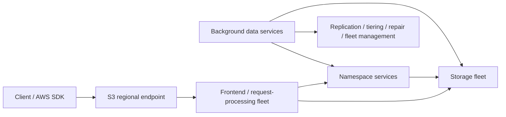

> [!warning]
> This is a **conceptual public architecture**, not an exact request sequence.
>
> Do not infer that every operation literally traverses these boxes in this order.

---

## 5.1 Why namespace and data storage need different reasoning

An object store must solve at least two very different problems:

### Namespace / metadata problem

Given:

```text
(bucket, key, version)
```

determine information required to service the request.

This domain deals with things such as:

- object identity,
- visibility,
- metadata,
- versions,
- deletion state,
- placement information,
- permissions/configuration interactions.

### Data-storage problem

Store enormous quantities of bytes while tolerating:

- disk failures,
- device corruption,
- rack/facility failures,
- repairs,
- hardware generations changing,
- skewed traffic,
- enormous burst loads.

The optimal techniques for these two domains need not be identical.

That separation is common in distributed storage systems even when the exact internal S3 implementation is proprietary.

---

# 6. Physical reality: S3 ultimately has to manage storage devices

Public S3 engineering material describes S3 as operating across **millions of hard drives**.

This matters because hard-drive capacity has increased much faster than random-I/O capability. A larger disk can therefore hold progressively more objects without providing a proportional increase in random seeks.

Warfield described the resulting problem as **heat management**:

```text
heat = request pressure landing on a physical storage resource
```

An overloaded subset of drives can cause:

1. request queues,
2. delayed lower-layer operations,
3. dependency amplification,
4. long-tail latency at the API layer.

The storage-placement problem is therefore not merely:

> "How do we preserve these bytes?"

It is also:

> "How do we preserve these bytes while maintaining enough placement freedom to avoid concentrating I/O?"

---

## 6.1 Redundancy is about more than durability

Public S3 engineering material describes the use of both:

- replication,
- erasure coding such as Reed-Solomon-style coding.

Conceptually, an erasure code converts data into:

```text
k data fragments + m redundancy fragments
```

such that the data can be reconstructed from a sufficient subset.

The exact `k` and `m` used internally by S3 are not a documented public contract.

Redundancy creates two useful properties:

### 1. Failure tolerance

The system can tolerate storage-device failures without losing the logical object.

### 2. Read-placement freedom

If equivalent/reconstructable data can be obtained through multiple physical choices, requests can potentially avoid overloaded resources.

This is a recurring distributed-storage principle:

> **Redundancy buys both reliability and scheduling freedom.**

---

## 6.2 Scale changes the economics of burstiness

An individual workload may look like:

```text
idle → idle → enormous burst → idle
```

At very large multi-tenant scale, unrelated workloads partially decorrelate.

Aggregated traffic is often smoother than the individual workload distributions.

That allows large shared systems to exploit statistical multiplexing: a customer's temporary burst can consume a much larger effective storage fleet than would be economical for that customer to own permanently.

This is one of the structural advantages of hyperscale storage.

---

# 7. Current S3 consistency model

This is one of the most important corrections to older S3 material.

Since December 2020, S3 general-purpose object operations provide **strong read-after-write consistency**, including:

- successful creation followed by `GET`,
- overwrite followed by `GET`,
- `DELETE` followed by read,
- `LIST` after object changes,
- `HEAD`/object metadata behavior covered by the documented consistency model.

There is no need for historical mechanisms such as S3Guard simply to compensate for eventual LIST/object visibility.

---

## 7.1 Single-key atomicity

Suppose:

```text
K = customer/42/profile.json
```

currently contains:

```json
{"tier":"basic"}
```

A writer overwrites it with:

```json
{"tier":"pro"}
```

A concurrent reader can see:

```text
old complete object
```

or:

```text
new complete object
```

but not a half-written mixture of the two.

That is a powerful property.

---

## 7.2 Strong consistency does NOT mean multi-object transactions

Consider:

```text
PUT order/123/header.json
PUT order/123/items.json
PUT order/123/payment.json
```

Another client can observe a state after one or two operations have completed.

S3 explicitly does **not** expose an atomic transaction covering multiple keys.

Therefore:

```text
atomic one-key publication
```

does not imply:

```text
atomic dataset publication
```

This distinction drives many production designs.

---

# 8. Concurrent writers

Unconditional concurrent writes to the same key use S3's documented last-writer-wins behavior, while the outcome ordering of truly concurrent operations cannot be inferred safely from client send or acknowledgement ordering.

If correctness depends on detecting races, do **not** rely on:

```text
GET
if value looks okay:
    PUT
```

because two callers can both pass the check.

Use conditional operations or another coordination service.

---

# 9. Conditional writes: S3 as a single-key CAS boundary

Modern S3 supports conditional writes using HTTP preconditions.

Two particularly important mechanisms are:

```text
If-None-Match: *
```

and:

```text
If-Match: <etag>
```

---

## 9.1 Create-if-absent

For an immutable object:

```text
artifacts/sha256/...
```

you may want creation to succeed only if the key does not already exist.

Use:

```http
If-None-Match: *
```

Conceptually:

```text
put-if-absent(K, bytes)
```

If competing writers attempt to create the same current key, the first completing conditional write succeeds and subsequent conflicting writes fail with a precondition error.

Useful for:

- immutable identifiers,
- content-addressed storage,
- deduplication boundaries,
- singleton output publication.

---

## 9.2 Compare-and-swap

Suppose:

```text
manifests/current.json
```

has ETag `E1`.

The application reads:

```text
value = V1
etag  = E1
```

It computes:

```text
V2 = update(V1)
```

and writes with:

```http
If-Match: E1
```

The write succeeds only if the current object's ETag still matches.

This gives an optimistic single-key compare-and-swap pattern:

```text
loop:
    old, etag = GET(key)

    new = f(old)

    result = PUT(key, new, If-Match=etag)

    if success:
        return

    retry after conflict
```

This is useful for low/moderate-contention coordination around:

- manifests,
- publication pointers,
- simple single-object state machines.

It does **not** turn S3 into a transactional database.

---

## 9.3 A particularly powerful publication model

Store immutable data:

```text
datasets/versions/v184/part-0001.parquet
datasets/versions/v184/part-0002.parquet
datasets/versions/v184/part-0003.parquet
```

Then publish:

```text
datasets/current.json
```

containing:

```json
{
  "version": 184,
  "manifest": "datasets/versions/v184/manifest.json"
}
```

The large dataset remains immutable.

Only one small pointer is mutable.

You have converted:

```text
"atomically replace N objects"
```

into:

```text
"write immutable N objects, then atomically update one publication pointer"
```

That is a reusable Staff+ design pattern far beyond S3.

---

# 10. ETags are not universal content hashes

Do not assume:

```text
ETag == MD5(object bytes)
```

For example, the ETag of a multipart-uploaded object is not the MD5 digest of the complete object.

ETags also do not have MD5 semantics for some encryption modes.

S3 supports explicit checksum mechanisms including multiple CRC, SHA, MD5, and XXHash variants. Current S3 behavior supports CRC64NVME as a full-object checksum and can automatically attach it when no other checksum has been specified through the relevant upload path.

Use a checksum API when your invariant is:

> "These bytes have this checksum."

Use the ETag when your invariant is:

> "The S3 object I observed has not changed."

Those are different concepts.

---

# 11. General-purpose S3 does not have atomic rename

For general-purpose buckets, "rename":

```text
a/object.bin
    ↓
b/object.bin
```

is logically:

```text
COPY a/object.bin → b/object.bin
DELETE a/object.bin
```

The two-key move is not one atomic namespace transaction.

This matters for designs ported from HDFS or POSIX filesystems that rely on:

```text
write temp file
atomic rename temp → final
```

That protocol does not carry over directly to general-purpose S3.

---

## 11.1 Better publication strategies

Prefer:

### Immutable final keys

If the final identifier is known before upload, write it directly.

### Manifest publication

Write immutable pieces and then publish one manifest/pointer.

### Transactional table formats

For data lakes, use a table format/protocol designed to layer transactional metadata over object storage rather than inventing an ad-hoc multi-file transaction protocol.

---

# 12. Key design

A key should encode the **stable retrieval/operational structure**, not every mutable property of an entity.

Good:

```text
tenant/<tenant-id>/asset/<asset-id>/version/<version-id>
```

Potentially problematic:

```text
tenant/<tenant-id>/status/pending/date/2026-09-10/owner/alice/...
```

if `status`, `date`, or `owner` changes frequently.

Changing the latter may require moving/copying the object.

---

## 12.1 Immutable keys reduce coordination

Instead of:

```text
models/recommender/current.bin
```

for all artifact data, consider:

```text
models/recommender/01JXYZ....bin
```

and separately maintain:

```text
models/recommender/current.json
```

or an authoritative database pointer.

Benefits include:

- safe retries,
- easier rollback,
- easy CDN caching,
- reduced overwrite races,
- auditability,
- reproducible processing,
- explicit garbage collection.

---

# 13. Prefixes: organization and performance

For general-purpose buckets, AWS currently documents at least:

- **3,500** `PUT`/`COPY`/`POST`/`DELETE` requests per second per partitioned prefix,
- **5,500** `GET`/`HEAD` requests per second per partitioned prefix.

There is no fixed limit to the number of prefixes you can use to scale aggregate access.

Scaling happens **gradually**, however. A sudden increase can temporarily produce HTTP `503 Slow Down` responses while S3 adapts.

---

## 13.1 Old advice: randomize every key prefix

Historical S3 guidance often recommended keys like:

```text
a8/order-1
19/order-2
f3/order-3
```

solely to distribute load.

AWS explicitly says randomizing prefixes is **no longer required** merely for performance. Sequential/logical prefix naming is supported.

This does not mean prefix distribution has become irrelevant.

It means:

> **Do not cargo-cult random prefixes; partition intentionally according to throughput and operational needs.**

---

## 13.2 Example throughput planning

Suppose the design target is approximately:

```text
40,000 GET/s
```

A documented baseline is:

```text
5,500 GET/HEAD/s per partitioned prefix
```

At a rough capacity-planning level:

```text
40,000 / 5,500 ≈ 7.3
```

so a design using eight or more independently active prefixes provides a reasonable starting distribution.

That is **not** a promise that exactly eight syntactic prefixes guarantee precisely 44,000 sustained reads/s. Actual performance depends on workload characteristics and S3's internal scaling.

Staff+ reasoning should distinguish:

```text
published baseline
```

from:

```text
hard physical partition mapping
```

because AWS does not expose the latter.

---

# 14. Scaling behavior and 503s

If a workload suddenly jumps:

```text
2K requests/s → 200K requests/s
```

do not interpret temporary `503 Slow Down` responses as evidence that S3 has a tiny global limit.

Instead:

1. monitor 503 rates,
2. spread traffic across appropriate prefixes,
3. parallelize,
4. use AWS SDK retry behavior,
5. apply exponential backoff with jitter where appropriate,
6. ramp traffic where workload control permits,
7. evaluate whether a cache or another storage class should absorb the access pattern.

> [!important]
> Retries are part of the distributed-system protocol, not merely error handling.

---

# 15. Multipart uploads

Multipart upload is important for large objects because individual parts can be:

- transferred independently,
- transferred in parallel,
- retried independently.

Logical lifecycle:

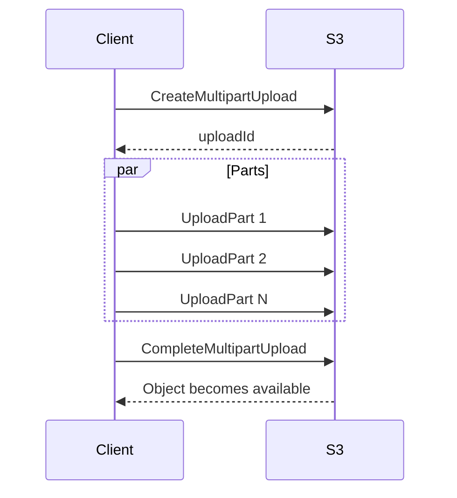

A production concern is abandoned uploads.

Uploaded parts continue to consume storage until the multipart upload is:

```text
completed
```

or:

```text
aborted
```

Use a Lifecycle rule such as `AbortIncompleteMultipartUpload` to prevent abandoned sessions from becoming permanent cost leakage.

---

# 16. Pattern: database for metadata, S3 for bytes

One of the most reusable backend architectures is:

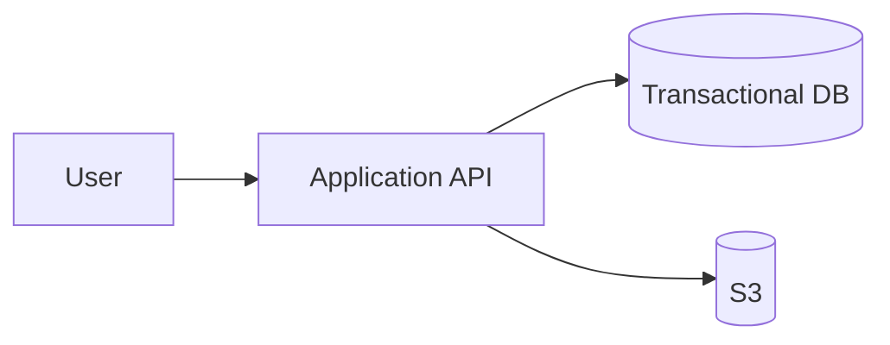

Example database row:

```text
asset_id
owner_id
status
s3_key
s3_version_id
content_checksum
size
content_type
created_at
```

S3 stores:

```text
hundreds of MB of bytes
```

The database stores:

```text
hundreds of bytes of queryable application state
```

This creates an intentional division:

|Concern|Authority|
|---|---|
|Object bytes|S3|
|Business state|Database|
|Ownership|Database/IAM policy model|
|Search indexes|Database/search system|
|Workflow status|Database/workflow engine|
|Large artifact|S3|

---

# 17. The dual-write problem

Suppose an API performs:

```text
1. PUT object to S3
2. INSERT database row
```

Step 1 may succeed while step 2 fails.

Now you have:

```text
orphan S3 object
```

Reverse the order:

```text
1. INSERT database row
2. PUT S3 object
```

Step 2 can fail.

Now you have:

```text
database row pointing to missing object
```

S3 strong consistency does not solve this.

The failure is a **transaction boundary between two independent systems**.

---

## 17.1 Model the workflow explicitly

One design:

```text
PENDING_UPLOAD
      |
      v
   UPLOADED
      |
      v
  PROCESSING
      |
      v
     READY
```

Example sequence:

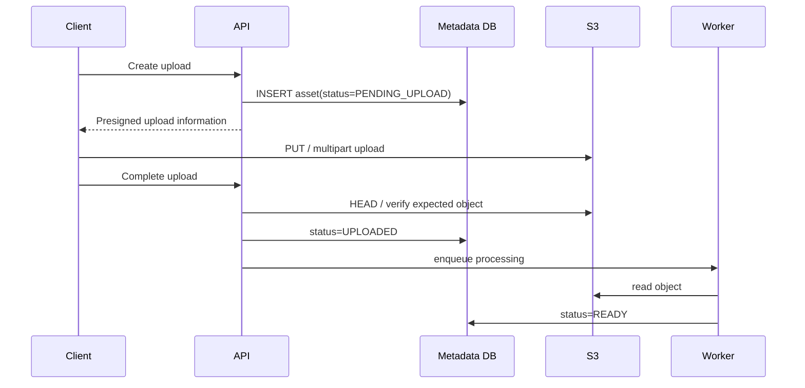

Then add reconciliation:

```text
PENDING_UPLOAD older than X
    → verify object
    → finish or expire

unreferenced object older than Y
    → delete/quarantine
```

> [!tip] Staff+ heuristic
> When two systems cannot participate in one transaction, **make inconsistency a named state and build convergence**, rather than pretending the operations are atomic.

---

# 18. Pattern: direct client uploads

For browser/mobile uploads, avoid this by default:

```text
client
  ↓ 2 GB
application server
  ↓ same 2 GB
S3
```

That makes your application fleet:

- a bandwidth proxy,
- a buffering layer,
- a scaling bottleneck,
- a failure point.

A more scalable model:

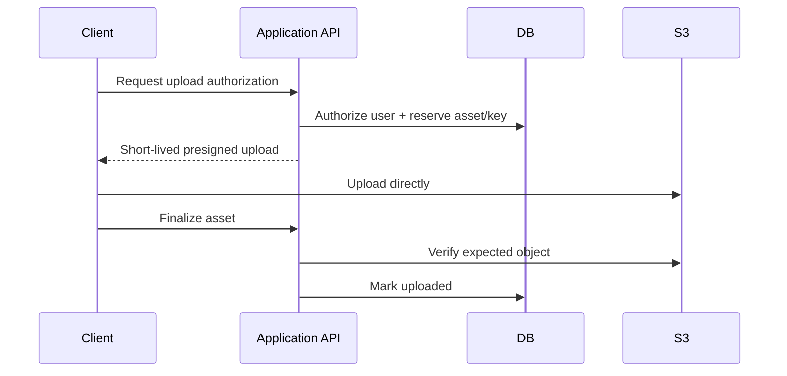

A presigned URL delegates the permissions of its signer for a specific signed S3 request.

Treat it as a **bearer capability**:

> Anyone who obtains a usable presigned URL can exercise the operation until it expires or its underlying credentials cease to be valid.

Temporary credentials bound the URL lifetime to the credential lifetime. SigV4 URLs created using long-lived IAM-user credentials can be valid for up to seven days, although production application URLs should ordinarily be far shorter-lived.

---

## 18.1 Server-side responsibilities before issuing the upload

The application should choose/control:

- tenant,
- object ID,
- destination bucket,
- destination key,
- authorization,
- maximum intended size,
- expected workflow,
- expiry.

Avoid allowing an untrusted client to simply request:

```text
"Give me permission to PUT any key I send you"
```

---

## 18.2 Untrusted-upload pipeline

For content that cannot immediately be trusted:

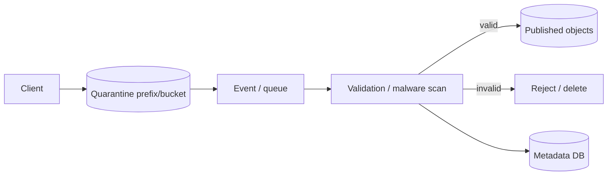

Do not trust the client's declared `Content-Type` as proof of content.

---

# 19. Pattern: event-driven object processing

S3 Event Notifications are designed for **at-least-once delivery**.

They are not guaranteed to arrive in event order.

Notifications normally arrive quickly, but AWS documents that delivery can occasionally take a minute or longer.

Therefore this design is unsafe:

```text
receive event
assume event is unique
assume previous event already arrived
apply irreversible mutation
```

---

## 19.1 Use idempotent consumers

A robust processor should be able to receive:

```text
event X
event X
```

without producing two logical side effects.

For a versioned bucket, a useful processing identity often includes:

```text
bucket
key
versionId
```

For ordering changes to the **same key**, S3 object event payloads include a `sequencer` on relevant create/delete events; a larger sequencer value represents the later event for that same object key.

Do not compare sequencers across unrelated keys as a global ordering mechanism.

---

## 19.2 Queue between storage and workers

Typical production architecture:

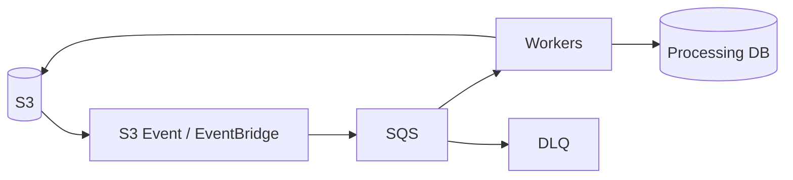

The queue gives you:

- buffering,
- backpressure,
- retries,
- worker decoupling,
- failure isolation,
- DLQ handling.

---

## 19.3 Do not make S3 notifications your immutable source-of-truth log

If lossless business-event history and strict ordering are fundamental requirements, use a system designed as the authoritative event log.

S3 notifications are excellent **triggers**.

That is not the same abstraction as:

```text
Kafka partition
```

or another explicitly ordered log.

---

# 20. Avoid recursive event loops

Suppose every new S3 object invokes a Lambda that writes output into the same event-triggered keyspace:

```text
PUT input
  ↓
Lambda
  ↓
PUT output
  ↓
Lambda
  ↓
PUT output
...
```

Separate:

```text
incoming/
```

from:

```text
processed/
```

and scope event rules accordingly—or use distinct buckets.

This is specifically called out in AWS's Event Notification guidance.

---

# 21. Pattern: media delivery

A common internet-facing architecture:

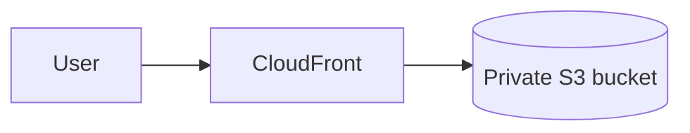

Use **CloudFront Origin Access Control (OAC)** so that the S3 origin does not need to be public.

AWS recommends OAC over the older Origin Access Identity mechanism.

OAC supports scenarios including:

- SSE-KMS,
- modern AWS Regions,
- signed requests,
- dynamic S3 requests where configured.

---

## 21.1 Immutable asset URLs

Prefer:

```text
/assets/sha256-abcd.../hero.webp
```

instead of repeatedly mutating:

```text
/assets/hero.webp
```

Then CDN behavior becomes simple:

```text
URL identity == content identity
```

This allows long cache lifetimes without turning invalidation into the normal publication path.

---

# 22. Pattern: data lake

S3 is a natural physical data layer for:

- Parquet,
- ORC,
- JSON,
- Avro,
- logs,
- analytical datasets.

But plain S3 objects do not themselves provide:

- multi-file ACID transactions,
- table-level schema evolution,
- snapshot isolation,
- record-level database semantics.

Use an appropriate table format/catalog/protocol when those properties are required.

Typical model:

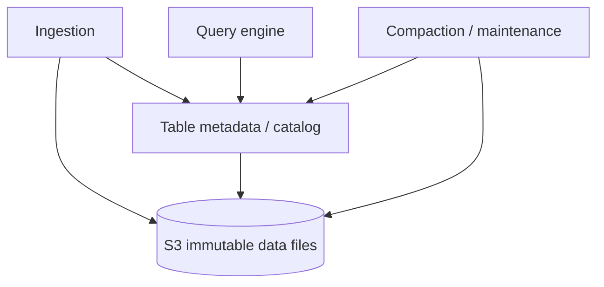

---

## 22.1 Strong LIST is useful but does not create ACID

Modern S3 eliminates a historical class of object/list visibility problems.

But consider:

```text
data/part-1
data/part-2
data/part-3
```

If a writer is halfway through the sequence, a strongly consistent list correctly shows:

```text
the currently completed subset
```

It cannot magically know that the application considers all three files one transaction.

Strong consistency gives you an accurate view of S3 state.

Transactional table protocols define which S3 states constitute a committed **logical table state**.

Those are complementary.

---

# 23. Small-file pathology

Millions of tiny objects can create second-order costs:

- request overhead,
- KMS API traffic when using SSE-KMS without mitigating mechanisms,
- object enumeration overhead,
- query planning overhead,
- per-object metadata/monitoring charges in some storage classes,
- inefficient analytics scans,
- compaction pressure.

For analytical systems, file sizes are therefore an architectural decision rather than merely serialization output.

A typical engineering question is:

```text
Are we optimizing for individual object access
or analytical scan efficiency?
```

Those goals often prefer very different object granularities.

---

# 24. Versioning

With Versioning enabled:

```text
key K
 ├── version V3  ← current
 ├── version V2
 └── version V1
```

An overwrite creates a new version rather than destroying the prior version.

This helps recover from:

- accidental overwrite,
- application bugs,
- mistaken deletion.

---

## 24.1 Delete markers

For a versioned object, a normal `DELETE` without specifying a version ID generally creates a **delete marker** as the current version.

Conceptually:

```text
K:
  delete-marker V4 ← current
  object V3
  object V2
  object V1
```

A normal `GET K` now behaves as though the key is deleted.

The historical versions still exist.

To permanently remove a particular historical version, delete that version explicitly or apply appropriate lifecycle behavior.

---

## 24.2 The versioning cost trap

This configuration:

```text
Versioning = ON
Lifecycle current versions after 30 days = expire
```

does **not** necessarily mean old object bytes disappear after 30 days.

Old versions can become noncurrent and continue consuming storage.

Design lifecycle policies for:

- current versions,
- noncurrent versions,
- expired delete markers,
- incomplete multipart uploads.

---

# 25. Object Lock

S3 Object Lock provides WORM-style protection on object versions and requires Versioning.

Important concepts:

### Governance mode

Protected versions cannot ordinarily be removed/overwritten, but privileged callers with `s3:BypassGovernanceRetention` can bypass governance retention when making the appropriate request.

### Compliance mode

A protected version cannot be overwritten or deleted by users—including the account root user—before the retention period expires.

AWS documents account deletion as the exceptional way of eliminating such data before its retention date.

### Legal hold

Provides protection independent of a fixed retention date until the hold is explicitly removed.

---

## 25.1 Object Lock protects versions, not logical key names

If:

```text
report.pdf version V1
```

is locked, an application may still create:

```text
report.pdf version V2
```

The locked V1 remains protected.

A delete marker can also become the current version while protected historical versions remain retained.

Therefore:

```text
"Object Lock prevents the key from ever changing"
```

is not the correct mental model.

---

# 26. Durability ≠ availability ≠ disaster recovery

These are different questions.

### Durability

> Will the stored bytes survive failures over time?

### Availability

> Can my application access the object right now?

### Disaster recovery

> Can the business recover its required data and service within its RPO/RTO after the failures in our threat model?

S3 Standard is designed for:

```text
99.999999999% annual object durability
```

and:

```text
99.99% availability
```

and stores data redundantly across at least three Availability Zones.

But that alone does not guarantee:

```text
RPO = 0 against accidental logical deletion
```

or:

```text
survival of a compromised administrator who is authorized to delete everything
```

or:

```text
cross-region availability during a regional disaster
```

Those require additional architectural controls.

---

# 27. Storage-class reasoning

Selected major storage classes:

|Storage class|AZ model|Designed durability|Designed availability|Typical reason to use|
|---|--:|--:|--:|---|
|S3 Standard|≥3 AZs|11 nines|99.99%|General hot production objects|
|S3 Standard-IA|≥3 AZs|11 nines|99.9%|Infrequent but immediate access|
|S3 One Zone-IA|1 AZ|11 nines|99.5%|Recreatable infrequent data|
|S3 Express One Zone|1 AZ|11 nines|99.95%|Very low-latency S3 access|
|Glacier Instant Retrieval|≥3 AZs|11 nines|99.9%|Rare access but millisecond retrieval|
|Glacier Flexible Retrieval|≥3 AZs|11 nines|99.99% after restore|Archive; minutes to hours|
|Glacier Deep Archive|≥3 AZs|11 nines|99.99% after restore|Long-term archive; hours|

Selected minimum storage durations:

```text
Standard-IA                  30 days
One Zone-IA                  30 days
Glacier Instant Retrieval    90 days
Glacier Flexible Retrieval   90 days
Glacier Deep Archive        180 days
```

Deleting/transitioning earlier can still incur charges corresponding to minimum-duration rules.

Glacier Flexible Retrieval and Deep Archive are not real-time object-access classes; archived objects require restore workflows.

---

# 28. Intelligent-Tiering

S3 Intelligent-Tiering is useful when access patterns are:

```text
unknown
```

or:

```text
changing over time
```

because S3 can move objects among access tiers.

A significant small-object caveat:

> Objects smaller than **128 KB** are not monitored for automatic tiering and stay in the Frequent Access tier.

This is another example of why object granularity affects cost architecture.

---

# 29. S3 Express One Zone

S3 Express One Zone is not simply:

```text
"S3 Standard but faster"
```

It is an intentionally different architectural trade.

AWS describes it as:

- single-AZ,
- directory-bucket based,
- designed for consistent single-digit-millisecond access,
- capable of very high request rates.

AWS currently documents directory-bucket scaling up to approximately:

```text
2,000,000 reads/s
200,000 writes/s
```

with quota increases, while default per-directory-bucket quotas are lower.

---

## 29.1 Why compute locality matters

For Express One Zone:

```text
compute AZ = storage AZ
```

is an explicit optimization.

For latency-sensitive ML/analytics pipelines:

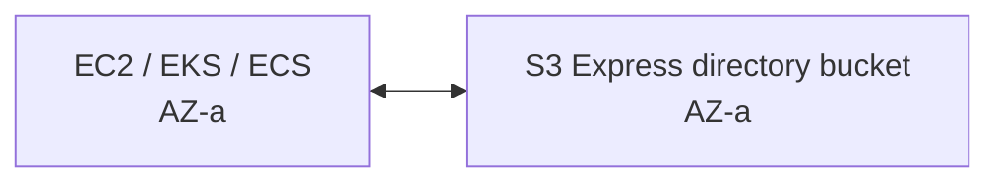

The storage failure domain is now one AZ.

That is a conscious exchange:

```text
lower latency
        ↕
narrower failure-domain resilience
```

---

## 29.2 Directory buckets are not feature-compatible with general-purpose buckets

Current AWS documentation lists several general-purpose S3 capabilities as unsupported by directory buckets, including:

- S3 Versioning,
- S3 Replication,
- S3 Event Notifications,
- S3 Object Lock,
- Multi-Region Access Points,
- Transfer Acceleration,
- object tags,
- server access logging,
- some lifecycle capabilities.

Therefore migration to Express should begin with:

```text
"What dependencies does our application have on general-purpose bucket semantics?"
```

not:

```text
"How much faster is it?"
```

---

## 29.3 Atomic rename is an important difference

Directory buckets using S3 Express One Zone support `RenameObject`.

AWS documents this rename as:

- atomic,
- within the same directory bucket,
- not requiring object data movement,
- typically completing in milliseconds regardless of object size.

That is fundamentally different from general-purpose S3's copy-and-delete rename model.

---

# 30. Replication

S3 supports:

- Same-Region Replication,
- Cross-Region Replication,
- live replication,
- Batch Replication for existing/backfill scenarios.

Live replication is **asynchronous**.

This must appear explicitly in your consistency model.

---

## 30.1 Replication is not synchronous multi-region commit

Suppose:

```text
Region A: PUT object X
```

returns successfully.

Do **not** infer:

```text
Region B must already contain X
```

merely because Cross-Region Replication is configured.

There is a replication interval.

Therefore:

```text
regional S3 strong consistency
```

plus:

```text
asynchronous CRR
```

does **not** produce:

```text
globally linearizable object storage
```

---

# 31. Replication Time Control nuance

AWS documents S3 Replication Time Control as designed to replicate **99.99% of new objects within 15 minutes**.

The current documentation also describes the SLA commitment using a **99.9% within 15 minutes** monthly threshold.

When presenting this to an architecture or compliance review, distinguish:

```text
designed replication-performance target
```

from:

```text
contractual SLA threshold
```

rather than collapsing both percentages into one statement.

---

# 32. Multi-Region Access Points

A Multi-Region Access Point can route requests toward the closest associated bucket.

A critical semantic:

> The Multi-Region Access Point routing layer does **not** inspect the contents of all associated buckets before selecting a destination.

Therefore:

```text
MRAP
```

does not imply:

```text
requested object is present in chosen region
```

AWS recommends replication to maintain corresponding datasets.

---

## 32.1 Global active/active writes require a conflict model

Architecture:

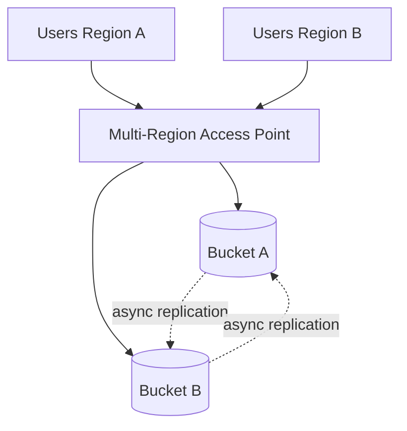

Now ask:

```text
What if both regions write the same logical key before replication converges?
```

Possible design answers:

### Single-writer ownership

```text
key partition P → Region A
key partition Q → Region B
```

### Immutable unique keys

No cross-region overwrite conflict because every write gets a unique object identity.

### Application-level conflict resolution

Use explicit versions/business sequence numbers.

### Global coordination database

Make another strongly coordinated datastore the authority for mutable cross-region state.

What you should **not** do is silently assume CRR turns same-key active/active mutation into a globally serialized write register.

---

# 33. A robust global-object pattern

Prefer:

```text
uploads/<globally-unique-id>
```

in each region.

Replicate immutable objects.

Then maintain logical ownership/current-version metadata in a database designed for the required multi-region consistency model.

This separates:

```text
byte replication
```

from:

```text
business-state coordination
```

and dramatically reduces S3 write conflicts.

---

# 34. Backup and ransomware-resistant design

A serious backup architecture may combine:

```text
Versioning
+
Object Lock
+
Lifecycle
+
cross-account isolation
+
optional cross-region replication
+
separate KMS/security boundaries
```

Example:

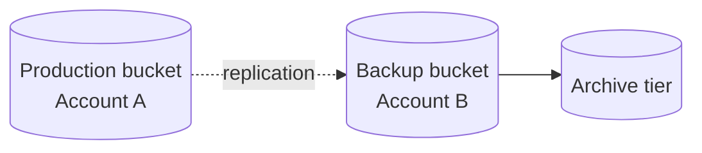

The second AWS account matters because the threat model should include:

```text
production credentials compromised
```

not merely:

```text
disk fails
```

> [!important]
> **Backup is not a product feature; it is a recovery property.**

A backup design is not complete until restores are exercised and measured.

---

# 35. Security baseline

For modern new buckets, S3 defaults include:

- Bucket Owner Enforced Object Ownership,
- ACLs disabled,
- all four Block Public Access settings enabled.

AWS recommends keeping ACLs disabled for the majority of modern use cases and managing authorization with policies.

---

## 35.1 Prefer explicit policy boundaries

Possible controls include:

- IAM identity policies,
- bucket policies,
- Access Point policies,
- VPC endpoint policies,
- AWS Organizations SCPs/RCPs,
- KMS key policies.

Authorization design must account for the interaction of multiple policy layers.

---

# 36. Access Points as architecture boundaries

S3 Access Points provide named endpoints attached to a bucket with separate:

- permissions,
- network controls.

A bucket can have up to **10,000 Access Points** attached under current documented limits.

This can be useful when:

```text
one giant shared data bucket
```

has many independently governed consumers.

Instead of a single ever-growing policy document:

```text
bucket
 ├── analytics access point
 ├── ingestion access point
 ├── ML access point
 └── partner-X access point
```

Access Points let security/network boundaries better match consumer boundaries.

This is also an organizational design tool: policy ownership can mirror service/team responsibility more cleanly.

---

# 37. Encryption

S3 buckets and new objects are encrypted by default using SSE-S3 unless another default server-side encryption mode is configured.

Options include:

```text
SSE-S3
SSE-KMS
DSSE-KMS
```

depending on workload and bucket type.

---

## 37.1 SSE-KMS adds another distributed dependency

With SSE-KMS, request architecture can involve:

```text
application
   ↓
S3
   ↓
KMS
```

At high object-operation rates, consider:

- KMS request quotas,
- KMS permissions,
- KMS cost,
- blast radius if the key is disabled,
- CloudTrail/audit requirements.

A storage design can therefore be within S3 capacity while becoming KMS-bound.

This is a classic second-order scaling effect.

---

# 38. S3 Bucket Keys

S3 Bucket Keys can reduce the volume and cost of AWS KMS calls for SSE-KMS workloads.

AWS documents potential KMS request-cost reductions of up to **99%**, depending on access patterns.

But understand the security/audit semantics:

After S3 has obtained a usable bucket-level key for a requester, subsequent requests benefiting from that Bucket Key do not necessarily invoke AWS KMS for every object operation or revalidate the KMS key policy on every such operation.

Consequences:

- fewer KMS requests,
- fewer corresponding KMS-level audit events,
- different operational expectations.

Performance/cost optimizations can alter your observability model.

---

# 39. Private network access

S3 supports two major VPC endpoint patterns.

### Gateway endpoint

- configured through route tables,
- traffic remains on the AWS network,
- uses S3 public IP addressing,
- no endpoint charge,
- designed for access from the associated VPC.

### Interface endpoint / AWS PrivateLink

- private ENIs/IPs in the VPC,
- billed,
- supports scenarios such as on-premises access through VPN/Direct Connect,
- can serve additional network topologies such as connected VPCs.

Do not equate:

```text
private IP address
```

with:

```text
strong authorization
```

Network restriction and IAM/resource authorization are separate controls.

---

# 40. Operational observability

An S3 design should monitor at least the dimensions relevant to the workload:

### Traffic

```text
request volume
GET/HEAD rate
PUT rate
bytes
latency
```

### Errors

```text
4xx
5xx
503 Slow Down
authorization failures
```

### Storage

```text
object count
current bytes
noncurrent-version bytes
delete markers
incomplete multipart upload bytes
```

### Replication

```text
replication lag
failed replication
missed RTC thresholds
```

### Workflow

```text
old PENDING uploads
event queue age
DLQ size
processing retries
orphan rate
```

### Cost

```text
storage-class distribution
request cost
retrieval cost
replication
KMS
transfer
logging/monitoring
```

---

# 41. Server access logs vs CloudTrail

S3 server access logs contain detailed request information.

AWS explicitly documents their delivery as **best effort**:

- records can be delayed,
- individual records can be missing,
- records can be duplicated.

Therefore they should not be treated as a perfect financial/accounting ledger.

For audit-oriented API records, AWS recommends CloudTrail.

Object-level S3 operations such as `GetObject`, `PutObject`, and `DeleteObject` are **CloudTrail data events**.

Data-event logging is not enabled by default and can be high-volume/charged, so scope it intentionally.

---

# 42. Common production failure modes

|Failure|What naive code assumes|Better architecture|
|---|---|---|
|Client times out during `PUT`|Upload failed|Outcome may be uncertain; retry safely or verify object state|
|Concurrent overwrite|"My PUT was last"|Use immutable keys or conditional write|
|Multi-object publication|All objects appear together|Manifest/table transaction protocol|
|DB commit fails after S3 PUT|Whole request rolled back|Explicit workflow + orphan reconciliation|
|S3 upload fails after DB insert|DB record implies bytes exist|State machine such as `PENDING_UPLOAD`|
|Duplicate event|Worker executes once|Idempotent processing|
|Out-of-order events|Arrival order = write order|Compare object/version state; per-key sequencer where applicable|
|Sudden request spike|S3 instantly scales any single pattern|Retry/backoff, parallel prefixes, observe 503s|
|Versioning enabled|Old data will eventually disappear|Add noncurrent-version Lifecycle rules|
|Multipart abandoned|Failed upload costs nothing|Abort or Lifecycle cleanup|
|CDN serves prior object|S3 consistency failed|Cache has separate consistency/TTL semantics|
|CRR behind|S3 consistency failed|Replication is asynchronous|
|MRAP returns 404|MRAP knows object location|Routing is content-unaware; replicate datasets|
|SSE-KMS throttles|S3 has insufficient capacity|KMS is another dependency/quota|
|Security principal compromised|11-nine durability protects backup|Isolate account/key/retention controls|
|General-purpose rename interrupted|Rename is atomic|It is copy + delete|
|Lifecycle delayed|Expiry time is exact physical deletion time|Lifecycle actions are asynchronous|
|Object exists but app says missing|S3 inconsistent|Check DB/workflow authority, version, key, permissions, cache|

---

# 43. Unknown-outcome writes

Distributed-system APIs sometimes create an important state:

```text
client did not receive success
```

which is **not equivalent to**:

```text
server definitely did not commit
```

For an upload timeout:

```text
client ----- PUT -----> S3
                 object committed
client <--- X connection failure
```

The application cannot conclude failure merely from the missing response.

Production strategies include:

### Immutable deterministic key

Retrying the exact content at the same immutable identity is safe under your application protocol.

### Conditional create

Use create-if-absent semantics.

### Version/checksum verification

Check what exists before deciding whether another upload is required.

### Operation ID

Represent the higher-level operation in your metadata system so retries converge on one logical transaction.

This pattern applies to essentially every remote system, not only S3.

---

# 44. Backpressure belongs outside S3 too

S3 may be capable of accepting objects much faster than downstream processing can consume them.

Example:

```text
S3 ingestion = 50,000 objects/s
worker capacity = 5,000 objects/s
```

The immediate bottleneck is no longer storage.

It is:

```text
processing capacity
```

Use a queue as the elasticity boundary:


Then autoscaling can use:

```text
queue depth
oldest-message age
processing latency
```

rather than allowing S3's ingress elasticity to cascade into downstream overload.

---

# 45. Performance decision tree

Before tuning keys, ask what is actually limiting the workload.

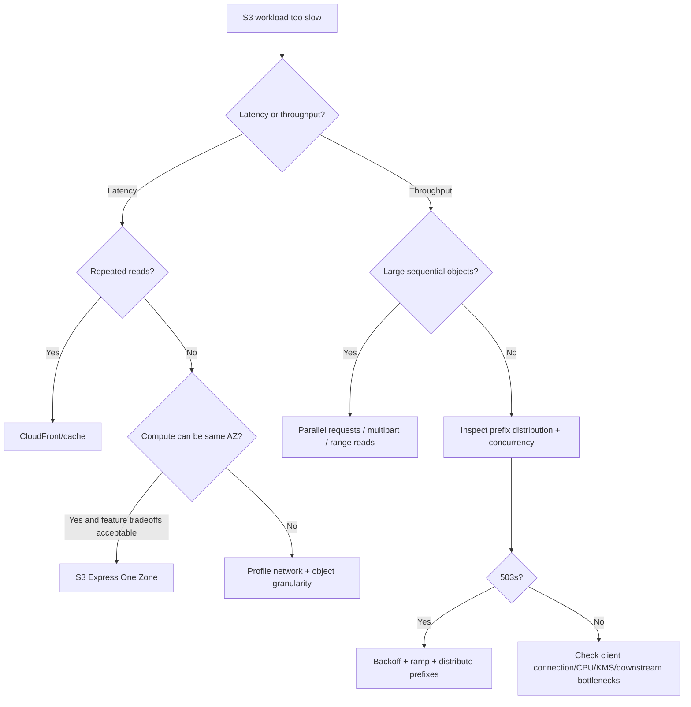

---

# 46. Cache consistency is separate from S3 consistency

Suppose:

```text
PUT /images/logo.png V2
```

succeeds.

A direct S3 `GET` follows S3's strong consistency model.

But:

```text
browser
  ↓
CloudFront
  ↓
S3
```

may still return cached V1 according to cache semantics.

That does not violate S3 consistency.

This illustrates a Staff+ rule:

> **End-to-end consistency is the composition of every layer, not the guarantee of the strongest individual component.**

Immutable cache-busted keys avoid much of this problem.

---

# 47. Cost model

Avoid reasoning about S3 cost as:

```text
cost ≈ stored GB
```

A more realistic model is:

```text
Total =
    storage
  + requests
  + data movement
  + retrieval/restore
  + lifecycle transitions
  + replication
  + KMS
  + monitoring/logging
  + downstream compute
```

Depending on workload, any one can dominate.

---

## 47.1 Small-object economics

Compare:

```text
1 × 1 GB object
```

against:

```text
1,000,000 × ~1 KB objects
```

Both may represent similar raw bytes.

They do not represent similar:

- request counts,
- KMS request counts,
- enumeration overhead,
- analytics planning work,
- lifecycle operations,
- metadata footprint.

Therefore:

> **Object count is a first-class capacity and cost dimension even when S3 itself scales to enormous counts.**

---

# 48. Organizational boundaries

A bucket is more than a storage container.

It can become an architecture/security/operability boundary for:

- Region,
- policy,
- lifecycle,
- Versioning,
- replication,
- encryption defaults,
- Object Lock,
- ownership,
- audit expectations,
- cost allocation.

Do not automatically create:

```text
one bucket per user
```

or:

```text
one bucket for the whole company
```

Choose boundaries according to controls that should evolve together.

---

# 49. Bucket vs prefix vs Access Point

A useful heuristic:

### Separate bucket when

You need a substantially different:

- security boundary,
- AWS account ownership,
- Region,
- lifecycle posture,
- Versioning posture,
- Object Lock posture,
- replication model,
- blast radius.

### Separate prefix when

Objects can safely share bucket-level controls but need:

- semantic organization,
- throughput distribution,
- lifecycle filters,
- event filters,
- policy scoping.

### Separate Access Point when

A shared bucket needs:

- consumer-specific policy,
- network restrictions,
- distinct access endpoints,
- clearer ownership boundaries.

---

# 50. Production architecture: user-generated media

A robust reference architecture:

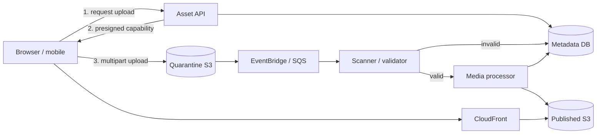

### Important invariants

```text
I1: A published asset is always validated.
I2: An object ID maps to immutable bytes/version.
I3: Replaying an event cannot create duplicate logical derivatives.
I4: Metadata never marks an asset READY before every required artifact exists.
I5: Public delivery cannot access quarantine keys.
```

The invariants are more important than the exact AWS boxes.

---

# 51. Production architecture: immutable artifact registry

Use cases:

- application binaries,
- deployment packages,
- ML models,
- configuration bundles.

Design:

```text
artifacts/<content-hash-or-build-id>/artifact.tar
artifacts/<...>/manifest.json
channels/production.json
```

Where:

```text
artifacts/* = immutable
channels/production.json = mutable pointer
```

Promotion becomes:

```text
CAS channels/production.json
```

rather than copying/rebuilding the artifact.

Benefits:

- provenance,
- rollback,
- deterministic deployments,
- deduplication,
- race detection.

---

# 52. Production architecture: append-oriented telemetry

Producers create immutable objects such as:

```text
logs/service=A/date=2026-09-10/hour=20/<uuid>.parquet
```

Downstream:

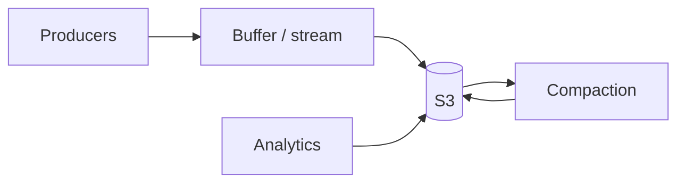

Architecture questions:

- target file size?
- partition cardinality?
- late events?
- schema evolution?
- compaction?
- retention?
- archive?
- discovery/catalog?
- delete/privacy requirements?

The hard part is often data-management protocol, not S3 durability.

---

# 53. Production architecture: large payload indirection

Queues and databases may have payload-size constraints or undesirable large-payload economics.

Instead of:

```text
queue message = 20 MB document
```

use:

```json
{
  "bucket": "payloads",
  "key": "jobs/01J.../payload.bin",
  "versionId": "...",
  "checksum": "..."
}
```

Advantages:

- smaller queue messages,
- explicit immutable payload identity,
- independent retention,
- retryable consumers.

But the lifecycle must be coordinated:

```text
When may payload objects be deleted?
What if the queue retries after payload expiration?
```

This is a distributed garbage-collection problem.

---

# 54. Architecture invariant design

Before selecting S3 features, write invariants.

Examples:

### Artifact immutability

```text
Once READY, bytes for artifact_id never change.
```

Implementation:

```text
unique immutable key
+
If-None-Match: *
```

### Exactly-once logical derivative

```text
Each source version produces at most one committed derivative record.
```

Implementation:

```text
idempotency key = source object/version
+
unique constraint in DB
```

not:

```text
"Lambda normally runs once"
```

### Recoverability

```text
A malicious production administrator cannot destroy the only recoverable copy within 30 days.
```

Possible implementation:

```text
cross-account replication
+
Object Lock
+
separate administrative/KMS boundary
```

Writing the invariant first avoids feature-driven architecture.

---

# 55. Blast-radius reasoning

Ask separately what happens if:

### One object is corrupted/deleted

Versioning/checksum/recovery may help.

### One application role is compromised

Can it read every tenant?

Can it delete every object?

### One AWS account is compromised

Does the attacker control all backup copies and encryption keys?

### One Availability Zone fails

General-purpose multi-AZ classes and single-AZ classes behave differently.

### One Region is unavailable

Is there another copy?

Can traffic be redirected?

What is replication RPO?

### A bad application deployment issues millions of deletes

Durability against hardware failure does not protect against an authorized logical delete without suitable versioning/retention controls.

This hierarchy is what "high availability" discussions should actually explore.

---

# 56. Migration reasoning

Large S3 migrations need more than bulk copying.

Think in phases:

```text
1. Establish destination invariants
2. Backfill existing data
3. Validate bytes + metadata
4. Replicate/capture new mutations
5. Compare source and destination
6. Shift reads
7. Shift writes
8. Observe
9. Retain rollback path
10. Decommission old path
```

For billions of objects, metadata verification and enumeration can become as significant as raw data transfer.

S3 Batch Operations and Batch Replication are useful primitives for large-scale object management/backfill.

---

# 57. Failure domains should determine storage-class selection

Do not select a class solely from:

```text
$/GB-month
```

Ask:

```text
Can this data be reconstructed?
How fast?
From what?
At what business cost?
What if an AZ is permanently unavailable?
What is the required RTO?
Is restore asynchronous?
How often is it read?
What is the minimum-retention economics?
```

For example:

```text
recreatable cache/intermediate results
```

may accept One Zone storage.

The company's only legally required archive should not casually inherit that same risk tolerance.

---

# 58. Staff+ architecture review checklist

## Semantics

- What exactly is the S3 key?
- Is the key mutable or immutable?
- What operation defines commit?
- Is commit one key or multiple keys?
- Could concurrent writers touch the same key?
- Do we need conditional writes?
- Are versions part of the object's logical identity?

## Workflow

- Is S3 or a database authoritative?
- What happens if S3 succeeds and DB fails?
- What happens if DB succeeds and S3 fails?
- How are abandoned operations detected?
- How are orphan objects collected?
- Can every asynchronous step be replayed safely?

## Events

- Can events duplicate?
- Can they arrive out of order?
- What is the idempotency key?
- Where is retry state?
- Is there a DLQ?
- What is the replay mechanism?
- Is the notification being incorrectly treated as the authoritative event history?

## Performance

- Expected reads/s?
- Writes/s?
- Peak-to-average ratio?
- Object-size distribution?
- Prefix distribution?
- Parallelism?
- Client connection-pool limits?
- Expected 503 behavior?
- KMS throughput?
- Would CloudFront/cache remove repeated reads?
- Would Express One Zone materially improve the actual bottleneck?

## Reliability

- Required RPO?
- Required RTO?
- AZ failure?
- Region failure?
- Accidental delete?
- Malicious delete?
- KMS key disabled?
- Replica lag?
- Can restores be demonstrated?

## Security

- Are ACLs disabled?
- Is Block Public Access enabled?
- Does the application have least privilege?
- Can policies scope by tenant/prefix appropriately?
- Should an Access Point define a boundary?
- Are presigned URLs short lived?
- Can an attacker choose arbitrary signed keys?
- Is the bucket reachable only through required network paths?
- Who controls the KMS key?
- Does the backup use an independent account/security boundary?

## Cost

- Bytes?
- Objects?
- request mix?
- LIST behavior?
- retrieval fees?
- minimum durations?
- replication?
- KMS?
- incomplete multipart uploads?
- old versions?
- logging?
- lifecycle?
- CDN egress/cache ratio?

## Operations

- 4xx/5xx alarms?
- 503 alarms?
- queue backlog?
- orphan count?
- replication metrics?
- storage growth?
- version growth?
- restore drill?
- policy drift?
- unexpected public access detection?

---

# 59. Questions a Staff engineer should ask that a feature checklist may miss

### "What happens when retry executes after success?"

This finds idempotency flaws.

### "What state proves publication?"

This discovers accidental multi-object transaction assumptions.

### "Who owns cleanup?"

This discovers orphan storage and long-term cost leaks.

### "What if notifications stop but storage remains healthy?"

This separates the object path from the processing path.

### "What if KMS is throttled?"

This exposes hidden dependencies.

### "What if Region B is 10 minutes behind?"

This tests real multi-region semantics.

### "What if the old version is still cached?"

This exposes end-to-end consistency gaps.

### "What if a credential with correct IAM permissions is malicious?"

This distinguishes hardware durability from cyber-recovery.

### "Can we rebuild metadata from objects?"

This tests recovery asymmetry.

### "Can we rebuild objects from metadata?"

Usually not—which highlights why object protection and backups matter.

---

# 60. Useful decision framework

A practical S3 architecture review can follow:

```text
1. OBJECT
   What are the bytes and their natural immutability boundary?

2. IDENTITY
   What uniquely identifies a version?

3. AUTHORITY
   Which system decides whether the object logically exists?

4. COMMIT
   What exact operation changes the logical state to committed?

5. CONCURRENCY
   Can multiple actors mutate the same logical state?

6. DELIVERY
   How is work triggered, retried, deduplicated, and replayed?

7. RECOVERY
   Which failures must the design survive?

8. SCALE
   What are peak object/s, request/s, bytes/s, object count?

9. SECURITY
   Which principal/account/key could destroy or expose the data?

10. COST
    Which unit grows fastest: bytes, requests, objects, versions, KMS, retrieval, replication?

11. OPERATIONS
    What signal tells us each invariant has stopped holding?
```

---

# 61. Interview/system-design reasoning pattern

For "design Dropbox/Google Photos/YouTube upload/etc.", a strong discussion is not:

```text
"We'll put the files in S3."
```

A stronger answer is:

> Store large immutable file bytes in S3 and keep queryable ownership/version/workflow metadata in a transactional database. Allocate immutable object IDs server-side and let clients upload directly through short-lived presigned requests, typically using multipart upload for large files. Model upload completion explicitly because S3 and the database cannot participate in one atomic transaction. Feed completed objects through an SQS-buffered idempotent processing pipeline because S3 notifications are at least once and unordered. Publish immutable derivatives behind CloudFront using OAC. Enable Versioning/Object Lock or cross-account replication according to recovery requirements rather than assuming S3 durability alone solves logical deletion.

That answer communicates knowledge of:

- data modeling,
- atomicity,
- failure handling,
- throughput,
- security,
- asynchronous systems,
- recovery.

---

# 62. Things not to say in a modern S3 design review

## ❌ "S3 is eventually consistent"

Too broad and obsolete for general-purpose object reads/writes/LIST.

## ❌ "An S3 folder is a filesystem directory"

Not for general-purpose buckets.

## ❌ "Rename is atomic in S3"

Not in general-purpose buckets. Directory buckets have a distinct atomic `RenameObject`.

## ❌ "S3 events are exactly once"

They are designed for at-least-once delivery.

## ❌ "S3 events are ordered"

Not generally.

## ❌ "ETag is the object's MD5"

Not generally.

## ❌ "Versioning means objects eventually get cleaned up"

Not without appropriate lifecycle management.

## ❌ "11-nine durability means we don't need backups"

Durability does not solve every recovery threat.

## ❌ "Cross-Region Replication is synchronous"

It is asynchronous.

## ❌ "Multi-Region Access Point gives global strong consistency"

It is a routing mechanism over regional buckets; replication semantics still matter.

## ❌ "S3 Express is just faster Standard"

It has a different single-AZ failure domain and substantial feature differences.

## ❌ "We need random prefixes because S3 partitions by the first few key characters"

Current AWS guidance explicitly says prefix randomization is not required merely to achieve modern S3 request performance.

---

# 63. Design heuristics

> [!tip] Heuristic 1 — Prefer immutable data
> Immutability removes whole categories of concurrency, cache, retry, audit, and replication problems.

> [!tip] Heuristic 2 — Shrink the atomicity boundary
> Publish many immutable objects using one authoritative pointer rather than trying to mutate many keys atomically.

> [!tip] Heuristic 3 — Separate bytes from business state
> S3 can own the bytes while a transactional DB owns application state.

> [!tip] Heuristic 4 — Treat asynchronous notifications as hints
> Re-read authoritative state and make processors idempotent.

> [!tip] Heuristic 5 — Put a queue before elastic downstream work
> Storage ingress capacity should not dictate worker concurrency.

> [!tip] Heuristic 6 — Design cleanup on day one
> Versions, multipart fragments, temporary objects, failed uploads, and generated derivatives all need owners and retention policies.

> [!tip] Heuristic 7 — Model failure domains explicitly
> "S3" is not one failure model. Standard and Express One Zone make materially different trade-offs.

> [!tip] Heuristic 8 — Optimize the bottleneck you measured
> Prefix design does not fix KMS throttling. Express does not fix slow application serialization. More workers do not fix queue duplication bugs.

> [!tip] Heuristic 9 — Security boundaries should survive credential compromise
> For critical recovery data, independent accounts/keys/retention can matter more than another copy in the same administrative boundary.

> [!tip] Heuristic 10 — Compose guarantees end to end
> S3 can be strongly consistent while CloudFront, replication, events, and your database workflow each have different semantics.

---

# 64. Key takeaways

1. **S3 is a distributed object store, not a filesystem or transactional database.**
2. General-purpose S3 object operations and LIST are strongly consistent.
3. A single object key is an atomic visibility boundary; multiple keys are not one transaction.
4. Conditional writes enable useful single-key create-if-absent and optimistic CAS protocols.
5. Immutable objects plus a small mutable manifest is one of the strongest S3 architecture patterns.
6. S3 Event Notifications are at least once and unordered; consumers must be idempotent.
7. ETags are not universally MD5 hashes; use explicit checksums for content-integrity invariants.
8. General-purpose rename is copy + delete and therefore not an atomic multi-key rename.
9. Prefix performance still matters, but random-prefix cargo culting is obsolete.
10. S3 scales gradually under rapid request-rate changes; temporary 503s belong in the retry model.
11. Multipart upload improves large-object transfer behavior but introduces abandoned-upload cleanup.
12. Versioning protects historical versions but can create substantial storage growth without Lifecycle rules.
13. Object Lock is a powerful recovery/compliance primitive, but it protects versions rather than freezing the logical key forever.
14. Durability, availability, and disaster recovery are different properties.
15. Cross-Region Replication is asynchronous.
16. Multi-Region Access Points route requests; they are not a synchronous replication or global-consistency protocol.
17. S3 Express One Zone trades a single-AZ failure domain and feature differences for very low latency/high request rates.
18. SSE-KMS can make KMS quota, cost, policy, and availability part of the storage architecture.
19. Access Points, bucket boundaries, accounts, and KMS keys are organizational/blast-radius tools—not merely configuration.
20. At Staff+ level, design from **invariants and failure modes**, then choose S3 features that enforce them.

---

# 65. Source notes

The factual service semantics and numerical values in this note were checked against AWS documentation and primary AWS engineering material available on **2026-09-10**.

Because S3 is continuously evolving, re-check current AWS documentation before treating quota, limit, feature-support, or storage-class values as permanent contracts.

### Footnotes

1. Andy Warfield, **"Building and Operating a Pretty Big Storage System Called S3"**, originally published through AWS All Things Distributed and presented at USENIX FAST '23. Primary source for the publicly disclosed frontend/namespace/storage/background-service architecture, large HDD fleet, heat management, replication/erasure-coding discussion, and ShardStore engineering material.
2. Nouraldin Jaber et al., Amazon Web Services, **"High Fidelity Models for Large Scale Stateful Services (Operational Systems)"**, USENIX OSDI '26. Reports that in 2026 S3 hosts more than 500 trillion objects and averages more than 200 million requests per second; describes S3's use of high-fidelity API reference models in development and deployment.
3. AWS, **Amazon S3 multipart upload limits** and **Uploading and copying objects using multipart upload**. Current limits include 48.8 TiB maximum object size, 10,000 parts, and 5 MiB–5 GiB part sizes with the last-part exception.
4. AWS, **Amazon S3 Strong Consistency** and **Amazon S3 User Guide — Amazon S3 data consistency model**. Primary sources for strong GET/PUT/DELETE/LIST semantics, single-key atomicity, concurrent-writer behavior, lack of multi-key atomic transactions, and bucket-configuration propagation caveats.
5. AWS, **How to prevent object overwrites with conditional writes** and **Enforce conditional writes on Amazon S3 buckets**. Primary sources for `If-None-Match`, `If-Match`, ETag preconditions, `412 Precondition Failed`, and policy enforcement.
6. AWS, **Checking object integrity for data uploads in Amazon S3**. Primary source for checksum algorithms, CRC64NVME behavior, and conditions under which ETags are or are not MD5 digests.
7. AWS, **Copying, moving, and renaming objects**. Primary source for general-purpose rename through copy + delete and immutable object-metadata update behavior.
8. AWS, **Best practices design patterns: optimizing Amazon S3 performance** and **Amazon S3 Strong Consistency — Performance**. Primary sources for current per-prefix request baselines, gradual scaling, 503 behavior, parallelization, and the removal of the old random-prefix requirement.
9. AWS, **Lifecycle configuration elements**, **Setting an S3 Lifecycle configuration on a bucket**, and **Troubleshooting Amazon S3 Lifecycle issues**. Primary sources for current/noncurrent version behavior, delete-marker management, asynchronous lifecycle actions, and incomplete multipart cleanup.
10. AWS, **Download and upload objects with presigned URLs**. Primary source for signer permissions, expiration, temporary credential interaction, and seven-day SigV4 maximum with IAM-user credentials.
11. AWS, **Amazon S3 Event Notifications**. Primary source for at-least-once delivery and delivery-latency behavior.
12. AWS, **Event message structure**. Primary source for lack of ordering guarantees and per-object-key sequencer behavior.
13. AWS CloudFront Developer Guide, **Restrict access to an Amazon S3 origin**. Primary source for OAC recommendation and S3-origin integration.
14. AWS, **Amazon S3 User Guide — S3 Versioning**. Primary source for object-version behavior.
15. AWS, **Working with delete markers** and **Managing delete markers**. Primary sources for current-version delete markers and restoration/deletion behavior.
16. AWS, **Locking objects with Object Lock**. Primary source for Versioning requirement, WORM behavior, legal holds, Governance mode, and Compliance mode.
17. AWS, **Understanding and managing Amazon S3 storage classes**. Primary source for AZ models, designed durability, designed availability, minimum object-size/duration rules, and class characteristics.
18. AWS, **Understanding S3 Glacier storage classes for long-term data storage**. Primary source for 90/180-day duration rules and current retrieval characteristics.
19. AWS, **Optimizing S3 Express One Zone performance**. Primary source for single-digit-millisecond latency, single-AZ locality, and directory-bucket request-rate characteristics.
20. AWS, **Differences for directory buckets**. Primary source for current directory-bucket API/feature differences.
21. AWS, **Renaming objects in directory buckets**. Primary source for atomic `RenameObject` behavior and typical millisecond completion without moving object data.
22. AWS, **Replicating objects within and across Regions**. Primary source for live replication, Batch Replication, two-way replication, RTC, and replication timing semantics.
23. AWS, **Multi-Region Access Point request routing** and **Rules for choosing buckets for Amazon S3 Multi-Region Access Points**. Primary source for proximity routing and the fact that routing does not inspect bucket contents.
24. AWS, **Setting Object Ownership when you create a bucket**. Primary source for Bucket Owner Enforced default, ACL-disabled default, and Block Public Access defaults for new buckets.
25. AWS, **Access control in Amazon S3**. Primary source for S3 Access Points and current access-management recommendations.
26. AWS, **Configuring default encryption**. Primary source for default SSE-S3 encryption and supported alternative server-side encryption configurations.
27. AWS, **Reducing the cost of SSE-KMS with Amazon S3 Bucket Keys**. Primary source for KMS request reductions and Bucket Key authorization/audit implications.
28. AWS, **AWS PrivateLink for Amazon S3**. Primary source for gateway-vs-interface endpoint behavior and network topology differences.
29. AWS, **Logging requests with server access logging**. Primary source for best-effort access-log delivery, possible loss/duplication, and current log-delivery options.
30. AWS, **Enabling CloudTrail event logging for S3 buckets and objects** and **Amazon S3 CloudTrail events**. Primary sources for S3 data events, object-operation coverage, opt-in behavior, and additional cost.

---

# 66. Quiz — 20 S3 architecture MCQs

## Q1

What is the most accurate mental model for an object in a general-purpose S3 bucket?

A. A POSIX inode stored inside a distributed directory tree
B. A mapping identified by bucket, key, and optionally version ID
C. A relational row addressed through a primary and secondary index
D. A block device extent mounted by the S3 frontend

---

## Q2

A successful `PUT` creates `reports/x.json`. Immediately afterward, another client issues a `LIST` covering that prefix. What should a modern general-purpose S3 design expect?

A. The object might remain absent because LIST is eventually consistent
B. Visibility depends on whether the object was uploaded using multipart upload
C. The listing reflects the completed write under S3's strong consistency model
D. Only a `HEAD` request is strongly consistent

---

## Q3

An application must publish 500 new objects such that readers logically see either the old dataset or the complete new dataset. Which design best fits S3 semantics?

A. Overwrite all 500 keys concurrently and rely on S3 multi-key atomicity
B. Write immutable versioned objects and atomically publish a single manifest/pointer
C. Rename a 500-object temporary directory in a general-purpose bucket
D. Wait five seconds after every PUT before allowing readers

---

## Q4

Two writers must ensure only one of them creates an object at a previously unused key. Which mechanism most directly provides this single-key invariant?

A. `If-None-Match: *`
B. A `LIST` immediately before every `PUT`
C. S3 Cross-Region Replication
D. A CloudFront cache invalidation

---

## Q5

A service reads an S3 manifest, modifies it, and wants the update to succeed only if nobody has changed the manifest since the read. Which S3 mechanism is appropriate?

A. Multipart upload with ten parts
B. `If-Match` using the previously observed ETag
C. Transfer Acceleration
D. Object Lock Compliance mode

---

## Q6

Which assumption about S3 ETags is unsafe?

A. An ETag can participate in conditional operations
B. An object's ETag can change when its content changes
C. Every object's ETag is the MD5 digest of the entire object bytes
D. Multipart-uploaded objects have ETag behavior different from a simple whole-object MD5

---

## Q7

For a general-purpose bucket, what does renaming an object normally entail?

A. A metadata-only atomic rename
B. Changing only the object's key metadata in place
C. Copying to the destination key and deleting the source
D. Updating the namespace through `RenameObject`

---

## Q8

What delivery semantics should a production consumer assume for S3 Event Notifications?

A. Exactly once and globally ordered
B. At most once and ordered per bucket
C. At least once, without a general event-order guarantee
D. Exactly once but potentially delayed

---

## Q9

A versioned bucket receives a normal `DeleteObject` request without a version ID for an existing versioned object. What normally happens?

A. Every historical version is permanently deleted
B. A delete marker becomes the current version
C. Versioning is automatically suspended for the key
D. The request is rejected because version IDs are mandatory

---

## Q10

What is a common mistake when enabling Versioning?

A. Assuming Versioning prevents new versions from being written
B. Forgetting that noncurrent versions can continue consuming storage without appropriate Lifecycle rules
C. Assuming Versioning is compatible with general-purpose buckets
D. Believing version IDs uniquely identify object versions

---

## Q11

Which statement about Object Lock Compliance mode is correct?

A. Any IAM administrator can bypass it with `s3:BypassGovernanceRetention`
B. It applies only when Versioning is disabled
C. A protected object version cannot normally be deleted before retention expiry, even by the account root user
D. It prevents a newer version from being created at the same key

---

## Q12

AWS documents which baseline request performance for a partitioned general-purpose S3 prefix?

A. At least 350 writes/s and 550 reads/s
B. At least 3,500 relevant write requests/s and 5,500 GET/HEAD requests/s
C. Exactly 35,000 writes/s and 55,000 reads/s
D. One fixed 5,500-request/s limit shared by the entire bucket

---

## Q13

A workload suddenly increases its write rate dramatically and observes temporary `503 Slow Down` responses. What is the best interpretation?

A. S3 never supports more than 3,500 writes/s per bucket
B. The object bytes have been corrupted
C. S3 scaling is gradual; the client should use retry/backoff and an appropriate prefix/concurrency strategy
D. Strong consistency has been disabled

---

## Q14

Which statement best describes S3 Cross-Region Replication?

A. Every source `PUT` synchronously commits to the destination before acknowledgement
B. It is asynchronous replication between buckets
C. It converts S3 into a globally serializable database
D. It is required for strong reads within one source Region

---

## Q15

What is an important limitation of Multi-Region Access Point routing?

A. It can route only write requests
B. It examines every bucket and always routes GET to the bucket containing the newest object
C. It routes based on factors such as proximity without being aware of each bucket's object contents
D. It performs synchronous replication before routing

---

## Q16

Why is S3 Express One Zone not a transparent replacement for S3 Standard?

A. It supports only public buckets
B. Directory buckets have a single-AZ failure domain and lack several general-purpose S3 features such as Versioning and Replication
C. It cannot store normal object bytes
D. It has eventual consistency for every object operation

---

## Q17

What is the main reason to use presigned uploads for large browser/mobile files?

A. They turn S3 into a relational database
B. They let the client upload directly to S3 under narrowly delegated authorization instead of proxying all bytes through the application fleet
C. They guarantee exactly-once upload completion
D. They make every uploaded object publicly readable

---

## Q18

A high-volume workload uses SSE-KMS. S3 request capacity is healthy but encryption-related requests begin throttling. Which dependency should be investigated?

A. AWS KMS request capacity/quotas
B. CloudFront DNS TTL only
C. S3 Glacier restore capacity
D. Object Lock retention mode

---

## Q19

Which architecture best protects critical backups against a compromise of the production AWS account?

A. Store a second unversioned copy under another prefix in the same bucket
B. Depend only on S3 Standard's durability rating
C. Use an independently controlled backup boundary such as another account, with appropriate Versioning/Object Lock/replication and key controls
D. Increase the number of S3 prefixes

---

## Q20

An S3 object-creation event may be delivered twice. What is the most robust worker design?

A. Assume the duplicate cannot happen because S3 is strongly consistent
B. Use a stable identity such as bucket/key/version and make the logical processing operation idempotent
C. Sleep for one minute before processing every event
D. Delete the object immediately after the first notification

---

# 67. Quiz answers

1. **B** — The useful S3 object model is `(bucket, key, optional version ID) → object`.
2. **C** — Modern S3 provides strong consistency for completed object writes and LIST operations.
3. **B** — S3 has no multi-key atomic transaction; immutable data plus a single publication pointer shrinks the commit boundary to one object.
4. **A** — `If-None-Match: *` implements create-if-current-key-does-not-exist semantics.
5. **B** — `If-Match` with the previously observed ETag provides optimistic single-key compare-and-swap behavior.
6. **C** — ETags are not universally whole-object MD5 digests, notably for multipart uploads and several encryption scenarios.
7. **C** — In general-purpose S3, rename is copy to a new key followed by deletion of the old key.
8. **C** — S3 Event Notifications are designed for at-least-once delivery and do not provide a general ordering guarantee.
9. **B** — A normal delete in a versioning-enabled bucket normally places a delete marker at the current version.
10. **B** — Noncurrent versions remain stored until they are explicitly removed or Lifecycle policy handles them.
11. **C** — Compliance-mode retention prevents normal deletion/overwrite of the protected version during the retention period, including by root.
12. **B** — AWS documents at least 3,500 relevant write operations/s and 5,500 GET/HEAD operations/s per partitioned prefix.
13. **C** — S3 scales request capacity gradually; temporary 503s can occur during sharp scaling and should be incorporated into retries and traffic distribution.
14. **B** — Live S3 replication, including CRR, is asynchronous.
15. **C** — MRAP routing is not object-content-aware, so replication still matters for dataset presence.
16. **B** — S3 Express uses directory buckets with a single-AZ storage model and a materially different supported-feature set.
17. **B** — Presigned requests remove the application fleet from the large-byte data path while retaining controlled authorization.
18. **A** — SSE-KMS creates a KMS dependency; KMS quotas/capacity can become the limiting factor independently of S3.
19. **C** — Independent administrative/security boundaries plus appropriate retention and replication protect against a broader compromise threat model.
20. **B** — The correct response to at-least-once delivery is idempotent processing keyed by stable object/event identity, not an exactly-once assumption.
