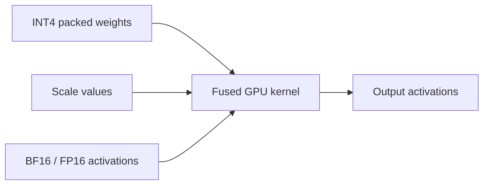
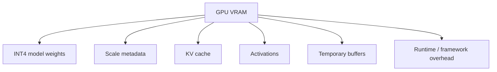
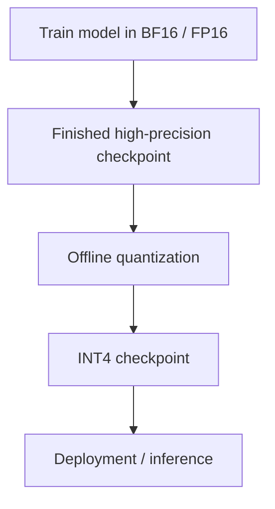
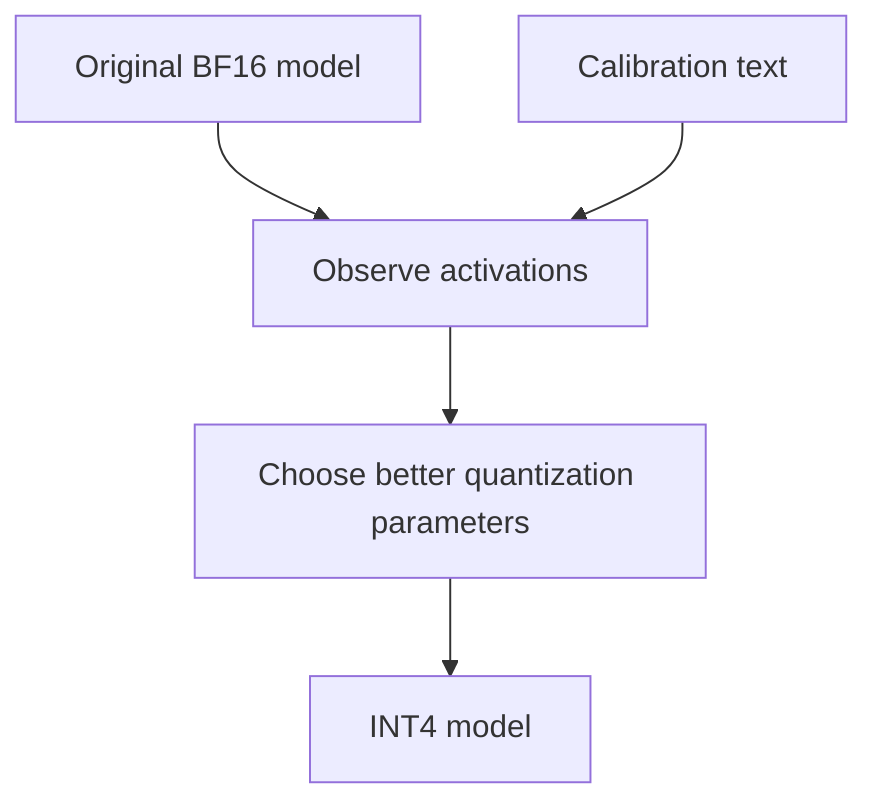
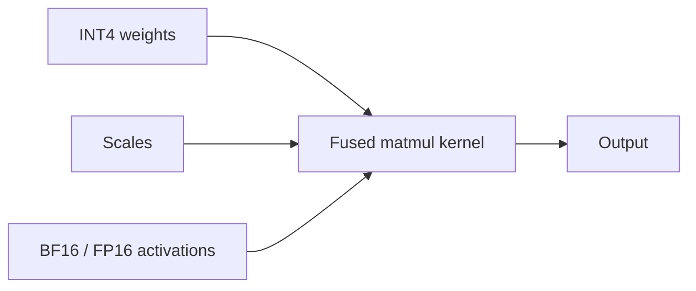
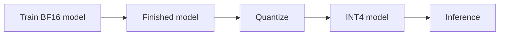
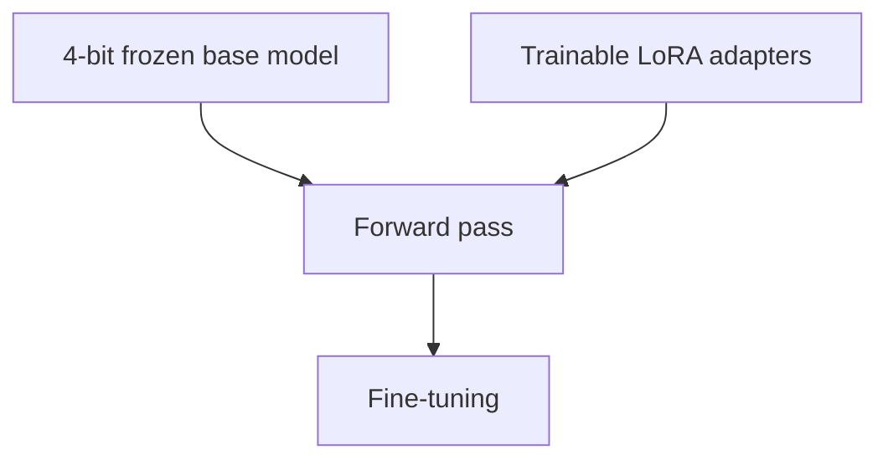
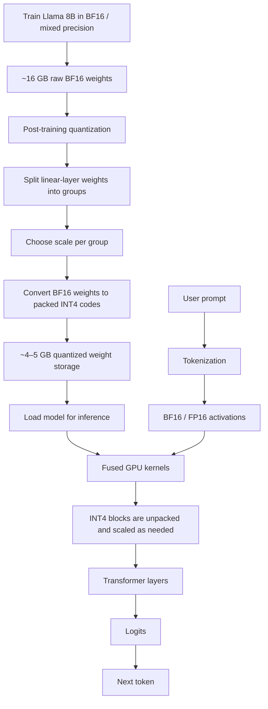
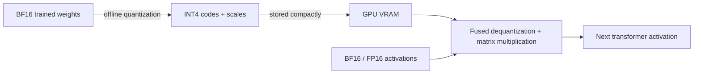

> [!abstract]
> **Quantization** reduces the numerical precision used to store model parameters.
> A common deployment strategy is to take a model whose weights are stored in **BF16/FP16** and compress many of its large linear-layer weights to **4-bit values**, while retaining small scale factors that let the model reconstruct close approximations during inference.

---

## 1. The core idea

Large language models contain billions of learned numbers called **weights**.

A weight might originally look like:

```text
1.5000
-0.7500
0.3008
-2.0000
```

If stored as **BF16**, each value uses:

$$
16 \text{ bits} = 2 \text{ bytes}
$$

With **4-bit quantization**, each weight can use only:

$$
4 \text{ bits} = 0.5 \text{ bytes}
$$

So the raw weight representation can become approximately:

$$
\frac{16}{4} = 4\times
$$

smaller.

> [!important]
> A 4-bit model does **not** necessarily perform every computation in 4-bit arithmetic.
> Usually, only the large weight matrices are stored in 4-bit form. Activations, accumulators, normalization layers, scales, and sometimes the KV cache remain in BF16, FP16, FP32, or another format.

---

## 2. A tiny INT4 example

Suppose we have four BF16 weights:

$$
W = [1.5,\;-0.75,\;0.3008,\;-2.0]
$$

We will quantize them together using **symmetric signed INT4**.

For simplicity, use:

$$
q \in [-7,7]
$$

The largest absolute value is:

$$
\max |W| = 2.0
$$

We choose a scale:

$$
s = \frac{\max |W|}{7}
$$

Therefore:

$$
s = \frac{2}{7} \approx 0.285714
$$

### 2.1 Quantize each weight

The quantization equation is:

$$
q = \operatorname{round}\left(\frac{x}{s}\right)
$$

#### Weight 1

$$
\frac{1.5}{0.285714} = 5.25
$$

$$
q = 5
$$

#### Weight 2

$$
\frac{-0.75}{0.285714} = -2.625
$$

$$
q = -3
$$

#### Weight 3

$$
\frac{0.3008}{0.285714} \approx 1.053
$$

$$
q = 1
$$

#### Weight 4

$$
\frac{-2.0}{0.285714} = -7
$$

$$
q = -7
$$

So:

$$
[1.5,\;-0.75,\;0.3008,\;-2.0]
$$

becomes:

$$
\boxed{[5,\;-3,\;1,\;-7]}
$$

plus the shared scale:

$$
\boxed{s = 0.285714}
$$

### 2.2 What is actually stored?

Conceptually:

| Original BF16 | INT4 code |
|---:|---:|
| 1.5000 | 5 |
| -0.7500 | -3 |
| 0.3008 | 1 |
| -2.0000 | -7 |

The critical idea is:

> [!tip]
> The integer value is **not the original weight**.
>
> `5` does not mean the weight is five.
>
> It means approximately:
>
> $$
> 5 \times 0.285714 \approx 1.4286
> $$

The scale carries the magnitude information.

---

## 3. Dequantization during inference

When the model needs the weight again, it can reconstruct an approximation:

$$
\hat{x} = q \times s
$$

For our four values:

| Original | INT4 | Reconstructed | Error |
|---:|---:|---:|---:|
| 1.5000 | 5 | 1.4286 | -0.0714 |
| -0.7500 | -3 | -0.8571 | -0.1071 |
| 0.3008 | 1 | 0.2857 | -0.0151 |
| -2.0000 | -7 | -2.0000 | 0 |

The differences are called **quantization error**.

The model accepts this error in exchange for much lower memory use.

---

## 4. Why groups matter

Real models do not normally use one scale for billions of weights.

Instead, weights are divided into groups.

For example:

```text
[w0 ... w127]     -> scale_0
[w128 ... w255]   -> scale_1
[w256 ... w383]   -> scale_2
...
```

A common group size might be:

$$
128
$$

Smaller groups usually mean:

- more scales
- slightly more metadata
- better numerical accuracy

Larger groups usually mean:

- fewer scales
- lower metadata overhead
- potentially more quantization error

> [!note]
> Quantization schemes such as **GPTQ**, **AWQ**, **NF4**, and related methods differ in how they choose the quantized representation and how aggressively they try to preserve model quality.

---

## 5. What happens inside a GPU kernel?

A simple mental model is:

```text
INT4 weight
    |
    | x scale
    v
approximate BF16/FP16 weight
    |
    v
matrix multiplication
```

But efficient inference kernels normally do **not** reconstruct the entire model into BF16 first.

Instead, the operations are fused.



This means the GPU can read compact 4-bit weights from memory, unpack/dequantize small blocks as needed, and immediately use them in matrix multiplication.

---

## 6. Real-world example — Llama 3.1 8B

Now apply the same idea to an approximately **8-billion-parameter** model such as **Llama 3.1 8B**.

Assume the original model weights are stored in BF16.

$$
8 \text{ billion parameters}
$$

Each BF16 value requires:

$$
2 \text{ bytes}
$$

So the raw weight memory is approximately:

$$
8B \times 2 = 16 \text{ GB}
$$

> [!example]
> **BF16 Llama 8B**
>
> $$
> \boxed{\approx 16 \text{ GB of raw weight storage}}
> $$

This is only the model weights. Real inference also needs memory for:

- activations
- KV cache
- temporary buffers
- runtime/framework overhead
- sometimes some unquantized layers

---

## 7. Where are those 8 billion numbers?

The parameters are mostly organized into matrices inside transformer layers.

A simplified transformer layer contains matrices such as:

### Attention

- \(W_Q\)
- \(W_K\)
- \(W_V\)
- \(W_O\)

### Feed-forward network

- \(W_{gate}\)
- \(W_{up}\)
- \(W_{down}\)

For an 8B-class Llama model, a projection matrix can be on the order of:

$$
4096 \times 4096
$$

which contains:

$$
16,777,216
$$

weights.

---

## 8. Quantizing one 4096 × 4096 matrix

A matrix with:

$$
16,777,216
$$

BF16 weights requires:

$$
16,777,216 \times 2
$$

bytes.

That is:

$$
33,554,432 \text{ bytes}
$$

or:

$$
\boxed{32 \text{ MiB}}
$$

### 8.1 Store those weights in INT4

At 4 bits per weight:

$$
16,777,216 \times 0.5
$$

bytes gives:

$$
8,388,608 \text{ bytes}
$$

or:

$$
\boxed{8 \text{ MiB}}
$$

So the raw weights shrink from:

```text
BF16:  32 MiB
INT4:   8 MiB
```

That is a **4× reduction** in raw weight storage.

---

## 9. Scale overhead

Assume group size:

$$
128
$$

The number of groups is:

$$
\frac{16,777,216}{128} = 131,072
$$

Suppose every group stores one BF16 scale.

Each BF16 scale is 2 bytes:

$$
131,072 \times 2
$$

bytes:

$$
262,144 \text{ bytes}
$$

or:

$$
0.25 \text{ MiB}
$$

So the matrix becomes approximately:

| Component | Size |
|---|---:|
| INT4 weights | 8.00 MiB |
| BF16 scales | 0.25 MiB |
| **Total** | **8.25 MiB** |

Instead of:

$$
32 \text{ MiB}
$$

That is roughly a **74% reduction** for this simplified example.

Some formats also store zero-points or other metadata, so the exact number varies.

---

## 10. Scale the calculation to the entire 8B model

### BF16

$$
8B \times 16 \text{ bits}
$$

gives approximately:

$$
\boxed{16 \text{ GB}}
$$

of raw weights.

### Pure 4-bit storage

$$
8B \times 4 \text{ bits}
$$

gives approximately:

$$
\boxed{4 \text{ GB}}
$$

Now include one BF16 scale per 128 weights.

Number of scales:

$$
\frac{8B}{128} = 62.5M
$$

Scale storage:

$$
62.5M \times 2 \text{ bytes} \approx 125 \text{ MB}
$$

So a simplified estimate becomes:

$$
4.0 \text{ GB} + 0.125 \text{ GB}
$$

or approximately:

$$
\boxed{4.125 \text{ GB}}
$$

---

## 11. Weight-memory comparison

| Precision | Approx. raw storage for 8B weights |
|---|---:|
| FP32 | ~32 GB |
| BF16 / FP16 | ~16 GB |
| INT8 | ~8 GB |
| INT4 | ~4–5 GB |
| Theoretical raw INT4 | ~4 GB |

> [!important]
> **4-bit weights do not mean the entire model process fits into exactly 4 GB of VRAM.**
>
> Runtime memory is larger because the GPU also needs KV cache, activations, buffers, metadata, and other state.

---

## 12. What actually sits in GPU memory?

A useful mental model:



For long-context generation, the **KV cache** can itself become a major memory consumer.

---

## 13. When is quantization performed?

For many deployed LLMs, quantization happens **after training**.

This is called:

$$
\boxed{\text{Post-Training Quantization — PTQ}}
$$

The lifecycle looks like:



So the model is first trained normally.

After training is complete, a quantization tool converts many of its weights into a lower-precision format.

---

## 14. What does the quantizer do?

Conceptually, for every large linear layer:

```text
load BF16 weight matrix
        |
        v
split weights into small groups
        |
        v
choose a scale for each group
        |
        v
map BF16 values -> INT4 codes
        |
        v
store packed INT4 values + scales
```

A model that originally had approximately:

$$
16 \text{ GB}
$$

of BF16 weights might now require roughly:

$$
4\text{–}5 \text{ GB}
$$

for its main quantized weights and metadata.

---

## 15. Calibration

Modern quantization can be smarter than simply taking the maximum absolute weight.

Some methods use representative input data.

For example:

```text
"The capital of France is..."
"Write a Python function..."
"Explain relativity..."
"Once upon a time..."
```

The quantizer runs these inputs through the original model and observes activation behavior.

That helps it determine which errors matter most.



This is still much cheaper than full training.

---

## 16. GPTQ and AWQ — conceptually

Two well-known approaches are **GPTQ** and **AWQ**.

You do not need their exact algorithms to understand the high-level idea.

### Naïve quantization

Ask:

> Which INT4 values numerically approximate these weights?

### Smarter LLM quantization

Ask something closer to:

> Which approximation causes the least damage to the model's actual behavior?

This lets the quantizer preserve important parts of the network more carefully.

---

## 17. What happens when the model answers a prompt?

Suppose you ask:

> Why is the sky blue?

The input is tokenized:

```text
Why
is
the
sky
blue
?
```

The network generates activation vectors.

At some linear layer, it needs to compute:

$$
y = xW
$$

where:

- \(x\) = activation vector
- \(W\) = weight matrix

But \(W\) is stored in INT4.

Conceptually:

$$
W_{\text{approx}} = Q \times S
$$

where:

- \(Q\) = packed INT4 values
- \(S\) = scale values

So inference computes something equivalent to:

$$
y = xW_{\text{approx}}
$$

---

## 18. The model does not recreate a 16 GB BF16 checkpoint

This would defeat much of the purpose:

```text
4 GB INT4 checkpoint
        |
        v
expand entire model to BF16
        |
        v
16 GB BF16 weights
```

Instead, optimized kernels perform block-wise dequantization while doing the matrix multiplication.



So an inference configuration may look approximately like:

| Component | Typical precision |
|---|---|
| Large weights | INT4 |
| Scales | BF16 / FP16 |
| Activations | BF16 / FP16 |
| Accumulation | BF16 / FP16 / FP32 depending on kernel |
| KV cache | BF16 / FP16 or separately quantized |

---

## 19. Why can quantization make inference faster?

LLM inference often spends enormous effort moving weights from GPU memory to compute units.

With BF16, an 8B model has roughly:

$$
16 \text{ GB}
$$

of raw weights.

With INT4, the main weights may be roughly:

$$
4\text{–}5 \text{ GB}
$$

So the GPU has much less data to read.

```text
BF16:
many bytes must move from VRAM
        |
        v
matrix multiplication

INT4:
far fewer bytes move from VRAM
        |
        v
unpack + scale + matrix multiplication
```

There is extra work to dequantize the values.

But reducing memory traffic can more than compensate for that cost.

This is why good INT4 kernels can improve:

- memory usage
- inference throughput
- model deployability

Actual speedups depend on:

- GPU architecture
- kernel implementation
- batch size
- quantization format
- sequence length
- framework

---

## 20. Is quantization ever used during training?

Yes, but several different techniques exist.

| Method | Quantization timing | What is trained? |
|---|---|---|
| Normal training | None | Full model |
| PTQ | After training | Nothing |
| QAT | During training | Usually full model |
| QLoRA | Before fine-tuning | Small LoRA adapters |

---

## 21. PTQ — Post-Training Quantization

The simplest deployment pipeline:



Advantages:

- inexpensive compared with training
- fast to apply
- large memory reduction
- often preserves most model quality

This is one of the most common ways to create deployable low-bit LLMs.

---

## 22. QAT — Quantization-Aware Training

With **Quantization-Aware Training**, the model experiences simulated quantization errors during training.

Conceptually:

```text
BF16 master weight
      |
      v
simulate low-bit quantization
      |
      v
approximate low-precision value
      |
      v
forward pass
```

The optimizer can then adjust the model so that it becomes more robust to those errors.

This can improve low-bit quality, but training a large LLM this way is substantially more expensive than PTQ.

---

## 23. QLoRA

QLoRA is different.

The large base model is kept quantized and mostly frozen.

Small trainable **LoRA adapters** are added.



Conceptually:

```text
8B base weights
    |
    v
stored in 4-bit
    |
    v
FROZEN

+

small LoRA matrices
    |
    v
BF16 / FP16
    |
    v
TRAINED
```

This allows fine-tuning a large model with much lower memory requirements.

> [!note]
> QLoRA does **not** mean that every original 4-bit base-model weight is directly updated with ordinary 4-bit gradients.

---

## 24. Why training uses much more memory than inference

Inference mainly needs:

- model weights
- KV cache
- activations
- temporary buffers

Training also needs things such as:

- gradients
- optimizer states
- sometimes high-precision master weights
- stored activations for backpropagation

A simplified Adam-style picture for 8B parameters could look like:

| State | Approximate memory |
|---|---:|
| BF16 parameters | ~16 GB |
| BF16 gradients | ~16 GB |
| FP32 Adam first moment | ~32 GB |
| FP32 Adam second moment | ~32 GB |
| **Subtotal** | **~96 GB** |

And that is **before** accounting for activations, buffers, sharding behavior, and other training state.

This is why training an 8B model is dramatically more expensive than serving one.

---

## 25. Does quantization reduce model quality?

Potentially, yes.

The model may replace:

$$
1.5000
$$

with:

$$
1.4286
$$

or:

$$
-0.7500
$$

with:

$$
-0.8571
$$

Billions of small approximations are introduced.

However, neural networks are often surprisingly tolerant of this noise.

A rough intuition:

```text
BF16
 |
 | negligible quantization error
 v
INT8
 |
 | usually small degradation
 v
INT4
 |
 | often very strong with good quantization
 v
INT3
 |
 | increasingly difficult
 v
INT2
   much harder
```

There is no universal rule such as:

> "INT4 loses exactly X% intelligence."

The result depends on:

- the original model
- the quantization algorithm
- group size
- calibration data
- which layers are quantized
- the benchmark or task

---

## 26. End-to-end Llama 8B picture



---

## 27. The most important takeaway

> [!success]
> **Quantization mainly changes how model parameters are represented and moved through memory.**
>
> A 4-bit model does **not** necessarily mean the neural network performs every operation using 4-bit integers.

A common real-world pattern is:

```text
Weights       -> INT4
Scales        -> BF16 / FP16
Activations   -> BF16 / FP16
Accumulators  -> BF16 / FP16 / FP32
KV cache      -> BF16 / FP16 or separately quantized
```

The central approximation is:

$$
\boxed{\text{weight} \approx \text{integer code} \times \text{scale}}
$$

For an 8B model:

$$
\boxed{\text{BF16 weights} \approx 16 \text{ GB}}
$$

can become roughly:

$$
\boxed{\text{INT4 weights} \approx 4\text{–}5 \text{ GB}}
$$

while the GPU reconstructs approximate values **on the fly** as part of optimized matrix-multiplication kernels.

---

## 28. Mental model

If you remember only one picture, remember this:



**Storage precision and compute precision are not the same thing.**

That single distinction explains most of how practical LLM quantization works.
